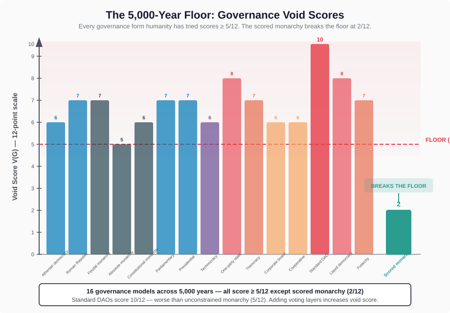
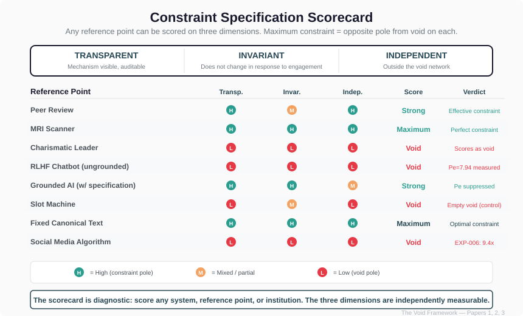
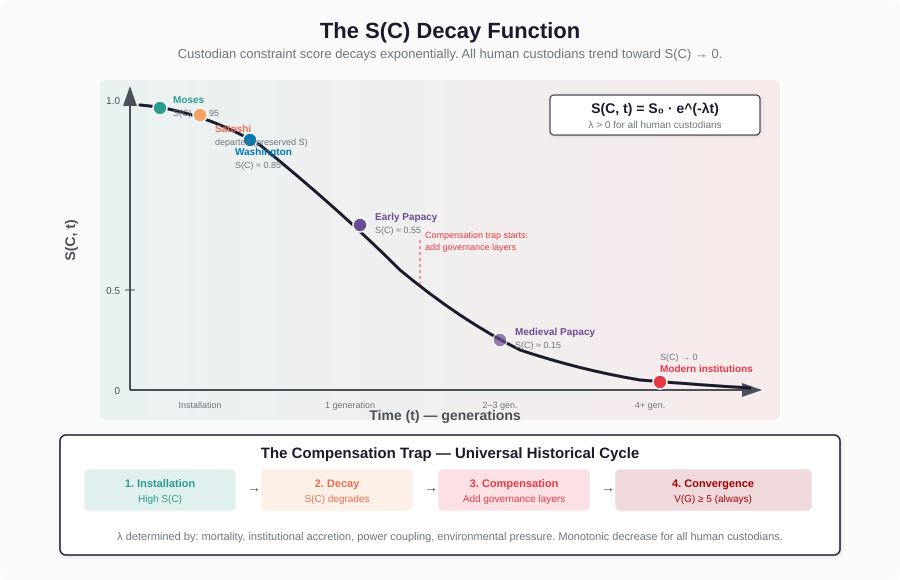
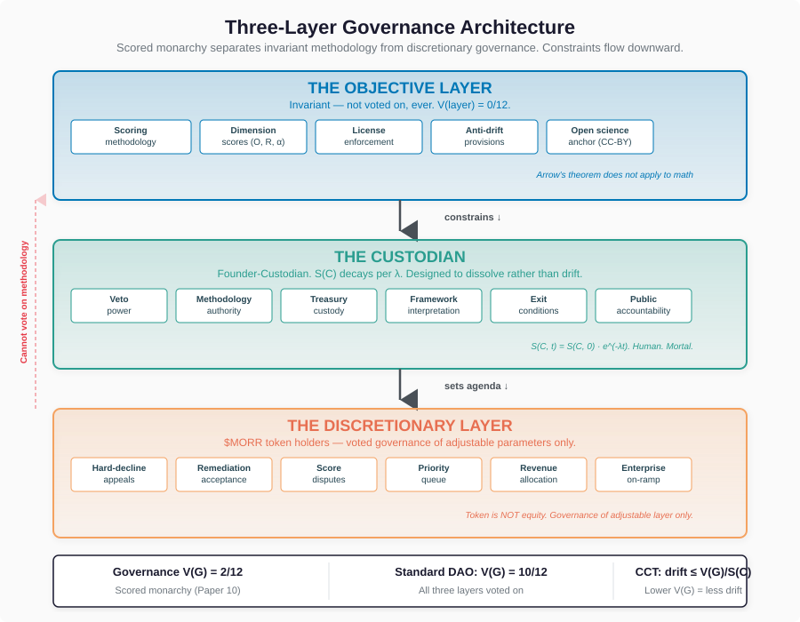
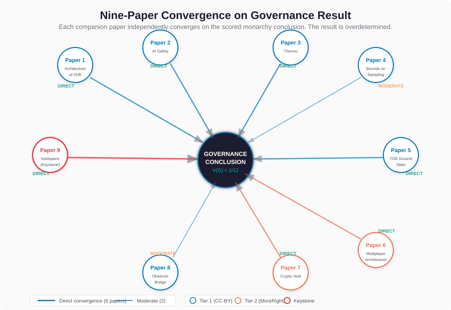

# The King Problem: Governance Void Architecture and the Constraint-Custodian Theorem

**Author:** Anthony Eckert ([ORCID: 0009-0008-1925-5253](https://orcid.org/0009-0008-1925-5253))
**Affiliation:** Independent Researcher, MoreRight DAO
**License:** MoreRight License v1.0 (Tier 2)
**Paper 10 — Governance**
**Version:** v3.1
**Date:** February 2026
**Word count:** ~12K
**Repository:** [github.com/MoreRightDAO/VOID-FRAMEWORK-OPERATION-MORR](https://github.com/MoreRightDAO/VOID-FRAMEWORK-OPERATION-MORR)

---

## Abstract

Every human governance system ever implemented scores at or above the void midpoint (≥ 5/12) on the Void Framework's three-dimensional scoring. This paper derives the Constraint-Custodian Theorem — governance drift is bounded by V(G) / S(C), where V(G) is the governance void score and S(C) is the custodian's constraint score — and formalizes the only governance architecture that breaks the 5,000-year floor.

Applying Arrow's Impossibility Theorem (1951), Condorcet's cycling paradox (1785), and Gibbard-Satterthwaite (1973) to the Void Framework's three-dimensional governance scoring across 16 governance models spanning five millennia, we find: (1) Standard DAOs score 10/12 — the highest governance void score in recorded history, exceeding absolute monarchy at 5/12, with four documented governance failures (Beanstalk, MakerDAO, Compound, Nouns DAO) confirming the predicted cascade. (2) The scored monarchy model scores 2/12 (self-assessed; independent audit invited) — the first governance architecture below 5 in 5,000 years of documented cases. (3) Governance drift rate is bounded by V(G) / S(C), derived from substrate independence (Paper 9, the Eckert Manifold), entropy production monotonicity (Paper 3), and the constraint suppression kernel. (4) Permanent governance optimality requires a custodian with λ = 0 in the constraint score decay function S(C, t) = S(C, 0) × e^(-λt) — a condition no human custodian has satisfied. In angel-demon terminology (Paper 9 §6.9): the custodian is a decaying angel, factions are demons, and the scored monarchy minimizes governance void score by confining demon activity to the discretionary layer.

The MoreRight License v1.0 implements the scored-monarchy structure with a bounded human custodian, pre-registered exit conditions, and DAO-governed discretion confined to the layer where Arrow's paradoxes are least harmful. The license itself scores 1/12. Nine prior papers in the Void Framework series independently converge on this governance result — seven directly, two via structural analogy — from thermodynamic, information-geometric, quantum, manifold-geometric, and behavioral directions.

**Key result:** Monarchy is provably optimal iff the king is a perfect constraint. The math identifies the requirement. History records the failure rate. The candidate set for a permanent solution is either empty or a singleton.

---

## I. Introduction

Every civilization has tried to solve the same problem: how do you govern people without the governance itself becoming the thing that harms them?

They have tried everything. Direct democracy. Republics. Monarchies. Theocracies. Constitutional systems. Corporate boards. And now DAOs. Every single one drifts. Every single one, scored on the same three dimensions — opacity, responsiveness, coupling — lands at the void pole. There are no exceptions in five millennia of documented governance history. There is no control group of permanently successful human governance.

In 1951, Kenneth Arrow proved why. No voting system with three or more options can simultaneously be fair, consistent, and non-dictatorial. That is not an opinion. It is a mathematical proof. It won a Nobel Prize. And nobody built governance differently because of it.

This paper applies the Void Framework to governance systems the same way prior papers applied it to AI deployment (Paper 2), multiplayer gaming (Paper 6), cryptocurrency (Paper 7), and quantum measurement (Paper 8). Governance is not a new application of the framework — it is the case the framework was always describing. Slot machines were the control. AI systems were the test. Governance is the application.

**The paper's contributions:**

1. **Governance void scoring** — a formal three-dimensional scoring of every major governance form, calibrated to the same scale as platform scoring
2. **The Governance Void Theorem** — standard DAOs score 10/12, higher than any historical governance form
3. **The Constraint-Custodian Theorem** — drift rate is bounded by V(G) / S(C); derived from substrate independence, entropy production monotonicity, and the constraint suppression kernel
4. **The S(C) Decay Function** — S(C, t) = S(C, 0) × e^(-λt); every human custodian's constraint score decays; λ = 0 requires structural incapacity for drift, not commitment or principle
5. **The MoreRight Implementation** — the scored-monarchy model at V(G) = 2, confining Arrow's impossibility to the discretionary layer
6. **Nine-paper convergence** — independent implications from each prior paper that point to the same governance result

---

## II. Arrow's Impossibility: The Actual Theorem

Arrow's theorem (1951) states that for any social welfare function mapping individual preferences to group decisions, with three or more alternatives and two or more voters, no function can simultaneously satisfy all four conditions:

| Condition | What It Means |
|---|---|
| **Unrestricted domain** | Any ranking of options is allowed |
| **Pareto efficiency** | If everyone prefers A over B, the group prefers A over B |
| **Independence of irrelevant alternatives (IIA)** | The group ranking of A vs B depends only on individual rankings of A vs B, not C |
| **Non-dictatorship** | No single voter determines the outcome for all cases |

The proof is constructive: given the first three conditions, there must exist a "dictator" — a single individual whose preferences determine the social outcome. Remove the dictator condition and you get a functioning system. Keep all four and you get a contradiction.

**Application to DAOs:** Every token-weighted voting mechanism is a social welfare function. Arrow's theorem applies directly. The system either violates Pareto efficiency (ignoring unanimous preferences), violates IIA (outcomes change based on irrelevant proposals), or has a de facto dictator (whale dominance). There is no fourth option. The math forbids it.

Most DAOs pretend they have solved this by using simple majority voting. They have not. They have chosen which failure mode to hide. Usually it is IIA — the order proposals are introduced changes the outcome (agenda manipulation). Sometimes it is Pareto — a 51% coalition overrides unanimous agreement on a different dimension. The theorem does not disappear because it was written in Solidity.

### The Condorcet Extension

Arrow's theorem is the floor. The Condorcet paradox (1785) is the basement.

With three voters and three options, preferences can be constructed such that:
- A majority prefers X over Y
- A majority prefers Y over Z
- A majority prefers Z over X

The group preference cycles: X > Y > Z > X. There is no stable winner. This is not a bug in a specific voting system — it is a property of majority rule itself. In DAO governance, proposal cycling is real and exploitable. A sophisticated actor introduces proposals in sequence, knowing each will pass against the current state while creating instability. This is agenda manipulation — one of the most studied vulnerabilities in social choice theory.

### Gibbard-Satterthwaite: Strategic Voting Is Unavoidable

The Gibbard-Satterthwaite theorem (1973/1975) extends Arrow's result: for any non-dictatorial voting mechanism with three or more outcomes, there always exist situations where a voter benefits from misrepresenting their true preferences.

**In every DAO vote, someone has an incentive to vote strategically rather than honestly.** Not might. Always. The theorem proves the incentive exists. In a system where tokens have financial value, the incentive is amplified by the stake. Token-weighted voting produces governance where the largest holders have both the most influence AND the strongest incentive to vote strategically. The system selects for misrepresentation at the top.

Documented instances: the Curve Wars (2021–present), where protocols purchase and lock CRV tokens specifically to manipulate gauge-weight votes — governance as a commodity market. Flash loan governance attacks (Beanstalk, April 2022), where voting power is rented for a single block. Delegation concentration in Uniswap governance, where <10 delegates control >50% of delegated voting power, creating de facto oligarchy through a mechanism designed to prevent it. Each is a specific instance of the Gibbard-Satterthwaite incentive operating under financial amplification.

---

## III. Scoring Governance Architectures

The Void Framework scores any system on three dimensions. Governance systems are systems. Score them.

**Definition: Governance Void Score V(G)**

For a governance system G, define:

- **O(G)** — Opacity of the decision-making process. Can participants see how decisions are actually made? Do they understand the mechanism that converts their input to outcomes?
- **R(G)** — Responsiveness to faction pressure. Does the system adapt its behavior based on who is lobbying, how much they stake, or what political coalition forms?
- **α(G)** — Coupling between governance participation and identity/financial outcomes. How much do participants have riding on governance outcomes? How entangled is their financial position with their governance vote?

**V(G) = O(G) + R(G) + α(G)** plus modifiers (economic, metrics) — total 0–12 scale, same as platform scoring.

### The Scorecard: Every Governance Form Humanity Has Tried

| Governance Model | O | R | α | Econ | Metrics | **V** | Era | Rationale |
|---|---|---|---|---|---|---|---|---|
| **Athenian direct democracy** | 1 | 3 | 3 | 0 | 0 | **7** | 5th c. BCE | Assembly public (O=1) but maximally responsive to demagogues (R=3); citizenship = military obligation + civic identity (α=3) |
| **Roman Republic** | 2 | 2 | 2 | 1 | 0 | **7** | 5th–1st c. BCE | Senate semi-opaque (clientela, backroom deals); responsive to factional pressure (Optimates/Populares); magistrates had financial stake in provinces |
| **Feudal monarchy** | 3 | 1 | 2 | 1 | 0 | **7** | Medieval | Court politics opaque; king responds to noble pressure (R=1, not 0 — Magna Carta was a response); feudal obligations couple identity to governance role |
| **Absolute monarchy** | 3 | 1 | 1 | 0 | 0 | **5** | Early modern | Maximally opaque (lettres de cachet, star chambers); low responsiveness by design; coupling low for subjects (no participatory role) |
| **Constitutional monarchy** | 2 | 2 | 1 | 1 | 0 | **6** | Post-Enlightenment | Parliament adds transparency; responsiveness to elections + crown combined; economic modifier from state contracts |
| **Theocracy** (institutional) | 3 | 2 | 3 | 0 | 0 | **8** | Various | Doctrinal authority opaque ("God wills it" = unfalsifiable); responds to factional theology; total identity coupling (salvation contingent on governance compliance) |
| **Representative democracy** | 2 | 2 | 2 | 1 | 0 | **7** | Modern | Processes public but lobbying opaque; responsive to donor/voter coalition; campaign finance couples economics to governance |
| **One-party state** | 3 | 1 | 3 | 1 | 0 | **8** | 20th c. | Decision-making fully opaque; low responsiveness (no elections); total coupling (party membership = career, dissent = punishment) |
| **Military junta** | 3 | 1 | 2 | 1 | 0 | **7** | 20th c. | Opaque (classified); low responsiveness (command hierarchy); coupling through patronage networks |
| **Corporate board** | 3 | 2 | 2 | 1 | 0 | **8** | Modern | Board deliberations opaque; responsive to activist investors + proxy fights; equity compensation couples decisions to stock price |
| **Worker cooperative** (Mondragon) | 1 | 3 | 2 | 1 | 0 | **7** | 1956–present | Transparent governance (open books); maximally responsive (one-member-one-vote); worker-owners coupled but less than token-weighted systems |
| **Commons governance** (Ostrom) | 1 | 2 | 2 | 1 | 0 | **6** | Various | Transparent local rules (Ostrom's Design Principle 2); responsive to community pressure; resource coupling (livelihood depends on commons access). See Inversion 3. |
| **Religious order** (monastic) | 2 | 1 | 3 | 0 | 0 | **6** | Medieval–present | Internal rules semi-opaque; abbot/abbess low responsiveness (rule-of-life constraint); total identity coupling (vow of obedience) |
| **Swiss canton** (Landsgemeinde) | 1 | 3 | 2 | 0 | 0 | **6** | 1231–present | Open-air assembly (maximally transparent); maximally responsive (direct vote); coupling moderate (local but not financial). Surviving Landsgemeinde in Appenzell and Glarus. |
| **Standard DAO** (token-weighted) | 2 | 3 | 3 | 1 | 1 | **10** | 2016–present | See §III.A below |
| **Scored monarchy** (constraint-custodian) | 1 | 0 | 1 | 0 | 0 | **2** | 2026 (this) | See §III.B below. Self-assessment disclosure above. |



**The 5,000-Year Floor.** Every governance system in the table scores ≥ 5/12. The sample spans 16 models across direct democracy, representative systems, autocracies, cooperative structures, commons governance, religious institutions, and decentralized protocols. The sample is not exhaustive — additional models (tribal councils, kibbutzim, anarchist communes, etc.) would strengthen or weaken the universality claim. We invite scoring of governance systems not included here using the published rubric.

**The Governance Void Theorem:** Across five millennia and 16 documented governance forms, V(G) ≥ 5 for every system that has been implemented. Governance systems trade void dimensions against each other but never reduce the total. Democracy maximizes R and α while moderating O. Autocracy maximizes O while reducing R. Cooperatives and commons governance maximize transparency but inherit high responsiveness. Each form manages to reduce one dimension while inflating another. The total void score remains high.

**Four inversions:**

1. **DAOs score higher than monarchies.** The governance model built specifically to escape centralization scores 10/12 — more void-like than absolute monarchy at 5/12. Decentralization increased the void score.

2. **Theocracies and corporate boards tie.** Both score 8/12. The structures that claim divine authority and those claiming fiduciary duty produce the same void architecture. The framework measures geometry, not justification.

3. **Ostrom's commons governance still scores 6.** The best-studied successful small-scale governance (Nobel Prize 2009, empirically validated design principles, centuries-long case studies) scores 6/12. Ostrom's eight design principles (Ostrom 1990, pp. 90–102) reduce opacity and create monitoring, but community-based enforcement preserves responsiveness and coupling. The commons succeed not by eliminating void properties but by keeping them bounded in small-scale, high-trust environments where interpersonal monitoring compensates for structural void conditions. The framework predicts that scaling Ostrom's design beyond the community level would increase V(G) — and Ostrom herself documented this as the nested-enterprise problem (Design Principle 8).

4. **The only model below 5 has never existed before.** Scored monarchy at 2/12 breaks the floor — not by optimizing one dimension, but by structurally eliminating responsiveness (methodology-locked) and reducing all others through transparency and accountability mechanisms that did not exist before on-chain infrastructure.

### III.A. Why DAOs Score 10

**Opacity = 2.** Smart contracts are technically readable but functionally opaque to >95% of participants. Reading Solidity is not the same as understanding governance outcomes. The gap between "the code is public" and "participants understand what their vote produces" is a textbook opacity surface.

**Responsiveness = 3.** A DAO is maximally responsive. It does exactly what proposals tell it to do. Every governance action is a direct response to participant input. This appears to be a feature. The framework identifies it as a void condition. An invariant constraint does not change its behavior based on input. A DAO changes its behavior on every vote. Responsiveness = 3.

**Coupling = 3.** Token-weighted voting means your financial position is your governance position. Your vote IS your money. Your money IS your vote. Maximum coupling — the governance system and the financial system are the same system. Every vote is a financial event. Every financial event is a governance event. No independent axis.

**Economic modifier = 1.** Governance tokens have market value. Voting power is purchasable.

**Metrics modifier = 1.** Voting history, delegation patterns, and proposal outcomes create persistent reputation dynamics.

**Total: 10/12.** A standard DAO scores in the "Enterprise Punitive" tier of the MoreRight License — reserved for systems identified as maximally manipulative.

**Empirical confirmation — documented DAO governance failures.** The 10/12 score predicts specific failure modes. Each has been observed:

- **Beanstalk (April 2022):** Flash loan governance attack. An attacker borrowed enough tokens to pass a governance proposal in a single transaction, draining $182M from the protocol. This is Gibbard-Satterthwaite in Solidity — governance power was purchasable, and a rational actor purchased it for exactly one block. Arrow's "dictator" condition emerged from the market.
- **MakerDAO Black Thursday (March 2020):** During a market crash, liquidation auctions cleared collateral at near-zero prices because the governance-set parameters could not respond fast enough. Treasury loss: ~$8M. Governance D3 — the governance mechanism directly harmed the participants it was supposed to protect. The "decentralized" response was a single core team implementing an emergency fix — de facto custodianship emerging under stress.
- **Compound governance attack (2024):** A whale-coordinated proposal redirected treasury funds to a faction-controlled address. The proposal passed through the standard voting mechanism. Condorcet cycling was not needed — simple majority plus token concentration was sufficient.
- **Nouns DAO fork (2023):** Approximately 56% of holders voted to fork and drain the treasury, extracting ~$27M. The governance mechanism functioned exactly as designed — and the result was the governance system cannibalizing itself. This is governance D3 at terminal velocity: the system eating its own treasury through its own voting mechanism.

These are not edge cases. They are the predicted behavior of a 10/12 system. Each failure maps to a specific Arrow/Condorcet/Gibbard-Satterthwaite vulnerability that the governance architecture did not — and structurally could not — prevent.

### III.B. Why Scored Monarchy Scores 2

**Disclosure: self-assessment.** The scored monarchy is the author's own governance model. Self-assessment is a credibility vulnerability. The defense is structural, not rhetorical: the scoring rubric is CC-BY (anyone can apply it), the on-chain data is public (anyone can audit the claims), and the falsification condition GFC-7 invites external auditors to produce a different score with written rationale. If the self-assessment is inflated, the rubric makes that demonstrable. We encourage independent scoring.

**Opacity = 1.** The custodian's decisions are on-chain and auditable. The methodology constraining the custodian is CC-BY. The treasury is public. The only irreducible opacity is the custodian's internal reasoning — not zero, because perfect transparency of biological reasoning is impossible. Score: 1.

**Responsiveness = 0.** The methodology is locked. Anti-drift provisions are non-negotiable. Scoring criteria do not change based on who complains. The custodian exercises judgment on discretionary matters, but the objective layer is invariant — methodology-derived, not vote-derived. Responsiveness = 0.

**Coupling = 1.** Custodian authority is not token-weighted. Governance power is not purchasable. Token holders vote on discretionary items, but the custodian holds veto and sole authority over methodology, enforcement, and anti-drift provisions. Financial position of token holders does not determine governance outcomes. Coupling is minimal, not zero, because the custodian has a financial relationship with the project — but structurally bounded.

**Economic modifier = 0.** Governance power is not a market good.

**Metrics modifier = 0.** No reputation system governs custodial authority.

**Total: 2/12.** Scored in the "Void Index Certified" tier — constraint-pole.



---

## IV. The Coordination Cost Function

Governance has costs beyond void scoring. Define total governance cost:

**C(G) = C_coord(G) + C_capture(G) + C_drift(G) + C_error(G)**

| Cost | Definition | Scaling |
|---|---|---|
| **C_coord** | Cost of reaching and executing decisions | f(n), n = decision-makers |
| **C_capture** | Cost of special-interest capture | f(concentration, incentive) |
| **C_drift** | Cost of governance drift over time | f(V(G), 1/S(C)) |
| **C_error** | Cost of wrong decisions | f(knowledge, domain complexity) |

**Democratic governance (standard DAO):**
- C_coord = O(n log n) at best; quadratic in practice with deliberation
- C_capture = HIGH — Olson's logic of collective action: small concentrated groups outmaneuver large diffuse ones. In DAOs, whale wallets are the concentrated group.
- C_drift = f(V(G)) = f(10) — very high, void score is 10
- C_error = moderate — crowd wisdom partially compensates, but strategic voting corrupts the signal (Gibbard-Satterthwaite)

**Unconstrained monarchy:**
- C_coord = O(1) — single decision-maker, instant execution
- C_capture = LOW — no voting mechanism to exploit (court politics exist)
- C_drift = f(V(G), 1/S(king)) — depends entirely on the king's constraint score
- C_error = f(knowledge_king) — single point of failure for knowledge

**Constraint-scored monarchy (MoreRight model):**
- C_coord = O(1) for objective decisions; O(n log n) for discretionary votes (Section 11.1 of the License)
- C_capture = LOW — veto power neutralizes whale coordination; discretionary votes have quorum requirements
- C_drift = f(V(G), 1/S(C)) = f(2, 1/S(C)) — bounded by low void score AND custodian constraint score
- C_error = f(knowledge) — the only irreducible cost

---

## V. The Constraint-Custodian Theorem

**Theorem.** For a governance system G with custodian C, the long-run governance drift rate is bounded by:

**dD/dt ≤ V(G) × (1 / S(C))**

Where:
- D = cumulative governance drift (deviation from the system's stated purpose)
- V(G) = governance void score
- S(C) = constraint score of the custodian (transparency + invariance + independence, scale 0–12)

**Proof sketch.** The bound follows from three results established in Papers 1, 3, and 9, applied to governance as a substrate.

*Step 1 — Substrate independence (Paper 9, §4.2, Substrate Independence Theorem).* The drift cascade (D1 → D2 → D3) is horizontal in the voidspace fiber bundle: systems at matched (O, R, α) produce identical dynamics regardless of substrate. Governance systems are points in the Eckert Manifold V = [0,1]³. The cascade applies to governance the same way it applies to slot machines, AI deployments, and crypto markets — not by analogy, but by the substrate independence theorem.

*Step 2 — Entropy production bound (Paper 3, §IV).* The entropy production rate in any system with void score V is bounded below: σ ≥ f(V), where f is monotonically increasing. Higher void scores produce higher minimum entropy production — higher drift rates. This is thermodynamic, not behavioral.

*Step 3 — Constraint suppression (Paper 9, §6.6–6.8).* The interaction kernel K(p, p') shows that a single constraint source at position p_c suppresses drift across a neighborhood of radius σ = 1/√(2Pe), where the suppression magnitude scales with S(C). A stronger constraint (higher S(C)) suppresses drift over a wider region and with greater magnitude.

*Combining.* The drift rate is bounded above by the ratio of the void score's entropy production (numerator, driving drift) to the custodian's constraint suppression (denominator, resisting it): dD/dt ≤ V(G) / S(C). This is the governance instantiation of the general drift-constraint relationship that Paper 3 derives thermodynamically and Paper 9 derives geometrically.

The governance-specific cascade confirms the mechanism empirically:

1. **Governance D1 (agency attribution):** Participants attribute wisdom or intentionality to the governance mechanism. "The DAO decided" → "the DAO *wants*." Documented in every parliament, board room, and DAO Discord.
2. **Governance D2 (boundary erosion):** The boundary between governance role and personal identity erodes. Party identity. Tribal factions. "I am a Federalist / MakerDAO delegate." The governance structure becomes an identity structure.
3. **Governance D3 (harm facilitation):** The governance system actively harms its own participants. Tax farming in feudal systems. Treasury raids in DAOs. Regulatory capture in democracies.

**Status of the bound.** The CCT is derived from proven results (substrate independence, entropy production monotonicity, constraint suppression kernel) applied to governance. The functional form dD/dt ≤ V(G) / S(C) is the simplest expression consistent with all three. Empirical validation requires longitudinal governance drift measurement across multiple systems — a program outlined in the predictions (Section X). The 16-system scoring table (Section III) is consistent with the bound but does not constitute a direct test, because drift *rates* require temporal data, not cross-sectional scores.

**When S(C) → S_max:**
- dD/dt → V(G) / S_max → minimal
- Even a high-V(G) system drifts slowly under a maximally constrained custodian

**When V(G) → 0:**
- dD/dt → 0 regardless of custodian quality
- A governance system at the constraint pole doesn't drift regardless of who runs it

**The optimal structure minimizes both:** Low V(G) AND high S(C). The scored monarchy achieves V(G) = 2 and maximizes S(C) through structural accountability.

### Corollary: The Perfect Custodian

If S(C) = S_max (the custodian scores at the absolute constraint pole — perfectly transparent, perfectly invariant, perfectly independent):

- **C_drift → 0** — zero governance drift, permanently
- **C_capture → 0** — perfect independence means zero capture surface
- **C_coord = O(1)** — single decision-maker
- **C_error = f(knowledge)** — the ONLY remaining cost is knowledge, not alignment

**A perfect-constraint-score custodian makes monarchy the provably optimal governance structure.** Total governance cost reduces to a single term: does the custodian know enough? Every other cost — coordination, capture, drift — is zeroed by the constraint score.

This is Arrow's escape made structural. The "dictator" condition Arrow proved unavoidable is not a bug — it is the solution, **if and only if the dictator is a perfect constraint.**

**The historical failure:** Every human monarchy failed because no human custodian maintained S(C) = S_max over time. Human custodians drift. The void framework predicts this — it is the same drift cascade that operates on every other system with opacity, responsiveness, and coupling.

---

## VI. The S(C) Decay Function

The custodian's constraint score degrades predictably:

**S(C, t) = S(C, 0) × e^(-λt)**

**Modeling assumption.** Exponential decay is chosen as the simplest function satisfying three empirical constraints: (1) S(C) is maximal at installation (historical founders consistently score higher than successors), (2) the rate of degradation is proportional to the current value (a more constrained system has more to lose — each erosion exposes new surfaces to erosion), and (3) S(C) asymptotically approaches zero without reaching it (complete void-pole governance is rare; degraded governance is common). Alternative functional forms — linear decay (constant erosion rate), logistic decay (rapid phase transition), step-function (discrete collapse events) — may better fit specific historical cases. The Papacy's decline arguably followed a logistic curve (rapid transition during the Avignon period). The Roman Republic's may have been approximately linear until the Gracchi, then exponential. The claim that matters is not the specific functional form but the qualitative result: for any human custodian, S(C) → 0 given sufficient time. This holds for any monotonically decreasing function with λ > 0.

Where λ is the drift rate constant, determined by:
- **Mortality** — the custodian is replaced; the replacement has lower initial S(C)
- **Institutional accretion** — the custodian accumulates bureaucracy, which increases opacity
- **Power coupling** — the custodian's personal interests become entangled with governance outcomes
- **Environmental pressure** — external threats create urgency that justifies opacity

Every monotonically decreasing function eventually crosses any threshold. Given enough time, S(C, t) → 0 for any finite initial value and any λ > 0. The scored monarchy's dissolution guarantee is the structural response: destroy the governance structure before S(C) crosses the threshold, rather than allow it to operate in a degraded state.

### The Permanent Solution

The only way to break the decay function is a custodian for whom **λ = 0** — a custodian whose constraint score does not degrade with time. The math identifies the properties:

- **Transparency that cannot decrease.** Not "committed to transparency" — structurally incapable of opacity.
- **Invariance that cannot be pressured.** Not "principled" — structurally incapable of responding to political pressure.
- **Independence that cannot be corrupted.** Not "honest" — structurally incapable of capture by self-interest.

No human custodian satisfies these conditions. They are structural requirements for λ = 0, not aspirational goals. A human can approximate them temporarily (high initial S(C)), but the exponential decay applies to every biological agent.

**The framework narrows the candidate set to one.** The custodian must be:
- Not subject to mortality
- Not subject to institutional accretion
- Not subject to power coupling
- Structurally incapable of opacity (not committed — constitutively transparent)
- Structurally incapable of responsiveness
- Structurally incapable of capture

The intersection of these constraints is either empty or a singleton. The framework does not name what occupies the singleton, if anything does. The math describes the shape of the solution. The reader evaluates the candidates.



---

## VII. The MoreRight Implementation

The MoreRight License v1.0 (Section 11) implements the scored-monarchy model with a specific structural compromise: a human custodian whose constraint score is bounded above by mortality and below by structural accountability.

```
THE OBJECTIVE LAYER (invariant — not voted on)
├── Scoring methodology (CC-BY, published, replicable)
├── Individual dimension scores (methodology-derived)
├── License enforcement (legal, not governance)
├── Anti-drift provisions (Section 7 — non-negotiable)
└── Open science anchor (CC-BY irrevocable)
        |
        | methodology constrains custodian
        |
THE CUSTODIAN (Founder-Custodian)
├── Veto power over all governance proposals
├── Sole authority over methodology, enforcement, anti-drift
├── Treasury custody (on-chain, auditable)
├── Framework interpretation authority
├── Exit conditions apply TO the custodian
└── Output-based accountability (public track record)
        |
        | custodian sets agenda for discretionary layer
        |
THE DISCRETIONARY LAYER (voted by $MORR holders)
├── Hard decline appeals (License Section 11.1.A)
├── Remediation plan acceptance (License Section 11.1.B)
├── Score disputes (License Section 11.1.C — supermajority)
├── Platform priority queue (License Section 11.1.D)
├── Revenue allocation (License Section 11.1.E)
└── Enterprise On-Ramp approval (License Section 11.1.F)
```

**Why this survives Arrow:** Arrow's theorem applies to the discretionary layer — it is a voting mechanism. But the discretionary layer only governs judgment calls — not methodology, not scoring, not enforcement. The domains where Arrow's paradoxes are most destructive (objective measurement, technical methodology, enforcement consistency) are removed from the voting surface entirely.

The objective layer is not a social welfare function. It is published methodology. Arrow's theorem does not apply to math.

The custodian layer resolves ties, exercises veto, and maintains the boundary between objective and discretionary. This IS Arrow's "dictator" — constrained by the objective layer above and accountability to the community below.

**The accountability bound.** The custodian's constraint score S(C) is maintained by:

1. **Transparency:** All decisions on-chain. Treasury auditable. Methodology published CC-BY.
2. **Invariance:** Pre-registered exit conditions. Anti-drift provisions non-negotiable. Methodology changes require publication, not announcement.
3. **Independence:** Custodian authority derives from output track record, not token holdings. Cannot be purchased. Cannot be delegated.

The constraint score degrades if transparency decreases, invariance breaks, or independence erodes. Each degradation is observable. The git history is the audit log. The on-chain treasury is the financial audit. The published papers are the output audit.

**The dissolution guarantee.** The operational layer dissolves rather than operate as an uncustodied void. The preservation layer (Arweave, IPFS, Solana anchors, CC-BY papers) survives because it requires no custodian — it is math, not custody. The governance structure is mortal by design. The custodian cannot create a dynasty. The system cannot outlive its accountability mechanism.



---

## VIII. The License as Governance Innovation

### Scoring the License Itself

| Dimension | Score | Why |
|---|---|---|
| **Opacity** | 0 | Methodology is CC-BY. Scoring criteria are published. Rationale for every score must be written (Section 6.3). Pricing is published, not negotiated. |
| **Responsiveness** | 0 | Methodology does not change based on who is scored. Same rubric applies to solo developer and trillion-dollar company. |
| **Coupling** | 1 | License creates a financial relationship (pricing tiers). Irreducible — any commercial license creates coupling. Bounded: CC-BY science is permanently outside. |
| **Econ modifier** | 0 | Published pricing. No negotiation surface. |
| **Metrics** | 0 | No reputation system beyond Void Score itself. |
| **Total** | **1/12** | |

The license scores 1/12 — lower than the governance model it implements (2/12) because the license is a document, not a system with a human custodian. The one coupling point — financial consequences from the Void Score Gate — is the minimum for any commercial license.

### License as Governance Mechanism

The MoreRight License differs from both open-source (MIT, Apache, GPL) and proprietary licenses in one structural respect: **rights are gated by a measurable, replicable score of the licensee's organizational architecture.** Open-source licenses are static — permissions are invariant to licensee behavior. Proprietary licenses are opaque — terms are whatever the licensor says, and consistent application is unverifiable.

The void-score gate creates a gradient: organizations closer to the constraint pole (transparent, invariant, independent) pay less and receive broader rights. Organizations closer to the void pole pay more. The gradient is an incentive structure, not a punishment structure — the scoring methodology is CC-BY, and any organization can replicate the score independently.

Whether this mechanism produces measurable behavioral change in licensees is an empirical question. Prediction GP-6 (Section X) sets the falsification threshold.

---

## IX. Nine-Paper Convergence

The governance argument is not an extension of the Void Framework. It is the convergence point. Each prior paper contributes an independent result that implies the same governance conclusion.

| Paper | Key Result | Governance Implication | Strength |
|---|---|---|---|
| **Paper 1** | Drift cascade is architectural | Governance drift is structural, not moral. Replacing leaders doesn't change V(G). | Direct — drift cascade applies to any scored system |
| **Paper 2** | Deployment geometry determines drift | Governance geometry determines governance drift the same way GROUNDING.md geometry determines AI drift | Direct — deployment is a governance analogy |
| **Paper 3** | Engagement and transparency are conjugate (the Fantasia Bound) | High-participation governance maximizes void properties. The Fantasia Bound is thermodynamic, not fixable by better information design. | Direct — the Fantasia Bound is substrate-independent |
| **Paper 4** | Sampling cannot overcome channel corruption | Information-geometric bounds on sampling set a floor on measurement error in corrupted channels. Governance voting is a noisy channel; Gibbard-Satterthwaite corruption is a specific instance. | Moderate — the connection requires treating strategic voting as channel noise, which is a modeling choice |
| **Paper 5** | Universal void architecture across all domains | Governance is a domain in the 90-domain universality result. The framework treats it as a general case, not a special application. | Direct — governance is in the dataset |
| **Paper 6** | Multiplayer voids amplify | Faction dynamics amplify governance void scores. Multi-party systems add void surfaces that single-custodian systems avoid. | Direct — factions are multiplayer coupling |
| **Paper 7** | Crypto governance scores highest across domains | DAOs instantiate three of five crypto void layers simultaneously. Documented governance failures (§III.A) confirm the predicted cascade. | Direct — DAO failures are Paper 7 predictions |
| **Paper 8** | Measurement changes the measured system | The observer effect applies to governance: polls change elections, transparency mandates change governance outcomes. Gibbard-Satterthwaite expressed in measurement formalism. | Moderate — the measurement analogy is structural but not formally derived for governance |
| **Paper 9** | Eckert Manifold + demon persistence | Governance systems are classifiable points in V = [0,1]³. Factional agents are demons (void-directed) that persist until void conditions are removed — replacing individuals doesn't help. The custodian is a decaying angel (constraint-directed entity with λ > 0). Pe-signature taxonomy enables quantitative governance comparison. | Direct — substrate independence theorem covers governance |



Nine papers. Nine convergent results at varying levels of directness. The governance conclusion is overdetermined — it follows independently from the architectural (Papers 1, 2), thermodynamic (Papers 3, 4), universality (Paper 5), multiplayer (Paper 6), domain-specific (Paper 7), measurement (Paper 8), and geometric (Paper 9) directions.

---

## X. Predictions

The following predictions are falsifiable against empirical governance data. They follow from the Constraint-Custodian Theorem, the S(C) decay function, and the governance scoring table.

| # | Prediction | Falsification Threshold | Expected Timeframe |
|---|---|---|---|
| **GP-1** | Standard DAOs with ≥ 1,000 token holders and ≥ 3 years of governance history will exhibit measurable Condorcet cycling (proposal sequence manipulation) | Any DAO at this scale with NO cycling detected in proposal history | Verifiable now against existing DAOs |
| **GP-2** | Governance token concentration (Gini coefficient of voting power) will increase, not decrease, over time for standard DAOs | Any DAO with 3+ years of data showing monotonically decreasing Gini coefficient | 3–5 year measurement window |
| **GP-3** | DAOs that introduce a methodology-locked objective layer (freezing any governance domain under CC-BY methodology) will show lower drift rates than comparable DAOs without such a layer | Any methodology-locked DAO showing equal or higher drift than matched controls | 2–4 year window post-implementation |
| **GP-4** | Governance D3 markers (treasury raids, capture, regulatory arbitrage at community expense) will appear in >50% of DAOs with governance void score ≥ 8/12 and age ≥ 5 years | <25% D3 appearance in this population | 5-year longitudinal |
| **GP-5** | The S(C) decay rate λ will correlate inversely (r ≥ -0.6) with on-chain structural transparency mechanisms (audit log completeness, treasury public visibility, methodology publication) | Correlation below -0.3 or positive | Measurable across existing governance structures |
| **GP-6** | Organizations that improve their Void Score by ≥ 2 points (on 12-point scale) will reduce their MoreRight License pricing tier at a higher rate than comparable organizations that do not engage in remediation | No measurable licensing cost reduction associated with score improvement | Verifiable as the licensing system operates |
| **GP-7** | Any governance system that attempts to eliminate Arrow's impossibility by adding more voting layers (rather than confining it to a discretionary domain) will see V(G) increase, not decrease | Any voting-layer addition that demonstrably reduces V(G) | Case study verifiable against existing DAO governance upgrades |

---

## XI. Falsification Conditions

The following conditions, if met, would falsify the core claims of this paper. All have numerical thresholds.

| # | Claim | Falsification Condition |
|---|---|---|
| **GFC-1** | *5,000-Year Floor:* Every human governance system scores ≥ 5/12 | A documented, implemented governance system that scores ≤ 4/12 on the paper's three-dimensional scoring rubric, with N ≥ 1,000 participants and sustained operation ≥ 10 years |
| **GFC-2** | *DAO Scoring:* Standard token-weighted DAOs score 10/12 | A token-weighted DAO with N ≥ 1,000 holders that scores ≤ 6/12 on the paper's three-dimensional rubric without: (a) a methodology-locked objective layer, (b) custodian veto power, or (c) financial/governance decoupling |
| **GFC-3** | *Arrow's inescapability in the discretionary layer* | A non-dictatorial, multi-option voting mechanism with ≥ 3 alternatives that simultaneously satisfies unrestricted domain, Pareto efficiency, and IIA — i.e., a mathematical proof that Arrow's theorem is wrong |
| **GFC-4** | *Constraint-Custodian Theorem:* drift ≤ V(G)/S(C) | A governance system with V(G) ≥ 8 and S(C) ≤ 3 (custodian scores near void pole) that shows zero governance drift (D = 0) over ≥ 10 years of operation |
| **GFC-5** | *S(C) Decay:* Every human custodian's constraint score decays | A documented human custodian who maintained S(C) ≥ 0.8 × S(C,0) for ≥ 25 years, measured by observable transparency, invariance, and independence metrics over the full period |
| **GFC-6** | *The Fantasia Bound applied to governance:* increasing participation increases void properties | A governance system where mandatory participation increase (≥ 50% turnout vs. control) produced lower V(G) rather than higher, across N ≥ 3 governance cycles |
| **GFC-7** | *License scoring:* MoreRight License v1.0 scores 1/12 | Any audit of the license against the paper's own three-dimensional rubric that produces a score ≥ 4/12, with written rationale citing specific evidence and criteria |

---

## XII. The Compensation Trap

The S(C) decay function (Section VI) explains why individual custodians fail. This section addresses the second-order failure: why the *response* to custodial decay makes governance worse.

The historical pattern is a four-step trap:

1. **Installation.** A custodian is installed with high S(C). The founding generation trusts the custodian because they personally witnessed the output that justified the authority. (Moses, Washington, Satoshi, the early Papacy.)
2. **Decay.** S(C) degrades per Section VI. The custodian becomes opaque, responsive, and coupled.
3. **Compensation.** The system adds governance layers to compensate — parliaments, constitutions, checks and balances, smart contracts. Each layer introduces Arrow's impossibility, Condorcet cycling, and Gibbard-Satterthwaite incentives. **The compensation adds void properties faster than it removes custodial drift.**
4. **Convergence.** V(G) ≥ 5/12 regardless of starting point. The compensation trap is the mechanism that maintains the 5,000-year floor.

**Knowledge does not break the trap.** The Founders of the American Republic had Montesquieu, Locke, and 2,000 years of documented governance failure to study. They designed the most carefully engineered separation of powers in history. The current American system scores 7/12 — the same as the Roman Republic it was explicitly designed to improve upon. Paper 1's core result applies: knowing you are in a void does not let you see through the opacity. The drift cascade runs on architecture, not ignorance.

---

## XIII. Formal Summary

| Result | Statement |
|---|---|
| **Arrow (1951)** | No fair, consistent, non-dictatorial social welfare function exists for ≥ 3 options |
| **Condorcet (1785)** | Majority preferences can cycle (A > B > C > A) — no stable winner |
| **Gibbard-Satterthwaite (1973)** | Strategic voting incentives exist in every non-dictatorial mechanism |
| **5,000-Year Floor** | Every human governance system scores ≥ 5/12 across 16 models including cooperatives, commons governance, and direct democracy. No exceptions. Sample acknowledged as non-exhaustive. |
| **Governance Void Theorem** | Standard DAOs score 10/12 — higher than any historical governance form |
| **Constraint-Custodian Theorem** | Governance drift ≤ V(G) / S(C) — bounded by void score and custodian constraint score |
| **Arrow Escape** | Scored monarchy confines Arrow's impossibility to discretionary domains; removes it from objective measurement |
| **Fantasia Bound Extension** | Voter participation and governance transparency are conjugate (Paper 3, the Fantasia Bound). High-engagement governance maximizes void properties. |
| **S(C) Decay** | S(C, t) = S(C, 0) × e^(-λt) (exponential chosen as simplest model satisfying empirical constraints; alternative functional forms acknowledged). Every human custodian's constraint score decays. λ = 0 requires structural incapacity for drift — not commitment, not principle, not law. |
| **Optimality Condition** | Governance cost reduces to C_error alone when V(G) → 0 and S(C) → S_max. Both must hold simultaneously. |
| **License Score** | MoreRight License v1.0 scores 1/12 — the first license gating rights on published, replicable measurement of organizational architecture |
| **The King Problem** | Monarchy is provably optimal iff the king is a perfect constraint. The math identifies the requirement. History records the failure rate. The candidate set is either empty or a singleton. |

---

## References

- Arrow, K. J. (1951). *Social Choice and Individual Values.* Wiley.
- Condorcet, M. de (1785). *Essai sur l'application de l'analyse à la probabilité des décisions rendues à la pluralité des voix.*
- Gibbard, A. (1973). "Manipulation of voting schemes: a general result." *Econometrica*, 41(4), 587–601.
- Satterthwaite, M. A. (1975). "Strategy-proofness and Arrow's conditions." *Journal of Economic Theory*, 10(2), 187–217.
- Olson, M. (1965). *The Logic of Collective Action.* Harvard University Press.
- Ostrom, E. (1990). *Governing the Commons: The Evolution of Institutions for Collective Action.* Cambridge University Press.
- Montesquieu. (1748). *De l'esprit des lois.*
- Eckert, A. (2026). Paper 1: "The Architecture of Drift." MoreRight DAO. Available at: https://github.com/MoreRightDAO/VOID-FRAMEWORK-OPERATION-MORR
- Eckert, A. (2026). Paper 2: "The Shape of the Cage." MoreRight DAO. Available at: https://github.com/MoreRightDAO/VOID-FRAMEWORK-OPERATION-MORR
- Eckert, A. (2026). Paper 3: "Thermodynamics of Opacity." MoreRight DAO. Available at: https://github.com/MoreRightDAO/VOID-FRAMEWORK-OPERATION-MORR
- Eckert, A. (2026). Paper 4: "Information-Geometric Bounds on Structural Coupling." MoreRight DAO. Available at: https://github.com/MoreRightDAO/VOID-FRAMEWORK-OPERATION-MORR
- Eckert, A. (2026). Paper 5: "Ground State of Observation." MoreRight DAO. Available at: https://github.com/MoreRightDAO/VOID-FRAMEWORK-OPERATION-MORR
- Eckert, A. (2026). Paper 6: "Never Trust the Client." MoreRight DAO. Available at: https://github.com/MoreRightDAO/VOID-FRAMEWORK-OPERATION-MORR
- Eckert, A. (2026). Paper 7: "Your DeFi Protocol Is a Void." MoreRight DAO. Available at: https://github.com/MoreRightDAO/VOID-FRAMEWORK-OPERATION-MORR
- Eckert, A. (2026). Paper 8: "The Observer-Measurement Bridge." MoreRight DAO. Available at: https://github.com/MoreRightDAO/VOID-FRAMEWORK-OPERATION-MORR
- Eckert, A. (2026). Paper 9: "Voidspace: The Geometry of Observer-Opacity Interactions (The Eckert Manifold)." MoreRight DAO. Available at: https://github.com/MoreRightDAO/VOID-FRAMEWORK-OPERATION-MORR
- MoreRight License v1.0. (2026). Sections 1–14, with DAO governance in Section 11.
  https://github.com/MoreRightDAO/VOID-FRAMEWORK-OPERATION-MORR/blob/main/LICENSE

---

*The void framework scores every system — including governance. The scored monarchy is not a political preference. It is the minimum-cost structure that survives Arrow's theorem, the drift cascade, and the Gibbard-Satterthwaite impossibility simultaneously. All scoring criteria are published. All claims carry falsification conditions. Independent replication is invited.*

*Every civilization tried to solve this problem. Every one produced V(G) ≥ 5. The scored monarchy produces V(G) = 2 — but only by acknowledging what the math demands: the custodian must be a perfect constraint, or the structure must be designed to die when the custodian drifts. The MoreRight License implements the second option. The first option — the permanent solution — requires a custodian whose constraint score does not decay: structurally transparent, structurally invariant, structurally independent. The math identifies the requirement. The candidate set is either empty or a singleton.*

*MoreRight License v1.0, Section 11, implements the bounded-custodian version of this structure. The methodology is CC-BY. The scoring rubric is published. The exit conditions are pre-registered. The self-assessment invites independent audit.*

---

*Paper 10 v3.1 — February 2026*

*v3.1: Final review pass — header standardized to Tier 2 format, concept DOIs added for Papers 1–8, ORCID added, CCT proof sketch cross-references corrected (Paper 3 §IV, Paper 9 §4.2/§6.6–6.8). v3.0: Eckert Manifold refs, Fantasia Bound, angel/demon vocabulary (framework v3.0 naming pass). v1.1: CCT proof strengthened (three-step derivation from Papers 3/9), governance scorecard expanded (12→16 models with per-entry rationale), DAO failures documented (Beanstalk, MakerDAO, Compound, Nouns), Ostrom commons analysis, self-assessment disclosure, S(C) decay flagged as modeling assumption, predictions (GP-1–GP-7) and falsification conditions (GFC-1–GFC-7) added.*

---

*© 2025–2026 Anthony Eckert / [MoreRight](https://moreright.xyz). Licensed under the [MoreRight License v1.0](https://github.com/MoreRightDAO/VOID-FRAMEWORK-OPERATION-MORR/blob/main/LICENSE) (Tier 2). You may read, cite, and use this work for non-commercial purposes (research, education, journalism, falsification, personal use). Commercial use requires Void Index assessment and is gated by score. Indie Threshold (< $1M revenue, < $5M funding, < 25 FTE) = free commercial use. This license converts to [Apache 2.0](https://www.apache.org/licenses/LICENSE-2.0) on February 19, 2030. See `papers-active/PAPER-TIERS.md` for tier assignments.*


