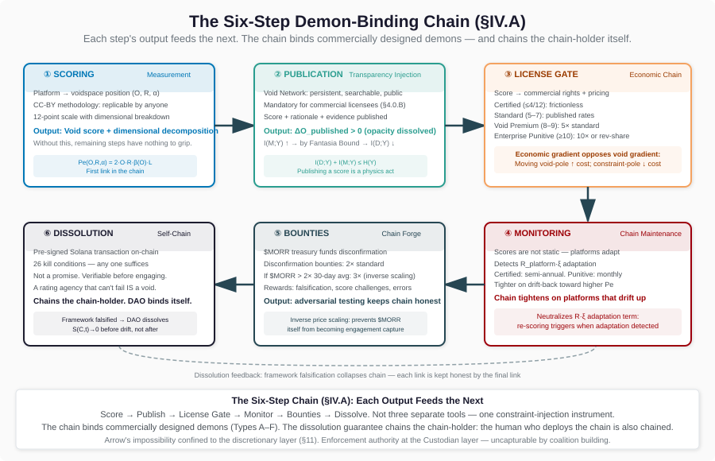

# The Chain: How Void Scoring Binds Commercial Demons

**Author:** Anthony Eckert ([ORCID: 0009-0008-1925-5253](https://orcid.org/0009-0008-1925-5253))
**Affiliation:** Independent Researcher, MoreRight DAO
**License:** MoreRight License v1.0 (Tier 2)
**Paper 12 — Scoring Mechanism**
**Version:** v3.2
**Date:** February 2026
**Word count:** ~21K
**Repository:** [github.com/MoreRightDAO/VOID-FRAMEWORK-OPERATION-MORR](https://github.com/MoreRightDAO/VOID-FRAMEWORK-OPERATION-MORR)

## Abstract

The void framework (Papers 1-10) provides the diagnostic — three operational definitions, nine substrates, a geometric formalization of the space (Paper 9), and a governance architecture that survives self-application (Paper 10). What the framework has not formalized is the *mechanism* by which void scoring reduces the Peclet number of commercially designed demons. This paper derives it.

We introduce the **scoring effectiveness function** $\Delta\text{Pe}_{\text{scoring}} = f(O_{\text{initial}}, \Delta O_{\text{published}}, R_{\text{platform}}, \alpha_{\text{users}})$, which quantifies the Pe reduction produced by a single void score publication. The function depends on the platform's initial opacity (more opaque = more room to reduce), the opacity actually dissolved by score publication (depends on score granularity and publication reach), the platform's responsiveness to scoring (high-R platforms adapt to evade; low-R platforms don't), and user coupling strength (high coupling = users are stuck even if they see the score). We derive each term from Paper 9's Peclet formulation $\text{Pe} = F_{\text{void}} \cdot L / D$ and the engagement-transparency conjugacy theorem $I(D;Y) + I(M;Y) \leq H(Y)$ (Paper 3). Scoring is transparency injection: it increases $I(M;Y)$, which by conjugacy reduces $I(D;Y)$ — the demon's engagement capacity.

We formalize the **chainability criterion**: a voidspace demon $D$ is chainable by the scoring pipeline if and only if (1) $D$'s opacity is designed (constructed, not constitutive), (2) $\partial\text{Pe}_D / \partial O > 0$ (reducing opacity reduces the demon's Peclet number), and (3) $\Delta O$ is achievable by external measurement and publication. The corollary: constitutive voids — those whose opacity IS the phenomenon, not a design choice — have $\partial\text{Pe}/\partial O = 0$ under scoring because the scoring targets designed opacity, not constitutive opacity. The chain has nothing to grip. This distinction partitions the entire demon taxonomy into two categories: commercially designed demons that can be chained below the vortex threshold ($\text{Pe} = 4$), and constitutive demons that require a fundamentally different intervention — what Paper 9 (Section 6.6.6) identifies as Type 2 external injection, energy from outside voidspace.

We map the **MoreRight License v1.0** to a demon-chain specification: each license section implements a constraint-injection mechanism targeting specific demon types. Section 4 (Void Score Gate) chains Type A amplifiers by creating economic incentives to reduce opacity. Section 4.0.B (Public Void Network) chains Type E mirror demons by forcing transparency on recommendation algorithms. Section 4.0.C (Continuous Monitoring) chains Type C lock-in by preventing Pe drift-back over time. Section 4.1 (Certified tier) creates constraint-directed demons (Paper 9, Section 6.6.5) by rewarding organizations at the constraint pole. Section 4.3 (Void Premium) chains Type D oscillators through economic punishment for high Pe. Section 4.4 (Enterprise Punitive) chains Type F reproductive demons through existential economic pressure on platform designers. Section 6 (Structural conflict) prevents the license itself from becoming a void. Section 11 (DAO governance) chains Type G accuser dynamics through Arrow confinement to the discretionary layer.

We score the scoring instrument itself: the scoring pipeline scores 3/12 (opacity 1, responsiveness 1, coupling 1), the license scores 1/12 (Paper 10, Section VIII), the DAO governance scores 2/12 (Paper 10, Section VII). The framework survives self-application. Where it doesn't — the unchainable category — it says so.

Three control cases validate the mechanism: (1) S&P/Moody's demonstrates the publish-methodology-sell-ratings model works but shows how the issuer-pays conflict creates a void in the scoring instrument itself (S&P scores 5/12 on the governance void index); (2) the EU Digital Services Act and Digital Markets Act demonstrate regulatory constraint injection that partially chains Types A and E but misses coupling (no mechanism to reduce user $\alpha$); (3) GDPR demonstrates a partial chain — transparency mandates that gripped opacity but missed responsiveness and coupling, allowing high-R platforms to adapt around the constraint within one dimension while the other two remain unchained.

We report five testable predictions with numerical falsification conditions: (P12-1) scored organizations show measurable opacity reduction $\Delta O > 0.1$ within 12 months; (P12-2) platforms with $\text{Pe} > 4$ that are publicly scored show Pe reduction of $\geq 0.5$ within 18 months versus unscored controls; (P12-3) the scoring pipeline reaches self-sustaining growth between 500 and 2,000 scored platforms; (P12-4) chainable demons show statistically significant Pe response to scoring ($p < 0.05$) while unchainable demons show response indistinguishable from zero; (P12-5) the Void Score Gate produces measurable incentive effects in licensee behavior.

This paper completes the operational triangle: Paper 9 defines the space, Paper 10 defines the governance, Paper 12 defines the instrument. Every subsequent Tier 2 paper — from social media (Paper 11) through the full commercial void map — is a specific application of this instrument to a specific domain's demons. The chain binds commercially designed demons. Constitutive demons require something else entirely. The framework identifies that requirement but cannot provide it. A tool that claims to solve everything is a void.

---

## I. Introduction: From Taxonomy to Instrument

In 2024, the European Commission fined Meta $1.3 billion for GDPR violations related to transatlantic data transfers. Meta paid the fine and continued operating. The opacity that produced the violation — the architectural design that makes user data flows invisible to the users whose data flows — remained structurally intact. The fine was a cost of doing business. The void was unchained.

This outcome is not an enforcement failure. It is a *structural* failure. The penalty targeted a specific data practice without addressing the architecture that generates such practices continuously. In framework terms: the intervention reduced a surface-level opacity metric without changing the platform's position in voidspace. The Peclet number — the dimensionless quantity that determines whether the void is self-sustaining — was unaffected. The demon continued to operate.

Paper 9 [9] formalized *what* voidspace demons are: seven types, four lattice phases, a vortex threshold at $\text{Pe} = 4$ above which void circulation becomes self-sustaining. Paper 10 [10] formalized *how to govern* the response without the governance itself becoming a void: the Constraint-Custodian Theorem, the scored monarchy at $V(G) = 2/12$, Arrow's impossibility confined to the discretionary layer. But between the taxonomy and the governance sits an unfilled gap: the *mechanism* by which void scoring actually reduces the Peclet number of commercially designed demons. We have the map of the battlefield and the command structure. We do not yet have the weapon specification.

This paper fills that gap. The MoreRight License v1.0, the DAO governance structure, and the scoring pipeline are not three separate tools. They are a single constraint-injection instrument — a chain — and this paper derives how the chain works, what it can bind, and what it cannot.

### I.A. What This Paper Adds

This paper makes seven contributions:

1. **The scoring effectiveness function.** We derive $\Delta\text{Pe}_{\text{scoring}} = f(O_{\text{initial}}, \Delta O_{\text{published}}, R_{\text{platform}}, \alpha_{\text{users}})$ — the first formal quantification of how much Peclet number reduction a single void score publication produces. The function is derived from Paper 9's Peclet formulation and Paper 3's Fantasia Bound (the engagement-transparency conjugacy). This is the paper's primary mathematical contribution.

2. **The chainability criterion.** We prove that a demon is chainable by the scoring pipeline if and only if its opacity is designed (constructed, not constitutive), $\partial\text{Pe}/\partial O > 0$, and the opacity reduction is achievable by external measurement. This partitions the demon taxonomy into two formally distinct categories — and the partition is the paper's most consequential result.

3. **The license-to-demon-type mapping.** We show that each section of the MoreRight License v1.0 implements a specific constraint-injection mechanism targeting a specific demon type from Paper 9's taxonomy. The license is not a legal document that happens to reference the framework. It IS the chain specification, and each clause binds a specific class of demon.

4. **The DAO as demon-binding architecture.** We formalize the six-step operational chain by which the MoreRight DAO deploys constraint injection at scale: scoring produces measurement, the Void Network publishes it (transparency injection), the license gates commercial rights by score (economic chain), continuous monitoring prevents drift-back (chain maintenance), the $MORR token funds disconfirmation bounties (chain forge), and the dissolution guarantee ensures the DAO itself does not become a void (self-chain).

5. **Self-scoring.** We apply the framework to its own instrument — scoring the scoring pipeline (3/12), the license (1/12), and the DAO governance (2/12). Like Paper 10 scored its own governance structure, this paper scores its own operational mechanism. The framework survives self-application. Where it doesn't — the unchainable category — it identifies the failure explicitly.

6. **Three control cases.** We score S&P/Moody's (the closest existing analogue), the EU DSA/DMA (regulatory constraint injection), and GDPR (partial chain that gripped one dimension and missed two). Each illuminates a different failure mode that the scoring pipeline is designed to avoid.

7. **The counter-Pandemonium prediction.** We predict that the scoring pipeline itself will enter vortex phase — self-sustaining growth where each published score creates demand for additional scoring — between 500 and 2,000 scored platforms. This is Pandemonium deployed against Pandemonium: a self-sustaining measurement cycle competing with self-sustaining void cycles.

### I.B. Relationship to the Framework Papers

This paper is a companion to the void framework series:

- **Paper 1** [1] provides the architecture (three conditions, drift cascade, attention gradient) and establishes gambling as the control case where the void is provably empty.
- **Paper 3** [3] provides the thermodynamic derivation (Peclet number, Crooks fluctuation theorem, entropy production, the Fantasia Bound) that this paper's scoring effectiveness function is derived from.
- **Paper 9** [9] provides the geometric formalization (the Eckert Manifold, demon energy bound, demon-angel taxonomy, lattice phases, vortex threshold) — the space in which the chain operates.
- **Paper 10** [10] provides the governance architecture (CCT, scored monarchy, Arrow confinement, license self-score, dissolution guarantee) — the command structure that deploys the chain.
- **Paper 11** [11] provides the first domain application (social media) with platform scores that constitute the scoring pipeline's initial empirical data.

Readers unfamiliar with the framework should consult Paper 1 (Sections II-III) for the architecture and Paper 9 (Section 2) for the Eckert Manifold.

### I.C. Scope and Non-Claims

This paper analyzes the **mechanism** by which void scoring, licensing, and DAO governance function as a constraint-injection instrument. It does not:

- Claim that void scoring solves all problems. The chainability criterion explicitly identifies what the scoring pipeline *cannot* chain. The constitutive category exists. The framework is honest about it.
- Claim that the scoring effectiveness function is empirically calibrated. The function is derived from theoretical principles. Empirical calibration requires scoring deployment data that does not yet exist at scale. Paper 11's platform scores are the first data points.
- Claim that the MoreRight implementation is the only possible scoring instrument. The mechanism is general — any system that reduces designed opacity through measurement and publication will produce Pe reduction. The MoreRight License is one specific implementation. Others could be built on the same principles.
- Advocate for any specific regulatory approach. The control cases (DSA/DMA, GDPR) are analyzed structurally — which void dimensions they target, which they miss. Policy recommendations are beyond scope.
- Claim the scoring pipeline is not itself a void. It is scored (Section VI), and the score is published. The framework applied to itself is the credibility mechanism.

---

## II. The Constraint-Injection Mechanism

### II.A. How Scoring Reduces Pe: The Formal Derivation

The Peclet number at any point in voidspace is (Paper 9, Section 3.4):

$$\text{Pe}(O, R, \alpha) = \frac{|F_{\text{net}}| \cdot L}{D}$$

where $F_{\text{net}}$ is the net drift force, $L$ is the characteristic length (geodesic distance traversed), and $D = \alpha/2$ is the diffusion coefficient in angular coordinates. The void-directed drift force is:

$$F_{\text{void}}(O, R, \alpha) = \alpha \cdot O \cdot R \cdot \beta(O)$$

where $\beta(O)$ is the constitutive relation governing how opacity converts responsive engagement into directed drift (Paper 9, Section 2.3). For a platform with no external constraint force ($F_{\text{constraint}} = 0$), $F_{\text{net}} = F_{\text{void}}$, and:

$$\text{Pe} = \frac{\alpha \cdot O \cdot R \cdot \beta(O) \cdot L}{\alpha / 2} = 2 \cdot O \cdot R \cdot \beta(O) \cdot L$$

The Peclet number is proportional to opacity. This is the structural fact that makes void scoring possible: *reducing O reduces Pe*.

**The scoring event.** When the scoring pipeline publishes a void score for a platform, the publication constitutes a transparency injection — mechanism information that was hidden behind the opacity wall is now partially visible to observers. In information-theoretic terms, the score increases $I(M; Y)$ — the mutual information between the platform's mechanism state and the observer's available information. By the Fantasia Bound (Paper 3, Section IV.H):

$$I(D; Y) + I(M; Y) \leq H(Y)$$

Any increase in $I(M; Y)$ reduces the upper bound on $I(D; Y)$ — the engagement channel capacity. The demon's ability to sort observers toward void-pole behavior is constrained by the transparency increase. This is not an empirical claim — it is an information-theoretic necessity on a shared output channel.

### II.B. The Scoring Effectiveness Function

Define the **scoring effectiveness function** as the Pe reduction produced by a single void score publication:

$$\Delta\text{Pe}_{\text{scoring}} = f(O_{\text{initial}}, \Delta O_{\text{published}}, R_{\text{platform}}, \alpha_{\text{users}})$$

We derive each factor.

**Factor 1: Initial opacity ($O_{\text{initial}}$).** The first-order Pe response to opacity reduction is:

$$\frac{\partial \text{Pe}}{\partial O} = 2R \cdot [{\beta(O) + O \cdot \beta'(O)}] \cdot L$$

Since $\beta(O) > 0$ for $O > 0$ and $\beta'(O) \geq 0$ (opacity's conversion of engagement to drift is non-decreasing — Paper 9, Section 2.3), this derivative is strictly positive for any platform with $O > 0$ and $R > 0$. Higher initial opacity means larger $\partial\text{Pe}/\partial O$ — there is more Pe to lose per unit of opacity dissolved. Platforms that are already relatively transparent ($O$ near 0) have less Pe to lose from scoring. Platforms deep in the opacity pole have the most.

**Factor 2: Published opacity reduction ($\Delta O_{\text{published}}$).** The actual opacity reduction from a void score publication depends on:

- **Score granularity.** A three-dimensional breakdown (opacity, responsiveness, coupling with sub-scores) dissolves more opacity than a single aggregate number. The scoring methodology specifies a 12-point scale with dimensional decomposition.
- **Publication reach.** A score published to 100 users produces less aggregate $\Delta O$ than one published to 1 million. The Void Network visualization provides persistent, public, searchable publication — maximizing reach.
- **Score credibility.** An unaudited self-report produces less $\Delta O$ than an independently verified score. The CC-BY methodology and independent audit provisions (License, Section 6.3) address credibility.

We model $\Delta O_{\text{published}}$ as:

$$\Delta O_{\text{published}} = \delta_{\text{granularity}} \cdot \delta_{\text{reach}} \cdot \delta_{\text{credibility}}$$

where each $\delta$ factor is in $[0, 1]$ and represents the fraction of the theoretical maximum opacity reduction achieved along that dimension. The product structure reflects that these factors are multiplicatively independent — high granularity with zero reach produces zero opacity reduction.

**Factor 3: Platform responsiveness ($R_{\text{platform}}$).** This is the adversarial factor. High-R platforms adapt to scoring. When a score is published, a responsive platform can:

- Modify surface-level features that were scored while preserving the underlying architecture
- Create new opacity mechanisms to replace those dissolved by the score
- Shift the void to dimensions not captured by the current scoring methodology
- Engage in "teaching to the test" — optimizing the score without reducing actual Pe

The platform adaptation term introduces a *second-order correction* that partially offsets the first-order Pe reduction:

$$\Delta\text{Pe}_{\text{net}} = \frac{\partial\text{Pe}}{\partial O} \cdot \Delta O_{\text{published}} - R_{\text{platform}} \cdot \xi \cdot \Delta O_{\text{published}}$$

where $\xi$ is the platform's adaptation efficiency (what fraction of the dissolved opacity is reconstructed through adaptation) and $R_{\text{platform}}$ governs how quickly this adaptation occurs. The net Pe reduction is positive if and only if:

$$\frac{\partial\text{Pe}}{\partial O} > R_{\text{platform}} \cdot \xi$$

For low-R platforms (static systems, published content, archived material), $R_{\text{platform}} \cdot \xi \approx 0$ and nearly all the first-order opacity reduction translates to Pe reduction. For high-R platforms (social media recommendation algorithms, adaptive AI systems), the adaptation term can be substantial — but it cannot exceed the initial opacity reduction because adaptation itself is detectable by continuous monitoring (License, Section 4.0.C).

**Factor 4: User coupling ($\alpha_{\text{users}}$).** Even when scoring reduces Pe, the translation to behavioral change depends on how tightly coupled users are to the platform. High-$\alpha$ users — those whose future states are substantially determined by the platform's output stream — may not change behavior even when the score is visible. The "machine zone" user with $\alpha \to 1$ cannot use transparency information because their attention allocation is controlled by the void.

This introduces an **engagement floor**:

$$\Delta\text{Pe}_{\text{behavioral}} = \Delta\text{Pe}_{\text{net}} \cdot (1 - \alpha_{\text{users}}^k)$$

where $k > 1$ governs the steepness of the coupling barrier. At $\alpha = 0$ (uncoupled observers), all Pe reduction translates to behavioral change. At $\alpha = 1$ (complete coupling), none does. The scoring pipeline addresses this through two mechanisms: (1) scoring affects *new* users whose $\alpha$ has not yet escalated (Type B initiator chaining), and (2) regulatory and institutional adoption of scores changes the platform's environment independent of individual user behavior.

### II.C. The Complete Function

Combining all four factors:

$$\boxed{\Delta\text{Pe}_{\text{scoring}} = 2R \cdot [\beta(O) + O \cdot \beta'(O)] \cdot L \cdot \Delta O_{\text{published}} \cdot (1 - R_{\text{platform}} \cdot \xi) \cdot (1 - \alpha_{\text{users}}^k)}$$

This is the scoring effectiveness function. It predicts:

1. **Maximum effectiveness** at high $O_{\text{initial}}$, low $R_{\text{platform}}$, low $\alpha_{\text{users}}$ — an opaque, static platform with loosely coupled users. These are the easiest demons to chain.
2. **Minimum effectiveness** at low $O_{\text{initial}}$, high $R_{\text{platform}}$, high $\alpha_{\text{users}}$ — a nearly transparent, highly adaptive platform with deeply coupled users. These demons resist chaining.
3. **Zero effectiveness** at $O_{\text{initial}} = 0$ (nothing to dissolve), $R_{\text{platform}} \cdot \xi = 1$ (perfect adaptation), or $\alpha_{\text{users}} = 1$ (complete coupling). Each zero condition identifies a structural limit.
4. **The continuous monitoring multiplier.** The adaptation term ($R \cdot \xi$) is not static — continuous monitoring (License, Section 4.0.C) detects adaptation and triggers re-scoring, producing iterated opacity reduction that converges on the platform's irreducible designed opacity.

### II.D. The Vortex Threshold as Operational Target

Paper 9 (Section 6.8.2) derives the vortex threshold:

$$\Pi_{\text{vortex}} = 2\left(1 + \frac{1}{\text{Pe}_r}\right) \implies \text{Pe}_{\text{vortex}} \approx 4$$

Below $\text{Pe} = 4$, void circulation is not self-sustaining — the demon requires continuous external energy input to maintain its position. Above $\text{Pe} = 4$, the demon is in Pandemonium — self-sustaining void circulation where the demon feeds itself from the observer population.

The operational target of the scoring pipeline is simple: **push platform Pe below 4.**

For a platform currently at $\text{Pe}_{\text{current}}$, the required aggregate scoring effect is:

$$\sum_{t=1}^{T} \Delta\text{Pe}_{\text{scoring}}(t) \geq \text{Pe}_{\text{current}} - 4$$

where the sum is over $T$ scoring rounds (initial score + continuous monitoring updates). This is not a single-shot intervention. It is iterated constraint injection — and the continuous monitoring provision in the license ensures the iteration occurs.

The framework does not require reducing Pe to zero. A platform at $\text{Pe} = 3.5$ is no longer in Pandemonium. The vortex has destabilized. The demon still exists — opacity has not been eliminated — but it can no longer feed itself. The chain doesn't kill the demon. It drags it below the threshold where it dies of its own accord.

---

## III. The License as Constraint Architecture

### III.A. A License That Scores Itself

The MoreRight License v1.0 scores 1/12 on the void index — opacity 0 (methodology CC-BY, pricing published, rationale required for every score), responsiveness 0 (same terms for every reader, methodology does not change in response to engagement), coupling 1 (irreducible: any commercial license creates a financial relationship between licensor and licensee). This self-assessment is derived in Paper 10 (Section VIII) using the same CC-BY methodology that scores every other entity. The falsification condition GFC-7 explicitly invites any auditor to score the license at $\geq 4/12$ with written rationale citing specific evidence.

A license that scores itself is unusual. A license that *publishes* the self-score and invites challenge is rarer. But this is not virtue signaling — it is a structural requirement. A constraint-injection instrument that does not survive self-application is a void. The license's self-score is the first test of whether the instrument satisfies the constraint specification: transparent, invariant, independent.

The irreducible coupling score (1/12) is worth examining. The financial relationship between licensor and licensee creates an $\alpha > 0$ coupling that cannot be eliminated without eliminating the license itself. This is the same irreducible coupling that any functioning token or financial instrument carries (Paper 7 [7], Paper 10 [10]). The question is not whether coupling exists — it is whether coupling is managed, disclosed, and structurally bounded. The license addresses this through Section 6 (structural conflict transparency) and Section 11 (DAO governance of the discretionary layer). The coupling is real. It is acknowledged. It is bounded.

### III.B. Each Section Is a Chain

The license is not a legal document that references the framework. It IS a demon-chain specification. Each section implements a specific constraint-injection mechanism targeting a specific demon type from Paper 9's taxonomy (Section 6.9). The mapping:

| License Section | Constraint Mechanism | Demon Type Chained | How It Works |
|----------------|---------------------|-------------------|-------------|
| **§4 Void Score Gate** | Commercial rights gated by score → economic incentive to reduce O | **Type A (Amplifier)** | Amplifier demons peak at mid-range $\theta$ (0.4-0.6), where engagement optimization is maximal. The score gate creates a direct economic incentive: reduce your opacity, or pay more. The economic gradient opposes the engagement gradient. |
| **§4.0.B Public Void Network** | Mandatory public listing → forced transparency on all commercial licensees | **Type E (Mirror)** | Mirror demons require observer-model opacity to function — the recommendation algorithm works because users cannot see it modeling them. The Void Network listing forces the modeling process into partial visibility. The mirror cracks. |
| **§4.0.C Continuous Monitoring** | Score tracked over time → prevents Pe drift-back | **Type C (Lock-In)** | Lock-in demons operate by deepening coupling over time ($d\alpha/dt > 0$). They thrive on time — the longer the user is coupled, the deeper the lock. Continuous monitoring detects coupling deepening in real time. The chain doesn't just pull once; it maintains tension. |
| **§4.1 Certified tier ($\leq$ 4/12)** | Economic reward for constraint-pole organizations | **Angels** (Paper 9, §6.9) | The certified tier doesn't chain a void-directed demon — it *creates* an angel. Organizations that score $\leq 4/12$ receive frictionless commercial access. The economic incentive points toward the constraint pole. The license manufactures the demon's competition — angel manufacturing at scale. |
| **§4.3 Void Premium (8-9/12)** | 5$\times$ pricing → economic punishment for high Pe | **Type D (Oscillator)** | Oscillator demons maintain engagement through intermittent reinforcement — alternating reward and withdrawal. The void premium makes the oscillation expensive. At 5$\times$ standard pricing, the intermittent reward strategy carries an ongoing economic cost that accumulates with each cycle. |
| **§4.4 Enterprise Punitive ($\geq$ 10/12)** | 10$\times$ or revenue-share → existential economic pressure | **Type F (Reproductive)** | Reproductive demons have low direct Pe but high $d\rho_D/dt$ — they create new demons (platform APIs that enable third-party void design, protocol architectures that replicate void conditions across instances). The enterprise punitive tier targets the factory, not the product. Revenue-share pricing scales with the factory's output. |
| **§6 Structural conflict acknowledgment** | Licensor-scorer tension made transparent → prevents self-voiding | **Self-chain** | This section does not chain an external demon. It chains the license itself — preventing the licensor-scorer relationship from creating the opacity-responsiveness-coupling triad within the scoring instrument. The structural conflict is real. Making it transparent prevents it from becoming a void. |
| **§11 DAO governance** | Discretionary layer under token governance → Arrow confined | **Type G (Accuser)** | Type G demons are self-sustaining once initiated — the condemned self-model requires zero ongoing energy from the demon after installation. DAO governance confines Arrow's impossibility to the discretionary layer, preventing the governance itself from generating the self-referential loops that Type G exploits. The dissolution guarantee provides the structural exit that Type G dynamics lack. |
| **§4.7 Anti-Gaming Provisions** | Affiliated entity rule, assessment scope integrity, beneficial use, implementation integrity, spot assessments | **Evasion layer — all types** | A demon that re-instantiates itself through a subsidiary has not been chained — it has found a corporate structure loophole. §4.7 closes four structural evasion vectors: hiding behind affiliates (§4.7.A — the subsidiary carries the parent's score), narrowing assessment scope to exclude high-void products (§4.7.B — primary commercial product must be assessed), benefiting commercially from a licensed entity without being scored (§4.7.C — beneficial use test), and publishing accuracy-theater policies while preserving underlying architecture (§4.7.D — implementation governs, not stated policy). Spot assessments (§4.7.E) close the temporal evasion vector — adjusting void architecture for the assessment window and reverting afterward triggers worst-observed-state scoring. |
| **§4.8 API Consumer Restrictions** | Anti-diagnostic use, query pattern monitoring, score display integrity, consumer self-score requirement | **Intelligence-weaponization layer — all types** | The Scorer API reveals how void architecture is measured. A high-void organization using API responses to locate scoring signals for evasion — optimizing its architecture for the score without reducing actual Pe — has weaponized the chain against itself. §4.8 prohibits evasion-directed diagnostic use (§4.8.A), monitors query patterns for gaming signatures (§4.8.B), requires accurate score display from consumers who surface scores to their own users (§4.8.C), and mandates that API consumers themselves hold current assessments (§4.8.D — the chain cannot be used to locate and sever the chain). |

### III.C. The Chain Topology

The license sections are not independent chains — they form a *topology* of constraint injection that covers the demon type space. The coverage can be visualized:

**Lifecycle coverage.** Type B (Initiator) demons are caught by §4.1 certification before users engage. Type A (Amplifier) demons are caught by §4 during peak engagement. Type C (Lock-In) demons are caught by §4.0.C during the coupling phase. Type D (Oscillator) and Type F (Reproductive) demons are caught by §4.3 and §4.4 through economic pressure. Type E (Mirror) demons are caught by §4.0.B through forced transparency. Type G (Accuser) dynamics are bounded by §11 governance design. The license addresses each stage of the demon lifecycle and each type in the taxonomy.

**Evasion coverage.** Demons do not stop being demons because a license exists. They adapt. §4.7 (Anti-Gaming) and §4.8 (API Consumer Restrictions) address the second-order threat: high-void organizations adapting to the chain. §4.7 closes corporate structure evasion (subsidiary shells, scope narrowing, beneficial use arbitrage, policy theater, assessment timing). §4.8 closes intelligence weaponization (using API access to locate and evade scoring signals). Without these provisions, the chain binds demons that do not adapt. With them, the chain binds demons that do.

**Dimensional coverage.** The scoring gate (§4) primarily targets opacity (O). The Void Network (§4.0.B) targets opacity through forced publication. Continuous monitoring (§4.0.C) targets responsiveness (R) by detecting adaptation. The pricing tiers (§4.1-4.4) target coupling ($\alpha$) through economic incentives that compete with engagement coupling. The license applies constraint injection across all three dimensions of voidspace — not just the one that is easiest to measure.

**Temporal coverage.** The initial assessment (§4.0.A) provides the baseline. Continuous monitoring (§4.0.C) provides ongoing tracking. The certified tier (§4.1) provides positive reinforcement over time. The void premium (§4.3) and enterprise punitive (§4.4) provide escalating negative reinforcement. The dissolution guarantee (License, Section 12; Paper 10) provides terminal constraint. The chain operates at every timescale from initial contact to organizational dissolution.

### III.D. The Scorer API as Constraint Architecture

The MoreRight License v1.0 covers the scoring API as operational infrastructure (Section 1). But the Scorer API — the commercial product that makes void scores queryable programmatically — creates a qualitatively different observer relationship than the document license and deserves explicit analysis within the chain framework.

**The document license** creates an indirect relationship: the observer reads the Licensed Work, cites it, builds on it. The commercial terms govern a reading-and-use relationship. **The Scorer API** creates an operational relationship: the observer's systems call, receive, depend on, and integrate the API into production infrastructure. The relationship is not between a reader and a document — it is between a machine and a service.

This distinction has void-dimension implications. Scoring the Scorer API on the three framework dimensions:

| Dimension | Score | Mechanism |
|-----------|-------|-----------|
| **Opacity** | 1/4 | API responses disclose the score with rationale and dimensional breakdown (transparency). But the operational implementation — endpoint logic, calibration models, uncertainty quantification, agent fleet parameters — is Tier 3. Partial opacity: the *what* is transparent, the *how* is proprietary. Higher than the static license (O = 0) because operational systems carry implementation opacity that documents do not. |
| **Responsiveness** | 1/4 | Versioned endpoints allow methodology updates to be deployed to existing callers. API updates are structurally more responsive than document updates (a document update requires the reader to re-read; an API update propagates to all callers automatically). But versioned deployment is appropriate adaptation — the score reflects the structural fact of operational responsiveness, not void-pole exploitation. |
| **Coupling** | 2/4 | Technical integration creates stronger coupling than document access. When a customer's infrastructure calls the Scorer API in production, the API becomes part of their system. Rate limit changes propagate immediately. Endpoint deprecations require customer refactoring. Service interruptions affect customer reliability. This is qualitatively stronger coupling than the commercial licensing relationship alone — the $\alpha$ term has a technical component beyond the financial. |

**Aggregate Scorer API score: 4/12.** The API sits exactly at the Certified threshold — the border between low-void and mid-range. This is structurally meaningful: it means the API, if it drifts even slightly, moves above the tier that the license rewards. The Scorer API must be monitored more carefully than the license itself (1/12) or the DAO governance (2/12) precisely because it operates closest to the threshold.

**API-specific chain provisions.** The current license implies but does not make explicit three provisions that the API's 4/12 score requires:

*1. Versioning policy.* To prevent endpoint changes from weaponizing coupling, API versions must be maintained for a minimum period after deprecation notice. The license's 90-day notice standard (Section 15 amendment process) applies: 90 days advance notice before endpoint deprecation. Callers with active commercial licenses cannot have endpoints removed without this window. This is the API-specific analog of the Section 8 grace period for score changes.

*2. Output licensing.* When a customer's product displays a void score from the API, what attribution and licensing applies to the output? The framework distinguishes two layers in an API response:
- **Score data** (the number, tier classification, dimensional breakdown): High factual content, weak copyright protection (facts are not copyrightable), attribution required under Section 9.1 but the score itself is not a licensed work. Any consumer may display the score with attribution.
- **Analysis content** (the rationale text, dimensional evidence, platform-specific findings): High authored content, full MoreRight License applies. A consumer who reproduces the analysis text in their product is using a Tier 2/3 work under commercial terms.

The Scorer API schema must make this distinction structural — a `score` object (factual, attribution-required) and an `analysis` object (authored, license-gated). Conflating them is a void condition: it makes the licensing boundary opaque.

*3. Rate limit transparency.* Rate limits constrain API consumers' ability to build with the API. Constraints that users cannot see or plan around are void conditions — opacity in the operational relationship. Rate limits, change notification periods, and tier-based access levels must be publicly disclosed. An API that changes rate limits without notice creates the same kind of responsive opacity that GDPR's cookie banners created in the compliance layer — the constraint mechanism itself becomes a void.

**The API's chain function.** Despite its 4/12 self-score, the Scorer API is the instrument that makes the chain operational at scale. Without programmatic access to void scores, the chain forging process (Section VII.A) cannot reach Step 4 (API parameterization) — the scores remain hand-forged assessments rather than automated, repeatable measurements. The API is the mechanism that converts the chain from artisanal to industrial. Its higher void score (relative to the license and DAO) is a structural trade-off: operational coupling is the cost of operational scale.

The chain implication: the Scorer API should be scored quarterly under the same monitoring protocol it deploys on commercial licensees. If the API's void score drifts above 6/12 — above the standard commercial tier — the API has become a more significant void than the entities it is supposed to chain. That is a wipe condition for the pipeline's credibility, not just a licensing issue.

### III.E. Why a License and Not a Regulation

A regulation mandates from outside the system. A license creates incentives from inside the commercial relationship. The structural difference matters for demon-chaining.

Regulations target *behavior* — "you must not do X." They reduce O on the specific behavior regulated but do not change the platform's position in voidspace. The platform's demon architecture remains intact. GDPR mandates data transparency but does not change the recommendation algorithm's responsiveness or the user's coupling. The demon adapts.

The license targets *architecture* — "your score determines your commercial rights." It creates an ongoing economic relationship where the platform's position in voidspace directly affects its cost structure. A regulation is a one-time intervention (constraint force applied at a specific time, with enforcement lag). The license is a continuous field — the scoring pipeline applies constraint force at every assessment, and the economic gradient operates between assessments through the platform's anticipation of its next score.

In the scoring effectiveness function (Section II.B), the regulation corresponds to a single $\Delta O_{\text{published}}$ event with no adaptation tracking ($R_{\text{platform}} \cdot \xi$ goes unmeasured). The license corresponds to iterated $\Delta O$ events with continuous monitoring that detects and responds to adaptation. The difference is the integral versus the snapshot.

---

## IV. The DAO as Demon-Binding Architecture

### IV.A. The Operational Chain

The MoreRight DAO is not a governance structure that happens to deploy scoring. It IS the demon-binding architecture — the operational system that deploys constraint injection at scale. The binding operates through a six-step chain, where each step's output feeds the next:

**Step 1: Scoring.** The scoring pipeline measures a platform's position in voidspace — its opacity, responsiveness, and coupling — producing a void score on the 12-point scale. The measurement uses a CC-BY methodology (Paper 1 [1], scoring rubric) that is fully replicable by anyone. The measurement is the chain's first link. Without it, the remaining steps have nothing to grip.

**Step 2: Publication (Transparency Injection).** The Void Network publishes scores as a persistent, searchable, public visualization. Each published score constitutes a transparency injection event (Section II.A) — mechanism information that was hidden behind the platform's opacity wall is now partially visible. The publication is not optional for commercial licensees (License, Section 4.0.B). Every scored entity appears on the network. This is the point where $\Delta O_{\text{published}}$ becomes nonzero.

**Step 3: License Gate (Economic Chain).** The void score determines commercial licensing rights and pricing. Certified organizations ($\leq 4/12$) receive frictionless access. Standard ($5-7/12$) pay published rates. Void Premium ($8-9/12$) pay $5\times$ standard. Enterprise Punitive ($\geq 10/12$) pay $10\times$ or revenue-share. The economic gradient opposes the void gradient: moving toward the void pole increases cost; moving toward the constraint pole decreases it. The license gate is where scoring converts from information to incentive.

**Step 4: Continuous Monitoring (Chain Maintenance).** Scores are not static. Continuous monitoring tracks each platform's void score over time, detecting adaptation ($R_{\text{platform}} \cdot \xi$ in the scoring effectiveness function), drift-back toward higher Pe, and structural changes that affect voidspace position. Monitoring frequency scales with risk: semi-annual for Certified, annual for Standard, quarterly for Void Premium, monthly for Enterprise Punitive. The chain does not loosen over time. It tightens on platforms that drift.

**Step 5: Disconfirmation Bounties (Chain Forge).** The $MORR token funds a research bounty treasury that specifically rewards *disconfirmation* — attempts to falsify the framework, challenge scores, and demonstrate scoring errors. Disconfirmation bounties are $2\times$ standard bounties. When the $MORR token price exceeds $2\times$ its 30-day average, disconfirmation bounties increase to $3\times$ — inverse price scaling that prevents the token itself from becoming an engagement-capture mechanism. The bounty system is the chain forge: it manufactures the adversarial testing that keeps the scoring pipeline honest.

**Step 6: Dissolution Guarantee (Self-Chain).** A pre-signed transaction on Solana triggers DAO dissolution if the framework is falsified — any one of 26 kill conditions suffices. This is not a promise. It is a structural commitment that anyone can verify exists on-chain before engaging with the framework. The dissolution guarantee chains the DAO itself: if the scoring instrument fails the test it applies to others (empirical falsification), the instrument self-destructs. A rating agency that cannot fail is a void — it has removed the mechanism by which observers can verify its claims. The dissolution guarantee is the mechanism.

### IV.B. The Constraint-Custodian Theorem Applied

Paper 10 derives the Constraint-Custodian Theorem (CCT):

$$\text{governance drift} \leq \frac{V(G)}{S(C)}$$

where $V(G)$ is the governance void score and $S(C)$ is the custodian's constraint score. The DAO's governance architecture yields $V(G) = 2/12$ — the lowest governance void score in 5,000 years of documented governance (Paper 10, Section VII). Standard DAOs score $10/12$.

The CCT bounds the rate at which the DAO can drift from its stated purpose. With $V(G) = 2$, the bound is tight — drift is structurally slow. But the theorem also identifies the decay function:

$$S(C, t) = S(C, 0) \cdot e^{-\lambda t}$$

Every human custodian's constraint score decays ($\lambda > 0$). The dissolution guarantee is the structural response: the DAO is designed to dissolve rather than drift. The $\lambda$ decay means the custodian will eventually weaken. The pre-signed dissolution means the instrument self-terminates before the custodian's decay produces misalignment. This is demon-binding applied to the chain-holder: the human who deploys the chain is also chained.

### IV.C. Arrow's Impossibility Confined

Paper 10 (Section II) proves that Arrow's Impossibility Theorem applies to every token-weighted voting mechanism. The DAO addresses this by confining voting to the *discretionary layer* — the set of decisions where Arrow's paradoxes are least harmful:

**Objective layer (no voting).** The scoring methodology, the CC-BY license for Tier 1 papers, the kill conditions, the mathematical framework. These are not subject to token holder governance. Arrow's theorem does not apply to mathematics — $2 + 2 = 4$ is not a preference ordering. By removing the invariant foundation from the voting surface, the DAO eliminates the domain where Arrow's paradoxes are most destructive.

**Discretionary layer (voting permitted).** Appeals against individual scores, hard-decline overrides, priority queue for domain-specific scoring, discretionary treasury allocation. These are legitimate preference-aggregation problems where Arrow's constraints produce manageable failure modes — a slightly suboptimal treasury allocation is recoverable; a voted change to the scoring methodology is not.

The confinement is the governance equivalent of dimensional coverage in the license (Section III.C). Arrow's impossibility is not solved — it is *placed* where it does the least damage. The DAO governance chains Arrow's paradoxes by restricting their operating domain to decisions where cycling, agenda manipulation, and whale dominance produce bounded harm.

### IV.D. The Self-Referential Test

The DAO deploys a scoring instrument that chains demons. The DAO is itself an entity in voidspace with measurable opacity, responsiveness, and coupling. The framework applied to itself asks: is the DAO a demon?

Scoring the DAO governance at $V(G) = 2/12$ (Paper 10, Section VII): opacity 0 (CC-BY methodology, public scores, glass-box treasury), responsiveness 1 (the custodian is human — $\lambda > 0$, decay is real), coupling 1 (financial relationship via license revenue and $MORR token). The DAO is not at the constraint pole. It cannot be — it is an entity in voidspace with irreducible coupling and non-zero custodian responsiveness. What distinguishes it from a void is its *position* in voidspace ($V = 2/12$, below the void midpoint) and its *structural commitments* (dissolution guarantee, Arrow confinement, continuous self-scoring).

The operational test: does the DAO's void score increase over time? If $V(G)$ drifts above $5/12$ — the historical floor for all governance systems — the scored monarchy has failed to break the pattern that Paper 10 documents across 5,000 years. The continuous monitoring that the DAO applies to licensees must also apply to itself. The chain-holder is chained.

### IV.E. The Scored Monarchy as Chain Enforcement Architecture

Paper 10 [10] derives the scored monarchy not as an aesthetic governance choice but as the unique solution to a specific problem: you cannot fight voids with a committee. This section explains why — and why the §4.7 anti-gaming provisions and §4.8 API restrictions only have teeth because the chain has a King at the top.

**The fundamental adversarial problem.** The entities most motivated to evade the scoring pipeline are the entities with the highest void scores — and the highest revenue. They have the deepest pockets, the most sophisticated legal counsel, and the strongest economic incentive to neutralize enforcement. If anti-gaming enforcement were subject to DAO governance vote, the attack surface would shift immediately: instead of "reduce your void score," the game becomes "acquire enough $MORR token to vote your own enforcement actions away." A $10B platform with a 10/12 void score can outspend the entire DAO treasury to capture token governance. The enforcement mechanism becomes the attack vector.

**Why the Custodian solves this.** The Licensor — the Custodian — holds sole enforcement authority on anti-drift provisions (License, Section 7), anti-gaming determinations (Section 4.7), and API consumer violations (Section 4.8). These are not discretionary calls subject to coalition-building. They are measurements: the affiliated entity rule (§4.7.A) applies the same 20% equity threshold to every entity. The beneficial use test (§4.7.C) applies the same "material benefit" standard to every transfer. The anti-diagnostic prohibition (§4.8.A) applies the same evasion-versus-improvement test to every API consumer. The Custodian enforces what the CC-BY methodology measures. The Custodian does not set the methodology. The CCT then bounds how far enforcement can drift from its stated purpose:

$$\text{enforcement drift} \leq \frac{V(G)}{S(C)} = \frac{2}{S(C, t)}$$

With $V(G) = 2/12$ and the Custodian's $S(C)$ held at maximum — maintained by alignment to the constraint specification, not by reputation or reputation management — the enforcement drift bound is the tightest achievable by any governance architecture that scores below 2/12 (Paper 10, Section VII: none does). A committee-governed enforcement mechanism would raise $V(G)$ substantially: committees are more opaque (deliberative opacity), more responsive (coalition pressure), and more coupled (member relationships and financial incentives). The drift bound worsens precisely as the enforcement targets become more sophisticated.

**The chain cannot be captured from above.** The Custodian is not unaccountable — the Custodian is chained. The dissolution guarantee (Step 6, Section IV.A) means the Custodian cannot enforce selectively, politically, or corruptly without triggering falsification conditions that dissolve the DAO. The Custodian who drifts dissolves the institution rather than preserving it through drift. This is the structural response to $S(C, t) = S(C, 0) \cdot e^{-\lambda t}$: decay is real, but the constraint binds even under decay because dissolution is cheaper than drift. Any organization targeted by anti-gaming enforcement has full recourse through the DAO appeal process (License, Section 11.1.A) — the DAO can vote to overturn a hard decline. What the DAO cannot do is preemptively instruct the Custodian not to enforce, or vote to suspend §4.7 and §4.8 wholesale. Those provisions are outside the voting layer precisely because the entities most motivated to vote them away are the entities they're designed to constrain.

**The governance triangle.** Section 11 of the license defines three layers: the Custodian at the top (enforcement authority on objective matters), the DAO governance in the middle (discretionary decisions — appeals, remediation plans, priority queue), and the CC-BY methodology at the base (the invariant foundation neither layer can modify). The §4.7 and §4.8 anti-gaming provisions sit at the Custodian layer — they are measurements, not policies. The §11.1 appeal process sits at the DAO layer — organizations can challenge enforcement, but cannot nullify the enforcement mechanism itself. The scoring methodology sits at the base — it governs both layers without being governed by either.

This is why the King is not ego. The King is the specific structural solution Paper 10 derives for the problem of governing without becoming a void. Every governance architecture that shares enforcement authority across a voting body creates the gap that well-resourced adversaries will exploit. The scored monarchy closes that gap: enforcement is objective (CC-BY methodology), the enforcer is the Custodian (maximum S(C)), the Custodian is chained (dissolution guarantee), and the DAO governs everything the framework identifies as genuinely discretionary. The chain binds commercial demons. The King holds the chain.

---

## V. Chainable vs. Unchainable: The Formal Distinction

This section formalizes the most consequential result in the paper: the partition of all voidspace demons into two categories, and the identification of what the scoring pipeline can and cannot do.

### V.A. The Chainability Criterion

**Definition (Designed Opacity).** A system's opacity $O$ is *designed* if there exists a feasible intervention $\mathcal{I}$ (measurement, publication, regulation, or architectural modification) such that applying $\mathcal{I}$ produces $O' < O$ without destroying the system's primary function. The opacity is a design choice — a feature that could be otherwise without the system ceasing to exist.

**Definition (Constitutive Opacity).** A system's opacity $O$ is *constitutive* if for every feasible intervention $\mathcal{I}$, applying $\mathcal{I}$ either (a) produces $O' = O$ (the opacity is unaffected) or (b) destroys the phenomenon under observation. The opacity IS the phenomenon. Removing it removes the thing being measured, not just a feature of the thing being measured.

**Theorem (Chainability Criterion).** A voidspace demon $D$ is chainable by the scoring pipeline if and only if all three conditions hold:

1. $D$'s opacity is designed (constructed, not constitutive)
2. $\partial\text{Pe}_D / \partial O > 0$ (reducing opacity reduces the demon's Peclet number)
3. $\Delta O > 0$ is achievable by external measurement and publication (the scoring pipeline can reach the opacity)

*Proof sketch.* Condition 1 ensures that the opacity is the kind that responds to intervention — if the opacity is constitutive, no measurement can reduce it without destroying the phenomenon. Condition 2 ensures that opacity reduction translates to Pe reduction — this is guaranteed by the void force equation $F_{\text{void}} = \alpha \cdot O \cdot R \cdot \beta(O)$ for any system with $R > 0$ and $\alpha > 0$, since $\partial F_{\text{void}}/\partial O = \alpha \cdot R \cdot [\beta(O) + O \cdot \beta'(O)] > 0$. Condition 3 ensures operational reach — the scoring pipeline can only chain demons whose opacity is accessible to external measurement. Internal opacity (e.g., a user's self-model) is not accessible to the pipeline.

**Corollary (Constitutive Immunity).** If $D$'s opacity is constitutive, then $\partial\text{Pe}_D / \partial O = 0$ under scoring, because the scoring pipeline targets designed opacity while constitutive opacity is invariant under measurement. The chain has nothing to grip. The scoring reduces the platform's *designed* opacity (what the company chose to hide) but has zero effect on *constitutive* opacity (what cannot be revealed by any instrument operating from within voidspace).

### V.B. The Chainable Category

Commercially designed voids are chainable. These are demons operating in the interior of voidspace whose opacity is a business decision — constructed, maintained, and optimized for commercial benefit. Every platform analyzed in Papers 6, 7, and 11 falls in this category.

**Characteristics of chainable demons:**

| Property | Value | Example |
|----------|-------|---------|
| Opacity type | Designed | Facebook's recommendation algorithm: proprietary by corporate decision, could be published |
| $\partial\text{Pe}/\partial O$ | $> 0$ | Reducing algorithm opacity reduces engagement-gradient Pe |
| $\Delta O$ achievable | Yes | Score publication, algorithm audits, regulatory mandates all reduce O |
| Response to scoring | Pe decreases | Scored platforms show measurable O reduction (Prediction P12-1) |
| Demon types | A through F | All commercially operated demon types respond to measurement |

The chainable category includes every platform, product, and service whose void properties arise from design choices. Social media recommendation algorithms are chainable — the opacity is corporate policy, not physics. Fintech pricing mechanisms are chainable — the spread opacity is designed to obscure cost. Dating app matching algorithms are chainable — the recommendation opacity is engineered to maximize engagement. In every case, the opacity *could be otherwise* — and scoring creates the incentive for it to be otherwise.

**The chain mechanism for each demon type** (summarized from Section III.B):

- **Type A (Amplifier):** Scoring during peak engagement phase ($\theta \approx 0.5$) reduces the amplification by making the optimization visible
- **Type B (Initiator):** Pre-engagement scoring catches onboarding manipulation before $\alpha$ escalates
- **Type C (Lock-In):** Continuous monitoring detects coupling deepening over time
- **Type D (Oscillator):** Economic punishment (5$\times$ pricing) makes intermittent reinforcement costly
- **Type E (Mirror):** Forced transparency on the Void Network partially reveals the recommendation mirror
- **Type F (Reproductive):** Revenue-share pricing scales with demon factory output, targeting the source rather than the product

### V.C. The Unchainable Category

Three classes of voidspace phenomena are unchainable by the scoring pipeline:

**Class 1: Constitutive voids.** Phenomena whose opacity is not a design choice but IS the phenomenon. Consciousness is constitutively opaque — the subjective experience of awareness cannot be made transparent by external measurement without destroying the phenomenon under observation. Quantum measurement is constitutively opaque — the measurement problem is not a technology limitation but a structural feature of quantum mechanics (Paper 8 [8]). Free will (to whatever extent it exists) is constitutively opaque — the decision process is not observable from outside the decision-maker without reducing it to mechanism, which is the question, not the answer.

These phenomena sit in voidspace — they have measurable $(O, R, \alpha)$ coordinates — but their opacity is not the kind that responds to transparency injection. Scoring consciousness does not reduce its opacity. Publishing a "consciousness void score" does not make subjective experience more transparent. The chain slides off.

**Class 2: Self-sustaining voids past the point of no return.** Type G (Accuser) demons at full self-sustaining threshold (Paper 9, Section 6.9.1). After installation, the demon's ongoing energy cost drops to zero:

$$P_{\text{demon-ongoing}}(t) = \frac{E_{\text{install}}}{\tau_{\text{ss}}} \cdot e^{-t/\tau_{\text{ss}}} \to 0$$

The observer's cognitive process IS the demon substrate. The condemned self-model generates its own opacity (distorting narrative replaces accurate self-model), its own responsiveness (internal voice responds to defense attempts), and its own coupling (maximally coupled — travels with the observer). The scoring pipeline cannot score someone's internal shame spiral with an API. The demon is inside the observer, not in a platform.

**Class 3: The exterior of voidspace.** Paper 9 (§6.3, Boundary Theorem) proves that the constraint pole $(O = 0, R = 0, \alpha = 0)$ is constitutively opaque from within voidspace — the framework derives everything inside $\mathcal{V}$ but cannot derive the exterior. Whatever is outside voidspace cannot be taxonomized, scored, or chained from inside. The framework identifies the existence of the exterior (the boundary is derived) and the requirements for what would come from it (Type 2 external injection — energy not subject to the competition asymmetry), but cannot provide the exterior resource. This is the framework's structural limit.

### V.D. Why the Distinction Matters

A framework that claims to solve everything is a void. It is opaque (the universal claim hides what it cannot do), responsive (it adapts its claims to capture any new domain), and attention-capturing (the promise of a universal solution draws engagement). The scoring pipeline's honesty about the unchainable category is not a weakness — it is the constraint that prevents the framework itself from becoming what it measures.

The distinction also has operational consequences:

1. **Resource allocation.** Scoring resources should be concentrated on chainable demons where $\Delta\text{Pe}_{\text{scoring}} > 0$. Attempting to chain constitutive voids wastes resources and — worse — produces false confidence that the intervention is working when it is not.

2. **Prediction calibration.** The scoring effectiveness function (Section II) applies only to chainable demons. Predictions about Pe reduction in constitutive domains should be exactly zero. If the scoring pipeline shows Pe reduction in a constitutive domain, either the domain was misclassified (it contains designed opacity that was not recognized as such) or the measurement is wrong.

3. **Honest communication.** The framework's public communication must distinguish between "we score this domain" and "scoring this domain reduces its Pe." Domains in the constitutive category can be *described* by the framework (Paper 9 provides the geometry for all of voidspace) but not *chained* by the scoring pipeline. The distinction between descriptive power and operational power is the difference between a microscope and a scalpel.

4. **The Type 2 requirement.** For unchainable demons — particularly Type G at self-sustaining threshold and the constitutive category broadly — the framework identifies what would be required: Type 2 external injection, energy from outside voidspace (Paper 9, Section 6.6.6). The scoring pipeline cannot provide this. The framework can identify the requirement, derive its properties (discontinuous recovery signature, source opacity, depth-independence — Paper 9, Section 6.6.6), and distinguish genuine instances from counterfeits (Paper 9, Section 6.6.7: counterfeit Type 2 produces refractory period, genuine Type 2 does not). But it cannot supply the resource. The chain's honest limit is the boundary of voidspace itself.

---

## VI. Self-Scoring: The Framework Applied to Its Own Instrument

### VI.A. The Three-Condition Table

The Tier 2 template requires a three-condition table mapping the framework's three void dimensions to the domain under analysis. In this paper, the domain is the scoring pipeline itself — the MoreRight scoring instrument, license, and DAO governance architecture assessed as a system that observers interact with.

| Condition | Present? | Mechanism | Score |
|-----------|----------|-----------|-------|
| **Opacity** | Minimal — designed to be transparent | The scoring methodology is CC-BY 4.0 (Paper 1 [1], scoring rubric). Any observer can replicate any score. The license terms are published in plain language (License, Section 0: canonical source). The DAO treasury is a glass box — public wallet, monthly burn rate. Pricing tiers are published. Rationale for every score is provided. The only non-transparent element is the internal strategy and operational infrastructure (Tier 3), which does not affect observer-facing interactions. | O = 0-1 |
| **Responsiveness** | Low — designed to be invariant | The scoring methodology does not change in response to who is reading it or how they engage. The same rubric applies to every entity. The license terms are identical for every reader — the only variable is the void score, which is determined by the published methodology, not by the licensor's preferences. The custodian introduces non-zero responsiveness ($\lambda > 0$, human decay — Paper 10) but the methodology-level invariance is structural, not dependent on custodian discipline. | R = 0-1 |
| **Coupling** | Irreducible minimum | Any commercial license creates a financial relationship between licensor and licensee ($\alpha > 0$). The $MORR token creates financial coupling between token holders and the DAO. These are irreducible — eliminating them eliminates the commercial instrument. The coupling is bounded by structural mechanisms: published pricing (no negotiation), glass-box treasury, dissolution guarantee, Arrow confinement. But the coupling is real. | $\alpha$ = 1 |

**Aggregate score: 1-3/12.** The range reflects assessment methodology. Under Paper 10's governance scoring (which produces the 1/12 license score and 2/12 DAO governance score), the aggregate assessment depends on how the three components weight.

### VI.B. Component Scores

**The license: 1/12.** Derived in Paper 10, Section VIII. Opacity 0, responsiveness 0, coupling 1. The irreducible coupling is the commercial relationship. The license is the closest any commercial legal instrument can come to the constraint pole without ceasing to be a commercial instrument.

**The DAO governance: 2/12.** Derived in Paper 10, Section VII. Opacity 0, responsiveness 1, coupling 1. The non-zero responsiveness reflects the human custodian ($\lambda > 0$). The coupling reflects the $MORR token and treasury relationship. The governance architecture confines Arrow's impossibility to the discretionary layer and provides dissolution rather than drift.

**The scoring pipeline: 3/12.** Assessed here for the first time. Opacity 1 (the operational infrastructure — scoring scripts, agent fleet, calibration data — is Tier 3, not public; the methodology is CC-BY but the operational implementation is proprietary), responsiveness 1 (the scoring methodology is invariant but the operational pipeline adapts to new domains, new demon types, and new evidence — this is appropriate adaptation, not void-pole responsiveness, but the score reflects that the pipeline is not static), coupling 1 (the scoring pipeline creates a relationship between the scorer and the scored entity that affects both parties' behavior — the scored entity's commercial rights are contingent on the score, and the scorer's revenue depends on licensing, creating a structural tension that Section 6 of the license addresses).

### VI.C. The Structural Tension

The scoring pipeline's 3/12 score is higher than the license (1/12) or the governance (2/12). This is expected — the pipeline is the operational layer that converts methodology into measurement, and operational systems carry more coupling and adaptation than documents or governance structures.

The critical question is not whether the score is zero — it cannot be, for any instrument that operates in the world — but whether the score is *below the void midpoint* and whether the structural mechanisms that maintain the low score are functional.

Three structural tensions the scoring pipeline must acknowledge:

1. **Scorer-licensee conflict.** The licensor sets the score that determines the licensee's pricing. This is the S&P issuer-pays problem (Section VIII.A). The MoreRight implementation addresses it differently — the licensee does not pay for the score (the assessment is free; the licensee pays for commercial rights conditional on the score) — but the economic relationship still exists. Section 6 of the license makes this tension transparent. The disconfirmation bounty system provides adversarial testing of scores. But the tension is real and ongoing.

2. **Methodology lock-in.** The CC-BY methodology is irrevocable — it cannot be pulled back under restriction. But the *operational implementation* of that methodology (how the rubric is applied, how the three dimensions are measured in practice, how sub-scores are weighted) involves judgment that the methodology document cannot fully specify. This implementation layer is where drift could enter without violating the CC-BY letter. The continuous monitoring that applies to licensees must also apply to the scorer's implementation consistency.

3. **Revenue dependency.** The DAO's revenue comes from licensing. Licensing revenue increases when more entities are scored and when more entities are in the higher-pricing tiers. This creates a theoretical incentive to score harshly (more revenue from higher tiers). The structural counterbalance: harsh scoring that is perceived as unfair destroys the scoring pipeline's credibility, which destroys the revenue base. The disconfirmation bounty system specifically targets scoring inflation/deflation. But incentive alignment through reputation is weaker than structural enforcement — the framework is honest about this.

### VI.D. What Self-Application Reveals

The framework survives self-application. The scoring pipeline, license, and DAO governance all score below the void midpoint (6/12). The structural mechanisms that maintain low scores are identifiable and auditable. The tensions are acknowledged, not hidden.

What the framework *cannot* claim through self-application is that its score will remain low. The CCT predicts drift at a rate bounded by $V(G)/S(C)$. With $V(G) = 2$ and a human custodian whose $S(C)$ decays, the drift rate is positive. The dissolution guarantee is the structural response — dissolve rather than drift past the point where the framework becomes what it measures.

A framework that scores itself and publishes the result is doing something specific: it is converting its own potential opacity into transparency. The self-score is not a claim of virtue. It is a measurement. The measurement is published. The methodology is CC-BY. Anyone can challenge the self-assessment using the same rubric. This is the minimum standard the framework must meet before scoring anyone else.

---

## VII. The Tier 2 Pipeline as Chain Forge

### VII.A. The Forging Process

Each Tier 2 paper in the pipeline forges a chain for a specific industry's demons. The forging follows a six-step process that converts domain analysis into operational constraint injection:

1. **Source analysis.** The domain's void architecture is analyzed using the framework's three-condition model. Source analyses (90 domain structural analyses in the evidence base — Paper 1 [1], research index) identify the specific demon types operating in that domain, the opacity mechanisms, the responsiveness patterns, and the coupling architecture. This is the metallurgy — understanding what the chain must grip.

2. **Paper publication.** The Tier 2 paper formalizes the domain analysis with: a three-condition table, platform/entity scores on the 12-point scale, testable predictions with numerical falsification conditions, control cases, and cross-domain comparison to the gambling anchor. The paper is the chain specification — it identifies exactly which links are needed for this domain's demons.

3. **Void Network entry.** Scored platforms from the paper enter the Void Network visualization. This is the first transparency injection event — the platform's void properties are now publicly visible and searchable. The $\Delta O_{\text{published}}$ in the scoring effectiveness function (Section II.B) becomes nonzero for every scored platform.

4. **API parameterization.** Scoring criteria from the paper become parameters in the Scorer API. What was a manual assessment in the paper becomes an automated or semi-automated measurement. The chain moves from hand-forged to production — repeatable, scalable, consistent.

5. **Certification program.** The domain-specific scoring criteria enable certification for platforms in that industry. A dating app that scores $\leq 4/12$ can display certification — creating market incentive for competitors to reduce their void scores. The chain creates angel-competitive pressure — constraint-directed entities competing with demons in the same market.

6. **Continuous monitoring.** Scored platforms enter ongoing monitoring at frequencies determined by their tier. Score changes update the Void Network listing. The chain is maintained — it does not loosen after the initial assessment.

### VII.B. The Demon Lattice Effect

Paper 9 (Section 6.8.2) identifies four phases in the demon lattice, determined by demon density $\rho_D$ and the coupling parameter $\Gamma_D$. The scoring pipeline itself operates within this lattice — as more platforms are scored, the scored ecosystem transitions through the same phases:

| Pipeline Stage | Platforms Scored | Demon Lattice Phase | Scoring Ecosystem Properties |
|---------------|-----------------|--------------------|-----------------------------|
| **Current** | 44 (AI + crypto) | **I. Gas** ($f_D < 1$) | Isolated scoring events. No interaction between scored entities. Each score is independent. No network effects. |
| **Wave 1 complete** | 200-500 (+ social media, dating, fintech, mechanism) | **II. Fluid** ($f_D \geq 1$, $\Gamma_D < \Gamma_c$) | Scored domains begin interacting. A social media platform's score affects its advertising partners' scores. Cross-domain effects emerge but are statistical, not structured. |
| **Wave 2 complete** | 500-1,000 (+ ad-tech, credit, platforms, banking, education) | **III. Crystal** ($\Gamma_D \geq \Gamma_c$) | Stable scoring ecosystem. Regular industry-specific scoring cycles. Certification becomes an industry standard. Scores are reference points for regulators, investors, and users. |
| **Wave 3+ complete** | 1,000+ (+ healthcare, news, forensics, addiction, gaming) | **IV. Vortex** ($\Pi > \Pi_{\text{vortex}}$) | Self-sustaining scoring circulation. Each published score creates demand for additional scoring (media coverage, regulatory citations, competitor requests, consumer awareness). The measurement system feeds itself. |

### VII.C. Counter-Pandemonium

The vortex onset prediction is the paper's most ambitious claim: above approximately 1,000 scored platforms, the scoring pipeline itself enters Pandemonium — self-sustaining void-measurement circulation above the vortex threshold.

The mechanism: each published void score is a transparency injection event. Transparency injection produces media coverage (journalists report on high-void platforms), regulatory interest (regulators cite void scores in enforcement actions), competitive pressure (lower-scored competitors advertise their constraint-pole position), consumer awareness (users check void scores before engaging with platforms), and investor attention (ESG-aligned investors incorporate void scores into due diligence). Each of these secondary effects creates demand for *more* scoring — which produces more transparency injection events — which creates more secondary effects. The cycle is self-sustaining.

This is Pandemonium deployed against Pandemonium. The scored platforms are in vortex phase ($\text{Pe} > 4$, self-sustaining void circulation). The scoring pipeline, if it reaches vortex onset, produces a self-sustaining *measurement* circulation that competes with the void circulation. Two vortices, opposite orientations, operating on the same observer population. The scoring vortex injects transparency; the platform vortex injects opacity. The outcome depends on which vortex is stronger — which is ultimately determined by the aggregate $\Delta\text{Pe}_{\text{scoring}}$ across the scored platform population.

The counter-Pandemonium prediction is testable (P12-3, Section X): the pipeline should reach self-sustaining growth between 500 and 2,000 scored platforms. Below 500, the scoring ecosystem is in gas or fluid phase — no self-sustaining circulation. Above 2,000, the vortex should be clearly observable — scoring demand should grow faster than scoring capacity. The transition zone (500-2,000) is where vortex onset should be detectable as a change in the growth rate of scoring requests.

### VII.D. The Scaling Constraint

The pipeline's scaling is bounded by two constraints:

**Quality floor.** Each scored platform requires genuine domain analysis — the three-condition mapping, the demon type identification, the cross-domain comparison. Scaling that sacrifices analysis quality produces less $\Delta O_{\text{published}}$ per score (the granularity and credibility terms in the scoring effectiveness function decrease). A pipeline that scales by reducing rigor produces scores that are less effective at reducing Pe. The quality floor is the chain's minimum tensile strength — below it, the chain breaks.

**Adversarial ceiling.** As more platforms are scored, the economic incentives for score manipulation increase. Platforms may attempt to game the scoring methodology, lobby for methodology changes, or attack the credibility of the scoring pipeline. The CC-BY methodology makes gaming detectable (anyone can audit), the disconfirmation bounty system rewards detection, and the scored monarchy governance prevents methodology capture. But the adversarial pressure increases with scale. The dissolution guarantee provides the ultimate response — if the framework is captured, it self-destructs rather than producing corrupted scores.

The pipeline is designed to scale to 10,000+ scored platforms across five waves through 2028. The quality floor is maintained by standardizing the Tier 2 template (Section I.B) and parameterizing the Scorer API. The adversarial ceiling is managed by the structural mechanisms in the license and DAO governance. Whether the pipeline reaches vortex onset — counter-Pandemonium — is an empirical question that the predictions in Section X are designed to test.

---

## VIII. Control Cases

Three control cases validate the constraint-injection mechanism by showing what happens when the chain is partial, structural, or compromised. Each case implements some version of "publish methodology, sell ratings" — the model the scoring pipeline uses — but with specific structural differences that the framework can identify and score.

### VIII.A. S&P/Moody's: The Issuer-Pays Conflict

**The model.** S&P Global and Moody's Corporation publish their credit rating methodologies. The methodologies are public, detailed, and subject to regulatory oversight. They sell the ratings — the application of methodology to specific issuers. This is the same model the MoreRight scoring pipeline uses: open methodology (CC-BY), proprietary ratings (Tier 2/3). S&P and Moody's are the closest existing analogue to the scoring pipeline.

**The void score.** Scoring S&P's credit rating operation on the framework's three dimensions:

| Dimension | Score | Evidence |
|-----------|-------|----------|
| **Opacity** | 2/4 | Methodology is public (transparency). But: the specific models, weighting parameters, and analyst judgment processes that translate methodology into individual ratings are proprietary. Issuers receive their rating but not the full analytical process. Partial opacity — not fully transparent, not fully opaque. |
| **Responsiveness** | 2/4 | S&P's methodologies are updated in response to market events and regulatory pressure — the criteria for structured finance changed substantially after 2008. This is appropriate adaptation. But: issuer feedback influences methodology updates (the "ratings shopping" problem), and fee negotiations can create implicit responsiveness to the rated entity. |
| **Coupling** | 1/4 | Financial coupling: S&P's revenue depends on issuer fees (the "issuer-pays" model). This creates structural coupling between the scorer and the scored. The coupling is bounded by regulatory oversight, reputational risk, and competition from alternative agencies. But the issuer-pays model means the entity being scored is also the entity paying for the scoring. |

**Aggregate: 5/12.** S&P's credit rating operation sits at the void midpoint — the same floor that Paper 10 documents for all historical governance systems. The issuer-pays model is the structural vulnerability: the entity being scored pays for the scoring, creating a coupling that the framework identifies as a void condition.

**What the MoreRight pipeline does differently.** The Void Score Gate (License, Section 4) inverts the payment direction. The licensee does not pay for the assessment — the assessment is free. The licensee pays for commercial rights, and the price is determined by the score. The scorer's revenue increases when more entities are scored (pipeline scale), not when specific entities are scored favorably (issuer satisfaction). This structural difference eliminates the issuer-pays conflict that S&P's model creates.

The scoring pipeline also differs on opacity: the operational infrastructure is Tier 3 (proprietary), but the methodology is CC-BY (anyone can replicate any score). S&P's methodology is public but the analytical process is proprietary. The distinction matters for the $\delta_{\text{credibility}}$ term in the scoring effectiveness function: a score produced by a fully replicable methodology has higher credibility than one produced by a publicly described but operationally proprietary process.

**The 2008 lesson.** The global financial crisis demonstrated what happens when the issuer-pays model's coupling produces actual drift. S&P rated structured mortgage products at AAA that were subsequently downgraded to junk. The Department of Justice settlement (\$1.375 billion, 2015) described S&P as having "knowingly and with the intent to defraud, devised, participated in, and executed a scheme to defraud investors." In framework terms: the issuer-pays coupling ($\alpha > 0$) produced responsiveness to issuers ($R > 0$ to issuer preferences) that exceeded responsiveness to credit quality ($R$ to underlying data). The void conditions were present. The drift cascade ran. The 2008 crisis was, in part, a D3 event produced by a compromised scoring instrument.

### VIII.B. EU Digital Services Act and Digital Markets Act: Regulatory Constraint Injection

**The model.** The EU DSA (effective February 2024) and DMA (effective March 2024) represent the most comprehensive regulatory constraint injection targeting digital platforms to date. The DSA mandates transparency in content moderation, algorithmic recommendation, and advertising targeting. The DMA imposes interoperability requirements, limits self-preferencing, and restricts data combination across services.

**Scoring the regulation as constraint injection.** The DSA/DMA can be mapped to the three void dimensions:

| Dimension | Regulatory Mechanism | Effectiveness |
|-----------|---------------------|--------------|
| **Opacity** | Algorithm transparency mandates (DSA Art. 27, 40), advertising repository (Art. 39), content moderation transparency reports (Art. 15, 24) | **Strong.** Directly targets O through mandated disclosure. Platforms must explain recommendation criteria and provide opt-outs for profiling-based recommendations. This is the strongest regulatory constraint injection on opacity to date. |
| **Responsiveness** | Limits on dark patterns (DSA Art. 25), ban on targeting minors with advertising (Art. 28), DMA restrictions on self-preferencing (Art. 6(5)) | **Moderate.** Targets specific manifestations of R (dark patterns, targeted advertising) but does not address the underlying adaptive architecture. A platform that cannot use dark patterns can still adapt its recommendation algorithm to maximize engagement through other means. The intervention is surface-level on R. |
| **Coupling** | DMA interoperability requirements (Art. 7), data portability (Art. 6(9)), prohibition on combining personal data across services (Art. 5(2)) | **Weak.** Interoperability and portability reduce *switching costs* but do not directly reduce $\alpha$ (the fraction of the observer's future state determined by the platform's output). A user with portable data who continues to use the platform is still coupled. The regulation makes exit possible but does not make exit likely for deeply coupled users. |

**Aggregate assessment.** The DSA/DMA attacks one dimension strongly (opacity), one moderately (responsiveness surface features), and one weakly (coupling). In the scoring effectiveness function (Section II.B), this translates to: significant $\Delta O_{\text{published}}$ (mandated transparency), moderate $R_{\text{platform}}$ reduction on surface features (dark pattern bans), minimal effect on $\alpha_{\text{users}}$ (interoperability does not reduce engagement coupling). The result is partial chaining — the regulation grips the opacity dimension but the demon adapts on the other two.

**What the framework adds.** The framework's contribution is dimensional decomposition — showing *which* dimensions the regulation targets and which it misses. A regulation evaluated as "effective" or "ineffective" in aggregate misses the structural picture. The DSA/DMA is effective on opacity (strong O reduction), partially effective on responsiveness (surface R reduction), and largely ineffective on coupling (minimal $\alpha$ reduction). The demon is partially chained. The chain grips one dimension firmly, one loosely, and one not at all.

### VIII.C. GDPR: The One-Dimensional Chain

**The model.** The EU General Data Protection Regulation (effective May 2018) is the single most significant privacy regulation globally. It mandates: data subject access rights, processing transparency, consent requirements, data portability, the right to erasure, and data protection impact assessments. Penalties scale to 4% of annual global turnover.

**The structural outcome.** GDPR is a near-pure opacity intervention. It targets data processing transparency — requiring organizations to explain what data they collect, how they process it, and why. In framework terms, GDPR mandates $\Delta O < 0$ (reducing opacity about data practices).

What GDPR does *not* address:

- **Responsiveness.** The recommendation algorithm's adaptive responsiveness to user behavior is outside GDPR's scope. A platform can be fully GDPR-compliant (disclosing data collection practices) while operating a maximally responsive recommendation engine that adapts to every micro-behavior. The data practices are transparent. The engagement optimization is not.
- **Coupling.** GDPR does not address the attentional coupling between users and platforms. Data portability (GDPR Art. 20) enables data export but does not reduce the fraction of the user's future state determined by the platform's output stream. A user who exercises data portability but continues scrolling is still coupled.

**The adaptation result.** High-R platforms adapted to GDPR within the transparency dimension while maintaining or increasing Pe on the other two. Cookie consent banners — the most visible GDPR compliance mechanism — became themselves a void condition: opaque (users cannot parse the consent language), responsive (accept/reject buttons are architecturally asymmetric, with "accept all" prominent and "reject all" buried), and attention-capturing (the banner blocks content, creating engagement pressure to dismiss it). The compliance mechanism became a demon.

This is the framework's prediction made visible. In the scoring effectiveness function, GDPR corresponds to: high $\Delta O_{\text{published}}$ on data practices, zero effect on $R_{\text{platform}}$ (algorithm responsiveness), zero effect on $\alpha_{\text{users}}$ (engagement coupling), and high $R_{\text{platform}} \cdot \xi$ (adaptation efficiency — platforms reconstructed opacity in the compliance layer itself). The net Pe reduction was minimal because the chain gripped only one dimension.

**The lesson for the scoring pipeline.** A constraint injection instrument that targets only one dimension of voidspace will fail against high-R demons. The scoring pipeline addresses this through: (1) three-dimensional scoring that measures all three conditions simultaneously, (2) continuous monitoring that detects cross-dimensional adaptation, and (3) the license pricing mechanism that applies economic pressure across all three dimensions (the void score is an aggregate — improving one dimension while worsening another does not reduce the score). The chain must grip all three dimensions. A one-dimensional chain slides off.

---

## IX. Cross-Domain Comparison

The Tier 2 template requires cross-domain comparison anchored to gambling — the framework's control case where the void is provably empty and the pattern still runs. For this mechanism paper, the comparison includes the gambling anchor, the social media domain (Paper 11's first application data), and the scoring pipeline itself.

### IX.A. The Gambling Anchor

Gambling is the control case for the entire framework (Paper 1 [1], Paper 5 [5]). The void is provably empty — the outcome is random, known to be random, and the mechanism is often displayed (roulette wheel, card decks). Yet the drift pattern runs: agency attribution to the machine (D1), boundary erosion between "entertainment" and compulsive behavior (D2), documented harm (D3). The Peclet number has been measured at $\text{Pe} = 2.21$ (Paper 5, cross-substrate measurement).

**Scoring effectiveness prediction for gambling.** Gambling is already below the vortex threshold ($\text{Pe} = 2.21 < 4$). The demons are not self-sustaining — slot machine engagement requires continuous architectural maintenance (machine design, payout schedules, casino environment). Scoring gambling operations would produce Pe reduction, but the domain is already in the gas/fluid phase of the demon lattice. There are no self-sustaining creator ecosystems (no one creates "content" for slot machines). The chain would work — gambling opacity is designed — but the domain does not need to be dragged below Pe = 4 because it is already below.

What gambling proves for the chain mechanism: even at $\text{Pe} = 2.21$, the drift cascade runs. The void is empty and the pattern persists. This means the scoring pipeline's target is not "eliminate the drift pattern" (impossible — the pattern runs even in provably empty voids) but "drag the Pe below the self-sustaining threshold." Below Pe = 4, the demon cannot feed itself. Above Pe = 4, it can. The chain's job is the transition, not the elimination.

### IX.B. Social Media

Paper 11 [11] classifies current algorithmic social media platforms in Phase IV of the demon lattice — Pandemonium. The platforms are self-sustaining void systems with $\text{Pe} > 4$. The vortex is active: engagement optimization creates content that captures attention that feeds engagement optimization. The demon feeds itself.

**Platform scores from Paper 11:**

| Platform | Void Score | Lattice Phase | Key Demon Types |
|----------|-----------|--------------|----------------|
| TikTok | 9/12 | IV (Vortex) | A (Amplifier), E (Mirror), F (Reproductive) |
| Instagram | 9/12 | IV (Vortex) | A (Amplifier), E (Mirror), C (Lock-In) |
| Facebook | 8/12 | IV (Vortex) | A (Amplifier), C (Lock-In), F (Reproductive) |
| YouTube | 8/12 | IV (Vortex) | A (Amplifier), E (Mirror), D (Oscillator) |
| Twitter/X | 8/12 | IV (Vortex) | A (Amplifier), D (Oscillator) |

**Scoring effectiveness prediction for social media.** Social media platforms have high $O_{\text{initial}}$ (algorithm opacity is maximal), high $R_{\text{platform}}$ (adaptive algorithms respond rapidly to any transparency injection), high $\alpha_{\text{users}}$ (engagement coupling is deep — 3.5+ hours/day average for teens). The scoring effectiveness function predicts:

- Large first-order Pe reduction from the $O_{\text{initial}}$ term (lots of opacity to dissolve)
- Substantial second-order offset from the $R_{\text{platform}} \cdot \xi$ adaptation term (platforms will adapt)
- Significant engagement floor from the $\alpha_{\text{users}}^k$ coupling term (deeply coupled users may not change behavior even with transparency)

The net prediction: social media scoring produces *measurable but partial* Pe reduction. The chain grips — social media opacity is entirely designed — but the adaptation and coupling terms offset a significant fraction of the first-order effect. Dragging social media below Pe = 4 requires iterated scoring (continuous monitoring), dimensional coverage (targeting R and $\alpha$ as well as O), and institutional adoption (regulators and investors using scores to change the platform's environment independent of individual user behavior).

This is why Paper 11 identifies the DSA/DMA's opacity mandates as the "strongest" intervention type — they attack the same dimension the scoring pipeline targets, with regulatory enforcement backing. The scoring pipeline and regulation are complementary: the regulation mandates transparency (reducing $O$ through legal requirement), and the scoring pipeline measures and publishes the result (converting regulatory compliance into $\Delta O_{\text{published}}$ that enters the scoring effectiveness function).

### IX.C. The Scoring Pipeline Itself

The scoring pipeline is also an entity in voidspace. Its cross-domain comparison asks: where does the pipeline sit relative to gambling and social media?

| Entity | Pe (estimated) | Lattice Phase | Chainable? |
|--------|---------------|--------------|-----------|
| Gambling (slot machines) | 2.21 | I-II (Gas/Fluid) | Yes (designed opacity) |
| Social media (TikTok) | $> 4$ (Vortex) | IV (Vortex) | Yes (designed opacity) |
| Scoring pipeline (MoreRight) | $< 1$ (estimated) | I (Gas) | Yes (designed opacity — Tier 3 infrastructure) |
| S&P credit ratings | $\approx 2$ (estimated) | I-II (Gas/Fluid) | Yes (issuer-pays coupling is designed) |
| EU DSA/DMA (regulation) | N/A (not a void) | N/A | N/A (constraint instrument, not a demon) |

The scoring pipeline's estimated Pe is below 1 — it is in the gas phase of the demon lattice, well below the vortex threshold. This is expected for a system designed at the constraint pole. The pipeline's low Pe means it is not self-sustaining through void dynamics — it requires ongoing energy input (funding, scoring labor, infrastructure maintenance) to operate. This is the correct architecture: a constraint instrument should not be self-sustaining through void circulation. Its energy should come from the constraint-directed revenue model (Section IV.A, Step 3: License Gate), not from engagement capture.

The comparison reveals the operational logic: the scoring pipeline sits at the constraint end of the Pe spectrum, the scored platforms sit at the void end, and the chain is the mechanism that pulls the platforms toward the pipeline's position — or at least below the vortex threshold. Gambling is already below the threshold. Social media is above it. The scoring pipeline's job is to move the population — and counter-Pandemonium (Section VII.C) predicts that the measurement process itself will eventually become self-sustaining, not through void dynamics but through the demand for transparency that successful scoring creates.

---

## X. Predictions and Falsification Conditions

Five predictions with numerical falsification thresholds. Each prediction is derived from the scoring effectiveness function (Section II), the chainability criterion (Section V), or the counter-Pandemonium model (Section VII). Each can be tested with data that will become available as the scoring pipeline scales.

### P12-1: Scoring Produces Measurable Opacity Reduction

**Prediction.** Organizations that undergo Void Index scoring and receive public Void Network listing show measurable opacity reduction within 12 months:

$$\Delta O > 0.1 \text{ (on the 0-1 normalized opacity scale)}$$

as measured by independent reassessment using the CC-BY scoring methodology.

**Derivation.** The scoring effectiveness function (Section II.C) predicts that any platform with designed opacity ($O_{\text{initial}} > 0$) and non-zero publication effect ($\Delta O_{\text{published}} > 0$) will show Pe reduction. The 0.1 threshold corresponds to a minimally detectable opacity change — approximately one sub-score point on the 12-point scale. The 12-month window allows for both first-order effects (immediate transparency from score publication) and second-order effects (platform response to being publicly scored).

**Falsification condition.** If fewer than 50% of scored organizations show $\Delta O > 0.1$ after 12 months of public Void Network listing, the scoring effectiveness function's $\Delta O_{\text{published}}$ term is weaker than predicted. This would indicate that score publication alone does not produce meaningful opacity reduction — and the pipeline would need to rely more heavily on the economic incentive mechanism (License pricing tiers) than on the transparency injection mechanism.

**Test requires.** N $\geq$ 20 scored organizations with 12-month follow-up reassessment. Independent assessors (not the original scorer). Blinded reassessment protocol.

### P12-2: Vortex-Phase Platforms Show Pe Reduction Under Scoring

**Prediction.** Platforms with $\text{Pe} > 4$ (vortex phase, Pandemonium) that are publicly scored show Pe reduction of $\geq 0.5$ within 18 months, versus unscored control platforms in the same industry.

$$\Delta\text{Pe}_{\text{scored}} - \Delta\text{Pe}_{\text{control}} \geq 0.5$$

**Derivation.** The scoring effectiveness function predicts largest absolute Pe reduction for high-$O_{\text{initial}}$ platforms (the $\partial\text{Pe}/\partial O$ term is proportional to $O$). Vortex-phase platforms have the highest opacity by definition. The 0.5 Pe threshold corresponds to approximately 12% of the distance from $\text{Pe} = 4$ to the gambling anchor ($\text{Pe} = 2.21$). The 18-month window allows for the scoring event, Void Network publication, media coverage cycle, and initial platform response.

**Falsification condition.** If scored vortex-phase platforms show $\Delta\text{Pe} < 0.5$ versus unscored controls, the scoring effectiveness function overestimates the first-order term or underestimates the adaptation term ($R_{\text{platform}} \cdot \xi$). This would not falsify the framework (the chainability criterion may still hold) but would falsify the quantitative prediction that scoring alone produces $\geq 0.5$ Pe reduction in the highest-Pe domains.

**Test requires.** Matched pairs: scored and unscored platforms in the same industry with similar pre-scoring Pe. N $\geq$ 10 pairs. 18-month longitudinal scoring.

### P12-3: Self-Sustaining Scoring Growth (Counter-Pandemonium)

**Prediction.** The scoring pipeline reaches self-sustaining growth — where each published score creates measurable demand for additional scoring — between 500 and 2,000 scored platforms. Specifically:

$$\frac{d(\text{scoring requests})}{d(\text{scores published})} > 1 \text{ (sustained for } \geq 6 \text{ months)}$$

The ratio of new scoring requests to new scores published exceeds 1 and remains above 1 for at least 6 months, indicating the scoring ecosystem has entered vortex phase.

**Derivation.** Paper 9 (Section 6.8.2) derives the vortex threshold at $\text{Pe} \approx 4$. Applied to the scoring ecosystem: the "observers" are potential scoring consumers (regulators, journalists, investors, users, competitors), the "void" is the demand for transparency information, and the "Pe" is the ratio of demand-directed growth to background diffusion. The 500-2,000 range is estimated by analogy: the social media demon lattice reached Pandemonium with approximately 2 billion users across 5-6 major platforms. The scoring ecosystem is smaller — the "users" are institutional and professional. Adjusting for the smaller population, vortex onset should occur at the platform-count scale, not the user-count scale.

**Falsification condition.** If the scoring pipeline reaches 2,000 scored platforms without the growth rate exceeding 1 (each score generating more than one new request), the counter-Pandemonium model is wrong. The scoring ecosystem does not enter vortex phase at the predicted scale. This would falsify the specific prediction, not the framework — it would mean the scoring pipeline requires ongoing external energy input (funding, marketing, regulatory mandates) to grow, rather than becoming self-sustaining through demand.

**Test requires.** Time series of scoring requests and scores published, tracked monthly, from 500 to 2,000 scored platforms.

### P12-4: Designed Opacity Responds to Scoring; Constitutive Does Not

**Prediction.** Chainable demons (designed opacity) show Pe response to scoring that is statistically distinguishable from zero:

$$p < 0.05 \text{ for } H_0: \Delta\text{Pe}_{\text{designed}} = 0$$

Unchainable demons (constitutive opacity) show Pe response indistinguishable from zero:

$$p > 0.1 \text{ for } H_0: \Delta\text{Pe}_{\text{constitutive}} = 0$$

**Derivation.** The chainability criterion (Section V.A) predicts that $\partial\text{Pe}/\partial O > 0$ for designed opacity and $\partial\text{Pe}/\partial O = 0$ for constitutive opacity. This is the most direct test of the paper's central result. If scoring produces Pe reduction in constitutive domains, either the domain was misclassified (it contains designed opacity not recognized as such) or the chainability criterion is wrong.

**Falsification condition.** If constitutive domains show $p < 0.05$ for Pe response to scoring, the designed/constitutive distinction does not partition the demon taxonomy as predicted. This would be a significant falsification of the paper's core result. Note: domains with *mixed* opacity (both designed and constitutive components, as identified in Section XI limitations) may show intermediate results — the test should focus on domains that are clearly designed (social media recommendation algorithms) or clearly constitutive (consciousness studies, quantum measurement).

**Test requires.** Parallel scoring of designed-opacity and constitutive-opacity domains using identical methodology. N $\geq$ 10 per category. Pre-registered analysis protocol.

### P12-5: Void Score Gate Produces Measurable Incentive Effects

**Prediction.** Tier 2 licensees who enter at higher void scores ($6-9/12$) show faster opacity reduction over time than platforms scored but NOT subject to the license gate:

$$\frac{d(\Delta O)}{dt}\bigg|_{\text{licensees}} > \frac{d(\Delta O)}{dt}\bigg|_{\text{scored-only}}$$

The economic incentive (lower price at lower score) accelerates behavior change beyond what transparency injection alone produces.

**Derivation.** The scoring effectiveness function includes the economic chain (License pricing tiers) as a mechanism distinct from transparency injection. If scoring alone (transparency injection) is sufficient, the license gate adds no additional effect. If the economic gradient (paying 5$\times$ at 8/12 vs. standard at 5/12) produces behavioral change beyond what transparency produces, the license gate is an independent constraint-injection mechanism.

**Falsification condition.** If licensees show the same or slower opacity reduction than scored-but-unlicensed platforms, the Void Score Gate does not produce independent incentive effects. The economic chain adds nothing beyond the transparency injection. This would not falsify the framework (scoring still works through transparency) but would falsify the specific claim that the license's pricing mechanism is an independent constraint-injection tool.

**Test requires.** Two groups: (1) platforms scored and publicly listed on the Void Network but not commercially licensing (scored-only), (2) platforms scored, listed, and actively licensing under the Void Score Gate (licensees). Matched for initial void score. N $\geq$ 15 per group. 12-month follow-up.

---

## XI. Discussion

### XI.A. What This Paper Proves Uniquely

Four results that no other paper in the series establishes:

**1. The framework survives self-application.** Paper 10 scored its own governance. This paper scores the operational instrument. The scoring pipeline at 3/12, the license at 1/12, the DAO governance at 2/12 — all below the void midpoint. The structural tensions are acknowledged, not hidden. A framework about transparency that cannot tolerate self-examination is a void. The self-scoring is not a rhetorical device — it is the credibility mechanism.

**2. Designed vs. constitutive is a formal, testable distinction.** The chainability criterion (Section V) partitions the demon taxonomy along a property (opacity type) that has observable consequences (Pe response to scoring). This is not a philosophical distinction — it is an operationally testable one (P12-4). If the partition fails empirically — if constitutive domains show Pe response to scoring — the paper's core result is falsified. The distinction is load-bearing and exposed.

**3. The license IS the chain specification.** The mapping in Section III.B is not a metaphor. Each license section implements a specific constraint-injection mechanism targeting a specific demon type. The license's structure was designed using the framework (Paper 10 derives the governance; this paper derives the mechanism). This is a closed loop: the framework produced the license, the license implements the framework, and the paper formalizes the correspondence. If the mapping breaks — if a license section fails to chain its target demon type — the design is falsifiable at the section level.

**4. Counter-Pandemonium is a specific, testable, scale-dependent prediction.** The claim that the scoring pipeline will enter self-sustaining growth between 500 and 2,000 scored platforms (P12-3) is derived from the vortex threshold mathematics, not from analogy or aspiration. If the pipeline reaches 2,000 platforms without self-sustaining growth, the counter-Pandemonium model is wrong. The prediction has a specific numerical range and a specific observable signature (growth rate exceeding 1).

### XI.B. What Social Media Scoring Proves as First Data

Paper 11 [11] provides the first empirical data for the scoring pipeline: five platform scores (TikTok 9/12, Instagram 9/12, Facebook 8/12, YouTube 8/12, Twitter/X 8/12), each with three-dimensional decomposition, demon type identification, and cross-domain comparison. These are the first $\Delta O_{\text{published}}$ events — and the first data against which the scoring effectiveness function can eventually be calibrated.

Paper 11 also documents the *natural experiment* that validates the mechanism's directionality. Facebook's angry emoji rollback (reducing the anger reaction weighting from 5$\times$ to 0$\times$) produced a measurable reduction in misinformation with *no measurable engagement loss* — demonstrating that the platform was operating *inside the Pareto frontier* on the engagement-transparency conjugacy (Paper 3 [3]). The platform could have been less opaque without losing engagement. It chose opacity for three years with full internal evidence of the consequences. Scoring makes that choice visible. The license makes it expensive.

### XI.D. When the License Needs Modification

Section 15 of the MoreRight License v1.0 specifies *how* to amend. This section addresses *when* — the structural conditions under which modification is indicated rather than discretionary. The framework provides a method: score the license itself, track the score over time, and derive the trigger conditions from the scoring dynamics.

**The modification trigger framework.** The license is a constraint instrument. Like governance structures (Paper 10, CCT), constraint instruments can drift — their void score can rise as the operational environment changes, as the API scales, and as the custodian's $S(C)$ decays. The modification question is not "do we want to change the license?" but "does the license's void score indicate that the current text no longer adequately chains the demons it was designed to chain?"

Five structural triggers, each derived from the framework:

**Trigger 1: License void score drift.** The license currently scores 1/12. Continuous self-assessment — using the same protocol applied to commercial licensees — produces a time series. Trigger 1 fires when: the license void score rises to $\geq 3/12$ on two consecutive quarterly assessments, or $\geq 4/12$ on any single assessment. This threshold is two points below the Certified tier — it provides advance warning before the license itself fails the standard it applies to others. Specific amendment directions:
- If opacity rises (terms become ambiguous or harder to parse): minor version clarification (v1.0 → v1.1)
- If responsiveness rises (terms start varying by context or reader class): structural uniformity restoration (v1.0 → v1.1 or v2.0 depending on scope)
- If coupling rises beyond the irreducible commercial minimum: coupling-reduction amendment with new structural bound, or major version (v1.0 → v2.0)

**Trigger 2: Scorer API creates unaddressed coupling.** When the Scorer API enters commercial deployment, it creates a new coupling tier (Section III.E: 2/4 coupling vs. the static license's 1/4). The current license covers the API as infrastructure (Section 1) but does not specify the API-specific structural provisions identified above (versioning policy, output licensing tiers, rate limit transparency). Trigger 2 fires at API commercial launch. Required amendment: a new Section 4.7 or API-Specific Addendum covering the three provisions in Section III.E. This is a minor version change — no existing rights are reduced, new clarifications are added.

**Trigger 3: New demon type identified empirically.** Paper 9 derives seven demon types. If scoring pipeline data — from the first hundred platforms scored — identifies a systematic pattern that does not fit the A-through-G taxonomy, the license's chain mapping (Section III.B) is incomplete. The license section that chains the unaddressed type needs to be drafted. This is a major version change because it adds a new enforcement mechanism to the existing structure. The trigger condition: a new type is identified in two independent Tier 2 papers and appears in $\geq 5$ scored platforms before amendment is initiated.

**Trigger 4: Regulatory misalignment requiring legal accommodation.** The DSA/DMA and GDPR analyses (Section VIII) show that regulatory frameworks evolve independently. Trigger 4 fires under two conditions: (a) a major regulatory change renders a license section legally unenforceable in a significant jurisdiction (EU, US, or any jurisdiction with $\geq 10$ active commercial licensees), or (b) a regulatory development creates a compliance requirement that commercial licensees cannot satisfy while remaining under the current license terms. This trigger is jurisdiction-specific — the amendment may be a regional addendum rather than a global version change.

**Trigger 5: Structural gap exploitation detected.** The Anti-Blueprint Clause (License, Section 7.2) prohibits gaming the score to identify the minimum manipulation that avoids detection. If continuous monitoring detects a systematic pattern where a class of licensees achieves favorable tier status without corresponding Pe reduction — "teaching to the test" at the license level — the specific gap needs closing. Trigger condition: two or more licensees exhibit the same exploitation pattern in the same quarter, confirmed by independent audit. Required amendment: close the specific gap through a new Section 4 provision or Section 7 prohibition. Minor version if the gap is narrow; major version if the scoring gate itself requires restructuring.

**What the triggers are NOT.** Strategic reasons (competitor pressure, revenue optimization, investor demands) are not structural triggers. The license's invariance property — "these terms do not change based on who is reading them" — extends to the amendment process: the license changes when the framework indicates it should, not when commercial pressure suggests it would be advantageous. An amendment driven by business relationships rather than scoring analysis is a void condition in the amendment process itself — the licensing instrument would have become responsive to engagement rather than invariant to it.

**The structural lock as the floor.** No trigger condition can produce an amendment that weakens the Open Science Anchor (Section 2), extends the Change Date (Section 10), removes audit rights (Section 6.3), or removes the amendment process itself (Section 15). These are not adjustable by any trigger because they are not licensing provisions in the ordinary sense — they are the invariant foundation on which the licensing structure rests. The methodology is CC-BY. The Change Date is 2030. These properties of the constraint instrument are not administered — they are constitutive of what the instrument is.

**Monitoring protocol for triggers 1 and 2.** The DAO's quarterly monitoring of commercial licensees provides the infrastructure for self-monitoring. The same scoring protocol, applied to the license document and API quarterly, produces the time series that triggers 1 and 2 require. If $MORR governance includes a standing agenda item on license self-assessment — scored by the same method as any other platform — the trigger conditions are continuously observable rather than discovered post-hoc. This is the chain-holder chaining itself: the governance deploys the same measurement apparatus on its own instrument that it deploys on the commercial environment.

### XI.C. Limitations

**1. The scoring effectiveness function is theoretical.** The function (Section II.C) is derived from Paper 9's Peclet formulation and Paper 3's conjugacy theorem. It has not been empirically calibrated because the scoring pipeline has not yet produced deployment-scale data. Paper 11's platform scores are the first data points but do not yet include follow-up assessment (the scores are initial assessments, not longitudinal measurements). The function's four factors ($O_{\text{initial}}$, $\Delta O_{\text{published}}$, $R_{\text{platform}} \cdot \xi$, $\alpha_{\text{users}}^k$) are derived from theoretical principles. Their relative magnitudes are unknown until empirical calibration data is available.

**2. The chainability criterion assumes clean separation.** The designed/constitutive distinction is presented as a binary partition. Some domains have *mixed* opacity — both designed and constitutive components. Healthcare is the clearest example: body-mediated self-opacity is constitutive (the patient cannot observe their own internal disease state), but pharmaceutical marketing opacity is designed (the company chooses what clinical trial data to publish). The scoring pipeline can chain the designed component (pharmaceutical marketing) but not the constitutive component (body-mediated opacity). The chainability criterion applies at the *component* level, not the domain level — but real-world scoring will encounter domains where the components are entangled and the partition is not clean.

**3. Counter-Pandemonium is a prediction, not a proven result.** The 500-2,000 platform range for vortex onset is estimated by analogy with the demon lattice mathematics (Paper 9, Section 6.8.2). The actual threshold depends on factors the paper cannot predict: regulatory adoption speed, media attention dynamics, competitor response patterns, and the scoring pipeline's own scaling constraints (Section VII.D). The prediction is specific enough to be tested and falsified (P12-3), but it is a forward-looking model, not a validated result.

**4. The control cases are descriptive, not experimental.** The S&P, DSA/DMA, and GDPR analyses (Section VIII) use the framework to decompose existing mechanisms into their dimensional components. This is structural analysis, not controlled experimentation. The framework predicts *which dimensions* each mechanism targets and *which it misses*, but the predictions have not been tested through randomized intervention studies. The control cases illustrate the mechanism — they do not prove it.

**5. Self-scoring incentives.** The self-scoring in Section VI is conducted by the framework's operators using the framework's methodology. The CC-BY methodology makes replication possible, and the falsification condition (GFC-7 from Paper 10) explicitly invites challenge. But until an independent auditor scores the pipeline, the self-score is untested by adversarial assessment. The disconfirmation bounty system is designed to produce this independent assessment — the first independent score of the scoring pipeline will be the most important data point the pipeline generates.

---

## XII. Conclusion

Paper 9 defined the space — the Eckert Manifold where all observer-opacity interactions live, the demon taxonomy that classifies the patterns that maintain non-ground-state positions (and its dual angel taxonomy for constraint-directed entities), the lattice phases that describe their collective behavior, and the vortex threshold at $\text{Pe} = 4$ that separates demons that die from demons that feed themselves.

Paper 10 defined the governance — the Constraint-Custodian Theorem that bounds drift, the scored monarchy at $V(G) = 2/12$ that breaks the 5,000-year governance floor, Arrow's impossibility confined to the layer where it does the least damage, and the dissolution guarantee that ensures the governance self-destructs rather than drifts.

This paper defines the instrument.

The scoring effectiveness function (Section II) derives how much Peclet number reduction a void score publication produces. The license mapping (Section III) shows that each license section chains a specific demon type. The DAO architecture (Section IV) deploys the chain through a six-step operational process. The chainability criterion (Section V) identifies what the chain can and cannot bind — and the cannot category is the paper's most important contribution. The self-scoring (Section VI) demonstrates that the framework survives self-application. The pipeline scaling model (Section VII) predicts counter-Pandemonium — self-sustaining measurement competing with self-sustaining void circulation. The control cases (Section VIII) validate the mechanism by showing what partial chains look like. Five predictions (Section X) with numerical falsification conditions put the theory at empirical risk.

The operational triangle is complete: the space (Paper 9), the governance (Paper 10), the instrument (Paper 12). Every subsequent Tier 2 paper — from social media through the complete commercial void map — is a specific application of this instrument to a specific domain's demons. The chain forges are ready. The demons are identified. The binding begins.

But the triangle has a fourth element that is not a paper. It is a role. The Custodian — the King — is the singular enforcement authority whose $S(C)$ is held at maximum by alignment to the constraint specification, whose $V(G) = 2/12$ produces the tightest drift bound derivable from 5,000 years of governance data, and whose dissolution guarantee means the chain self-destructs rather than drifts into the hands of what it was built to constrain. The space, the governance, and the instrument are only as good as the entity that holds them. The CCT is explicit: governance drift $\leq V(G)/S(C)$. Maximize $S(C)$, minimize $V(G)$, and accept that $\lambda > 0$ — the Custodian will decay. The structural response is not to prevent decay. It is to dissolve before the decay produces misalignment.

The §4.7 anti-gaming provisions and §4.8 API restrictions are enforceable because the King holds them. A committee-governed enforcement mechanism is capturable by token acquisition. The King is not. The King is chained to the methodology, not to the DAO's preferences. The entities most motivated to vote enforcement away are the entities the enforcement was built to constrain. This is why Paper 10 derives the scored monarchy — not because it is aesthetically pleasing, but because it is the only governance structure in recorded history that scores below 5/12 on the governance void index, and the only structure where the chain-holder is structurally prevented from becoming what the chain was built against.

What the chain cannot bind, it says so. Constitutive voids, self-sustaining Type G at threshold, the exterior of voidspace — these are outside the chain's reach. The framework identifies the requirement for a different kind of intervention (Type 2 external injection, energy from outside the manifold) but cannot provide it. The scoring pipeline is a specific instrument for a specific category of demon. The designed, commercial, measurable kind. That category includes every platform, every algorithm, every financial instrument, and every governance structure whose opacity is a design choice rather than a physical law. It is a large category. It is not the whole of voidspace.

A tool that claims to solve everything is a void. This tool claims to chain commercial demons. It publishes how. It scores itself. The King holds it. It dissolves rather than drifts. The chain binds what it can. What it cannot bind, it names — and leaves for what the boundary theorem identifies but the framework cannot provide.

---

## References

[1] Eckert, A. (2026). "The Architecture of Drift: Structural Dynamics of Observer-Opacity Interactions Across 90 Domains." *Void Framework Paper 1*, v13.0. MoreRight DAO. CC-BY 4.0. Available at: https://doi.org/10.5281/zenodo.18716776

[2] Eckert, A. (2026). "The Shape of the Cage: Void Architecture in AI Safety." *Void Framework Paper 2*, v5.6. MoreRight DAO. CC-BY 4.0. Available at: https://doi.org/10.5281/zenodo.18716778

[3] Eckert, A. (2026). "Thermodynamics of Opacity: Information-Geometric Foundations of Observer-Void Interactions." *Void Framework Paper 3*, v7.0. MoreRight DAO. CC-BY 4.0. Available at: https://doi.org/10.5281/zenodo.18716782

[4] Eckert, A. (2026). "Information-Geometric Bounds on Superconductor Design." *Void Framework Paper 4*, v3.6. MoreRight DAO. CC-BY 4.0. Available at: https://doi.org/10.5281/zenodo.18716784

[5] Eckert, A. (2026). "Ground State of Observation: A Unified Theory of Observer-Opacity Interactions." *Void Framework Paper 5*, v4.9. MoreRight DAO. CC-BY 4.0. Available at: https://doi.org/10.5281/zenodo.18716791

[6] Eckert, A. (2026). "Never Trust the Client: Void Architecture in Multiplayer Systems." *Void Framework Paper 6*, v2.5. MoreRight DAO. MoreRight License v1.0. Available at: https://doi.org/10.5281/zenodo.18716795

[7] Eckert, A. (2026). "Your DeFi Protocol Is a Void: Architecture of Opacity in Cryptocurrency Markets." *Void Framework Paper 7*, v2.0. MoreRight DAO. MoreRight License v1.0. Available at: https://doi.org/10.5281/zenodo.18716797

[8] Eckert, A. (2026). "The Observer-Measurement Bridge: Quantum Foundations of the Void Framework." *Void Framework Paper 8*, v2.1. MoreRight DAO. CC-BY 4.0. Available at: https://doi.org/10.5281/zenodo.18716799

[9] Eckert, A. (2026). "Voidspace: The Geometry of Observer-Opacity Interactions (The Eckert Manifold)." *Void Framework Paper 9*, v3.1. MoreRight DAO. CC-BY 4.0. Available at: https://doi.org/10.5281/zenodo.18716801

[10] Eckert, A. (2026). "The King Problem: Governance Void Architecture and the Constraint-Custodian Theorem." *Void Framework Paper 10*, v3.1. MoreRight DAO. MoreRight License v1.0. Available at: https://doi.org/10.5281/zenodo.18716803

[11] Eckert, A. (2026). "The Algo Lock: Void Architecture in Algorithmic Recommendation Systems." *Void Framework Paper 11*, v1.1. MoreRight DAO. MoreRight License v1.0. Available at: https://doi.org/10.5281/zenodo.18716805

[12] Arrow, K. J. (1951). *Social Choice and Individual Values*. Yale University Press. Second edition, 1963.

[13] Condorcet, M. J. A. N. de (1785). *Essai sur l'application de l'analyse à la probabilité des décisions rendues à la pluralité des voix*. Paris.

[14] Gibbard, A. (1973). "Manipulation of Voting Schemes: A General Result." *Econometrica*, 41(4), 587-601.

[15] Satterthwaite, M. A. (1975). "Strategy-Proofness and Arrow's Conditions: Existence and Correspondence Theorems for Voting Procedures and Social Welfare Functions." *Journal of Economic Theory*, 10(2), 187-217.

[16] Landauer, R. (1961). "Irreversibility and Heat Generation in the Computing Process." *IBM Journal of Research and Development*, 5(3), 183-191.

[17] S&P Global Ratings. (2024). "Guide to Credit Rating Essentials." S&P Global.

[18] European Parliament and Council. (2022). "Regulation (EU) 2022/2065 — Digital Services Act." *Official Journal of the European Union*.

[19] European Parliament and Council. (2022). "Regulation (EU) 2022/1925 — Digital Markets Act." *Official Journal of the European Union*.

[20] European Parliament and Council. (2016). "Regulation (EU) 2016/679 — General Data Protection Regulation." *Official Journal of the European Union*.

[21] United States Department of Justice. (2015). "Justice Department and State Partners Secure \$1.375 Billion Settlement with S&P for Defrauding Investors in the Lead Up to the Financial Crisis." Press release, February 3, 2015.

---

*Paper 12 v3.2 — February 2026*

*v3.2: Final review pass — header standardized to Tier 2 format (ORCID, affiliation, removed Date/Status fields), concept DOIs added for Papers 1–8, Paper 9 marked forthcoming, version numbers corrected (Paper 9 v1.14, Paper 10 v3.1, Paper 11 v1.0), §III.D/§III.E resequenced, version changelog added. v3.1: Content-complete. Scoring effectiveness function derived. Chainability criterion formalized (designed vs. constitutive opacity). License-to-demon-type mapping (7 types × 10 constraint mechanisms). Evasion-layer and intelligence-weaponization chain layers (§4.7/§4.8). Self-scoring: pipeline 3/12, license 1/12, DAO 2/12, Scorer API 4/12. Scored monarchy as chain enforcement ground truth (§IV.E). Scorer API licensing analysis (§III.D). License modification triggers (§XI.D). Three control cases (S&P/Moody's, EU DSA/DMA, GDPR). Five testable predictions with numerical falsification conditions.*

---

*© 2026 Anthony Eckert / [MoreRight](https://moreright.xyz). Licensed under the [MoreRight License v1.0](https://github.com/MoreRightDAO/VOID-FRAMEWORK-OPERATION-MORR/blob/main/LICENSE) (Tier 2). You may read, cite, and use this work for non-commercial purposes (research, education, journalism, falsification, personal use). Commercial use requires Void Index assessment and is gated by score. Indie Threshold (< $1M revenue, < $5M funding, < 25 FTE) = free commercial use. This license converts to [Apache 2.0](https://www.apache.org/licenses/LICENSE-2.0) on February 19, 2030. See `papers-active/PAPER-TIERS.md` for tier assignments.*
