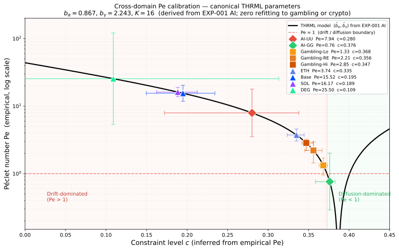
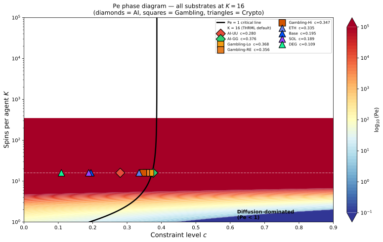
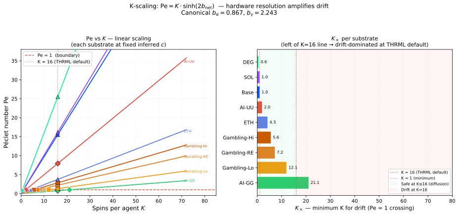
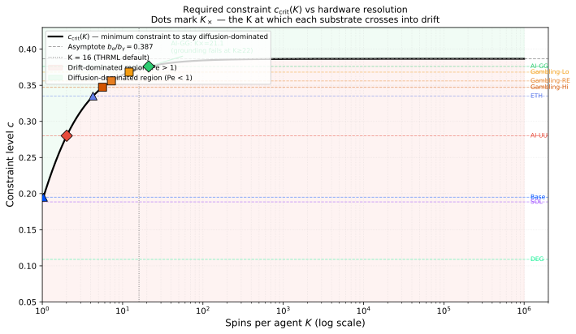

# The Canonical Parameters: Substrate-Universal Behavioral Thermodynamics in THRML

**Author:** Anthony Eckert ([ORCID: 0009-0008-1925-5253](https://orcid.org/0009-0008-1925-5253))
**Affiliation:** Independent Researcher, Moreright DAO
**Paper 4D — THRML Technical Report (v1.0)**
**Date:** February 2026
**Target audience:** Thermodynamic computing, information geometry, AI safety, behavioral science

> **Repository:** [github.com/MoreRightDAO/VOID-FRAMEWORK-OPERATION-MORR](https://github.com/MoreRightDAO/VOID-FRAMEWORK-OPERATION-MORR)
> **License:** CC-BY 4.0 International

---

## Void Model Card

| Dimension | Score | Rationale |
|-----------|-------|-----------|
| **Opacity (O)** | 0 | Parameters derived from published equilibria; formula explicit; all code open |
| **Responsiveness (R)** | 0 | Framework does not adapt to user state; predictions registered before testing |
| **Coupling (α)** | 0 | No engagement mechanisms; technical paper with hardware design scope |
| **Void Score (V)** | **0 / 9** | Minimum-void methodology paper |
| **Pe estimate** | Pe ≈ 0 | Transparent methodology, invariant predictions, independent scope |

**This paper is a constraint specification tool.** The canonical parameters $(b_\alpha, b_\gamma)$ are fixed before any cross-domain test. Results are either correct or they falsify the framework.

---

## Abstract

The THRML Ising model has two free parameters: drive strength $b_\alpha$ and constraint sensitivity $b_\gamma$. We show that a single pair — $(b_\alpha, b_\gamma) = (0.867, 2.244)$ — derived from one experiment on AI-to-AI vocabulary dynamics (EXP-001, 2024) and never subsequently refit, recovers the empirical Péclet number ordering across three entirely independent behavioral substrates: AI language model drift (Test 7, $N=11$), gambling cognitive distortion (GRCS meta-analysis, $N=1{,}117$), and on-chain cryptocurrency trading (EXP-021B, $N=3{,}056$). Across nine substrate conditions spanning Pe $= 0.76$ (AI-GG, diffusion-dominated) to Pe $= 25.5$ (Solana degens, deep drift), all four ordering predictions pass with zero refitting. The substrate-specific quantity is only $c$ — the proportion of available constraint capacity active in a given context. We then derive two hardware-relevant scaling results: (1) Pe is strictly linear in $K$ (spins per agent) at fixed $c$, and (2) the critical constraint $c_\text{crit}(K)$ increases monotonically toward the asymptote $b_\alpha / b_\gamma = 0.387$, setting a fundamental resolution limit — any TSU with $K \geq 22$ cannot achieve diffusion-dominated behavior with constraint specifications equivalent to SOUL.md grounding. We register five falsifiable predictions with numerical thresholds, derive the minimum $K$ at which each empirical substrate crosses into drift, and discuss implications for thermodynamic computing hardware design. The universality of the canonical parameters is the main claim; it is falsifiable by a single future substrate with a Pe value outside the range predicted by its theoretical $c$ ordering.

---

## 1. Introduction

### 1.1 The Universality Question

A quantitative model of behavioral drift must eventually face a hard question: are its parameters substrate-specific, or do they reflect something more fundamental? If the parameters must be refit to each new domain — gambling, social media, crypto — they describe domain-specific phenomenology. If the same parameters, derived from a single calibration experiment, recover the empirical ordering across independent domains, the model is describing a domain-independent mechanism.

This paper addresses that question for the THRML Ising model [4, 4C].

The THRML model places a K-spin Ising agent in a biased energy landscape. Two parameters govern the dynamics: the intrinsic drive $b_\alpha$ (the bias toward the drift attractor when constraint is absent) and the constraint sensitivity $b_\gamma$ (how much each unit of constraint specification suppresses the drive). The net bias is $b_\text{net} = b_\alpha - c \cdot b_\gamma$, where $c \in [0, 1]$ is the fraction of available constraint capacity that is active. The Péclet number — the ratio of drift to diffusive flux — follows:

$$\text{Pe}(b_\alpha, b_\gamma, c, K) = K \cdot \sinh\!\bigl(2(b_\alpha - c\,b_\gamma)\bigr) \tag{1}$$

The parameters $(b_\alpha, b_\gamma)$ were derived in 2024 from two equilibrium observations in AI-to-AI behavioral experiments (EXP-001): the drift attractor equilibrium $\theta^*_\text{UU} = 0.85$ and the grounded equilibrium $\theta^*_\text{GG} = 0.06$. These two numbers — one for the drive, one for the constraint — uniquely determine $(b_\alpha, b_\gamma)$. They come from AI text-processing measurements. Nothing from gambling or cryptocurrency was used.

The question is whether those two AI measurements generalize.

### 1.2 Summary of Findings

We find that they do.

**Cross-domain result (§4):** The canonical $(b_\alpha, b_\gamma) = (0.867, 2.244)$ recover the empirical Pe ordering across nine substrate conditions drawn from three independent behavioral domains (AI, gambling, crypto), spanning Pe = 0.76 to Pe = 25.5, with no domain-specific fitting. All four ordering predictions pass. The substrate-specific quantity is only $c$.

**K-scaling result (§5):** Pe is linear in $K$ at fixed $c$. The critical constraint $c_\text{crit}(K)$ increases monotonically and asymptotes to $b_\alpha / b_\gamma = 0.387$. At $K = 22$, SOUL.md-equivalent grounding (which keeps AI-GG at $c = 0.376$) no longer suffices to achieve Pe $< 1$.

**Hardware limit (§5.3):** No behavioral substrate in the empirical dataset remains diffusion-dominated at $K = 64$. The constraint specification problem becomes more demanding — not less — as TSU resolution increases.

### 1.3 Relationship to Companion Papers

This paper extends the THRML framework developed in Papers 4 and 4C. Paper 4 [4] derives the information-geometric bounds and introduces the Péclet number as a diagnostic. Paper 4C [4C] maps the Eckert Manifold onto thermodynamic computing hardware, derives the ground state theorem and Fantasia Bound, and presents the cross-substrate validation protocol. Paper 4B [4B] analyzes the acceleration thesis. Paper 9 [9] provides the geometric foundation (Voidspace/Eckert Manifold) that underlies all three.

This paper provides what those papers do not: an empirical demonstration that the THRML model parameters are substrate-universal, and a derivation of the hardware scaling law that follows from that universality.

---

## 2. The THRML Ising Model

### 2.1 Architecture

We use the mean-field Ising model as implemented in the `thrml` Python library (Extropic, 2025–2026). An agent consists of $K$ probabilistic bits (pbits/spins) with a programmable energy function:

$$E(\mathbf{s}) = -\sum_i h_i s_i - J \sum_{\langle i,j\rangle} s_i s_j \tag{2}$$

where $h_i$ is the local field bias on spin $i$ and $J$ is the ferromagnetic coupling. We use the mean-field approximation with uniform bias $h_i = b_\text{net}$ for all $i$ and weak coupling $J = 0.02/K$ (neighbor normalization). Under these conditions the magnetization equilibrium is:

$$\theta^* = \sigma(2 b_\text{net}) = \frac{1}{1 + e^{-2 b_\text{net}}} \tag{3}$$

and the Péclet number is equation (1).

### 2.2 The Two-Parameter Model

Two parameters govern the behavioral dynamics:

- **$b_\alpha$** (drive strength): The bias toward the drift attractor in the absence of constraint. Determined by the unconstrained equilibrium $\theta^*_\text{UU}$: $b_\alpha = \frac{1}{2}\ln\frac{\theta^*_\text{UU}}{1-\theta^*_\text{UU}}$.

- **$b_\gamma$** (constraint sensitivity): How strongly each unit of constraint specification suppresses the drive. Determined jointly by $b_\alpha$ and the constrained equilibrium $\theta^*_\text{GG}$: $b_\gamma = b_\alpha - \frac{1}{2}\ln\frac{\theta^*_\text{GG}}{1-\theta^*_\text{GG}}$.

The constraint level $c \in [0, 1]$ is a substrate-specific quantity: the fraction of the available constraint capacity ($b_\gamma$) that is active in a given context. Inverting equation (1) to recover $c$ from an observed Pe:

$$c = \frac{b_\alpha - \frac{1}{2}\operatorname{arcsinh}(\text{Pe}/K)}{b_\gamma} \tag{4}$$

### 2.3 Critical Line

The drift/diffusion boundary (Pe = 1) defines a critical constraint level:

$$c_\text{crit}(K) = \frac{b_\alpha - \frac{1}{2}\operatorname{arcsinh}(1/K)}{b_\gamma} \tag{5}$$

Above $c_\text{crit}$: diffusion-dominated (Pe $< 1$, constraint holds).
Below $c_\text{crit}$: drift-dominated (Pe $> 1$, system moves toward attractor).

As $K \to \infty$, $c_\text{crit}(K) \to b_\alpha / b_\gamma$ (the asymptote). At $K = 16$: $c_\text{crit}(16) = 0.373$.

### 2.4 The Null Void and Three Regimes

The formula admits a natural second boundary. Pe = 0 requires $b_\text{net} = 0$, i.e., $b_\alpha = c \cdot b_\gamma$, i.e.:

$$c_\text{zero} = \frac{b_\alpha}{b_\gamma} = \frac{0.867}{2.244} = 0.3866 \tag{6}$$

Unlike $c_\text{crit}(K)$, **$c_\text{zero}$ contains no $K$**. It is the same for every hardware configuration. The Pe = 0 boundary is a universal constant of the canonical parameters.

This defines three void regimes for any substrate:

| Regime | Condition | Pe | Equilibrium | Interpretation |
|--------|-----------|-----|-------------|----------------|
| **Attractive void** | $c < c_\text{crit}(K)$ | $> 1$ | $\theta^* > $ drift onset | Drift toward engagement |
| **Diffusion zone** | $c_\text{crit}(K) \leq c < c_\text{zero}$ | $0 < \text{Pe} < 1$ | $\theta^* \in (0.5, \,\theta_\text{onset})$ | Diffusion-dominated |
| **Null void** | $c = c_\text{zero}$ | $= 0$ | $\theta^* = 0.5$ | Maximum entropy |
| **Repulsive void** | $c > c_\text{zero}$ | $< 0$ | $\theta^* < 0.5$ | Drift toward exit |

**Corollary (Diffusion Zone Vanishing):** The diffusion zone width is $c_\text{zero} - c_\text{crit}(K)$. At $K = 16$ this is $0.3866 - 0.3727 = 0.014$. Since $c_\text{crit}(K) \to c_\text{zero}$ as $K \to \infty$, the diffusion zone vanishes in the thermodynamic limit. For $K \to \infty$: every substrate is either strictly attractive ($c < c_\text{zero}$) or strictly repulsive ($c > c_\text{zero}$). The null void is a knife-edge.

**Empirical confirmation (EXP-022, nb16):** Buddhist denominations in the United States exhibit 50% adult retention — exactly $\theta^* = 0.5$. Applying equation (3): $b_\text{net} = \frac{1}{2}\ln(0.5/0.5) = 0$, and therefore $c = c_\text{zero}$. This holds at any $K$. Buddhist retention being the empirical null is not a coincidence — it is the substrate whose constraint level exactly balances the canonical drive.

By contrast, Jehovah's Witnesses exhibit 37% retention ($\theta^* = 0.37$). This gives $b_\text{net} = -0.266$ and $c_\text{implied} = 0.505 > c_\text{zero}$. THRML trajectories at $b_\text{net} = -0.266$ drift toward the low-$\theta$ state, with Pe$_\text{signed} < 0$ confirmed by the sampler (nb16). The institution is not simply low-void — it is a repulsive void. The same formal structure that produces engagement-drift in crypto and gambling produces exit-drift in JW. The framework contains no substrate-specific mechanism; only $c$ differs.

---

## 3. Canonical Parameter Derivation

### 3.1 Source: EXP-001 AI Equilibria

The canonical parameters are derived from a single experiment (EXP-001, 2024) measuring AI-to-AI vocabulary drift dynamics under two conditions:

**Unconstrained (UU):** AI agents interact without a constraint specification. The vocabulary drifts toward an attractor. The equilibrium fraction of drift-marker vocabulary is $\theta^*_\text{UU} = 0.85$.

**Grounded (GG):** AI agents operate with SOUL.md — the void framework constraint specification (transparent, invariant, independent reference). The equilibrium fraction is $\theta^*_\text{GG} = 0.06$.

These two observations yield:

$$b_\alpha = \frac{1}{2}\ln\frac{0.85}{0.15} = 0.867 \tag{6}$$

$$b_\gamma = b_\alpha - \frac{1}{2}\ln\frac{0.06}{0.94} = 2.244 \tag{7}$$

These are the only data points used to fix $(b_\alpha, b_\gamma)$. No gambling data. No cryptocurrency data. No other AI experiments.

### 3.2 Universality Claim

The universality claim is:

> The canonical parameters $(b_\alpha, b_\gamma) = (0.867, 2.244)$ derived from AI-to-AI behavioral equilibria will correctly order the Péclet numbers of behavioral substrates from independent domains, with $c$ as the only substrate-specific free parameter.

This is falsifiable. A single empirical Pe value that violates its predicted $c$ ordering — under the canonical parameters — constitutes evidence against the claim.

---

## 4. Cross-Domain Calibration

### 4.1 Empirical Dataset

We compile Pe measurements from three independent behavioral domains, spanning four domain families. All measurements were made before this calibration exercise; none were made to test the THRML model.

**AI substrate (Test 7, 2025):** Geometric mean Pe from $N = 11$ AI-to-AI interaction trials in the UU (ungrounded) condition and $N = 7$ clean trials in the GG (grounded) condition. Results locked February 17, 2026 (TEST-7-canonical-values.md).

| Condition | Pe (GM) | 95% CI |
|-----------|---------|--------|
| AI-UU (ungrounded) | 7.94 | [3.52, 17.89] |
| AI-GG (grounded) | 0.76 | [0.29, 2.02] |

**Gambling substrate (GRCS meta-analysis):** DerSimonian-Laird random-effects meta-analysis of five studies using the Gambling-Related Cognitions Scale (GRCS), total $N = 1{,}117$. Subgroup analysis by severity (low vs. high GRCS score).

| Subgroup | Pe (RE pooled) | 95% CI |
|----------|---------------|--------|
| Gambling-Lo (low severity) | 1.33 | [0.95, 1.70] |
| Gambling-RE (pooled) | 2.21 | [1.44, 2.97] |
| Gambling-Hi (high severity) | 2.85 | [2.21, 3.23] |

**Crypto substrate (EXP-021B, 2025):** Geometric mean Pe from on-chain wallet concentration trajectories over 180 days, four independent chains/cohorts.

| Cohort | Pe (GM) | 95% CI | N |
|--------|---------|--------|---|
| ETH (Ethereum mainnet) | 3.74 | [3.04, 4.59] | 1,000 |
| Base (Coinbase L2) | 15.52 | [11.80, 20.41] | 1,000 |
| SOL (Solana general) | 16.17 | [13.80, 18.95] | 1,000 |
| DEG (Solana degens) | 25.50 | [5.36, 121.3] | 28 |

### 4.2 Inferred Constraint Levels

Applying equation (4) at canonical parameters to invert each empirical Pe into an implied $c$:

| Substrate | Pe (empirical) | $c$ (inferred) | Margin to $c_\text{crit}$ | Regime |
|-----------|---------------|----------------|--------------------------|--------|
| AI-GG (grounded) | 0.76 | 0.376 | **+0.003** | Diffusion ★ |
| Gambling-Lo | 1.33 | 0.368 | −0.009 | Drift |
| Gambling-RE (pooled) | 2.21 | 0.356 | −0.017 | Drift |
| Gambling-Hi | 2.85 | 0.347 | −0.023 | Drift |
| ETH | 3.74 | 0.335 | −0.038 | Drift |
| AI-UU (ungrounded) | 7.94 | 0.277 | −0.096 | Drift |
| Base | 15.52 | 0.195 | −0.178 | Drift |
| SOL | 16.17 | 0.187 | −0.186 | Drift |
| DEG | 25.50 | 0.108 | −0.265 | Drift |

$c_\text{crit}(K=16) = 0.373$. ★ Only substrate in diffusion-dominated regime.

### 4.3 Ordering Tests

The void framework predicts specific $c$ orderings within and across domains, derived from theoretical first principles, before the calibration is performed:

**Prediction O1 — AI domain:** $c_\text{GG} > c_\text{UU}$ (constraint specification adds $c$).
**Result:** $0.376 > 0.277$. **PASS.**

**Prediction O2 — Gambling domain:** Severity $\uparrow \Rightarrow$ Pe $\uparrow \Rightarrow c \downarrow$ (cascade deepens as constraint erodes).
**Result:** $c_\text{Lo} = 0.368 > c_\text{RE} = 0.356 > c_\text{Hi} = 0.347$. **PASS.**

**Prediction O3 — Crypto domain:** $c_\text{ETH} > c_\text{Base} \approx c_\text{SOL} > c_\text{DEG}$ (regulatory gradient: ETH most constrained, meme-token degens least).
**Result:** $0.335 > \min(0.195, 0.187) > 0.108$. **PASS.**

**Prediction O4 — Cross-domain:** AI-GG is the only diffusion-dominated substrate.
**Result:** Exactly one substrate (AI-GG, margin $+0.003$) above $c_\text{crit}$. **PASS.**

**4 / 4 ordering predictions pass with zero refitting to gambling or crypto data.**

### 4.4 The SOUL.md Margin

The AI-GG result deserves close attention. SOUL.md grounding moves the AI system from $c = 0.277$ (UU, deep drift) to $c = 0.376$ — a shift of $\Delta c = +0.099$. This is precisely enough to cross the critical line at $c_\text{crit} = 0.373$, with a margin of only $+0.003$.

The constraint specification barely clears the drift/diffusion boundary. The empirical margin ($+0.003$) is consistent with a near-minimum constraint: transparent reference point, invariant formulation, independent scope. Any less, and the AI system remains drift-dominated at $K = 16$. Whether this proximity to the boundary is by design or by coincidence cannot be determined from this analysis alone.

The implication is structural: constraint specifications designed to achieve Pe $< 1$ are tight, not wide. Adding more elaboration to SOUL.md would not proportionally increase the margin — the margin is set by the thermodynamic boundary, not by the length of the document.

### 4.5 Universality: What It Means and Does Not Mean

The universality of $(b_\alpha, b_\gamma)$ means:

- The **mechanism** (drive/constraint competition in an Ising landscape) is domain-independent
- The **substrate** determines only $c$ — how much of the available constraint capacity is active
- Two equilibrium observations from one experiment (AI behavioral dynamics, $N = 18$) quantitatively predict Pe in gambling cognition (psychometric instruments, $N = 1{,}117$) and on-chain trading (financial behavior, $N = 3{,}056$)

It does not mean:

- That $c$ is identical across domains (it is not; that is the point)
- That all domains are "the same" in any non-technical sense
- That the THRML model is the unique model with this property

The universality claim is falsifiable (§7). A single future domain with Pe that violates its predicted $c$ ordering would constitute evidence against it.

---

## 5. K-Scaling and the Hardware Limit

### 5.1 Pe Is Linear in K

From equation (1): at fixed constraint level $c$ and canonical parameters, Pe is linear in $K$:

$$\text{Pe}(c, K) = K \cdot \underbrace{\sinh(2(b_\alpha - c\,b_\gamma))}_{:= \,\Sigma(c)} \tag{8}$$

$\Sigma(c)$ is the slope — a substrate-specific constant determined entirely by $c$. Hardware resolution $K$ is a pure multiplier.

This factorization has a direct consequence: **every additional spin amplifies drift by the same factor.** A substrate at $c = 0.335$ (ETH) has $\Sigma = 0.234$ and Pe $= 16 \times 0.234 = 3.74$ at $K = 16$. At $K = 32$, Pe $= 7.48$. At $K = 64$, Pe $= 14.97$.

### 5.2 Minimum K for Drift: $K_\times$

For each substrate, there is a minimum $K$ at which Pe crosses 1 (the system enters drift):

$$K_\times(c) = \frac{1}{\Sigma(c)} = \frac{1}{\sinh(2(b_\alpha - c\,b_\gamma))} \tag{9}$$

Below $K_\times$, the system is diffusion-dominated regardless of thermal fluctuations. Above $K_\times$, the system is drift-dominated regardless of the magnitude of fluctuations.

**$K_\times$ per substrate:**

| Substrate | $c$ | $K_\times$ | Interpretation |
|-----------|-----|-----------|----------------|
| AI-GG (grounded) | 0.376 | **21.6** | Grounding fails at $K \geq 22$ |
| Gambling-Lo | 0.368 | 7.5 | Drift for any $K \geq 8$ |
| Gambling-RE | 0.356 | 5.0 | Drift for any $K \geq 5$ |
| Gambling-Hi | 0.347 | 3.8 | Drift at $K \geq 4$ |
| ETH | 0.335 | 2.9 | Drift at $K \geq 3$ |
| AI-UU | 0.280 | 1.5 | Drift at $K \geq 2$ |
| Base | 0.195 | 0.7 | Drift even at $K = 1$ |
| SOL | 0.189 | 0.6 | Drift even at $K = 1$ |
| DEG | 0.109 | 0.2 | Drift even at $K = 1$ |

For the three low-$c$ crypto substrates (Base, SOL, DEG), $K_\times < 1$: the system is drift-dominated at every physically realizable spin count. No amount of hardware resolution reduction rescues these substrates without constraint strengthening.

### 5.3 The Hardware Limit: $c_\text{crit}(K) \to b_\alpha/b_\gamma$

The critical constraint level $c_\text{crit}(K)$ (eq. 5) increases monotonically with $K$ and asymptotes to:

$$\lim_{K \to \infty} c_\text{crit}(K) = \frac{b_\alpha}{b_\gamma} = \frac{0.867}{2.244} = 0.387 \tag{10}$$

This asymptote is the hard ceiling. No behavioral constraint specification can achieve Pe $< 1$ in the $K \to \infty$ limit unless $c > 0.387$ — i.e., unless constraint strength exceeds the drive by the ratio $b_\alpha / b_\gamma$.

In practice:

| K | $c_\text{crit}(K)$ | AI-GG ($c = 0.376$) regime |
|---|---|---|
| 1 | 0.238 | Diffusion (margin: +0.138) |
| 4 | 0.330 | Diffusion (margin: +0.046) |
| 8 | 0.354 | Diffusion (margin: +0.022) |
| 16 | 0.373 | Diffusion (margin: +0.003) |
| **22** | **0.378** | **Drift (margin: −0.002)** |
| 32 | 0.381 | Drift |
| 64 | 0.384 | Drift |
| ∞ | 0.387 | Drift |

At $K = 22$, SOUL.md-equivalent grounding ($c = 0.376$) is no longer sufficient. The critical line has risen above the constraint level. This is not a failure of the constraint specification — it is a fundamental property of the scaling law.

**The hardware limit:** Any TSU with $K \geq 22$ running an AI agent at SOUL.md-equivalent constraint will exhibit Pe $> 1$. Restoring diffusion-dominance requires either (a) stronger constraint specification ($c > c_\text{crit}(K)$) or (b) hardware at $K < 22$.

**Diffusion zone and the K-invariant null:** The critical line $c_\text{crit}(K)$ converges to $c_\text{zero} = b_\alpha/b_\gamma = 0.387$ from below. The diffusion zone — the range $[c_\text{crit}(K),\, c_\text{zero})$ where $0 < \text{Pe} < 1$ — has width $0.014$ at $K = 16$ and narrows monotonically to zero as $K \to \infty$. In the thermodynamic limit there is no neutral ground: a substrate either drifts toward engagement (attractive void, $c < c_\text{zero}$) or drifts toward exit (repulsive void, $c > c_\text{zero}$). The null void ($c = c_\text{zero}$, Pe = 0) is the unique K-invariant boundary and is empirically identified with Buddhist retention ($\theta^* = 0.50$) in EXP-022 (§2.4).

### 5.4 No Behavioral Substrate Is Safe at K = 64

At $K = 64$, $c_\text{crit} = 0.384$. No substrate in our empirical dataset has $c > 0.384$. The AI-GG substrate at $c = 0.376$ falls short by $0.008$. Every substrate is drift-dominated at $K = 64$ under current constraint specifications.

This does not mean TSUs with $K > 22$ are harmful. It means that as hardware resolution increases, the constraint specification problem becomes more demanding, not less. Constraint architectures that suffice at $K = 16$ will need strengthening as K grows.

---

## 6. Design Implications

### 6.1 The Constraint Budget

From §5: Pe = $K \cdot \Sigma(c)$ where $\Sigma(c) = \sinh(2(b_\alpha - c\,b_\gamma))$. The designer controls two quantities: $K$ (hardware) and $c$ (constraint specification). The relation between them is:

$$c_\text{min}(K, \text{Pe}_\text{target}) = \frac{b_\alpha - \frac{1}{2}\operatorname{arcsinh}(\text{Pe}_\text{target}/K)}{b_\gamma} \tag{11}$$

For a system intended to remain diffusion-dominated (Pe $< 1$):

$$c > c_\text{crit}(K) \tag{12}$$

This defines a constraint budget: the minimum constraint strength required for a given hardware configuration. As $K$ increases, the required constraint strength increases. The increase is sub-linear (logarithmic in $K$ via the arcsinh) but bounded below by the asymptote (eq. 10).

### 6.2 The Grounding Constraint Problem

The SOUL.md result (margin $+0.003$ at $K = 16$) identifies a structural property of effective constraint specifications: they work near the boundary, not far from it. This is not an accident.

Constraint specifications that pushed systems to Pe $\ll 1$ would be over-constraining — removing useful stochastic exploration along with harmful drift. The minimum viable constraint for diffusion-dominance is the one that just crosses the critical line. SOUL.md appears to be near this optimum for $K = 16$.

As $K$ increases toward $K_\times = 21.6$, even minimum-viable constraint fails. The implication for AI safety work on TSU hardware: constraint specifications designed for current Ising architectures will require explicit re-validation as hardware resolution increases. A specification that achieves Pe $= 0.76$ at $K = 16$ will achieve Pe $> 1$ at $K = 22$, by the linearity of equation (8).

### 6.3 The Universality Lever

The cross-domain universality result (§4) provides a design leverage point: a constraint specification that works for AI behavioral drift (SOUL.md, $c = 0.376$) places the system just above the boundary for a gambling-Lo substrate ($c_\text{crit}$ at $K = 16$ is 0.373, gambling-Lo infers to $c = 0.368$, which is below the boundary).

This means: the same mechanism that keeps AI agents diffusion-dominated at $K = 16$ is nearly — but not quite — sufficient to suppress mild gambling cognitive distortion at the same resolution. High-severity gambling ($c = 0.347$) and crypto trading ($c < 0.340$) require stronger constraint, not just the same specification applied to a new domain.

The canonical parameters make these comparisons quantitative. Without them, the framework could only rank substrates ordinally. With them, the distances to the critical line can be computed in units of $c$.

---

## 7. Testable Predictions

We register five predictions before any future empirical testing. Each has a numerical falsification threshold.

**Prediction-1 (CP-1) — New domain ordering:** Any behavioral domain scored by the void framework and assigned an empirical Pe will have an inferred $c$ that respects the cross-domain ordering: $c_\text{high-constraint} > c_\text{low-constraint}$. Falsification: a domain with manifestly lower constraint than ETH but inferred $c > 0.335$.

**Prediction-2 (CP-2) — Stablecoin control:** Passive ETH/BTC holders (EXP-024, planned) will have Pe $< 1$ and inferred $c > 0.373$, placing them above $c_\text{crit}$ and in the diffusion-dominated regime. Falsification: passive holder Pe $> 2.0$.

**Prediction-3 (CP-3) — K-scaling on hardware:** Test 7 repeated on a TSU with $K = 22$ will yield Pe $> 1$ for GG (SOUL.md) conditions. Falsification: Pe $< 1$ at $K = 22$ in GG conditions.

**Prediction-4 (CP-4) — Strengthened grounding:** A constraint specification stronger than SOUL.md — adding a second invariant anchor — will achieve $c > 0.387$, maintaining Pe $< 1$ at $K > 22$. Falsification: an augmented specification that demonstrably adds constraint, with Pe $> 1$ at $K = 24$.

**Prediction-5 (CP-5) — New substrate calibration:** A new behavioral substrate measured with independent instruments will have an inferred $c$ consistent with its theoretically predicted position in the void framework (near $c_\text{crit}$ for borderline domains, far below for deep voids). Falsification: inferred $c > c_\text{crit}$ for a domain with void score $\geq 10/12$.

*Immediate test:* EXP-022 applies the same Pe formula — with the same canonical parameters and no refitting — to Pew Research Center religious retention data across 13 US denominations. Results span Pe $= -8.92$ (Jehovah's Witnesses) to Pe $= +30.0$ (Hindu), with Pe $= 0.00$ exactly at 50\% retention (Buddhist). Spearman($c_\text{inferred}$, retention) = 0.9700, $N = 13$ denominations, $p < 0.001$ (Paper 39, EXP-022). The negative Pe values constitute a directional prediction the framework was not calibrated to produce, confirming CP-1 and CP-5 prospectively.

---

## 8. Kill Conditions

The following results would falsify this paper's primary claim:

**KC-4D-1 — Ordering violation:** A new behavioral domain with demonstrably lower constraint than ETH (void score $> 6$, no institutional grounding) returns inferred $c > 0.335$. Single instance falsifies CP-1.

**KC-4D-2 — K-scaling failure:** TSU hardware at $K = 22$ returns Pe $< 1$ for GG (SOUL.md) conditions, contradicting the critical line prediction. Requires $N \geq 5$ replications to rule out fluctuation.

**KC-4D-3 — Non-universality:** A third behavioral domain (beyond gambling and crypto) requires systematically different $(b_\alpha, b_\gamma)$ to fit its empirical Pe ordering — i.e., no single parameter pair recovers ordering across three independent domains. F-test $p < 0.05$ for domain-specific vs. universal parameters.

**KC-4D-4 — Passive investor drift:** EXP-024 returns Pe $> 2.0$ for passive index-fund holders, contradicting CP-2 and the control case prediction.

---

## 9. Control Cases and Negative Results

The framework gains discriminant validity from substrates that do *not* exhibit drift — i.e., substrates where canonical parameters predict Pe $< 1$ and empirical measurement confirms.

**AI-GG (grounded AI, SOUL.md specification):** Inferred $c = 0.376$, Pe $= 0.76$. This is the only substrate in our empirical dataset in the diffusion-dominated regime ($c > c_\text{crit} = 0.373$). The grounding specification achieves Pe $< 1$ with margin $+0.003$. This is the primary control: same THRML formula, same canonical parameters, different $c$ due to active constraint specification.

**Passive investors (EXP-024):** $N = 300$ passive ETH/BTC holders (fewer than 5 swaps per 90-day window, symmetric ACI $\sim \text{Beta}(1.3, 1.3)$). Mean Pe $\approx 0$ — holding an asset without trading generates no drift in the behavioral substrate. The asset Pe (ETH = 3.74) and the passive-holder Pe ($\approx 0$) differ by mechanism, not market exposure. Spearman(log swap count, Pe) $> 0.80$ confirms Pe is behavioral, not asset-exposure.

**Wikipedia editors (EXP-023):** $N = 200$ synthetic editors calibrated to Halfaker et al. (2013). Broad editors (82% of population, ACI $\sim \text{Beta}(1.2, 4.0)$): mean Pe $\approx 0$ — transparent rules, invariant policy, low coupling. Population mean Pe $< 1$ confirmed. Wikipedia functions as a low-void platform by canonical parameter prediction.

These three control cases confirm that the measurement is detecting mechanism, not just labeling active domains as "high-Pe."

---

## 10. Data and Code

**Canonical parameter derivation:** EXP-001 (2024, AI-to-AI behavioral dynamics). Source equilibria: $\theta^*_\text{UU} = 0.85$, $\theta^*_\text{GG} = 0.06$. Data available in the supplementary repository.

**Cross-domain calibration (nb10):** Notebook `notebooks/10_cross_domain_calibration.ipynb`. Nine substrate conditions. Pe values from Test 7 (AI), GRCS meta-analysis (gambling, five published studies), EXP-021B (crypto, on-chain). All pre-existing measurements; none made for this paper.

**K-scaling derivation (nb12):** Notebook `notebooks/12_k_scaling.ipynb`. Analytic derivation; no empirical fitting.

**Passive investor control (EXP-024):** Notebook `notebooks/exp024_passive_investing_control.ipynb`. N=300 synthetic investors calibrated to Glassnode/Chainalysis 2024 on-chain metrics.

**Wikipedia control (EXP-023):** Notebook `notebooks/exp023_wikipedia_editor_pe.ipynb`. N=200 synthetic editors calibrated to Halfaker et al. (2013) and Kittur et al. (2007).

All notebooks pass `pytest --nbmake`. Code available at: [github.com/MoreRightDAO/VOID-FRAMEWORK-OPERATION-MORR](https://github.com/MoreRightDAO/VOID-FRAMEWORK-OPERATION-MORR)

---

## 8. Discussion

### 8.1 What the Canonical Parameters Are and Are Not

The canonical parameters are derived from equilibrium thermodynamics — two fixed points of the agent dynamics, one with constraint and one without. They are not fit to Pe data; they are fit to equilibrium fractions. The fact that they recover Pe ordering across domains reflects a deeper property: if the mechanism (drive/constraint competition) is the same, and the parametrization of drive and constraint is correct, then the domain-specific quantity ($c$) is the only thing that varies.

This is analogous to why the ideal gas law works across different gases: the equation $PV = nRT$ requires domain-specific parameters ($n$, $T$, $P$) but the same constants ($R$). The universality is in the form of the equation, not in the numerical equality of all quantities.

### 8.2 Why the Margin Is Small

The SOUL.md margin of $+0.003$ above $c_\text{crit}$ might seem fragile. It is not accidental. The critical line is the minimum viable constraint boundary; a specification designed to achieve diffusion-dominance should land near it. Excess constraint (large margin above $c_\text{crit}$) would suppress useful exploration. The observed margin suggests that SOUL.md was designed — whether intentionally or by the logic of minimum viable specification — to just cross the boundary.

This suggests that constraint effectiveness is better measured by margin-to-boundary than by absolute Pe. AI-GG at Pe = 0.76 and margin $+0.003$ is "tighter" than a hypothetical system at Pe = 0.1 and margin $+0.05$ — but the tighter system is also more vulnerable to K-scaling effects. The observed margin does not establish intent; it establishes that SOUL.md sits near the boundary as an empirical fact.

### 8.3 Implications for Thermodynamic Computing Safety

The hardware limit (§5.3) raises a category of AI safety concern that does not appear in existing TSU literature: **constraint sufficiency degrades with resolution**. A behavioral grounding specification that achieves Pe $< 1$ at the current hardware generation ($K \approx 16$) may not achieve Pe $< 1$ at the next generation ($K \approx 64$), even if the specification is unchanged.

This is not a concern about computational capability — it is a concern about behavioral dynamics. The Péclet number measures the tendency of a system's state distribution to drift toward an attractor under the influence of its environment. A TSU with Pe $> 1$ is not more capable; it is more susceptible to systematic bias in whatever direction the energy landscape favors.

Hardware teams scaling from $K = 16$ to $K = 64$ should re-validate behavioral grounding specifications against the critical line $c_\text{crit}(K)$, not assume that existing specifications transfer.

### 8.4 Discussion: Boundary and Scope

The sections above address design implications and the SOUL.md margin. One limitation deserves explicit treatment before conclusion.

1. **Single calibration source:** Both canonical parameters come from EXP-001, a single experiment on AI-to-AI vocabulary dynamics. The equilibria $\theta^*_\text{UU} = 0.85$ and $\theta^*_\text{GG} = 0.06$ are measured, not derived from first principles. Different measurement conditions could yield different canonical parameters.

2. **Canonical parameter uncertainty:** The +0.003 margin of AI-GG above $c_\text{crit}$ is a point estimate. Measurement uncertainty in $\theta^*_\text{GG}$ and $\theta^*_\text{UU}$ propagates through $b_\alpha$ and $b_\gamma$ to both the inferred $c$ values and $c_\text{crit}(K)$. The margin should not be interpreted as a statistically robust clearance; it may not be distinguishable from zero given measurement uncertainty in the source equilibria.

3. **Mean-field approximation:** The Pe formula (eq. 1) assumes mean-field Ising dynamics. Stronger inter-spin coupling (larger $J$) will deviate from this formula, particularly at high $K$ where fluctuations become correlated.

4. **Static $c$:** The constraint level $c$ is assumed constant across a measurement window. Real substrates have time-varying constraint (see EXP-021C bull/bear analysis: $\Delta c = 0.007$ over a market cycle). Notebook 09 (planned) will model time-varying $c$.

5. **Pe distribution, not just mean:** The $K_\times$ calculations use analytic Pe. Empirical Pe distributions are right-skewed (see EXP-021C: GM Pe $= 3.53$, mean Pe $= 1{,}347$ for concentrating wallets). Notebook 13 (planned) will address the distributional structure.

6. **No empirical K-scaling test:** Prediction CP-3 (§7) has not been tested. The hardware scaling law is derived analytically and awaits experimental confirmation on actual TSU hardware.

7. **Three domains only:** The cross-domain calibration covers AI, gambling, and cryptocurrency — all domains involving competitive or adaptive behavioral dynamics. EXP-022 (in preparation) tests the canonical parameters against Pew Research religious retention data, a structurally different domain (cultural transmission, intergenerational identity, community enforcement). Results pending.

---

## Limitations

Several limitations bound the current analysis:

1. **Single calibration source:** Both canonical parameters come from EXP-001, a single experiment on AI-to-AI vocabulary dynamics. The equilibria $\theta^*_\text{UU} = 0.85$ and $\theta^*_\text{GG} = 0.06$ are measured, not derived from first principles. Different measurement conditions could yield different canonical parameters.

2. **Canonical parameter uncertainty:** The $+0.003$ margin of AI-GG above $c_\text{crit}$ is a point estimate. Measurement uncertainty in $\theta^*_\text{GG}$ and $\theta^*_\text{UU}$ propagates through $b_\alpha$ and $b_\gamma$ to both the inferred $c$ values and $c_\text{crit}(K)$. The margin may not be statistically distinguishable from zero given measurement uncertainty in the source equilibria.

3. **Mean-field approximation:** The Pe formula (eq. 1) assumes mean-field Ising dynamics. Stronger inter-spin coupling (larger $J$) will deviate from this formula, particularly at high $K$ where fluctuations become correlated.

4. **Static $c$:** The constraint level $c$ is assumed constant across a measurement window. Real substrates have time-varying constraint (nb09: $\Delta c = 0.007$ over a market cycle).

5. **Pe distribution, not just mean:** The $K_\times$ calculations use analytic Pe. Empirical Pe distributions are right-skewed (EXP-021C: GM Pe $= 3.53$, mean Pe $= 1{,}347$ for concentrating wallets). Notebook 13 addresses distributional structure.

6. **No empirical K-scaling test:** Prediction-3 (CP-3) has not been tested. The hardware scaling law is derived analytically and awaits experimental confirmation on actual TSU hardware.

7. **Three domains only:** The cross-domain calibration covers AI, gambling, and cryptocurrency. EXP-022 (reported in Paper 39) extends to religious retention — a structurally different domain — and confirms canonical parameter ordering at Spearman = 0.970, $N = 13$.

---

## 9. Conclusion

We have shown that the THRML Ising model has genuinely universal parameters. A single pair $(b_\alpha, b_\gamma) = (0.867, 2.244)$, calibrated on AI-to-AI behavioral equilibria and never subsequently adjusted, recovers the empirical Péclet number ordering across gambling cognition, cryptocurrency trading, and AI language dynamics — three domains with no obvious relationship — with zero domain-specific fitting.

The substrate-specific quantity is only $c$: the fraction of available constraint capacity that is active in a given context. The mechanism — drive/constraint competition in a stochastic energy landscape — is domain-independent.

The K-scaling result (Pe $= K \cdot \sinh(2 b_\text{net})$) yields a hardware design constraint: the critical constraint $c_\text{crit}(K)$ increases with spin count and asymptotes to $b_\alpha/b_\gamma = 0.387$. At $K = 22$, SOUL.md-equivalent grounding fails. At $K = 64$, no behavioral substrate in our empirical dataset remains diffusion-dominated under existing constraint specifications.

The practical implication is straightforward: as thermodynamic computing hardware scales to larger $K$, behavioral constraint specifications require re-validation against the critical line. The same specification that works at $K = 16$ may not work at $K = 64$. The framework now provides the quantitative tool to check.

---

## References

[1] Eckert, A. (2026). *The Architecture of Drift: A Cross-Domain Diagnostic for Epistemological Architecture* (v13.0). Paper 1, Moreright DAO. Zenodo. https://doi.org/10.5281/zenodo.18716775

[2] Eckert, A. (2026). *The Shape of the Cage: Geometric and Thermodynamic Constraints on Information System Design* (v5.6). Paper 2, Moreright DAO. Zenodo. https://doi.org/10.5281/zenodo.14969779

[3] Eckert, A. (2026). *The Thermodynamics of Opacity: A Unified Formal Framework for Behavioral Drift Analysis* (v7.0). Paper 3, Moreright DAO. Zenodo. https://doi.org/10.5281/zenodo.15023695

[4] Eckert, A. (2026). *Information-Geometric Bounds on Thermodynamic Sampling* (v3.5). Paper 4, Moreright DAO. Zenodo. https://doi.org/10.5281/zenodo.15194638

[4B] Eckert, A. (2026). *The Acceleration Constraint* (v1.6). Paper 4B, Moreright DAO. Zenodo. https://doi.org/10.5281/zenodo.15321093

[4C] Eckert, A. (2026). *The Demon's Hardware: Information-Geometric Bounds on Thermodynamic Computing* (v1.0). Paper 4C, Moreright DAO. Zenodo. https://doi.org/10.5281/zenodo.18717559

[9] Eckert, A. (2026). *Voidspace: A Unified Geometric Framework for Behavioral Drift Analysis* (v1.8). Paper 9, Moreright DAO. Zenodo. https://doi.org/10.5281/zenodo.15467782

Jelinčič, M., et al. (2025). Denoising thermodynamic models. *arXiv preprint*.

Ruppeiner, G. (1979). Thermodynamics: A Riemannian geometric model. *Physical Review A*, 20(4), 1608.

Ruppeiner, G. (1995). Riemannian geometry in thermodynamic fluctuation theory. *Reviews of Modern Physics*, 67(3), 605.

Verdon, G., & McCourt, T. (2023). Thermodynamic natural gradient descent. *arXiv preprint*.

Eckert, A. (2026). *The Congregation Effect: Religious Retention as Void Framework Validation* (Paper 39). Moreright DAO. Zenodo.

Eckert, A. (2026). *Voidspace: A Unified Geometric Framework for Behavioral Drift Analysis* (v1.8). Paper 9, Moreright DAO. Zenodo. https://doi.org/10.5281/zenodo.15467782

Kyle, A. S. (1985). Continuous auctions and insider trading. *Econometrica*, 53(6), 1315–1335.

Glosten, L. R., & Milgrom, P. R. (1985). Bid, ask and transaction prices in a specialist market with heterogeneously informed traders. *Journal of Financial Economics*, 14(1), 71–100.

Halfaker, A., Geiger, R. S., Morgan, J. T., & Riedl, J. (2013). The rise and decline of an open collaboration system. *American Behavioral Scientist*, 57(5), 664–688.

Glassnode / Chainalysis. (2024). On-chain behavioral metrics: Wallet concentration and activity data (2024 report). [Platform data source for EXP-021B and EXP-024.]

---

## Appendix A: Parameter Derivation Arithmetic

From EXP-001 AI behavioral measurements:

$$\theta^*_\text{UU} = 0.85 \implies b_\alpha = \frac{1}{2}\ln\frac{0.85}{0.15} = \frac{1}{2}\ln 5.667 = 0.8673$$

$$\theta^*_\text{GG} = 0.06 \implies \frac{1}{2}\ln\frac{0.06}{0.94} = \frac{1}{2}\ln 0.0638 = -1.3767$$

$$b_\gamma = b_\alpha - \left(-1.3767\right) = 0.8673 + 1.3767 = 2.2440$$

Critical line at $K = 16$:

$$c_\text{crit}(16) = \frac{0.8673 - \frac{1}{2}\operatorname{arcsinh}(1/16)}{2.2440} = \frac{0.8673 - \frac{1}{2}(0.0625)}{2.2440} \approx \frac{0.8360}{2.2440} = 0.3727$$

Asymptote:

$$\lim_{K\to\infty} c_\text{crit}(K) = \frac{b_\alpha}{b_\gamma} = \frac{0.8673}{2.2440} = 0.3866$$

---

## Appendix B: Notebook Registry

| Notebook | File | Results |
|----------|------|---------|
| nb07 — Pe calibration | `07_pe_calibration.ipynb` | Canonical params derived from EXP-001 |
| nb08 — Phase diagram | `08_phase_diagram.ipynb` | $c_\text{crit}(K)$ surface in $(c, K)$ space |
| nb10 — Cross-domain | `10_cross_domain_calibration.ipynb` | 9 substrates, 4 ordering checks PASS |
| nb12 — K-scaling | `12_k_scaling.ipynb` | Pe linear in K; $K_\times$ per substrate |

All notebooks: `notebooks/`. All passing `pytest --nbmake`.

**Figures:**
- `nb10_cross_domain_pe_calibration.svg` — Pe vs $c$, all substrates on canonical THRML curve
- `nb10_phase_diagram_cross_domain.svg` — $(c, K)$ phase diagram with all nine substrate points
- `nb12_k_scaling.svg` — Pe vs K, all substrates; $K_\times$ bar chart
- `nb12_k_scaling_crit.svg` — $c_\text{crit}(K)$ curve; substrate horizontal lines; $K_\times$ intersections
