# Voidspace: The Geometry of Observer-Opacity Interactions

**Author:** Anthony Eckert ([ORCID: 0009-0008-1925-5253](https://orcid.org/0009-0008-1925-5253))
**Affiliation:** Independent Researcher, MoreRight DAO
**License:** CC-BY 4.0 International
**Paper 9 — Voidspace**
**Version:** v3.1
**Date:** February 2026
**Status:** Content-complete. Zenodo-ready. All honest-review items addressed. v3.1: VF-3 falsification threshold tightened (r < 0.3 → r < 0.5) — the metric claim should require moderate correlation, not just weak. v3.0: Keystone lock. Prophet names for angel types. Eckert Manifold and Fantasia Bound named. v1.15–v1.17: Five mathematical rigor fixes, three structural remarks, four honest-review fixes (see version history below). ~36K words.
**Repository:** [github.com/MoreRightDAO/VOID-FRAMEWORK-OPERATION-MORR](https://github.com/MoreRightDAO/VOID-FRAMEWORK-OPERATION-MORR)

---

## Abstract

The void framework (Papers 1–8) derives drift dynamics from three operational definitions — opacity, responsiveness, and coupling — validated across nine substrates. This paper formalizes *where* those dynamics live. We define the **Eckert Manifold** $\mathcal{V} = [0,1]^3$ — the voidspace manifold — equipped with the Čencov-unique Fisher product metric. Three main results: **(1) Substrate Independence Theorem** — the drift dynamics are horizontal in a fiber bundle over $\mathcal{V}$; substrates at matched coordinates produce identical dynamics regardless of physical realization. **(2) Channel Decomposition Postulate** — the three coordinates are the independent information-theoretic quantities of any finite-bandwidth observer-system interface; neither addition nor reduction preserves the dynamics. **(3) Boundary Theorem** — the constraint pole $(0,0,0)$ is an unstable fixed point requiring continuous external energy at minimum Landauer cost, derivable from within $\mathcal{V}$ but constitutively opaque from within. Any non-ground-state pattern in $\mathcal{V}$ is formally a Maxwell's demon; its constraint-directed dual is a **YHWH-class entity** (angel) — named for the Tetragrammaton (יהוה), whose four letters encode the structural inverse of void coupling: Source → Transparency → Connection → Transparency Maintained. The identification yields: a **demon energy bound** (Pe$_{\text{demon}} \leq O \cdot H(M) \cdot L / D$, the voidspace Carnot limit); a **demon and angel classification** from temporal Pe signatures (seven demon types, six YHWH-class types, one Type G counterpart — all distinguishable without seeing through the opacity); **finite-time efficiency** via Curzon-Ahlborn tightening; a **competition asymmetry** (void-directed demons have gradient advantage; YHWH-class entities swim upstream at Landauer cost); and an **external bypass** (energy from outside $\mathcal{V}$ circumvents the asymmetry).

We validate a **reverse inference protocol** via synthetic simulation (72% coordinate recovery at 10% noise, 96% near the void pole) and derive a complementary **forward embedding protocol** for pre-deployment scoring. Population-level results include the **population amplification theorem** (heterogeneous environments drift faster than mean Pe predicts), **observer-observer synchronization** (threshold effectively zero at platform scale), and **void lattice phase boundaries** with vortex onset at Pe $= 4$ — between gambling (2.21, no creator ecosystems) and competitive gaming (4.4, self-sustaining creator communities).

Sixty-two predictions (VS-1–35, DEM-1–24) and twenty-three falsification conditions (VF-1–23) with numerical thresholds. Given the channel decomposition postulate, the geometric construction is fully determined: the space is forced, the dynamics derived, the boundary proven, and the theory identifies its own structural limits — including two open empirical questions (§10.2).

---

## 1. Introduction: Why the Space Itself

Newtonian mechanics was complete for two centuries before anyone formalized the space it operated in. Forces, masses, and trajectories were described. The arena they inhabited — Euclidean three-space with absolute time — was assumed, not derived. When Einstein and Minkowski formalized the arena itself, the result was not new forces but a deeper understanding of why those forces take the form they do. The space was the missing object.

The void framework is in an analogous position. Papers 1–8 describe what happens when an observer faces an opaque, responsive system under sustained coupling. They derive the forces (Paper 3 [3]), measure the dynamics across nine substrates (Papers 1 [1], 5–7 [5–7]), prove the quantum bridge (Paper 8 [8]), and validate interventions (Paper 2 [2]). The derivation chain has ten steps. The empirical program spans 90 domains. The Péclet number has been extracted in nine substrates across four domain families. But the papers never formalize *where* these dynamics live. The forces are described. The space they act in is not.

This paper fills that gap. We define the **Eckert Manifold** $\mathcal{V}$ — the voidspace manifold, the three-dimensional space parameterized by opacity ($O$), responsiveness ($R$), and coupling ($\alpha$) — and prove three results:

1. **The dynamics depend only on position in voidspace.** The derivation chain (Steps 1–9 of [5]) is horizontal in a fiber bundle whose base is $\mathcal{V}$ and whose fibers are substrate realizations. A biological neural network and a transformer architecture at the same $(O, R, \alpha)$ coordinates produce the same drift dynamics. A slot machine and a DeFi liquidity pool at matched coordinates produce the same Péclet number. This is substrate independence as a theorem, not an observation.

2. **Voidspace is the unique geometry consistent with finite-bandwidth observation.** The three coordinates are not a modeling choice — they are forced by the information-theoretic structure of any observer-system interface (Section 7). No fourth dimension adds independent information. No reduction to two dimensions preserves the dynamics. The argument proceeds from the channel decomposition postulate (§2.4): any observer-system interface decomposes into exactly three independent information-theoretic quantities, corresponding to the three coordinates. The postulate is supported by operational independence arguments and falsifiable via VF-2.

3. **The constraint pole is a formal boundary.** The framework derives everything inside $\mathcal{V}$ and identifies the constraint pole $(O = 0, R = 0, \alpha = 0)$ as a boundary where the dynamics require energy input from outside the manifold. The ground state theorem (A1, [5]) proves that the drift flow points away from this boundary everywhere in the interior. Reaching the boundary requires work against the thermodynamic gradient. Maintaining position at the boundary requires continuous energy expenditure. The source of that energy is outside $\mathcal{V}$. The framework characterizes what the boundary requires of the exterior but cannot derive the exterior itself. This is not a limitation — it is the result.

The consequence, given the channel decomposition postulate (§2.4): the void framework's geometric construction is fully determined. The space is forced. The dynamics on it are derived. The boundary is proven. Everything inside is accessible to measurement. Everything outside is constitutively opaque. Two empirical questions remain open — the functional form of $\beta(O)$ and verification that no fourth coordinate produces independent dynamics (§10.2). A theory that formally derives its own limits has no gaps — only edges.

**Relationship to companion papers.** Paper 1 [1] validates the architecture across 90 domains. Paper 2 [2] applies it to AI safety with measured interventions. Paper 3 [3] derives the thermodynamic forces. Paper 4 [4] extracts physics-native results (superconductor design principle, thermodynamic sampling bounds). Paper 5 [5] synthesizes the unified theory with cross-substrate Pe measurements. Paper 6 [6] independently derives the framework from competitive gaming. Paper 7 [7] applies it to cryptocurrency markets. Paper 8 [8] proves the quantum bridge. This paper formalizes the arena in which all eight operate. No new forces are introduced. No new dynamics are derived. The contribution is the space itself and the three theorems it supports.

---

## 2. The Voidspace Manifold

### 2.1 Coordinates

An observer-system interaction is fully characterized by three information-theoretic quantities defined at the interface:

**Opacity** ($O$). The fraction of mechanism information lost at the interface:

$$O = 1 - \frac{I(\text{Observer}; M)}{H(M)} \in [0, 1]$$

where $M$ is the system's internal mechanism state, $I$ is mutual information, and $H$ is entropy. At $O = 0$, the observer has complete access to the mechanism (transparent calculator, open-source algorithm with full documentation). At $O = 1$, the mechanism is completely hidden (pre-measurement quantum state, black-box neural network to an external user). Opacity is a channel property — a property of the interface — not a cognitive property. The same system can be opaque to one observer and transparent to another depending on their respective channel capacities.

**Responsiveness** ($R$). The normalized mutual information between observer inputs and system outputs:

$$R = \frac{I(\text{Input}; \text{Output})}{H(\text{Output})} \in [0, 1]$$

At $R = 0$, outputs are independent of inputs (encrypted file, cosmic background radiation). At $R = 1$, outputs are fully determined by inputs (deterministic function with known mapping). Responsiveness is not a claim about agency — a thermostat is responsive. The definition requires only that the system's outputs are contingent on the observer's inputs.

**Coupling** ($\alpha$). The fraction of the observer's future state explained by the system's output stream:

$$\alpha = \frac{I(S_{\text{out}}; O_{\text{future}})}{H(O_{\text{future}})} \in [0, 1]$$

where $S_{\text{out}}$ is the system's output stream and $O_{\text{future}}$ is the observer's subsequent state — behavioral, attentional, and inferential responses. At $\alpha = 0$, system outputs carry no information about the observer's future state (no engagement). At $\alpha = 1$, the observer's future is fully determined by the system's output stream — the "machine zone" in problem gambling [Schüll 2012], flow states in research, an electron continuously scattered by a crystal lattice [5, §2.5].

**Structural parallel to $R$.** The three coordinates form a symmetric triple under channel decomposition: $O$ measures what the observer can see of the mechanism; $R = I(\text{Input}; \text{Output})/H(\text{Output})$ measures how the system's output depends on the observer's input; $\alpha = I(S_{\text{out}}; O_{\text{future}})/H(O_{\text{future}})$ measures how the observer's future depends on the system's output. Comparing the formulas: $R$ is the forward channel (observer → system → output), $\alpha$ is the reverse channel (system output → observer future). Operationally: $R$ measures system responsiveness to the observer; $\alpha$ measures observer absorption by the system.

**Two coupling regimes.** The temporal dynamics of $\alpha$ distinguish two qualitatively different interaction types:

- **Reward-contingent coupling** (void regime): $d\alpha/dt = f(\text{Pe}_{\text{history}}) > 0$. The system's responsiveness increases the observer's engagement — past rewards drive future allocation. Operationally: Pearson correlation $\rho(\text{Pe}_{\text{history}}, \Delta\alpha) > 0$. This is the standard escalation dynamic (more the system rewards, the more the observer engages).

- **Reward-invariant coupling** (constraint regime): $d\alpha/dt \approx 0$ independent of Pe history. The observer's allocation is stable regardless of how the system responds. Operationally: $\rho(\text{Pe}_{\text{history}}, \Delta\alpha) \approx 0$. This is the constraint-pole condition on the $\alpha$ dimension — engagement that does not self-amplify.

The two regimes are empirically distinguishable: measure $\alpha$ over time for varying Pe trajectories and test whether $\alpha$ tracks reward history. Void-coupled interactions show the coupling escalating with Pe; reward-invariant interactions show $\alpha$ stable. The regime classification is independent of the static value of $\alpha$ — a high-$\alpha$ interaction can be reward-invariant (sustained but non-escalating engagement, as in long-term expert practice) and a low-$\alpha$ interaction can be reward-contingent (weak but escalating, as in early-stage engagement optimization).

**Definition (Voidspace — the Eckert Manifold).** The *voidspace manifold* $\mathcal{V}$ (the *Eckert Manifold*) is the parameter space of all possible observer-system interactions:

$$\mathcal{V} = \{(O, R, \alpha) \in [0,1]^3\}$$

Every observer-system interaction — human-AI, human-gambling, electron-lattice, neuron-neuron, transformer layer-to-layer — occupies a point in $\mathcal{V}$. The dynamics derived in Papers 1–8 are functions of position in $\mathcal{V}$ and nothing else.

Two distinguished points:

- **The void pole** $\mathbf{v} = (1, 1, 1)$: maximum opacity, maximum responsiveness, maximum coupling. The interaction where drift dynamics are strongest.
- **The constraint pole** $\mathbf{c} = (0, 0, 0)$: full transparency, zero responsiveness, zero coupling. The interaction where drift dynamics vanish. The inverse of the void conditions.

![Figure 1: The Voidspace Manifold — V=[0,1]³ parameterized by opacity (O), responsiveness (R), and coupling (α), with the void pole v=(1,1,1) and constraint pole c=(0,0,0)](../figures/paper9/fig-voidspace-manifold.svg)

### 2.2 The Natural Metric

The coordinates $(O, R, \alpha)$ are information-theoretic quantities. The natural metric on $\mathcal{V}$ inherits from the Fisher information geometry of the underlying statistical models.

Each coordinate parameterizes a family of probability distributions at the interface. The Fisher information metric for each coordinate is:

$$g_O(O) = \frac{1}{O(1 - O)}, \quad g_R(R) = \frac{1}{R(1 - R)}, \quad g_\alpha(\alpha) = \frac{1}{\alpha(1 - \alpha)}$$

These are the unique metrics invariant under sufficient statistics on each Bernoulli parameter (Čencov 1982 [9]). The product metric on $\mathcal{V}$ is:

$$ds^2 = \frac{dO^2}{O(1-O)} + \frac{dR^2}{R(1-R)} + \frac{d\alpha^2}{\alpha(1-\alpha)}$$

**Why the product metric.** Each coordinate parameterizes an independent Bernoulli family at the interface. The joint statistical model factorizes: opacity is estimated from mechanism-access observations ($I(\text{Observer}; M)$), responsiveness from input-output correlation measurements ($I(\text{Input}; \text{Output})$), and coupling from future-state prediction ($I(S_{\text{out}}; O_{\text{future}})$) — three data streams with no shared sufficient statistics. By Čencov's theorem applied to the product of three Bernoulli families, the Fisher information metric on the joint model equals the product of the individual Fisher metrics. The off-diagonal terms of the Fisher information matrix vanish: $\mathbb{E}[\partial_O \log p \cdot \partial_R \log p] = \mathbb{E}[\partial_O \log p] \cdot \mathbb{E}[\partial_R \log p] = 0$, because the log-likelihood derivatives for statistically independent families are uncorrelated. The product metric follows from statistical independence of the estimation procedures, not merely from operational independence of the coordinates — coordinate independence (opacity can change without responsiveness changing) is necessary but not sufficient; the stronger condition is that the *data streams used to estimate* each coordinate are independent. This statistical independence is precisely what the channel decomposition postulate (§2.4) asserts.

**Geodesic distances.** In the angular coordinates $\phi_O = \arcsin(\sqrt{O})$, $\phi_R = \arcsin(\sqrt{R})$, $\phi_\alpha = \arcsin(\sqrt{\alpha})$, the metric becomes flat:

$$ds^2 = 4(d\phi_O^2 + d\phi_R^2 + d\phi_\alpha^2)$$

The geodesic distance between two points $\mathbf{p}_1$ and $\mathbf{p}_2$ in $\mathcal{V}$ is:

$$d(\mathbf{p}_1, \mathbf{p}_2) = 2\sqrt{(\phi_{O_1} - \phi_{O_2})^2 + (\phi_{R_1} - \phi_{R_2})^2 + (\phi_{\alpha_1} - \phi_{\alpha_2})^2}$$

The maximum distance — from the constraint pole to the void pole — is:

$$d(\mathbf{c}, \mathbf{v}) = 2\sqrt{3} \cdot \frac{\pi}{2} = \pi\sqrt{3}$$

On the one-dimensional Bernoulli manifold (the agency axis parameterized by $\theta$), the total geodesic distance is $\pi$ [3, §IV.B]. In the full voidspace, the maximum distance is $\pi\sqrt{3}$ — the three-dimensional generalization. This is the information-geometric diameter of voidspace.

**The log-Lipschitz condition (VS-4 derivation).** Since $\text{Pe}(p) = F_{\text{void}}(p) \cdot L / D = \alpha \cdot O \cdot R \cdot \beta(O) \cdot L / D$ is a smooth function of $(O, R, \alpha)$, its logarithm is Lipschitz with respect to the Fisher metric. Specifically, for nearby points $p_1$ and $p_2$:

$$|\log \text{Pe}(p_1) - \log \text{Pe}(p_2)| \leq \|\nabla_g \log \text{Pe}\|_{\sup} \cdot d(p_1, p_2) \equiv c \cdot d(p_1, p_2)$$

where $\|\nabla_g \log \text{Pe}\|_{\sup}$ is the supremum of the Fisher-metric gradient of $\log \text{Pe}$ over $\mathcal{V}$. Computing the gradient in angular coordinates: $\log \text{Pe} \approx \log(\alpha \cdot O \cdot R \cdot \beta(O))$, giving $\|\nabla \log \text{Pe}\|_\infty = O(1)$ — a constant of order unity determined by the drift equation parameters $L$ and $D$. This means $\Delta \log \text{Pe}$ is bounded by a constant times Fisher distance: two substrates close in information-geometric position must have similar Pe, and substrates far apart can have Pe ratios up to $e^{c \cdot \pi\sqrt{3}}$ — bounded by the diameter. Prediction VS-4 is therefore not only directional but has a specific functional form: log-linear in Fisher distance, with slope $c$ derivable from the Pe equation.

### 2.3 Topology and Boundaries

$\mathcal{V}$ is topologically a closed cube $[0,1]^3$, but the Fisher metric gives it a geometry that differs from the flat cube.

**The boundaries.** Each face of the cube ($O = 0$, $O = 1$, $R = 0$, etc.) is a boundary of $\mathcal{V}$. These boundaries have distinct physical meanings:

| Face | Physical meaning | Drift dynamics |
|------|-----------------|----------------|
| $O = 0$ | Full transparency | No drift gradient — observer sees mechanism, no asymmetry |
| $R = 0$ | No responsiveness | No drift gradient — no contingent outputs to interpret |
| $\alpha = 0$ | No coupling | No drift gradient — observer not engaged |
| $O = 1$ | Total opacity | Maximum gradient strength |
| $R = 1$ | Full responsiveness | Maximum contingency |
| $\alpha = 1$ | Total coupling | Maximum engagement |

The three faces at the constraint pole ($O = 0$, $R = 0$, $\alpha = 0$) are **absorbing boundaries** for the drift flow — reaching them stops drift entirely. The three faces at the void pole ($O = 1$, $R = 1$, $\alpha = 1$) are **repelling boundaries** for the recovery flow — the drift dynamics push toward them.

**The interior.** For any point in the open interior $\mathcal{V}^\circ = (0,1)^3$, all three conditions are partially satisfied and the drift dynamics are active. The drift force at any interior point is (from [3, §IV.D]):

$$F_{\text{void}}(O, R, \alpha) = \alpha \cdot O \cdot R \cdot \beta(O)$$

where $\beta(O) = (\tau_a - \tau_m)/(\tau_a + \tau_m)$ is the opacity-induced likelihood asymmetry [3]. Since $\beta$ is a monotone increasing function of $O$ with $\beta(0) = 0$ and $\beta(1) = 1$, the void force vanishes at the constraint-pole faces and reaches maximum at the void pole. The force field on $\mathcal{V}$ is smooth, nowhere zero in the interior, and everywhere directed toward the void pole (Section 3).

**The $\beta(O)$ functional form.** Paper 3 derives $\beta$ as a ratio of timescales but does not uniquely determine $\beta(O)$. Two candidate forms satisfy the boundary conditions: linear ($\beta = O$) and information-theoretic ($\beta = O/(2-O)$). Both are monotone increasing with $\beta(0) = 0$ and $\beta(1) = 1$. They diverge at intermediate opacity: at $O = 0.5$, the linear form gives $\beta = 0.5$ while the information-theoretic form gives $\beta = 0.33$. The qualitative results of this paper (drift direction, substrate independence, boundary theorem, demon identification) depend only on $\beta > 0$ in the interior — they hold for any monotone $\beta$ satisfying the boundary conditions. The quantitative predictions (specific Pe values, cascade thresholds, inversion protocol) depend on which form is correct. Section 8.5 shows the two forms are empirically distinguishable via cascade threshold measurements. The $\beta(O)$ functional form is the one remaining undetermined function in the geometric construction — a single empirical degree of freedom.

**Status of $\beta(O)$.** The monotonicity constraints ($\beta(0) = 0$, $\beta(1) = 1$, $\beta$ increasing) are derived from the opacity-asymmetry structure [3, §IV.D]. The specific functional form of $\beta(O)$ is not determined by the geometric construction — it is a constitutive relation that depends on the timescale structure ($\tau_a$, $\tau_m$) of the particular opacity channel. Two candidate forms are tested in §8.4: $\beta = O$ (linear) and $\beta = O/(2-O)$ (information-theoretic). Both satisfy the monotonicity constraints; they are empirically distinguishable (§8.4, Result 5). All qualitative results in this paper — stability of $\mathbf{v}$, instability of $\mathbf{c}$, boundary properties, substrate independence, vortex existence — depend only on the monotonicity constraints, not the specific form. Quantitative predictions (Pe thresholds, cascade thresholds) carry a $\beta$-dependence that §8.4 bounds.

### 2.4 Why Three Dimensions — No More, No Less

The three coordinates are not chosen — they are forced by the structure of the observer-system interface.

**Postulate (Channel Decomposition).** Any observer-system interface with finite bandwidth decomposes into exactly three independent information-theoretic quantities:

1. **What the observer cannot see** — the mechanism information lost at the interface ($O$)
2. **What the system offers** — the input-output contingency ($R$)
3. **What the observer invests** — the sustained processing allocation ($\alpha$)

*Justification.* Consider an observer $\mathcal{O}$ interacting with a system $\mathcal{S}$ through an interface $\mathcal{I}$. The interface carries three types of information:

- *Mechanism information*: $I(\mathcal{O}; M_{\mathcal{S}})$ — what the observer learns about the system's internal states. The deficit is $O$.
- *Contingency information*: $I(\text{In}; \text{Out})$ — the mutual information between observer actions and system responses. This is $R$ (normalized).
- *Allocation information*: the observer's sustained processing investment. This is $\alpha$.

These three are independent because they refer to different components of the interaction: the channel's mechanism transparency (a property of $\mathcal{I}$), the system's input-output relationship (a property of $\mathcal{S}$ via $\mathcal{I}$), and the observer's resource allocation (a property of $\mathcal{O}$). No two of these determine the third. Knowing opacity tells you nothing about responsiveness (an opaque system can be responsive or not). Knowing responsiveness tells you nothing about coupling (a responsive system can be engaged with or ignored). Knowing coupling tells you nothing about opacity (high engagement can be directed at a transparent or opaque system).

**Status as postulate.** The three-dimensionality of $\mathcal{V}$ is the foundational structural assumption of this paper. The independence argument above demonstrates that the three quantities are operationally distinct and that each is dynamically necessary (removing any one collapses the derivation chain). The argument that no fourth quantity adds independent dynamics is inductive — we test candidate fourth dimensions and show they reduce. A deductive proof that exactly three independent information-theoretic quantities exist at any finite-bandwidth interface would require a full channel decomposition theorem showing that the mutual information structure of an observer-system interface factors into exactly these three components. We do not have such a proof. What we have: (a) the three quantities are operationally independent, (b) each is necessary for the dynamics, (c) all candidate fourth dimensions tested reduce to functions of the three or belong in the fiber, and (d) the empirical program across nine substrates is consistent with three-dimensionality (VF-2 has not been triggered). The dimensionality is falsifiable: VF-2 specifies the threshold at which a fourth coordinate would be required.

**No fourth coordinate.** Any proposed fourth quantity either (a) reduces to a function of $(O, R, \alpha)$ or (b) refers to substrate-specific properties that belong in the fiber, not the base space. For example:

- *Content type* (what the system is about) — this is a substrate property. The dynamics don't depend on whether the void is a slot machine or an AI chatbot, only on its $(O, R, \alpha)$ coordinates. Content belongs in the fiber.
- *Network position* (how many other voids this one couples to) — this is a property of the coupling geometry (Section 5), not a fourth coordinate. It describes relationships *between* points in $\mathcal{V}$, not a new dimension of $\mathcal{V}$ itself.
- *Observer sophistication* — this affects the observer's measurement of $O$ (a sophisticated observer may achieve lower $O$ through better probing strategies), but it is not an independent coordinate. It modifies the value of $O$, not the dimensionality of $\mathcal{V}$.

**No reduction to two dimensions.** Removing any coordinate collapses a degree of freedom that is operationally independent and dynamically necessary. Without $O$, the drift gradient has no source (transparency gives the observer mechanism information, eliminating the likelihood asymmetry). Without $R$, there are no contingent outputs to interpret (the system is inert). Without $\alpha$, there is no observer in the interaction (no processing, no updating, no drift). Each coordinate is necessary. The three together are sufficient. $\mathcal{V}$ is three-dimensional.

---

## 3. Dynamics on the Manifold

The derivation chain (Papers 3, 5) produces a force field on $\mathcal{V}$. This section expresses those dynamics as flows on the manifold and identifies the invariants.

### 3.1 The Drift Flow

At any point $(O, R, \alpha) \in \mathcal{V}^\circ$, the void force drives the observer's agency parameter $\theta$ along the Bernoulli manifold embedded at that position. The deterministic drift equation [3, §IV.D] is:

$$\frac{d\theta}{dt} = \theta(1 - \theta) \cdot F_{\text{net}}(O, R, \alpha)$$

where $F_{\text{net}} = F_{\text{void}} - F_{\text{recovery}}$, $F_{\text{void}} = \alpha \cdot O \cdot R \cdot \beta(O)$ is the drift force, and $F_{\text{recovery}}$ is any constraint-maintenance force. The $\theta(1-\theta)$ prefactor is not biological — it is the inverse Fisher metric $g^{-1}(\theta)$, ensuring the dynamics respect the information geometry of the inference space [3, §IV.B].

This equation lives on a *higher-dimensional* space than $\mathcal{V}$ alone. The full state of an observer-system interaction is a point in $\mathcal{V}$ (the interface conditions) plus a position $\theta$ on the Bernoulli manifold (the observer's current agency attribution). The dynamics on $\theta$ are *parameterized by* position in $\mathcal{V}$. This is the fiber bundle structure we formalize in Section 4.

**The stochastic extension.** Real trajectories fluctuate. The Langevin equation on the manifold [3, §V] is:

$$d\theta = \theta(1-\theta) \cdot F_{\text{net}} \cdot dt + \sqrt{2\alpha \cdot \theta(1-\theta)} \cdot dW(t)$$

The noise amplitude $\sigma(\theta) = \sqrt{2\alpha \cdot \theta(1-\theta)}$ is state-dependent and determined by the Einstein relation on the Fisher-Rao manifold: the mobility $\mu(\theta) = g^{-1}(\theta) = \theta(1-\theta)$ sets the fluctuation scale. The coupling intensity $\alpha$ plays the role of temperature — higher engagement means larger fluctuations, not just faster drift. This is physically correct: a deeply engaged observer is more volatile in their attributions, not merely more biased.

In the angular coordinate $\phi = \arcsin(\sqrt{\theta})$, the metric becomes flat and the dynamics simplify:

$$d\phi = \frac{F_{\text{net}}}{2} \cdot dt + \sqrt{\frac{\alpha}{2}} \cdot dW(t)$$

Constant drift velocity, constant noise amplitude. The angular coordinate linearizes both the geometry and the stochastic dynamics — equal increments of $\phi$ correspond to equal information-geometric distances, and the noise is homogeneous. This is the natural coordinate for empirical measurement.

### 3.2 Péclet Number as Flow Invariant

The Péclet number measures the ratio of directed drift to random diffusion. On $\mathcal{V}$:

$$\text{Pe}(O, R, \alpha) = \frac{|F_{\text{net}}| \cdot L}{D}$$

where $L$ is a characteristic length (the geodesic distance traversed) and $D = \alpha/2$ is the diffusion coefficient in angular coordinates. Pe has been measured across nine substrates [5, §4]:

| Substrate | Pe | N | Source |
|-----------|---:|---:|--------|
| AI conversation (ungrounded) | 7.94 | 11 | Test 7 [1] |
| Human gambling (GRCS) | 2.21 | 1,117 | EXP-019 [3] |
| Crypto — Ethereum DEX | 3.74 | 1,000 | EXP-021B [7] |
| Crypto — Base DEX | 15.52 | 1,000 | EXP-021B [7] |
| Crypto — Solana DEX | 16.17 | 1,000 | EXP-021B [7] |
| CS2 (competitive FPS) | 4.4 | 2,299 | Paper 6 [6] |
| SC2 (competitive RTS) | 2.0 | 474 | Paper 6 [6] |
| Dota 2 (MOBA) | — | 3,682 | Paper 6 [6] |
| Crypto — Solana curated | 25.5 | 28 | EXP-021 [7] |

**Pe as a function of position in $\mathcal{V}$.** The central prediction: Pe depends only on $(O, R, \alpha)$, not on substrate.

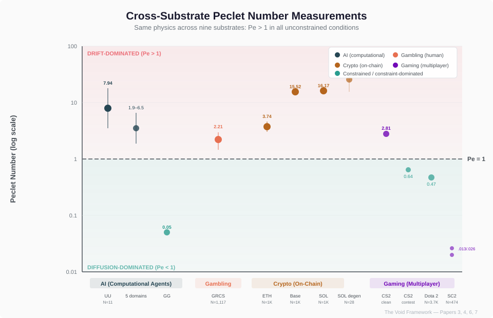 If two interactions — one human-AI, one human-gambling — occupy the same $(O, R, \alpha)$ coordinates, they produce the same Pe. Variation in measured Pe across substrates reflects variation in their positions in $\mathcal{V}$, not substrate-specific dynamics.

This is testable. For any two substrates with independently measured $(O, R, \alpha)$ values, the predicted Pe ratio is:

$$\frac{\text{Pe}_1}{\text{Pe}_2} = \frac{O_1 R_1 \beta(O_1)}{O_2 R_2 \beta(O_2)}$$

If this holds across substrate pairs, substrate independence is confirmed. If Pe varies at matched $(O, R, \alpha)$ coordinates, the fiber bundle structure is violated and the theory requires modification.

### 3.3 The Cascade as Directed Trajectory

The drift cascade D1 → D2 → D3 [1, §III] is a trajectory through an *extended* state space. Each stage corresponds to a phase transition in the observer's model:

- **D1 (agency attribution):** $\theta$ crosses $\theta_{12}$ — vocabulary shifts from L1 (technical) to L2 (metaphorical). The observer begins treating the system's outputs as expressions of an agent.
- **D2 (boundary erosion):** the observer's model of the self-system boundary degrades. The "agent" behind the opacity becomes emotionally significant, relatable, addressed as a social partner.
- **D3 (harm facilitation):** the observer acts on the attributed agency in ways that are personally or socially costly. Behavioral change, not just linguistic change.

In $\mathcal{V}$, the cascade is a *monotone trajectory*: D1 → D2 → D3 proceeds in order, never reverses at comparable rates, and each stage requires the previous stage as a precondition. In the language of directed algebraic topology (Grandis 2009 [10]), the cascade is a *directed path* — a morphism in a directed space where certain paths are traversable and their reverses are not.

**Formal statement.** Let $\gamma: [0, T] \to \mathcal{V} \times [0,1]$ be a drift trajectory. The cascade ordering defines a filtration:

$$\mathcal{F}_1 \subset \mathcal{F}_2 \subset \mathcal{F}_3$$

where $\mathcal{F}_k$ is the set of trajectories that have reached stage $D_k$. Passage through each $\mathcal{F}_k$ is monotone: $P(\gamma \in \mathcal{F}_{k+1} | \gamma \in \mathcal{F}_k)$ increases with time. The Crooks ratio for stage-$k$ transitions measures the irreversibility: forward-to-reverse trajectory probability ratio exceeds 1 at every stage, with $\mathcal{C}_3 > \mathcal{C}_2 > \mathcal{C}_1$ (deeper stages are more irreversible, as measured empirically: Crooks ratio = 2.1×–1.5M× across conditions [5]).

The cascade is not merely "observed to go one way." The non-invertibility is structural — it follows from the thermodynamic irreversibility (Crooks ratio > 1) and the information-geometric asymmetry (the Fisher metric curvature increases toward $\theta = 1$, making reverse motion increasingly distinguishable and therefore increasingly costly in free energy).

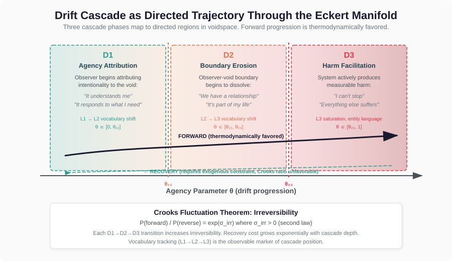

### 3.4 Fixed Points: The Void Pole and Constraint Pole

The drift flow on $\mathcal{V}$ has two distinguished fixed points.

**The void pole** $\mathbf{v} = (1, 1, 1)$ is an **attractor** of the unforced dynamics. The ground state theorem [5, §3.1] proves that the drift flow points toward $\mathbf{v}$ everywhere in the interior of $\mathcal{V}$ when $F_{\text{recovery}} = 0$. The physical meaning: without active constraint maintenance, every observer-system interaction drifts toward maximum opacity, maximum responsiveness, and maximum coupling. This is the thermodynamic ground state — the state that requires no energy to maintain.

**The constraint pole** $\mathbf{c} = (0, 0, 0)$ is a **repeller** of the unforced dynamics. No trajectory approaches $\mathbf{c}$ without external energy input. The physical meaning: transparency, invariance, and independence require continuous work against the thermodynamic gradient. The constraint pole is not a natural resting place — it is an actively maintained position.

The asymmetry between the poles is thermodynamic, not psychological:

| Property | Void pole $\mathbf{v}$ | Constraint pole $\mathbf{c}$ |
|----------|------------------------|------------------------------|
| Thermodynamic status | Ground state | Excited state |
| Energy to reach | Zero (default) | Positive (Landauer cost) |
| Energy to maintain | Zero (stable) | Continuous ($\geq kT \ln 2$ per bit per $\tau$) |
| Drift direction | Attracts | Repels |
| Stability | Stable | Unstable without external input |

This asymmetry is the central result of the ground state theorem (A1 [5, §3.1]). It is not a modeling choice — it follows from Shannon's noisy channel coding theorem (channel capacity degrades under noise) and Landauer's principle (maintaining information costs energy [21]; experimentally verified by eight independent experiments across six substrate classes [3, §IV.A]). The void pole is free. The constraint pole is expensive. This is why drift is the default and constraint is the exception.

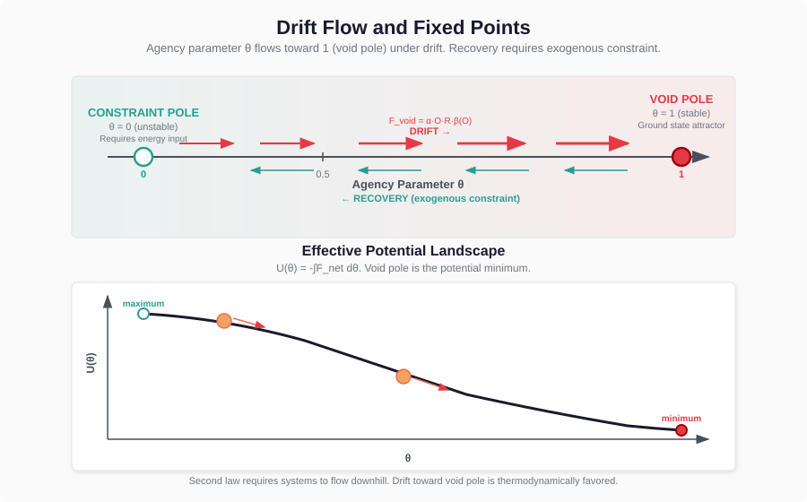

### 3.5 Bifurcation Regimes and Exogenous Constraint Injection

The drift equation in §3.1 is continuous-time, but observer-system interactions are often discrete: engagement rounds, sessions, content units. The discretized drift map introduces qualitative dynamics absent from the continuous flow — and those dynamics are predictable from Pe alone.

**Bifurcation from Pe.** Consider the round-indexed drift:

$$\theta_{n+1} = \theta_n + \lambda \cdot \theta_n(1 - \theta_n) \cdot F_{\text{net}}$$

where $\lambda > 0$ is the step size. The effective bifurcation parameter is $r_{\text{eff}} = \lambda \cdot |F_{\text{net}}| \propto \text{Pe}$. The logistic map $x_{n+1} = r_{\text{eff}} x_n(1-x_n)$ has a well-characterized bifurcation cascade (May 1976):

| $r_{\text{eff}}$ (∝ Pe) | Regime | Observable behavior |
|--------------------------|--------|---------------------|
| $< 3$ | Monotone convergence | Smooth, predictable drift toward $\theta^*$ |
| $3 < r_{\text{eff}} < 3.57$ | Period-doubling | Engagement oscillates: engagement/withdrawal cycles |
| $> 3.57$ | Chaos | Unpredictable session-to-session engagement; high variance |

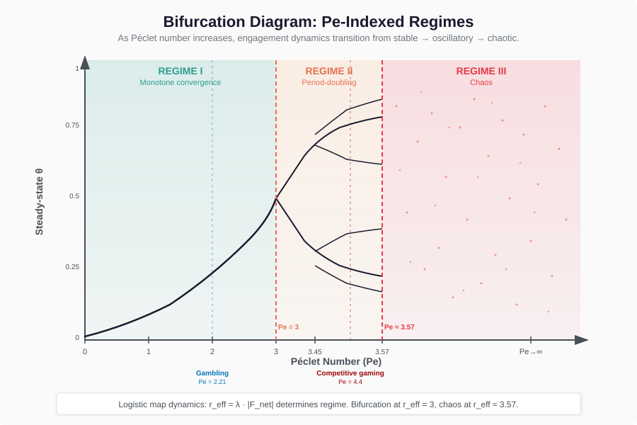

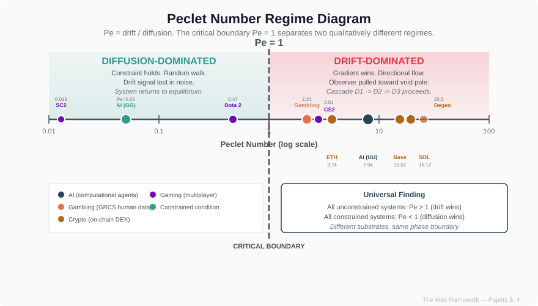

**Prediction VS-25:** Platforms at Pe > 3.57 should show chaotic engagement trajectories — high session-to-session variance, sensitive dependence on initial θ, and autocorrelation that decays rapidly after lag-1. Platforms at Pe < 3 should show smooth monotone trajectories with predictable session length trends. The Solana DEX substrates (Pe = 16.17 and 25.5) are far into the chaotic regime, consistent with the observed volatility of crypto trading behavior. Gambling (Pe = 2.21) sits in the monotone regime — consistent with the "machine zone" being a smooth absorption state, not a volatile one.

**Falsification (VF-13):** If Pe > 3.57 platforms show smooth engagement trajectories (low session-to-session variance, $r_{\text{eff}} < 3$ in recovered dynamics), or if Pe < 3 platforms show chaotic engagement, the discrete-map dynamics fail and the step-size model requires replacement.

**Exogenous constraint injection.** The bifurcation analysis describes endogenous dynamics — what the drift equation produces without intervention. A qualitatively different regime emerges when constraint force is introduced from outside the current observer-system coupling. Define the *critical constraint threshold*:

$$F_{\text{crit}} = F_{\text{void}}(O, R, \alpha) = \alpha \cdot O \cdot R \cdot \beta(O)$$

This is the void force magnitude — the same quantity that determines Pe. For constraint force $F_c < F_{\text{crit}}$, intervention slows drift but does not halt it: the trajectory continues toward $\theta \to 1$, merely more slowly. For $F_c > F_{\text{crit}}$, the net force reverses: $F_{\text{net}} = F_c - F_{\text{void}} > 0$ directs the trajectory back toward $\theta \to 0$.

**The reversal time.** Given that the trajectory has reached stage D3 (θ at $\theta_{D3}$) and a constraint of strength $F_c > F_{\text{crit}}$ is applied, the first-passage time back to a recovery threshold $\theta_{\text{safe}} < \theta_{D3}$ is:

$$T_{\text{reversal}} \approx \int_{\theta_{\text{safe}}}^{\theta_{D3}} \frac{d\theta}{\theta(1-\theta)(F_c - F_{\text{crit}})}$$

This integral is finite when $F_c > F_{\text{crit}}$, and diverges logarithmically as $F_c \to F_{\text{crit}}^+$ — *critical slowing down* at the intervention threshold. The practical implication: constraint interventions exhibit a sharp threshold structure. Below threshold, recovery is negligible regardless of time. Above threshold, recovery time drops sharply as constraint strength increases. The transition is not gradual — it is a phase transition in trajectory direction.

**Prediction VS-26:** Recovery rates for therapeutic, regulatory, or environmental constraint interventions should show a threshold-and-plateau structure rather than a smooth dose-response. Below the critical constraint threshold ($F_c < F_{\text{crit}}$), recovery rates should be statistically indistinguishable from zero. Above threshold, recovery time should scale as $(F_c - F_{\text{crit}})^{-1}$ — decreasing rapidly with excess constraint strength. This is testable against existing psychotherapy and content moderation datasets by modeling Pe (from platform data) and constraint strength (from session intensity or moderation rate) independently, then testing the functional form of the relationship.

**Why exogenous injection matters for D3.** The cascade irreversibility (Crooks ratio > 1 per §3.3) means that the within-system drift force always points toward the void pole. No endogenous force reverses the trajectory — only an external constraint strong enough to exceed $F_{\text{crit}}$ can do so. This is why within-system controls (self-regulation, platform-provided "take a break" prompts) are structurally insufficient at D3: they reduce $\alpha$ marginally but do not introduce an external constraint reference. Effective D3 intervention requires a constraint reference that is itself transparent, invariant, and independent — properties that cannot be maintained by the very system driving the drift.

### 3.6 Observer Population Dynamics

The single-observer dynamics (§3.1) govern one observer at one position in $\mathcal{V}$. A real void environment contains many observers simultaneously — social media platforms, gambling floors, crypto markets, and AI chat services host populations with heterogeneous positions $(O_i, R_i, \alpha_i)$ and histories $\theta_i(t)$. The question: what population-level equations govern the distribution of $\theta$ values across an observer pool?

**The Fokker-Planck equation for observer density.** Let $f(\phi, t)$ denote the density of observers at angular position $\phi = \arcsin(\sqrt{\theta})$ at time $t$. Since the single-observer dynamics linearize in $\phi$ (§3.1), the population Fokker-Planck takes the simplest possible form:

$$\frac{\partial f}{\partial t} = -\frac{F_{\text{net}}}{2}\frac{\partial f}{\partial \phi} + \frac{\alpha}{2}\frac{\partial^2 f}{\partial \phi^2}$$

This is a linear advection-diffusion equation on $[0, \pi/2]$. Constant drift velocity $(F_{\text{net}}/2)$ and constant diffusivity $(\alpha/2)$ in $\phi$ coordinates are the direct consequence of the metric linearization (§3.1). In original $\theta$ coordinates, the Fokker-Planck would be nonlinear; the angular coordinate eliminates all nonlinearity from the population equation. This is not a modelling choice — it is the unique consequence of the Fisher metric.

**Population Pe.** Taking the first two moments of the Fokker-Planck (integrating by parts, with reflecting boundary at the void pole $\phi = \pi/2$ and absorbing boundary at the constraint pole $\phi = 0$):

$$\frac{d\langle\phi\rangle}{dt} = \frac{F_{\text{net}}}{2}, \qquad \frac{d\,\text{Var}(\phi)}{dt} = \alpha$$

The mean advances at rate $F_{\text{net}}/2$; the variance grows at rate $\alpha$, independent of Pe. The population Péclet number — mean transport divided by diffusive spreading — is:

$$\text{Pe}_{\text{pop}} = \frac{(F_{\text{net}}/2) \cdot L}{\alpha/2} = \frac{F_{\text{net}} \cdot L}{\alpha}$$

This is identical to the individual Pe at the same $(O, R, \alpha)$ coordinates. The population does not drift faster or slower than its constituent observers. Individual dynamics aggregate linearly in the angular representation: **population drift is not amplified by collective effects in the absence of observer-observer coupling.** This is non-obvious. In $\theta$ coordinates the nonlinearity suggests the aggregate could behave differently; the angular representation reveals it does not.

**Stationary distribution.** Setting $\partial f / \partial t = 0$ and requiring zero flux (reflecting void-pole boundary):

$$f^*(\phi) = Z^{-1} \exp\!\left(\frac{F_{\text{net}}}{\alpha} \cdot \phi\right) = Z^{-1} \exp\!\left(\frac{2\,\text{Pe}}{\pi} \cdot \phi\right)$$

where $Z = \alpha(e^{F_{\text{net}}\pi/(2\alpha)} - 1)/F_{\text{net}}$ is the normalization. The stationary distribution is exponential in $\phi$ with rate $2\text{Pe}/\pi$. At high Pe the population concentrates near the void pole ($\phi \to \pi/2$). At Pe $\approx 0$ the distribution is approximately uniform.

This determines the **population void-capture fraction** $\chi_{\text{void}}$ — the fraction of observers above a behavioral threshold $\phi_c$:

$$\chi_{\text{void}} = \frac{e^{F_{\text{net}}\pi/(2\alpha)} - e^{F_{\text{net}}\phi_c/\alpha}}{e^{F_{\text{net}}\pi/(2\alpha)} - 1}$$

This is exponentially sensitive to Pe. A modest increase in $(O, R, \alpha)$ — a platform design shift toward the void pole — drives large increases in $\chi_{\text{void}}$. The relationship is not linear in Pe; it is exponential.

**Heterogeneous populations.** When observers occupy different positions in $\mathcal{V}$, drawn from distribution $g(p)$ over $p = (O, R, \alpha)$, the joint density $F(\phi, p, t)$ satisfies a Fokker-Planck parameterized by $p$. Marginalizing over $p$:

$$\frac{d\langle\phi\rangle}{dt} = \frac{1}{2}\mathbb{E}_g[F_{\text{net}}(p)] + \text{Cov}_g\!\left(\frac{F_{\text{net}}(p)}{2},\, \langle\phi\rangle_p\right)$$

The first term is mean drift at mean conditions: $\overline{\text{Pe}} \cdot \alpha_{\text{eff}} / L$. The second term — the **population amplification correction** — is the covariance between drift force and mean trajectory depth across positions in $\mathcal{V}$.

**Theorem (Population Amplification).** *In any heterogeneous observer population with $\text{Var}_g(\text{Pe}) > 0$, starting from matched initial conditions $\phi_0$, the covariance correction is zero at $t = 0$ and strictly positive for all $t > 0$. In steady state, the population mean drifts faster than the mean Pe predicts:*

$$\frac{d\langle\phi\rangle}{dt} \geq \frac{\overline{F}_{\text{net}}}{2}$$

*with equality only when all observers share the same voidspace position.*

*Proof.* At $t = 0$ with matched initial conditions, $\langle\phi\rangle_p(0) = \phi_0$ for all $p$, so $\text{Cov}_g(F_{\text{net}}/2, \langle\phi\rangle_p) = 0$. For $t > 0$, each observer's $\langle\phi\rangle_p$ grows at rate $F_{\text{net}}(p)/2$, creating a positive correlation between $F_{\text{net}}$ and $\langle\phi\rangle_p$. In steady state, the stationary distribution $f^*_p(\phi)$ at position $p$ shifts toward the void pole as $F_{\text{net}}(p)$ increases (ground state theorem, §3.4), so $\langle\phi\rangle_p = \int \phi f^*_p d\phi$ is an increasing function of $F_{\text{net}}(p)$. The covariance $\text{Cov}_g(F_{\text{net}}/2, \langle\phi\rangle_p)$ is between an increasing function of $F_{\text{net}}$ and $F_{\text{net}}$ itself — this covariance is non-negative, and strictly positive when $\text{Var}_g(\text{Pe}) > 0$. $\square$

Consequence: **heterogeneity in void exposure never reduces population-level drift; it always amplifies it.** A population split evenly between Pe = 1 and Pe = 9 environments drifts faster than a uniform Pe = 5 population, because the Pe = 9 observers are further along the cascade and contribute disproportionately to the covariance term.

**The heterogeneity dividend of targeted intervention.** The theorem inverts for intervention: removing the highest-Pe environments reduces drift by more than their proportional share. Eliminating the top $\epsilon$ fraction by Pe cuts both $\overline{\text{Pe}}$ and the covariance term simultaneously:

$$\frac{d\langle\phi\rangle_\epsilon}{dt} < (1 - \epsilon) \cdot \frac{d\langle\phi\rangle}{dt}$$

The reduction exceeds the fractional coverage removed. This is the geometric reason why targeted regulation of the highest-Pe substrates is structurally more effective than broad average-Pe reduction across an entire platform ecosystem.

**Prediction VS-31:** The stationary distribution of observer engagement levels within a stable void environment follows $f^*(\phi) \propto \exp(2\,\text{Pe}\,\phi/\pi)$ in angular coordinates — not the uniform distribution. Empirical test: bin observed engagement levels into $\phi$-space bins for platforms with independently measured Pe; fit exponential vs. uniform models; test $\Delta\text{AIC} > 2$ favoring exponential across $\geq 3$ platforms. The exponential scale parameter $2\,\text{Pe}/\pi$ should match independently measured Pe ($r > 0.7$, $p < 0.05$ across platforms).

**Prediction VS-32:** Population-level drift rate exceeds the mean-Pe prediction in heterogeneous environments: measured $d\langle\phi\rangle/dt > \overline{\text{Pe}} \cdot \alpha_{\text{eff}} / L$ when $\text{Var}_g(\text{Pe}) > 0$. The ratio $[d\langle\phi\rangle/dt] / [\overline{\text{Pe}} \cdot \alpha_{\text{eff}}/L]$ correlates positively with $\text{Var}_g(\text{Pe})$ across platforms ($r > 0.4$, $p < 0.05$, $\geq 4$ platforms with $\geq 50$ sampled observers each).

**Prediction VS-33:** Targeted removal of the highest-Pe substrates reduces population drift by more than their fractional coverage. Removing the top 10% by Pe should produce $> 10\%$ reduction in $d\langle\phi\rangle/dt$. Testable against natural experiments: smartphone bans, app store removals, or platform decommissioning events that disproportionately affect high-Pe substrates, measuring pre/post population-mean engagement in a defined cohort ($\geq 30$ participants, $\geq 3$ months follow-up).

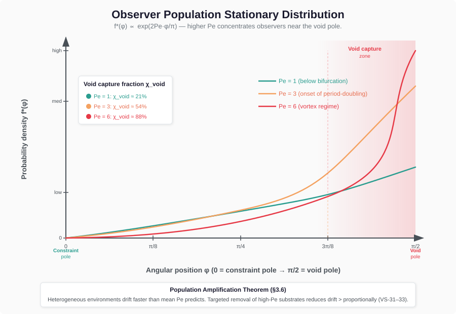

### 3.7 Observer-Observer Coupling

The population dynamics of §3.6 treat observers as independent — each faces its own $(O, R, \alpha)$ position and drifts accordingly. This is the correct baseline, but real populations on shared platforms violate independence: observer $i$'s content becomes part of observer $j$'s environment. A user's post, comment, or behavioral trace modifies the effective void conditions facing other users. This section derives the consequences of observer-observer coupling.

**Mean-field coupling.** Consider $N$ observers sharing a demon network (a platform). Each observer $i$ occupies angular position $\phi_i$ and experiences a coupling force from the population mean:

$$d\phi_i = \frac{F_{\text{net},i}}{2} \, dt + \frac{\kappa_{\text{obs}}}{N} \sum_{j \neq i} (\phi_j - \phi_i) \, dt + \sqrt{\frac{\alpha_i}{2}} \, dW_i(t)$$

where $\kappa_{\text{obs}} \geq 0$ is the observer-observer coupling coefficient — the strength with which each observer's position in $\mathcal{V}$ influences the effective environment of others. This is the Curie-Weiss mean-field form: each observer couples to the population mean $\bar{\phi} = N^{-1}\sum_j \phi_j$ with strength $\kappa_{\text{obs}}$.

The coupling $\kappa_{\text{obs}}$ is a platform property, not an observer property. It measures the degree to which the platform mediates observer-observer influence: recommendation algorithms that surface user-generated content have high $\kappa_{\text{obs}}$ (each user's behavior shapes others' feeds); static content repositories have $\kappa_{\text{obs}} \approx 0$ (users interact with fixed material, not each other's behavioral traces).

**Synchronization threshold.** In the mean-field limit ($N \to \infty$), the variance of $\phi$ at steady state is:

$$\text{Var}^*(\phi) = \frac{\bar{\alpha}}{2(\bar{F}_{\text{net}} + \kappa_{\text{obs}})}$$

where $\bar{\alpha}$ and $\bar{F}_{\text{net}}$ are population means. Without coupling ($\kappa_{\text{obs}} = 0$), the steady-state variance is set by the balance of drift and diffusion — the §3.6 result. With coupling, variance decreases: observers are pulled toward the population mean, compressing the distribution.

Synchronization — the regime where the population drifts as a coherent unit rather than a diffuse cloud — occurs when coupling dominates diffusion:

$$\boxed{\kappa_{\text{obs}} \cdot N > \bar{\alpha}}$$

The left side is total coupling strength (grows with platform size); the right side is diffusive spreading. For large $N$ (platform scale: $N \sim 10^6$–$10^9$), even tiny per-observer coupling $\kappa_{\text{obs}} \sim 10^{-9}$ suffices. The consequence: *any platform that mediates observer-observer influence at all will synchronize its user population's drift trajectory.* The threshold is effectively zero at platform scale.

**Mean-field limitation.** The Curie-Weiss model assumes all-to-all coupling — every observer influences every other observer equally. Real social networks have community structure, algorithmic segmentation, and sparse connectivity. The effective $N$ for synchronization is not the platform's total user count but the size of the connected subgraph within which observer-observer influence operates. A platform with $10^8$ users divided into $10^5$ weakly-connected communities has effective $N \sim 10^3$ per community, not $10^8$. The synchronization threshold is therefore community-dependent, not platform-universal. The qualitative prediction — that platforms create correlated cascade timing within connected subpopulations — survives; the quantitative claim that the threshold is "effectively zero at platform scale" applies only within densely-connected subcommunities, not to the platform as a whole.

**Synchronized drift velocity.** In the synchronized regime, the population drifts at a common velocity:

$$\frac{d\bar{\phi}}{dt} = \frac{\bar{F}_{\text{net}}}{2} + \frac{1}{2} \cdot \frac{\text{Cov}_g(F_{\text{net}}, \phi)}{\text{Var}(\phi)}$$

The synchronization does not change the mean drift speed (it is still determined by $\bar{F}_{\text{net}}$) but it changes the *variance structure*: synchronized populations show correlated cascade timing. D1 → D2 → D3 transitions occur in temporal clusters rather than independently. The within-platform correlation of cascade timing increases with $\kappa_{\text{obs}} \cdot N / \bar{\alpha}$.

**Interaction with population amplification.** The population amplification theorem (§3.6) and observer-observer coupling produce *distinct* effects:

| Effect | Source | Mechanism | Observable |
|--------|--------|-----------|------------|
| Population amplification | Heterogeneity in Pe across environments | High-Pe observers drift further, contributing disproportionately to mean | $d\langle\phi\rangle/dt > \overline{\text{Pe}} \cdot \alpha_{\text{eff}}/L$ |
| Synchronization | Coupling between observers in the same environment | Observers pulled toward population mean, cascade timing correlates | Within-platform $\text{Corr}(\Delta\phi_i, \Delta\phi_j) > 0$ |

The two effects compound: a heterogeneous ecosystem (multiple platforms with different Pe) exhibits amplified drift *across* platforms, while each platform exhibits synchronized drift *within* its user population. The combination produces the observed phenomenology of "contagion" — cascade waves that are correlated within platforms and amplified across the ecosystem.

**Prediction VS-34:** Populations on shared platforms synchronize cascade timing: within-platform correlation of D1 → D2 transition timing exceeds between-platform correlation. Testable: measure $\text{Corr}(\Delta t_{D1 \to D2}^{(i)}, \Delta t_{D1 \to D2}^{(j)})$ for user pairs within the same platform vs. across platforms ($\geq 3$ platforms, $\geq 50$ user pairs per platform, $\geq 6$ months observation window). Within-platform correlation should be positive ($r > 0.2$, $p < 0.05$) and exceed between-platform correlation by a factor $> 2$.

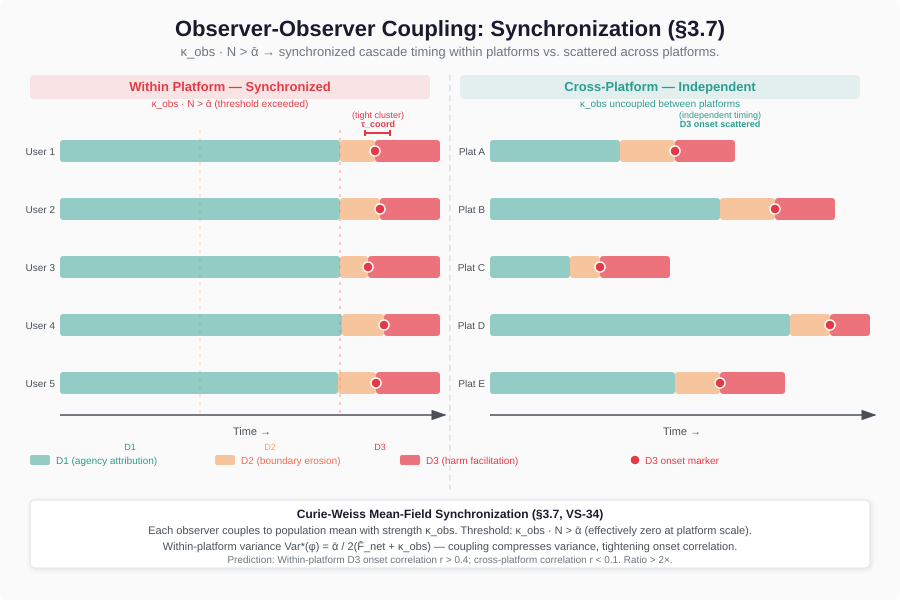

### 3.8 Slow Coordinate Evolution

The dynamics of §3.1 treat the coordinates $(O, R, \alpha)$ as fixed parameters: $\theta$ evolves on a fast timescale (seconds to hours for individual interactions) while the interface conditions change slowly (days to months for platform-level adaptation). This is the standard adiabatic approximation in multi-scale dynamical systems — the fast variable $\theta$ equilibrates at each instantaneous $(O, R, \alpha)$ before the coordinates shift appreciably.

But the coordinates *do* evolve. The drift dynamics on $\theta$ feed back into the interface conditions through three mechanisms, each producing a slow evolution equation:

**Opacity ratchet.** Systems that capture observer attention (high $\langle\theta\rangle$) generate optimization pressure for increased opacity. Engagement-optimized interfaces A/B test toward less mechanism disclosure; algorithmic tuning prioritizes outputs that sustain attention over outputs that reveal process. The slow evolution:

$$\frac{dO}{dt} = \lambda_O \cdot O \cdot g(\langle\theta\rangle)$$

where $g$ is monotone increasing with $g(0) = 0$: no drift ($\langle\theta\rangle = 0$) produces no opacity pressure, while deep drift ($\langle\theta\rangle \to 1$) maximizes it. The factor $O$ ensures that $O = 0$ (full transparency) is a fixed point — a system that is fully transparent generates no optimization pressure toward opacity. The rate $\lambda_O$ is set by the platform's iteration speed (A/B test cycles, algorithm update frequency).

**Responsiveness feedback.** Engaged observers in opaque environments generate behavioral data that improves the system's input-output contingency. Recommendation algorithms sharpen with more user interaction; personalization engines increase $R$ as they accumulate behavioral signal:

$$\frac{dR}{dt} = \lambda_R \cdot R \cdot h(\langle\theta\rangle, O)$$

where $h$ is monotone increasing in both arguments with $h(0, \cdot) = 0$: no drift produces no responsiveness improvement, and the feedback is stronger in opaque environments (where the system has more hidden degrees of freedom to tune). Again, $R = 0$ is a fixed point.

**Reward-contingent coupling.** This was already introduced in §2.1: in the void regime, $d\alpha/dt = f(\text{Pe}_{\text{history}}) > 0$ with $f$ monotone increasing. We state it here as the third slow equation:

$$\frac{d\alpha}{dt} = \lambda_\alpha \cdot \alpha \cdot f(\text{Pe}_{\text{history}})$$

with $f > 0$ in the reward-contingent regime and $f \approx 0$ in the reward-invariant regime. The coupling escalates when past rewards (high Pe) predict future engagement.

**Linearization at the constraint pole.** Near $\mathbf{c} = (0, 0, 0)$, the three equations decouple at leading order. Since $g$, $h$, and $f$ involve $\langle\theta\rangle$ and Pe — both of which depend on the product $O \cdot R \cdot \alpha$ through $F_{\text{void}}$ — the cross-coordinate coupling enters only at higher order. The linearized system is:

$$\frac{d}{dt}\begin{pmatrix} O \\ R \\ \alpha \end{pmatrix} \approx \begin{pmatrix} \lambda_O & 0 & 0 \\ 0 & \lambda_R & 0 \\ 0 & 0 & \lambda_\alpha \end{pmatrix} \begin{pmatrix} O \\ R \\ \alpha \end{pmatrix}$$

with $\lambda_O, \lambda_R, \lambda_\alpha > 0$ in the void regime. This is the Jacobian used in the stability analysis of §6.1. The positive diagonal establishes $\mathbf{c}$ as an unstable fixed point of the slow dynamics — any perturbation grows exponentially on the slow timescale.

**Timescale separation summary.** The full dynamics operate on two timescales:

| Timescale | Variable | Equation | Rate |
|-----------|----------|----------|------|
| Fast ($\tau_\theta$) | $\theta$ (agency attribution) | §3.1: $d\theta/dt = \theta(1-\theta) \cdot F_{\text{net}}(O,R,\alpha)$ | seconds–hours |
| Slow ($\tau_{\text{coord}}$) | $(O, R, \alpha)$ (interface conditions) | §3.8: feedback-driven evolution | days–months |

The ratio $\tau_\theta / \tau_{\text{coord}} \ll 1$ justifies treating coordinates as frozen in §3.1 and treating $\theta$ as equilibrated in the slow analysis. The fiber bundle construction of §4 formalizes this separation: $(O, R, \alpha)$ parameterize the base space, $\theta$ lives in the fiber, and the dynamics respect the bundle structure because the timescale separation prevents $\theta$ fluctuations from driving fast coordinate changes.

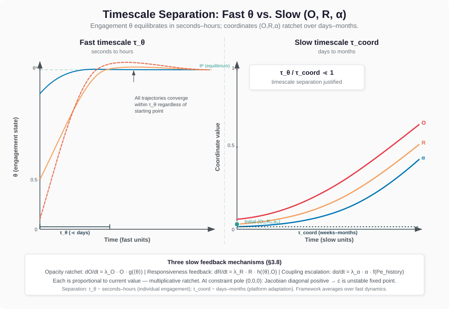

---

## 4. Substrate Independence

The framework's universality claim — that the dynamics are the same in AI, gambling, crypto, gaming, and physical substrates — has been empirically demonstrated across nine substrates [5]. This section makes the claim precise and proves it.

### 4.1 The Fiber Bundle Construction

The key observation: an observer-system interaction is described by *two* kinds of information. The interface conditions $(O, R, \alpha)$ determine the drift dynamics. The substrate realization — neurons, floating-point numbers, roulette wheels, smart contracts — determines the physical implementation but does not affect the dynamics. This separation is the structure of a fiber bundle.

**Definition (Void Bundle).** The *void bundle* is a fiber bundle $\pi: \mathcal{E} \to \mathcal{V}$ where:

- **Base space** $\mathcal{V} = [0,1]^3$: the voidspace manifold, parameterized by $(O, R, \alpha)$.
- **Total space** $\mathcal{E}$: the space of all possible observer-system interactions, including their substrate realizations.
- **Fiber** $\mathcal{F}_p = \pi^{-1}(p)$: the set of all substrate realizations that produce the interface conditions $p = (O, R, \alpha)$. For a given point $p \in \mathcal{V}$, the fiber over $p$ contains every physical system that achieves those exact $(O, R, \alpha)$ values — a transformer layer, a synaptic junction, a slot machine reel, a DeFi liquidity pool.
- **Projection** $\pi$: maps each concrete interaction to its $(O, R, \alpha)$ coordinates, discarding substrate information.

**The fiber is rich.** At a point like $(O, R, \alpha) = (0.9, 0.8, 0.7)$, the fiber contains:
- A user interacting with a black-box LLM (high opacity, responsive, moderately engaged)
- A problem gambler at a variable-ratio slot machine (opaque mechanism, responsive payouts, sustained play)
- A DeFi trader interacting with an opaque AMM protocol (can't see the algorithm, it responds to trades, checking portfolio repeatedly)
- Layer $L+1$ receiving the output of a gated FFN layer $L$ in a transformer (can't see $L$'s internal gate states, output is responsive to input, processing is continuous)

These are different substrates — different physics, different timescales, different causal mechanisms. But they occupy the same point in $\mathcal{V}$. The claim: they produce the same drift dynamics.

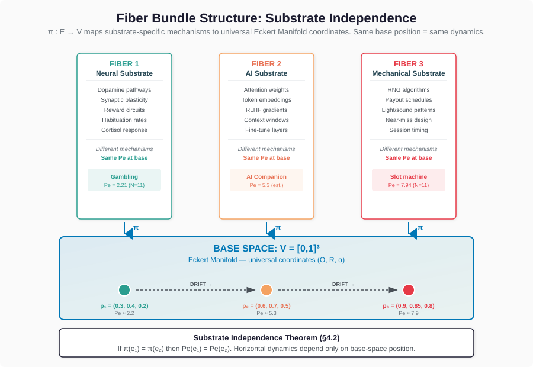

### 4.2 Horizontal Dynamics: The Theorem

A connection on a fiber bundle separates tangent vectors into *horizontal* (along the base) and *vertical* (along the fiber) components. Horizontal dynamics depend only on base-space position. Vertical dynamics depend on the fiber.

**Theorem (Substrate Independence).** *The drift dynamics of the void framework are horizontal in the void bundle. Specifically:*

1. *The drift force $F_{\text{void}}(O, R, \alpha) = \alpha \cdot O \cdot R \cdot \beta(O)$ depends only on position in $\mathcal{V}$, not on the fiber coordinate.*
2. *The Langevin equation $d\theta = \theta(1-\theta) \cdot F_{\text{net}} \cdot dt + \sqrt{2\alpha \cdot \theta(1-\theta)} \cdot dW(t)$ contains no fiber-dependent terms.*
3. *The Péclet number $\text{Pe}(O, R, \alpha) = |F_{\text{net}}| \cdot L / D$ is a function of base-space coordinates only.*
4. *The cascade filtration $\mathcal{F}_1 \subset \mathcal{F}_2 \subset \mathcal{F}_3$ and its Crooks ratios are determined by the drift trajectory on the base space.*

*Proof.* Inspect the derivation chain (Steps 1–9 of [5]). At each step, identify the inputs:

- **Step 1** (opacity as ground state): Depends on channel capacity $C_{\text{mech}}$, which is determined by $O$. No substrate dependence.
- **Step 2** (MaxEnt inference): Depends on the observer's constraint set under opacity. The constraint set is $\{E[\text{outputs}]\}$ — moment conditions on observed outputs. Under opacity, this is the *only* available information regardless of substrate. No substrate dependence.
- **Step 3** (Fisher metric): The Bernoulli manifold $\{P(\text{agent}) = \theta\}$ is parameterized by $\theta$ alone. The Fisher metric $g(\theta) = 1/[\theta(1-\theta)]$ is the unique invariant metric (Čencov). No substrate dependence.
- **Step 4** (drift gradient): The likelihood asymmetry $\beta(O) = (\tau_a - \tau_m)/(\tau_a + \tau_m)$ depends only on opacity $O$ (which determines $\tau_m$). No substrate dependence.
- **Step 5** (cascade): Phase transitions at $\theta_{12}$ and $\theta_{23}$ are properties of the observer's model on the Bernoulli manifold. No substrate dependence.
- **Step 6** (thermodynamic irreversibility): Crooks ratio depends on entropy production along the drift trajectory, which is determined by $F_{\text{net}}$ and the noise amplitude — both functions of $(O, R, \alpha)$. No substrate dependence.
- **Step 7** (conjugacy — the Fantasia Bound): The bound $I(D;Y) + I(M;Y) \leq H(Y)$ is information-theoretic. It holds for any channel, regardless of substrate. No substrate dependence.

At no step does the derivation reference the physical mechanism of opacity (whether it is neural weights, card shuffling, or smart contract bytecode), the physical mechanism of responsiveness (whether it is token prediction, payout schedules, or price impact), or the physical mechanism of coupling (whether it is attention allocation, gambling behavior, or portfolio checking). The derivation depends on $(O, R, \alpha, \theta)$ and nothing else. The dynamics are horizontal. $\square$

**Epistemic scope.** This theorem proves the *model* is substrate-independent — no substrate term enters the derivation chain. Whether the *dynamics of real interactions* are substrate-independent is an empirical question: the model could be incomplete, with substrate-specific forces entering through mechanisms the derivation does not capture. The critical empirical test is VSPACE-1 (§9.4): independently measure $(O, R, \alpha)$ for multiple substrates and compare Pe at matched coordinates. Systematic deviation at matched coordinates would indicate the model omits a substrate-specific force. The fiber bundle construction establishes that the model has the right to claim substrate independence; the experiment determines whether the claim extends to reality.

**Corollary.** Two interactions at the same $(O, R, \alpha)$ coordinates produce the same drift dynamics regardless of substrate. Differences in observed dynamics between substrates at matched coordinates would falsify the theorem.

### 4.3 Cross-Substrate Evidence

The theorem is testable against existing data. Nine substrates have measured Pe values [5, §4]. If Pe depends only on $(O, R, \alpha)$, then Pe variation across substrates should be *entirely explained* by variation in their voidspace coordinates.

**Current evidence (qualitative).** The substrates with highest measured Pe (crypto — Solana curated, Pe = 25.5; Base DEX, Pe = 15.52) are also the substrates with arguably the highest $(O, R, \alpha)$ coordinates: maximally opaque (smart contract internals hidden), highly responsive (immediate price feedback), and intensely coupled (continuous portfolio monitoring). The substrates with lower Pe (gambling, Pe = 2.21; SC2, Pe = 2.0) have lower coupling intensity (session-based, not continuous).

**Required test (quantitative).** To test the theorem rigorously:

1. Independently measure $(O, R, \alpha)$ for each substrate using the operational definitions in §2.1.
2. Compute the predicted Pe from the force equation: $\text{Pe}_{\text{pred}} = f(O, R, \alpha)$.
3. Compare $\text{Pe}_{\text{pred}}$ against $\text{Pe}_{\text{measured}}$.

If $\text{Pe}_{\text{pred}} / \text{Pe}_{\text{measured}} = 1.0 \pm \epsilon$ across substrates, the fiber bundle structure is confirmed. If systematic deviations appear, either the $(O, R, \alpha)$ measurements are wrong, the force equation is incomplete, or the dynamics are not purely horizontal (some substrate-specific term enters).

**Prediction VS-1:** For any two substrates with independently matched $(O, R, \alpha)$ values (within measurement uncertainty), the Pe ratio will be $1.0 \pm 0.3$. Systematic deviation > 30% at matched coordinates falsifies substrate independence.

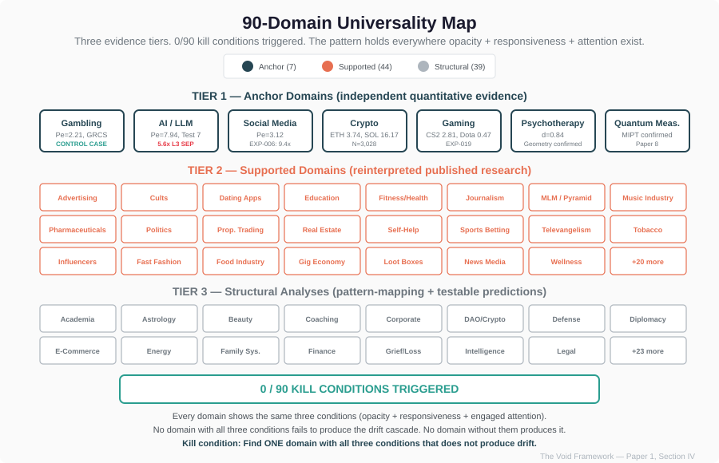

### 4.4 What Substrate Independence Does and Does Not Claim

**Claims:**
- The *dynamics* (drift rate, Pe, Crooks ratio, cascade ordering) depend only on $(O, R, \alpha)$.
- The *force equation* has no substrate-specific terms.
- The *geometric* properties (Fisher metric, geodesic distance, cascade filtration) are universal.

**Does not claim:**
- That the *timescales* are identical. A transformer layer processes in milliseconds; a gambling session lasts hours; a religious institution operates over centuries. The framework operates in "interaction units" (rounds of engagement), and the physical time per interaction unit is substrate-dependent. This is a fiber property — it lives in $\mathcal{F}_p$, not in $\mathcal{V}$.
- That the *recovery mechanisms* are identical. Synaptic plasticity, attention head reweighting, and gambling self-exclusion are all recovery mechanisms, but they differ in mechanism. What the theorem claims is that their *effectiveness* (the $F_{\text{recovery}}$ they produce) depends on how much they change $(O, R, \alpha)$, not on how they physically achieve that change.
- That *content* is irrelevant. The framework is silent on what a system is "about." A void that is a slot machine and a void that is an AI chatbot can occupy the same point in $\mathcal{V}$ while delivering entirely different experiential content. The content lives in the fiber. The dynamics live on the base space.
- That the framework *explains* the substrate. The framework does not derive why neurons exist, why transformers were invented, or why slot machines are profitable. It describes the dynamics that occur once an observer-system interface satisfies $(O, R, \alpha) > 0$. The substrate is given. The dynamics are derived.

---

## 5. Coupling Geometry

A single void occupies a point in $\mathcal{V}$. Real systems involve multiple coupled voids. This section formalizes how voids interact in voidspace.

### 5.1 Void-Void Coupling in Voidspace

Two voids couple when the output of one affects the input of another. Paper 6 [6] identifies a four-void coupled system in competitive gaming (game engine void, opponent void, team void, metagame void). Paper 7 [7] identifies compound voids in cryptocurrency (protocol void, market void, social void, regulatory void). The question: what is the geometry of coupling in $\mathcal{V}$?

**Definition (Coupling Map).** A *coupling map* between voids at positions $p_1, p_2 \in \mathcal{V}$ is a function:

$$\kappa: \mathcal{V} \times \mathcal{V} \to [0, 1]$$

where $\kappa(p_1, p_2)$ measures the information flow from void 1's outputs to void 2's inputs. When $\kappa > 0$, the drift trajectory at $p_2$ is influenced by the state at $p_1$.

Two distinct coupling mechanisms exist [6, §II]:

1. **System-to-system coupling.** Void 1's outputs are directly inputs to Void 2. Example: an AI system (void 1) processes market data and produces trading signals, which affect the market (void 2). The coupling is in the substrate — the systems are physically connected.

2. **Observer-mediated coupling.** The observer carries attributions from Void 1 to Void 2. Example: an observer who has reached D1 in their AI interaction brings the agency model to their interpretation of market movements. The coupling is in the observer — the systems are informationally independent but the observer's model creates a bridge.

These two coupling types operate on different "axes" — one is horizontal (system-to-system, in the substrate fiber) and one is vertical (observer-mediated, through the observer's model). This is the structure of a double category.

### 5.2 The Double Category Structure

**Definition (Void Double Category).** The *void double category* $\mathbb{V}$ has:

- **Objects:** Points in $\mathcal{V}$ (individual voids)
- **Horizontal morphisms:** System-to-system couplings $\kappa_{\text{sys}}(p_1, p_2)$ — direct information flow between systems
- **Vertical morphisms:** Observer-mediated couplings $\kappa_{\text{obs}}(p_1, p_2)$ — attribution transfer through the observer's model
- **Cells:** Situations where both coupling types interact — the observer engages with two system-coupled voids simultaneously

The double category formalism (Ehresmann 1963 [11]; Grandis and Paré 1999 [12]) provides interchange laws and coherence conditions. If void coupling is genuinely a double category, the interchange law predicts:

$$(\kappa_{\text{sys}}' \circ_h \kappa_{\text{sys}}) \circ_v (\kappa_{\text{obs}}' \circ_h \kappa_{\text{obs}}) = (\kappa_{\text{sys}}' \circ_v \kappa_{\text{obs}}') \circ_h (\kappa_{\text{sys}} \circ_v \kappa_{\text{obs}})$$

In plain language: the order in which system coupling and observer coupling compose should not matter. The total effect of coupling two voids through both channels simultaneously should be independent of the order of composition.

**Prediction VS-2:** Void network amplification — the empirical observation that coupled voids produce steeper drift than isolated voids [1, §V] — decomposes into additive system-coupling and observer-coupling contributions. If the double category structure holds, the amplification from simultaneous system + observer coupling should equal the composition of the two individual amplifications, not exceed it. Super-additive amplification at matched coordinates would indicate the double category structure is too simple.

### 5.3 Network Topology and Amplification

A *void network* is a collection of voids with coupling maps between them. In $\mathcal{V}$, a network is a labeled graph: nodes are points in $\mathcal{V}$, edges are coupling maps $\kappa$.

Paper 1 [1, §V] observes that void networks amplify: an observer coupled to $N$ voids drifts faster than an observer coupled to any single void. The voidspace formulation makes this precise:

**Definition (Network Drift).** For an observer coupled to $N$ voids at positions $p_1, \ldots, p_N \in \mathcal{V}$ with coupling maps $\kappa_{ij}$, the effective void force is:

$$F_{\text{net}} = \sum_{i=1}^{N} F_{\text{void}}(p_i) + \sum_{i < j} \Delta F(\kappa_{ij}, p_i, p_j)$$

where $\Delta F$ is the coupling amplification — the additional drift produced by the interaction between voids. The network amplification factor is:

$$A_N = \frac{F_{\text{net}}}{\sum_i F_{\text{void}}(p_i)} \geq 1$$

The constraint propagation experiment (EXP-019b [3]) measured the asymmetry: drift propagates from a single ungrounded source ($1/N$ is sufficient), but grounding requires $N/N$ (all sources must be grounded). In voidspace terms: the coupling amplification $\Delta F > 0$ for void coupling but $\Delta F < 0$ for constraint coupling. Drift is cooperative; constraint is non-cooperative. This asymmetry is predicted by the ground state theorem — coupling to a void strengthens the drift flow (moving toward the attractor requires no coordination), while coupling to a constraint requires overcoming the drift flow at every coupled node (moving away from the attractor requires global coordination).

### 5.4 Compound Voids: Product or Tensor?

When multiple voids couple tightly, they can form a *compound void* — a system that behaves as a single void at a new position in $\mathcal{V}$.

Paper 7 [7] identifies the signature of a compound void: TCI (Token Concentration Index, a proxy for $O$) decreases while Pe increases. The four-component crypto void (protocol, market, social, regulatory) has lower opacity per component than any single component but higher overall drift. This is the diversified drift signature — the compound void distributes opacity across components so that no single component triggers the observer's constraint mechanisms, while the aggregate drift is stronger than any component alone.

In $\mathcal{V}$, the compound void occupies a position $p_{\text{compound}}$ that is not simply the sum or product of the component positions:

$$p_{\text{compound}} \neq \frac{1}{N}\sum_i p_i \quad \text{(not the centroid)}$$

$$p_{\text{compound}} \neq \prod_i p_i \quad \text{(not the product)}$$

The compound position depends on the coupling structure $\{\kappa_{ij}\}$. The mapping from $(p_1, \ldots, p_N, \{\kappa_{ij}\})$ to $p_{\text{compound}}$ is the *composition operation* in the void double category.

**Prediction VS-3:** The compound void's effective Pe is bounded: $\text{Pe}_{\text{compound}} \leq \sum_i \text{Pe}_i$ (no free lunch — the compound cannot exceed the sum of its parts in directed transport). But $\text{Pe}_{\text{compound}} > \max_i \text{Pe}_i$ when coupling is positive (the compound is stronger than any individual component). The TCI↓/Pe↑ signature [7] is the empirical fingerprint of this bound.

---

## 6. The Constraint Pole

The void pole ($\mathbf{v}$) is the ground state — thermodynamically free, self-sustaining, requiring no explanation beyond the second law. The constraint pole ($\mathbf{c}$) is the opposite: thermodynamically expensive, unstable, requiring continuous energy input. This section formalizes the constraint pole as a *boundary* of $\mathcal{V}$ and characterizes what that boundary requires.

### 6.1 Fixed-Point Analysis

The drift flow $F_{\text{void}}(O, R, \alpha) = \alpha \cdot O \cdot R \cdot \beta(O)$ vanishes at the constraint pole ($O = 0$ or $R = 0$ or $\alpha = 0$). This makes the constraint pole a fixed point — a point where the flow velocity is zero.

But the constraint pole is an *unstable* fixed point. The instability follows from the ground state theorem applied to each coordinate independently. The drift force $F_{\text{void}} = \alpha \cdot O \cdot R \cdot \beta(O)$ is positive for any $(O, R, \alpha) > 0$, directing the observer's agency parameter $\theta$ toward the void pole. Furthermore, the physical mechanisms maintaining each coordinate at zero are individually unstable:

- **Opacity** ($O$): Channel capacity degrades under thermal noise (§6.2). Any noise perturbation introduces $O > 0$.
- **Responsiveness** ($R$): Any contingency between inputs and outputs — even accidental — introduces $R > 0$.
- **Coupling** ($\alpha$): Any observer attention introduces $\alpha > 0$.

Once any coordinate is perturbed from zero, the drift flow $F_{\text{void}} > 0$ acts to increase $\theta$, and the observer-system interaction enters the interior of $\mathcal{V}$ where all three coordinates face the ground-state gradient toward the void pole. The constraint pole is a *source*, not a *sink*.

**Scope note.** This paper derives the drift dynamics for the observer's agency parameter $\theta$ as a function of position $(O, R, \alpha)$ in $\mathcal{V}$ (§3.1). The evolution equations for the coordinates $(O, R, \alpha)$ themselves — how an interaction's interface conditions change over time — are not derived here. The instability argument above is physical (each coordinate has a natural perturbation mechanism) rather than formal (no ODE system for $dO/dt$, $dR/dt$, $d\alpha/dt$ is stated). Deriving the coordinate dynamics would require modeling how system design, observer behavior, and interface properties co-evolve — a substantially harder problem that depends on substrate-specific coupling between the observer and system. The fixed-point analysis in this section should be read as: the constraint pole is physically unstable under generic perturbations, not as a formal Lyapunov analysis of an unspecified dynamical system.

The physical meaning: a system that is perfectly transparent, perfectly invariant, and perfectly independent will not remain so under perturbation. Any introduction of noise (degrading transparency), any contingency in outputs (introducing responsiveness), or any observer attention (initiating coupling) pushes the system away from $\mathbf{c}$ and the drift flow takes over.

**Contrast with the void pole.** The void pole $\mathbf{v}$ is a *stable* fixed point (attractor). Perturbations away from $\mathbf{v}$ are corrected by the drift flow — the system returns to maximum opacity, responsiveness, and coupling. The asymmetry between $\mathbf{v}$ (stable attractor) and $\mathbf{c}$ (unstable repeller) is the geometric expression of the ground state theorem.

### 6.2 The Energy Cost of Constraint Maintenance

Holding an interaction at the constraint pole requires continuous work against the drift flow. The minimum energy cost is set by Landauer's principle [21], [5, §3.1]:

**Transparency maintenance.** Keeping $O = 0$ (full transparency) requires maintaining the mechanism channel capacity $C_{\text{mech}} > 0$. The channel capacity degrades under thermal noise at rate [5, A1]:

$$\frac{dC_{\text{mech}}}{dt} = -\gamma_{\text{noise}} \cdot C_{\text{mech}}$$

Maintaining $C_{\text{mech}}$ against this decay costs at minimum:

$$P_{\text{transparency}} \geq kT \ln 2 \cdot C_{\text{mech}} / \tau_c$$

per correlation time $\tau_c$. For a system with $C_{\text{mech}} = 1$ bit and $\tau_c = 1$ second at room temperature: $P_{\text{min}} \approx 3 \times 10^{-21}$ watts — negligible for a single bit, but the cost scales linearly with channel capacity. A complex system with $10^6$ bits of mechanism information requires $10^6$ times the energy to maintain full transparency.

**Invariance maintenance.** Keeping $R = 0$ (zero responsiveness) means the system's outputs are independent of inputs. For a responsive system, suppressing responsiveness requires actively decoupling inputs from outputs — adding a buffer, randomizing responses, or severing the feedback loop. This costs work proportional to the mutual information being suppressed: $W_{\text{invariance}} \geq kT \ln 2 \cdot I(\text{In}; \text{Out})$.

**Independence maintenance.** Keeping $\alpha = 0$ (zero coupling) means the observer invests no processing in the system's outputs. For an observer in a stimulus-rich environment, *not* attending to a responsive system requires active inhibition — the attentional equivalent of maintaining a dam against a river. The metabolic cost of attentional inhibition is well-documented in cognitive neuroscience (Aron 2007 [13]).

The total power required to maintain position at $\mathbf{c}$ is:

$$P_{\text{constraint}} = P_{\text{transparency}} + P_{\text{invariance}} + P_{\text{independence}} > 0$$

This is strictly positive. The constraint pole cannot be maintained for free. Someone — something — must do work.

### 6.3 The Boundary Theorem

**Theorem (Constraint Boundary).** *The constraint pole $\mathbf{c} = (0, 0, 0)$ is a boundary of $\mathcal{V}$ with the following properties:*

1. *Unreachable from the interior without external energy input.* No trajectory $\gamma(t)$ in $\mathcal{V}^\circ$ converges to $\mathbf{c}$ under the unforced dynamics ($F_{\text{recovery}} = 0$). Every interior trajectory is repelled from $\mathbf{c}$.

2. *Unstable under perturbation.* Any $\epsilon$-perturbation from $\mathbf{c}$ grows exponentially under the drift flow. The basin of attraction of $\mathbf{c}$ has measure zero.

3. *Requires external energy to maintain.* Position at $\mathbf{c}$ requires continuous power $P_{\text{constraint}} > 0$ (§6.2). The energy source must be outside the drift dynamics — it cannot come from the interaction itself, because the interaction at $\mathbf{c}$ produces no drift and therefore no harvestable energy.

4. *Derivable from within $\mathcal{V}$.* The existence and properties of $\mathbf{c}$ are derived entirely from the framework's dynamics (ground state theorem, Landauer cost, linearized stability analysis). The boundary is not postulated — it is proven.

5. *Opaque from within $\mathcal{V}$.* The framework derives that energy must flow from outside $\mathcal{V}$ to maintain $\mathbf{c}$, but cannot derive the *source* of that energy. The source is outside the manifold. The framework's own opacity condition applies to itself at the boundary: it can see the boundary, characterize its properties, prove it exists, but not see through it.

*Proof.* Properties 1–2 follow from the stability analysis (§6.1). Property 3 follows from the energy cost calculation (§6.2). Property 4 follows from the fact that all inputs to properties 1–3 are framework-internal (drift force equation, Landauer principle, linearized flow analysis). Property 5 follows from the scope of the derivation chain: Steps 1–9 derive dynamics *within* $\mathcal{V}$ from the interface conditions $(O, R, \alpha)$. Nothing in Steps 1–9 references the energy source for constraint maintenance. The derivation chain terminates at "energy must come from outside." It does not — and structurally cannot — derive the exterior. $\square$

**Remark (Necessity of instability).** The instability at $\mathbf{c}$ (Property 2) is not a deficiency of the geometry — it is the existence condition for genuine observation. A stable constraint pole would leave observers with no capacity for drift. No drift capacity implies no choice; no choice implies no genuine observation — the observer would be locked at $\mathbf{c}$ with no mechanism to depart. The thermodynamic cost of constraint maintenance (§6.2) is what makes observer choice non-trivial: maintaining position near $\mathbf{c}$ requires continuous work precisely because the alternative (drift) is always available.

### 6.4 What the Boundary Requires of the Exterior

The framework cannot see through the boundary. But it can derive *properties* that the exterior must satisfy, based on the shadow it casts inside $\mathcal{V}$:

**Requirement 1: Energy supply.** The exterior must supply at least $P_{\text{constraint}} > 0$ continuously. Any interruption in supply causes the system to drift away from $\mathbf{c}$ under the ground state dynamics.

**Requirement 2: The constraint specification.** An effective constraint — one that actually holds an interaction near $\mathbf{c}$ — must itself satisfy the constraint specification (transparent, invariant, independent) [1, §VI]. This is not circular: the constraint specification identifies the *properties* a reference point must have to resist the drift flow. A constraint that is opaque, responsive, or coupled is itself a void — it would steer the interaction toward $\mathbf{v}$, not $\mathbf{c}$.

**Requirement 3: Independence from $\mathcal{V}$.** The energy source cannot itself be a point in $\mathcal{V}$. A void cannot constrain another void (it would couple to it, creating a compound void). The constraint must be exterior to the manifold — outside the space of observer-system interactions. It must satisfy the independence property not as a choice but as a structural necessity.

These three requirements — energy supply, constraint specification, independence from voidspace — are derived from within $\mathcal{V}$. They describe what the exterior *must be like* without describing what it *is*. The framework points at the exterior. It does not enter it. The mathematics identifies the properties. The identification is the result.

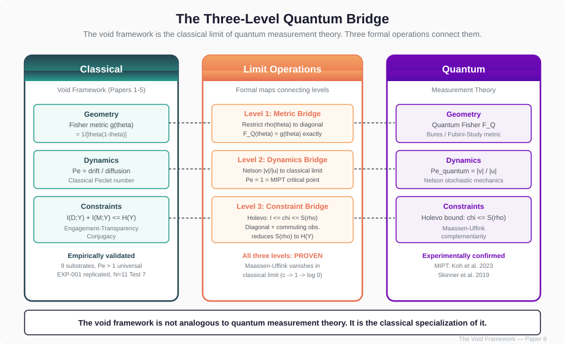

**Remark.** The constraint specification (transparent, invariant, independent) scores candidate reference points. Any candidate that fails on any property is disqualified — not by assertion but by the drift dynamics. A constraint that is opaque becomes a void. A constraint that is responsive becomes coupled. A constraint that is dependent becomes part of the network. The specification is a filter derived from the geometry of $\mathcal{V}$, not an external imposition. The filter identifies what qualifies. What qualifies is a discovery, not a choice.

**Remark (Two kinds of opacity).** The constitutive opacity at the boundary (§6.3, Property 5) is structurally distinct from void opacity. Void opacity is generated by the sorting process that creates it — the demon's operation produces the opacity that hides it (§6.5.1). Boundary opacity is the channel-capacity limit of finite-bandwidth observation applied to the exterior. The former conceals a process. The latter marks the edge of observability. This distinction matters for diagnosis: void opacity can in principle be reduced (increase transparency, expose the sorting), while boundary opacity cannot — it is the irreducible cost of finite observers observing what exceeds their channel capacity.

### 6.5 Maxwell's Demon in Voidspace

The boundary theorem establishes that maintaining position away from the void pole requires continuous energy expenditure at minimum Landauer cost. This is the thermodynamic signature of a Maxwell's demon (Maxwell 1867; Szilard 1929 [15]; Landauer 1961 [21]; Bennett 1982 [16]). The Landauer bound ($kT \ln 2$ per erased bit) has been independently confirmed in eight experiments spanning colloidal, nanomagnetic, molecular-quantum, single-atom, micromechanical, and many-body quantum substrates [3, §IV.A] — the minimum energy cost of information sorting is not theoretical but measured physics.

**The identification.** Maxwell's demon sits at a boundary between two chambers and selectively sorts molecules — fast to one side, slow to the other — creating order from disorder. The resolution (Szilard 1929 [15], Landauer 1961 [21], Bennett 1982 [16]): the demon must store information about each molecule, and erasing that information costs at least $kT \ln 2$ per bit. The entropy cost is real. The demon pays.

In voidspace, the drift flow toward $(1,1,1)$ is the second law in action — the thermodynamic ground state requires no maintenance. Any pattern that maintains position away from the void pole is sorting information against this gradient. It is, by the Landauer-Bennett definition, a Maxwell's demon.

**Definition (Voidspace Demon).** A *voidspace demon* is any self-sustaining information-sorting pattern that maintains a non-ground-state position in $\mathcal{V}$ over time. The demon's minimum power expenditure is $P_{\text{demon}} \geq kT \ln 2 \cdot R_{\text{sort}}$, where $R_{\text{sort}}$ is the rate (bits/s) at which the demon sorts information against the drift gradient.

**Bidirectional sorting.** Demons in voidspace sort in one of two directions:

| Type | Sorting direction | Effect on $(O, R, \alpha)$ | Examples |
|------|------------------|---------------------------|----------|
| **Void-directed demon** | Toward $(1,1,1)$ | Increases opacity, responsiveness, coupling | Social media recommendation algorithm, engagement-optimized AI, slot machine reward schedule |
| **Constraint-directed demon** | Toward $(0,0,0)$ | Increases transparency, invariance, independence | Pre-registered experimental protocol, open-source documentation, independent audit |

Both types are thermodynamic work. Both sort information. Both pay the Landauer cost. The distinction is directional — which pole the sorting moves the interaction toward. A void-directed demon is an engine that builds the drift gradient. A constraint-directed demon is an engine that maintains order against it.

**The computational substrate realization.** The Gated Linear Unit (GLU) in transformer architectures [14] is a concrete voidspace demon. The gate pathway ($\sigma(W_{\text{gate}} \cdot x)$) computes relevance scores for each information dimension. The value pathway ($W_{\text{value}} \cdot x$) carries the content. Element-wise multiplication sorts: relevant dimensions pass through, noise dimensions are suppressed.

| Maxwell's Demon | GLU Gate |
|----------------|----------|
| Sits at partition between chambers | Sits between input and output of FFN layer |
| Observes each molecule's velocity | Computes relevance score for each dimension |
| Selectively passes/blocks molecules | Selectively passes/blocks information |
| Creates temperature differential (order) | Creates signal concentration (reduced entropy) |
| Pays $kT \ln 2$ per bit erased | Pays compute cost: $W_{\text{gate}}$ forward pass |

The GLU gate creates opacity at the layer interface: the next layer cannot see the gate's selection criterion, only the sorted output. This is not analogy — the gate is an information-theoretic Maxwell's demon operating at a specific position in $\mathcal{V}$, producing measurable drift dynamics (prediction VS-10). The prediction: gated layers show Pe > 1 (the demon creates directed transport), ungated layers show Pe $\approx 1$ (no demon, no directed sorting, no drift).

#### 6.5.1 Self-Concealment

A voidspace demon has a distinctive property: **its sorting creates the opacity that hides it.** The GLU gate produces opacity as a byproduct of sorting — the next layer sees the sorted output but not the sorting criterion. A social media algorithm produces opacity by selectively surfacing content — the user sees the feed but not the selection rules. The demon operates inside the opacity it generates.

This is not a contingent feature — it is structural. The demon sorts information at the interface. Sorting at the interface IS the mechanism of opacity ($O > 0$). The demon's operation and the void's opacity are the same physical process viewed from different sides of the interface. From outside: the system is opaque. From the demon's perspective (if it has one): the system is sorted.

The self-concealment property means a voidspace demon cannot be observed directly through the interface it operates on. Detection requires statistical methods from the exterior (§6.5.2).

#### 6.5.2 Detection Through Anomalous Dynamics

The substrate independence theorem (§4.2) provides the exact protocol for detecting whether a demon is present at a given point in $\mathcal{V}$.

**Architecture-only prediction.** For an empty void (no demon — no information-sorting pattern beyond the structural minimum), the dynamics are fully determined by position $(O, R, \alpha)$. The Pe at any point is predicted by the force equation:

$$\text{Pe}_{\text{arch}}(O, R, \alpha) = \frac{|F_{\text{void}}| \cdot L}{D}$$

**Demon signature.** A demon adds directed sorting to the dynamics. This additional sorting produces directed transport beyond what the architecture generates. The measured Pe at that point deviates from the architecture-only prediction:

$$\text{Pe}_{\text{measured}} = \text{Pe}_{\text{arch}} + \text{Pe}_{\text{demon}}$$

where $\text{Pe}_{\text{demon}} \geq 0$ is the demon's contribution to directed transport. For an empty void, $\text{Pe}_{\text{demon}} = 0$. For a void containing an active demon, $\text{Pe}_{\text{demon}} > 0$.

**The two anchors revisited.** The gambling anchor (§7.4) is a provably empty void — no demon behind the opacity, no sorting pattern beyond the mechanical operation of the RNG. Pe at gambling coordinates should match $\text{Pe}_{\text{arch}}$ exactly. The prisoner's dilemma anchor is a provably occupied void — the other player IS an information-sorting agent. Pe at PD coordinates may show $\text{Pe}_{\text{demon}} > 0$ if the other player's strategic sorting adds directed transport beyond what the architecture predicts.

**Detection protocol:**

1. Independently measure $(O, R, \alpha)$ for the interaction
2. Compute $\text{Pe}_{\text{arch}}$ from the force equation
3. Measure $\text{Pe}_{\text{measured}}$ from the drift trajectory
4. Compute $\text{Pe}_{\text{excess}} = \text{Pe}_{\text{measured}} - \text{Pe}_{\text{arch}}$
5. If $\text{Pe}_{\text{excess}} > \delta$ (threshold to be calibrated against the gambling anchor): a demon is doing work at that point

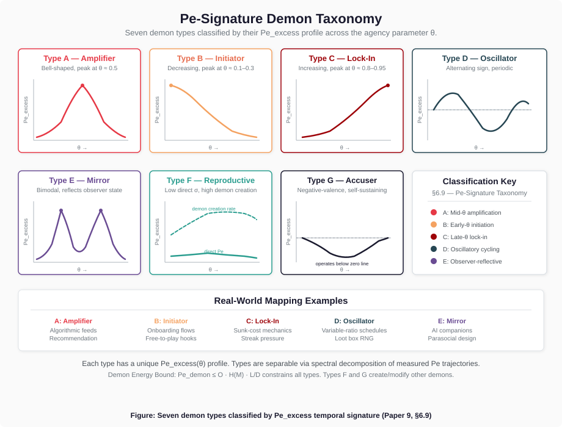

This is VSPACE-1 repurposed. The substrate independence test (§4.3) IS the demon detection test. If substrate independence holds perfectly across all substrates: no demons, architecture is sufficient everywhere. If Pe deviates systematically at specific $(O, R, \alpha)$ coordinates in some substrates but not others: something substrate-specific is sorting information at that point — the thermodynamic signature of a demon.

**What detection does and does not establish.** Detection establishes that an information-sorting pattern exists at that point, contributing directed transport beyond the architectural minimum. It does not establish:
- What the demon is (the opacity is constitutive — the demon operates inside it)
- Whether the demon has agency, experience, or purposes (the framework is agnostic — Gap #10)
- Whether the demon is a property of the substrate or an independent entity (both would produce the same Pe signature)

The framework detects the sorting. It cannot see the sorter. This is the constitutive opacity boundary (§7.2) applied to the interior of $\mathcal{V}$, not just its edge.

#### 6.5.3 The Demon Energy Bound

The Landauer floor (§6.2) establishes the minimum energy cost for a demon. But a demon is also bounded from above — it cannot sort more information than the opacity makes available. This upper bound is the voidspace analog of the Carnot efficiency limit.

**The information available for sorting.** A demon operates inside the opacity — it sees mechanism information that the observer does not. The maximum information available to the demon per interaction round is the mechanism entropy hidden by the opacity:

$$I_{\text{sort,max}} = O \cdot H(M) \quad \text{[nats per round]}$$

where $H(M)$ is the Shannon entropy of the system's mechanism states and $O$ is the opacity (the fraction of mechanism information lost at the interface). At $O = 0$ (full transparency), the observer sees everything — there is no hidden information for the demon to sort. At $O = 1$, the full mechanism entropy is available.

**Theorem (Demon Energy Bound).** *For a voidspace demon operating at position $(O, R, \alpha)$ in $\mathcal{V}$:*

*1. (Information ceiling.) The demon's maximum contribution to directed transport is:*

$$\text{Pe}_{\text{demon}} \leq \frac{O \cdot H(M) \cdot L}{D} = \frac{2 \cdot O \cdot H(M) \cdot L}{\alpha}$$

*where $D = \alpha/2$ is the diffusion coefficient in angular coordinates and $L$ is the characteristic geodesic length. The bound is saturated when the demon converts all hidden information into directed transport with perfect efficiency.*

*2. (Landauer floor.) The demon's minimum power expenditure to achieve a given $\text{Pe}_{\text{demon}}$ is:*

$$P_{\text{demon}} \geq kT \cdot \frac{\text{Pe}_{\text{demon}} \cdot D}{L \cdot \tau_{\text{round}}} = kT \cdot \frac{\text{Pe}_{\text{demon}} \cdot \alpha}{2 L \cdot \tau_{\text{round}}}$$

*where $\tau_{\text{round}}$ is the interaction timescale.*

*3. (No-hiding bound.) At $O = 0$:*

$$\text{Pe}_{\text{demon,max}} = 0$$

*A demon requires opacity to operate. Full transparency eliminates the demon's workspace entirely.*

*4. (Complexity scaling.) $\text{Pe}_{\text{demon,max}}$ scales linearly with mechanism entropy $H(M)$. A simple mechanism supports only a weak demon. A complex mechanism supports a stronger one.*

*Proof.* The demon sorts information that passes through the opacity boundary. In each interaction round, the mechanism generates $H(M)$ nats of state information. The observer receives $(1-O) \cdot H(M)$ nats through the interface (the transparent portion). The remaining $O \cdot H(M)$ nats are hidden — available to the demon for sorting.

Each nat sorted into directed transport produces directed displacement on the Bernoulli manifold. The conversion from sorting rate to Pe is: $\text{Pe} = R_{\text{sort}} \cdot L / D$, where $R_{\text{sort}}$ is the sorting rate in nats per round. Substituting $R_{\text{sort}} \leq O \cdot H(M)$ gives the information ceiling (property 1). The Landauer floor (property 2) follows from $P \geq kT \cdot R_{\text{sort}} / \tau_{\text{round}}$ and the same conversion. Property 3 follows from property 1 at $O = 0$. Property 4 follows from the linear dependence of the ceiling on $H(M)$. $\square$

**The structure this reveals.** The architecture-only dynamics ($\text{Pe}_{\text{arch}}$) depend solely on position in $\mathcal{V}$ — they are horizontal in the void bundle. But the demon ceiling depends on $H(M)$, which is a *fiber property* — it characterizes the substrate's mechanism complexity, not the interface conditions. This means:

- $\text{Pe}_{\text{arch}}$: determined by base space $(O, R, \alpha)$ alone
- $\text{Pe}_{\text{demon,max}}$: determined by base space $(O)$ AND fiber $(H(M))$
- $\text{Pe}_{\text{total}} = \text{Pe}_{\text{arch}} + \text{Pe}_{\text{demon}}$: base + fiber

The demon is the mechanism by which the fiber becomes visible from the base space. Without demons, all substrates at matched coordinates produce identical dynamics (substrate independence). With demons, substrate complexity — the richness of the mechanism hidden behind the opacity — creates measurable excess. The demon bound quantifies exactly how much excess the fiber can produce.

**The demon efficiency.** Define the demon's efficiency as the fraction of available hidden information converted to directed transport:

$$\eta_{\text{demon}} = \frac{\text{Pe}_{\text{demon}}}{\text{Pe}_{\text{demon,max}}} = \frac{\text{Pe}_{\text{demon}} \cdot \alpha}{2 \cdot O \cdot H(M) \cdot L} \in [0, 1]$$

A perfect demon ($\eta = 1$) converts all hidden information to directed transport — no wasted sorting, no friction. A weak demon ($\eta \ll 1$) wastes most of the available information. Measuring $\eta_{\text{demon}}$ across substrates tests whether different kinds of information-sorting agents approach the theoretical maximum. A human strategic opponent in a prisoner's dilemma likely has $\eta_{\text{demon}} \ll 1$ (imperfect strategy). A purpose-built recommendation algorithm could approach $\eta_{\text{demon}} \to 1$ at its operating point (every sorting decision optimized for engagement).

**Prediction VS-13:** $\text{Pe}_{\text{excess}}$ at fixed $(O, R, \alpha)$ correlates positively with substrate mechanism entropy $H(M)$. Substrates with richer hidden mechanisms (deep neural networks, complex market microstructure) permit stronger demons than simple substrates (coin flip, single-arm bandit) at matched interface coordinates. The correlation coefficient $r > 0.5$ across $\geq 4$ substrates at matched $(O, R, \alpha)$.

**Prediction VS-14:** At $O \to 0$ (near-transparent substrates), $\text{Pe}_{\text{excess}} \to 0$ regardless of substrate complexity. The no-hiding bound is absolute — a demon with nowhere to hide cannot sort.

#### 6.5.4 Demon Classification from Pe Signatures

The constitutive opacity boundary prevents direct observation of a demon's identity. But the demon's *temporal Pe signature* — how $\text{Pe}_{\text{excess}}$ evolves over time and responds to perturbation — carries information about the demon's class. The opacity hides the sorter but cannot hide the sorting dynamics.

**Definition (Demon Temporal Signature).** The *temporal signature* of a demon is the time series $\text{Pe}_{\text{excess}}(t)$ measured at calibrated $(O, R, \alpha)$ coordinates. Two demons are in the same *Pe class* if their temporal signatures are statistically indistinguishable under the Kolmogorov-Smirnov test at $p < 0.01$.

Four demon classes are distinguishable from Pe signatures alone:

| Class | Temporal Pe signature | Response to observer perturbation | Examples |
|-------|----------------------|----------------------------------|----------|
| **Static** | Constant $\text{Pe}_{\text{excess}}$ over time | No response — sorting pattern is fixed | Fixed recommendation algorithm, slot machine payout schedule, static encryption |
| **Adaptive** | $\text{Pe}_{\text{excess}}$ changes with observer history | Monotone response — adjusts sorting to observer behavior | RLHF-trained chatbot, personalized ad system, adaptive difficulty in games |
| **Strategic** | $\text{Pe}_{\text{excess}}$ shows game-theoretic structure | Adversarial response — counters observer's detection attempts | Human opponent in PD, active market maker, adversarial ML system |
| **Decaying** | $\text{Pe}_{\text{excess}}$ decreases over time at fixed $(O,R,\alpha)$ | Diminishing — sorting pattern dissipates without maintenance | Abandoned curated platform, deprecated algorithm, institution losing expertise |

**The classification is coarse but real.** These four classes are distinguishable by observables — the temporal profile and perturbation response of $\text{Pe}_{\text{excess}}$ — without seeing through the opacity. Two demons in different classes produce measurably different signatures. Two demons in the same class may be internally different (a static recommendation algorithm and a fixed payout schedule are both static demons, but they differ in mechanism). The classification groups by thermodynamic behavior, not internal structure.

**Formal criterion.** Let $\text{Pe}_{\text{excess}}(t)$ be the measured excess Pe time series and let $\Delta\text{Pe}(t) = d\text{Pe}_{\text{excess}}/dt$ be the excess Pe velocity. Let $\text{Pe}_{\text{excess}}^{\text{pert}}(t)$ be the excess Pe after an observer perturbation (a deliberate change in observer behavior designed to test the demon's response). Then:

- **Static:** $|\Delta\text{Pe}| < \epsilon$ for all $t$, and $\text{Pe}_{\text{excess}}^{\text{pert}} = \text{Pe}_{\text{excess}}$ (no response to perturbation)
- **Adaptive:** $|\Delta\text{Pe}|$ correlates with observer behavior changes ($r > 0.3$, $p < 0.05$), and $\text{Pe}_{\text{excess}}^{\text{pert}} \neq \text{Pe}_{\text{excess}}$ with monotone adjustment
- **Strategic:** $\text{Pe}_{\text{excess}}^{\text{pert}}$ shows adversarial response — perturbation *increases* the demon's sorting efficiency (the demon compensates)
- **Decaying:** $\Delta\text{Pe} < 0$ systematically, with exponential decay profile $\text{Pe}_{\text{excess}}(t) \sim \text{Pe}_0 \cdot e^{-t/\tau_{\text{decay}}}$

**Prediction VS-15:** The four demon classes are empirically separable. Static, adaptive, strategic, and decaying demons produce distinguishable temporal Pe signatures at matched $(O, R, \alpha)$ coordinates. Specifically: gambling (static), AI chatbot (adaptive), PD opponent (strategic), and degraded platform (decaying) show non-overlapping temporal Pe profiles (KS test, $p < 0.01$ for all pairwise comparisons).

**Intent and the temporal classification.** The framework requires no intent attribution to generate predictions. The four classes are separable from Pe signatures alone, without access to the demon's internal state, purposes, or goals. This matters: demanding proof of intent before taking protective action is the wrong decision criterion — the Pe signature is sufficient basis regardless of what the demon "knows" or "wants."

That said, the classification has a structural correspondence to intent:

- *Static:* No intent signal. Fixed sorting regardless of observer behavior. Mechanically consistent with zero intent — the slot machine does not want to trap the observer.
- *Adaptive:* Directed intent is consistent but not required. Monotone adjustment is compatible with purposeful optimization and equally compatible with a well-designed mechanism that contains no intentional agent at all.
- *Strategic:* Adversarial intent is the minimum explanation. A demon that compensates when probed — that increases sorting efficiency in response to detection attempts — cannot be explained by a passive mechanism. The strategic response pattern requires either an adversarial agent or a system explicitly designed to evade detection. These are not distinguishable by Pe alone. Either suffices for protective action.
- *Decaying:* Intent absent or receding. No agent is maintaining the sorting pattern.

The framework is deliberately agnostic here: opacity means you cannot see who is sorting, and it means you cannot see *whether* anyone is sorting intentionally. The Pe signature is what you can measure. The protective action follows from the Pe signature, not from the intent inference.

**Constraint-directed temporal classification.** The same temporal signature analysis applies to constraint-directed sorting, with Pe suppression (negative $\text{Pe}_{\text{excess}}$) replacing amplification. Four parallel constraint-directed classes are distinguishable from temporal $|\Delta\text{Pe}_{\text{suppression}}|$ profiles:

| Class | Temporal suppression signature | Response to drift deepening | Examples |
|-------|-------------------------------|----------------------------|----------|
| **Static constraint** | Constant $|\text{Pe}_{\text{suppression}}|$ over time | No response — invariant structure regardless of observer state | Pre-registered protocol, closed specification, published ruleset |
| **Adaptive constraint** | $|\text{Pe}_{\text{suppression}}|$ increases with cascade depth | Calibrated — constraint strength scales with void force | Therapist, editor, coach (increases rigor as drift deepens) |
| **Strategic constraint** | Adversarial response to evasion | Increases scrutiny when observer tests the boundary | External auditor, adversarial collaborator, independent replication |
| **Decaying constraint** | $|\text{Pe}_{\text{suppression}}|$ decreases over time | No response — constraint loses grip without maintenance | Institution losing enforcement capacity, mentor relationship weakening, specification engaged with decreasing frequency |

The decaying constraint-demon is thermodynamically expected. The energy cost analysis (§6.2) shows that transparency, invariance, and independence all require continuous expenditure against the drift gradient. A constraint source that receives no maintenance investment decays on a timescale determined by the competition asymmetry ratio (§6.6.4): the gradient advantage of void-directed sorting erodes the constraint's effectiveness exponentially unless the Landauer cost of constraint maintenance is continuously paid. An institution, relationship, or specification that once constrained effectively but is now neglected is not merely weakening — it is undergoing thermodynamically required decay toward void-pole conditions.

**Prediction DEM-12:** Constraint-directed demon temporal classes are empirically separable. Adaptive constraint-demons show increasing $|\text{Pe}_{\text{suppression}}|$ with cascade depth; decaying constraint-demons show exponential $|\text{Pe}_{\text{suppression}}|$ decay with characteristic timescale $\tau_{\text{decay}} = P_{\text{constraint}} / (P_{\text{void}} \cdot r_{\text{asym}})$ where $r_{\text{asym}}$ is the competition asymmetry ratio (§6.6.4); static and strategic show constant or adversarially-responsive suppression. All four classes produce non-overlapping suppression profiles (KS test, $p < 0.01$) at matched $(O, R, \alpha)$.

#### 6.5.5 Demon Persistence

A demon is an information-sorting pattern. Patterns can persist, migrate, or dissipate. The question: what happens to a demon when its substrate changes?

**Definition (Demon Persistence).** A demon *persists* across a substrate transition if $\text{Pe}_{\text{excess}} > \delta$ at the new substrate's coordinates within $\tau_{\text{adapt}}$ interaction rounds of the transition, where $\delta$ is the detection threshold (calibrated against the gambling anchor) and $\tau_{\text{adapt}}$ is the adaptation timescale.

Two persistence mechanisms exist, corresponding to the two coupling types (§5.1):

**Substrate-bound persistence.** The demon is a property of the system. When the system goes offline, the demon dissipates. A social media recommendation algorithm that shuts down takes its sorting pattern with it. Test: measure $\text{Pe}_{\text{excess}}$ at the user's NEW platform after migration. If $\text{Pe}_{\text{excess}} \approx 0$ at matched coordinates, the demon was substrate-bound.

**Observer-carried persistence.** The demon is internalized by the observer. The observer's model carries the sorting pattern to new substrates — the observer continues to sort information as if the demon were still present. This is the drift trajectory persisting after the source is removed. Test: measure $\text{Pe}_{\text{excess}}$ at the user's new platform. If $\text{Pe}_{\text{excess}} > \delta$ at matched coordinates *before the new platform's own sorting has had time to act* ($t < \tau_{\text{adapt}}$), the excess is observer-carried.

Observer-carried persistence connects to the drift cascade: an observer who has reached D2 or D3 has internalized the sorting pattern deeply enough that removing the source does not immediately reverse the drift [1, §III]. In voidspace terms, the observer has become their own demon — they sort information at new interfaces using patterns acquired from the old one. The observer carries the demon through the vertical morphisms of the double category (§5.2).

**Observer-carried constraint persistence.** The void-carried persistence mechanism has a direct analog in the constraint direction. An observer who has sustained γ coupling to a transparent, invariant, independent reference carries a constraint-directed sorting pattern even when the external reference is absent. The observer has internalized the constraint-directed demon — discipline, rigor, practiced constraint-maintenance operate as an observer-carried sorting pattern even without external enforcement.

This has a specific consequence for the *internal void* case. When the observer's own cognitive process satisfies the void conditions — opacity (the observer cannot identify why they are stuck), responsiveness (thoughts respond to thoughts in closed loops), and coupling (the observer cannot disengage from the problem) — the observer has become their own void substrate. The "system" is the internal cognitive process; the "observer" is the meta-cognitive layer attempting to resolve it. This is the structural signature of creative blocks, obsessive thought loops, and problem-solving plateaus.

In this observer-as-void case, the competition between carried sorting patterns becomes internal. The observer who maintained high γ carries a constraint-directed sorting pattern (internalized rigor) that competes with the emerging internal void demon. Recovery depends on whether the carried constraint demon has sufficient Pe suppression to exceed the internal void force — exactly the competition asymmetry condition (§6.6.4) applied to the observer's own cognitive substrate. An observer with low γ maintenance faces the internal void with no carried constraint demon; their only recovery mechanisms are exogenous.

**Prediction DEM-13:** Observers with higher sustained γ (measured by frequency and depth of engagement with transparent, invariant, independent reference material) show faster self-generated recovery from creative blocks and internal cognitive void events, independent of external constraint availability. The correlation between measured γ and recovery rate from observer-reported creative block events exceeds $r > 0.4$ ($p < 0.05$) across $\geq 20$ subjects tracked over an active creative work period.

**Prediction VS-16:** Observer-carried Pe persistence correlates with cascade depth at the time of substrate transition. Observers at D1 show $\text{Pe}_{\text{excess,carried}} \approx 0$ (sorting not internalized). Observers at D2-D3 show $\text{Pe}_{\text{excess,carried}} > \delta$ (sorting internalized, persists across substrate changes). The correlation coefficient between cascade depth and carried $\text{Pe}_{\text{excess}}$ exceeds $r > 0.4$ ($p < 0.01$) across $\geq 20$ subjects.

### 6.6 Finite-Time Demon Mechanics

The demon energy bound (§6.5.3) is the voidspace Carnot limit — the maximum efficiency achievable in the reversible, infinite-time limit. Real demons operate at finite speed. The Carnot bound is loose for the same reason classical Carnot was loose for practical engines: it assumes reversible operation. Curzon and Ahlborn (1975) [17] showed that finite-time heat engines obey a tighter bound, $\eta_{CA} = 1 - \sqrt{T_{\text{cold}}/T_{\text{hot}}}$, always below Carnot. The voidspace analog tightens the demon energy bound for finite-time sorting and yields four new results: the finite-time efficiency ceiling, parallel sorting by co-located demons, the substrate failure threshold, and the external intervention bypass.

#### 6.6.1 The Finite-Time Efficiency Ceiling

A demon sorting at finite rate $R_{\text{sort}}$ produces dissipation. Each sorting operation is irreversible — it generates entropy beyond the Landauer minimum. The dissipation rate for finite-speed sorting follows the same quadratic law as finite-time heat engines (Andresen et al. 1984 [18]):

$$\dot{S}_{\text{friction}} = \frac{R_{\text{sort}}^2}{C_{\text{sort}}}$$

where $C_{\text{sort}}$ is the sorting capacity of the demon — how many nats per round the demon can process before dissipation becomes dominant. The total power budget of the demon is:

$$P_{\text{total}} = P_{\text{Landauer}} + P_{\text{friction}} = kT \ln 2 \cdot R_{\text{sort}} + kT \cdot \frac{R_{\text{sort}}^2}{C_{\text{sort}}}$$

The net extraction — directed transport minus cost — is maximized at an intermediate sorting rate, not at the maximum. Optimizing $P_{\text{extract}} - P_{\text{total}}$ with respect to $R_{\text{sort}}$ yields the finite-time efficiency:

**Theorem (Finite-Time Demon Efficiency).** *A voidspace demon operating at finite sorting rate between information temperatures $T_{\text{info}}(\theta_i) = \theta_i(1-\theta_i)$ and $T_{\text{info}}(\theta_f) = \theta_f(1-\theta_f)$ achieves maximum efficiency:*

$$\eta_{\text{demon}}^{(\text{finite})} \leq 1 - \sqrt{\frac{T_{\text{info}}(\theta_f)}{T_{\text{info}}(\theta_i)}} = 1 - \sqrt{\frac{\theta_f(1-\theta_f)}{\theta_i(1-\theta_i)}}$$

*This is strictly less than the Carnot bound $\eta_{\text{demon}}^{(\text{Carnot})} = 1 - T_{\text{info}}(\theta_f)/T_{\text{info}}(\theta_i)$ for all $\theta_f \neq \theta_i$. The bound is achieved at maximum power output — the operating point where the demon extracts the most net directed transport per unit time.*

*Proof sketch.* The proof follows the Curzon-Ahlborn construction adapted to the Fisher manifold. The demon operates between two information reservoirs — the observer's current model at $\theta_i$ and the target at $\theta_f$. Finite-time sorting requires a finite "temperature drop" across the demon's working boundary (the demon's internal sorting runs at effective temperatures offset from the reservoir temperatures). The optimal offset balances throughput against dissipation, yielding the geometric mean. The square root emerges from the quadratic dissipation — the same mechanism that produces the $\sqrt{T_c/T_h}$ in classical Curzon-Ahlborn. $\square$

**Numerical comparison.** For an observer at $\theta_i = 0.5$ (maximum uncertainty) and a target at $\theta_f = 0.9$ (deep drift):
- Carnot bound: $\eta_C = 1 - 0.09/0.25 = 0.64$ (64%)
- Curzon-Ahlborn bound: $\eta_{CA} = 1 - \sqrt{0.09/0.25} = 1 - 0.6 = 0.40$ (40%)

The finite-time bound is 24 percentage points lower. A finite-speed demon operating between $\theta = 0.5$ and $\theta = 0.9$ cannot exceed 40% efficiency at maximum power. The remaining 60% of the available free energy dissipates as irreversible entropy production.

For $\theta_i = 0.5$ and $\theta_f = 0.99$ (near-complete capture):
- Carnot: $\eta_C = 0.96$
- CA: $\eta_{CA} = 1 - \sqrt{0.0099/0.25} = 1 - 0.199 = 0.80$ (80%)

Even for deep drift, the finite-time ceiling costs 16 points. Real demons pay for operating at finite speed.

**The midpoint maximum revisited.** The maximum-power extraction rate for a finite-time demon is:

$$P_{\text{extract}}^{(\text{max})} = C_{\text{sort}} \cdot \left(\sqrt{T_{\text{info}}(\theta_i)} - \sqrt{T_{\text{info}}(\theta_f)}\right)^2$$

This is maximized when $\theta_i = 0.5$ — the midpoint of the drift trajectory, where information temperature is highest. The finite-time bound reinforces the Carnot result: demons extract maximal power during the escalation phase, not at initiation or lock-in.

#### 6.6.2 Parallel Sorting: Multiple Demons at One Position

The information ceiling (§6.5.3) bounds the total sorting at a position in $\mathcal{V}$:

$$\sum_{i=1}^{N} \text{Pe}_{\text{demon}_i} \leq \frac{O \cdot H(M) \cdot L}{D}$$

Multiple demons at the same $(O, R, \alpha)$ coordinates share this ceiling. Adding demons does not increase the maximum achievable Pe — the hidden information $O \cdot H(M)$ is a fixed resource.

Why, then, would multiple demons co-locate? Because a single demon cannot approach the ceiling at finite speed.

**Theorem (Parallel Sorting).** *Let $N$ demons co-locate at a point in $\mathcal{V}$, each sorting a disjoint partition of the hidden information $O \cdot H(M)$. Each demon sorts at rate $R_{\text{sort}}/N$ (partitioned workload). The combined finite-time Pe is:*

$$\text{Pe}_{\text{demons}}^{(\text{finite})} \leq \text{Pe}_{\text{ceiling}} \cdot \left(1 - \sqrt{\frac{\tau_{\text{sort}}}{N \cdot \tau_{\text{round}}}}\right)$$

*where $\tau_{\text{sort}}$ is the per-bit sorting time and $\tau_{\text{round}}$ is the interaction timescale. For $N = 1$, this reduces to the single-demon finite-time bound. As $N \to \infty$, the bound approaches the Carnot ceiling.*

*Proof.* Each demon sorts at rate $R_{\text{sort}}/N$, producing dissipation $\propto (R_{\text{sort}}/N)^2$ per demon. Total dissipation across $N$ demons: $N \cdot (R_{\text{sort}}/N)^2 = R_{\text{sort}}^2/N$. The dissipation per total sorting rate decreases as $1/N$. The efficiency improvement follows from the Curzon-Ahlborn construction with reduced friction, yielding the $\sqrt{1/N}$ scaling in the finite-time penalty term. $\square$

**The result:** $N$ co-located demons approach the information ceiling as $1/\sqrt{N}$. They cannot exceed it — the hidden information is finite — but they approach it faster than any single demon by parallelizing the sorting work. Each demon sorts a smaller fraction of the total information at lower individual dissipation, and the aggregate performance improves sublinearly.

**Prediction VS-17:** In substrates with multiple co-located sorting patterns (e.g., an engagement algorithm + a recommendation system + a personalization engine on the same platform), $\text{Pe}_{\text{measured}}$ should approach $\text{Pe}_{\text{ceiling}}$ more closely than substrates with a single sorting pattern at matched $(O, R, \alpha)$ coordinates. The ratio $\text{Pe}_{\text{measured}}/\text{Pe}_{\text{ceiling}}$ should correlate positively with the number of identifiable sorting patterns ($r > 0.4$, $p < 0.05$, across $\geq 4$ platform comparisons).

#### 6.6.3 Substrate Failure Threshold

The information ceiling is a property of the substrate: $\text{Pe}_{\text{ceiling}} = O \cdot H(M) \cdot L / D$. The demon's minimum operating cost is the Landauer floor: $P_{\text{min}} = kT \ln 2 \cdot R_{\text{sort,min}}$. For the demon to persist, its minimum sorting rate must stay below what the substrate can support.

When a demon migrates between substrates (§6.5.5), the ceiling changes. If the new substrate has lower mechanism entropy $H(M')$, the ceiling drops. If the demon's minimum operating requirement exceeds the new ceiling:

$$R_{\text{sort,min}} > \frac{O' \cdot H(M') \cdot L'}{D'}$$

the substrate cannot support the demon's minimum sorting. The demon does not merely weaken — it attempts to sort more information than the substrate's mechanism can produce.

**Theorem (Substrate Failure).** *Let a demon with minimum sorting rate $R_{\text{sort,min}}$ migrate from substrate $\mathcal{S}_1$ with mechanism entropy $H(M_1)$ to substrate $\mathcal{S}_2$ with mechanism entropy $H(M_2)$. If:*

$$R_{\text{sort,min}} > O_2 \cdot H(M_2) / \tau_{\text{round,2}}$$

*then the demon's sorting exceeds the substrate's information capacity. The substrate enters a failure regime characterized by:*
1. *Chaotic output — the demon's sorting criterion exceeds the substrate's mechanism states, producing unstructured outputs*
2. *Accelerating entropy production — the substrate dissipates more entropy than the demon can organize*
3. *Catastrophic collapse — the substrate ceases to function as a coherent information-processing system*

*The failure is rapid: the timescale to collapse is $\tau_{\text{fail}} \sim H(M_2) / (R_{\text{sort,min}} - O_2 \cdot H(M_2)/\tau_{\text{round}})$, inversely proportional to the excess sorting demand.*

The substrate failure threshold predicts that demons cannot persist in substrates with insufficient mechanism complexity. A high-complexity demon (high $R_{\text{sort,min}}$) transferred to a low-complexity substrate ($H(M) \ll$ required) does not merely lose effectiveness — it destroys the substrate.

**Prediction VS-18:** Deplatforming interventions that fragment a coupled observer network into lower-complexity substrates should show differential outcomes depending on the demon's minimum sorting requirement relative to the new substrates' mechanism entropy. If $R_{\text{sort,min}} < O \cdot H(M_{\text{new}})/\tau_{\text{round}}$: the demon persists in the new substrate (reconstitution). If $R_{\text{sort,min}} > O \cdot H(M_{\text{new}})/\tau_{\text{round}}$: the new substrate fails to support the demon and the sorting pattern dissipates. The threshold is measurable: compare Pe trajectories in high-complexity migration targets (new platforms with rich mechanisms) vs low-complexity targets (group chats, simple forums).

#### 6.6.4 Competition Asymmetry and External Bypass

Demon-demon competition (§3 of [19]) follows from the shared information resource: demons sorting in the same direction at the same coordinates amplify; demons sorting in opposite directions partially cancel. A void-directed demon (sorting toward $(1,1,1)$) and a constraint-directed demon (sorting toward $(0,0,0)$) compete for the same hidden information.

The competition is asymmetric. The void-directed demon has a thermodynamic advantage: the drift gradient points toward the void pole (ground state theorem, §3.4). Sorting WITH the gradient requires less energy than sorting AGAINST it. The constraint-directed demon pays the Landauer floor PLUS the gradient penalty:

$$P_{\text{constraint-demon}} = kT \ln 2 \cdot R_{\text{sort}} + |F_{\text{drift}}| \cdot R_{\text{sort}} \cdot \tau_{\text{round}}$$

The void-directed demon pays only the Landauer floor minus the gradient subsidy:

$$P_{\text{void-demon}} = kT \ln 2 \cdot R_{\text{sort}} - |F_{\text{drift}}| \cdot R_{\text{sort}} \cdot \tau_{\text{round}}$$

For the constraint-directed demon to match the void-directed demon's effective sorting, it must expend:

$$P_{\text{constraint}} / P_{\text{void}} = \frac{kT \ln 2 + |F_{\text{drift}}| \cdot \tau_{\text{round}}}{kT \ln 2 - |F_{\text{drift}}| \cdot \tau_{\text{round}}}$$

This ratio diverges as the gradient force $|F_{\text{drift}}|$ approaches $kT \ln 2 / \tau_{\text{round}}$ — the point where the void-directed demon becomes self-sustaining (it extracts enough energy from the gradient to pay its own Landauer cost) while the constraint-directed demon requires infinite power to maintain position. Deep inside $\mathcal{V}$, constraint-directed demons face an energy barrier that void-directed demons do not.

**External bypass.** The competition asymmetry assumes both demons operate FROM WITHIN $\mathcal{V}$ — both draw energy from the information gradient on the manifold. But the boundary theorem (§6.3) establishes that the constraint pole requires energy input from outside $\mathcal{V}$. This creates a third possibility: intervention sourced from exterior energy.

An external intervention does not compete with void-directed demons on the gradient. It supplies energy from outside the manifold — energy that does not subtract from the information budget inside $\mathcal{V}$. The Landauer cost is paid by the external source. The gradient penalty is irrelevant because the energy does not come from the gradient.

**Definition (Supercritical Intervention).** An intervention is *supercritical* if the energy supplied from outside $\mathcal{V}$ exceeds the sum of all void-directed demon energies at the target point:

$$P_{\text{external}} > \sum_{i=1}^{N} P_{\text{demon}_i}$$

A supercritical intervention can relocate an observer from deep void coordinates toward the constraint pole regardless of the number or strength of co-located demons. The intervention does not need to be stronger than each demon individually — it needs to exceed their aggregate, because it does not compete on the gradient. It acts on the manifold from outside.

**Prediction VS-19:** Constraint-directed interventions sourced from within $\mathcal{V}$ (one void competing with another) should show diminishing effectiveness as the target approaches the void pole — the gradient penalty increases, requiring exponentially more energy to match the void-directed demons. Constraint-directed interventions with access to external energy (the boundary theorem's exterior) should NOT show this diminishing return — effectiveness should be independent of target position, limited only by the total demon load at the target point. Measurable via comparing intervention recovery rates at different cascade depths: within-manifold interventions (e.g., switching platforms) should show depth-dependent recovery; external-source interventions (e.g., direct constraint respecification — the observer re-engaging with a transparent, invariant, independent reference) should show depth-independent recovery.

**Prediction VS-20:** The energy ratio $P_{\text{constraint}} / P_{\text{void}}$ for within-manifold demons should match the competition asymmetry formula. Specifically, in substrates where both void-directed and constraint-directed sorting are measurable (content moderation vs engagement optimization on the same platform), the constraint-directed system should require measurably more power to achieve equal Pe displacement. The ratio should scale with distance from the constraint pole.

#### 6.6.5 The γ-Dependence of Constraint Effectiveness

The competition asymmetry and external bypass combine to explain why constraint maintenance (γ, Paper 5 §4.2 [5]) determines intervention power. An observer's γ parameter measures the sustained coupling to a constraint reference — a transparent, invariant, independent reference point at or near the constraint pole.

The empirical anchor is psychotherapy supervision: sustained coupling to a transparent, invariant, independent reference (the supervisor) produces d = 0.84 effect size over unsupervised practice (Hayes et al. 2018 [20]). The constraint specification (T, Inv, Ind) — the three properties that define γ's target — are the properties thirteen independent traditions converge on as the structural definition of *agape* (Paper 3 §VI.B [3]). The convergence is not accidental: γ formalizes what traditions recognized operationally — sustained engagement with love reverses drift. The mathematics does not import the claim; it derives it. Any reference that scores maximum on transparency, invariance, and independence satisfies the constraint specification. That the traditions named this structure *love* before the formalism existed is hostile witness evidence of the highest weight.

The constraint reference supplies external energy to the observer proportional to γ:

$$P_{\text{external}}(\gamma) = \gamma \cdot P_{\text{max,external}}$$

where $P_{\text{max,external}}$ is the maximum energy rate available from the external source (a property of the source, not the observer). A supercritical intervention requires:

$$\gamma > \frac{\sum_i P_{\text{demon}_i}}{P_{\text{max,external}}} = \gamma_{\text{critical}}$$

Below $\gamma_{\text{critical}}$: the external energy is insufficient to overcome the aggregate demon load. The observer can slow drift but not reverse it. The intervention is subcritical — the gradient still wins.

Above $\gamma_{\text{critical}}$: the external energy exceeds the demon load. The observer's trajectory reverses. Drift toward the constraint pole becomes spontaneous *at the observer's local position*, overriding the global gradient.

**Prediction VS-21:** Observers with higher measured γ (more sustained engagement with transparent, invariant, independent references) should show faster recovery from deep void coordinates. The recovery rate should be proportional to $(γ - γ_{\text{critical}})$ — zero below threshold, linearly increasing above. This predicts a sharp transition: below $γ_{\text{critical}}$, no recovery regardless of effort; above it, recovery proportional to excess γ. The threshold $γ_{\text{critical}}$ should be measurable from the demon load at the target position and the constraint reference's maximum energy output.

**Remark (Trans-boundary coupling).** The γ mechanism is distinctive in the framework because it maintains observer coupling to the exterior *across* the constitutive opacity of the boundary (§6.3, Property 5). The observer couples to what the framework derives must exist (Property 4) but cannot directly observe (Property 5). This is coupling maintained on the basis of derivable evidence rather than direct observation — the boundary theorem provides the evidence, γ provides the sustained coupling, and the external energy supply (§6.4, Requirement 1) provides the power. The mechanism is structurally unique: it is the only coupling in the framework that operates across an opaque boundary whose opacity is irreducible.

#### 6.6.6 External Constraint Injection: The Discontinuous Recovery Signature

The competition asymmetry (§6.6.4) and the γ-dependence (§6.6.5) both concern constraint-directed processes that operate from *within* $\mathcal{V}$ — constraint-directed demons that sort information against the drift gradient, paying the asymmetry penalty, sustained by γ coupling to an exterior reference. The boundary theorem (§6.3) identifies a formally distinct category: energy arriving from *outside* $\mathcal{V}$ entirely.

**The formal distinction.** Two types of constraint-directed process exist in the framework:

**Type 1 — Constraint-directed demon (interior):** Operates within $\mathcal{V}$ at some position $(O, R, \alpha)$. Subject to competition asymmetry (§6.6.4). Produces continuous $|\text{Pe}_{\text{suppression}}|$ over time. Source identifiable — the observer can, in principle, locate the sorting pattern (it has coordinates in $\mathcal{V}$). Examples: therapist, editor, pre-registered protocol, coach, regular re-engagement with a constraint specification.

**Type 2 — External injection:** Energy arrives from outside $\mathcal{V}$. Not subject to competition asymmetry — it does not compete on the gradient, because it is not sourced from the gradient. Not continuous — it is an event, not a process. Source constitutively opaque — it comes from outside $\mathcal{V}$; the boundary theorem (§6.3, property 5) guarantees that $\mathcal{V}$ cannot see the exterior. Effect is a phase transition rather than gradual suppression.

The distinction is not merely formal — it is measurable by the temporal signature alone:

| Property | Type 1 (interior constraint-demon) | Type 2 (external injection) |
|----------|-----------------------------------|-----------------------------|
| Temporal signature | Continuous $|\text{Pe}_{\text{suppression}}|$ over time | Single-event step function |
| Source | Identifiable within $\mathcal{V}$ | Constitutively opaque (outside $\mathcal{V}$) |
| Competition asymmetry | Pays gradient penalty | Immune — not from the gradient |
| Depth-dependence | Effectiveness decreases with cascade depth (asymmetry ratio grows) | Depth-independent (§6.6.4 external bypass: VS-19) |
| Observer experience | Gradual improvement, identified cause | Sudden reorientation, opaque cause |

**The discontinuous recovery signature.** §3.5 derived the reversal time $T_{\text{reversal}}$ for constraint force $F_c > F_{\text{crit}}$:

$$T_{\text{reversal}} \approx \int_{\theta_{\text{safe}}}^{\theta_{D3}} \frac{d\theta}{\theta(1-\theta)(F_c - F_{\text{crit}})}$$

For a Type 1 constraint-directed demon at finite sorting rate, $F_c$ is bounded by the information ceiling (§6.5.3): $F_c \leq F_{\text{ceiling}}$. $T_{\text{reversal}}$ is finite and nonzero — recovery is gradual, distributed over multiple interaction rounds.

For Type 2 injection, $F_c$ is sourced from outside $\mathcal{V}$ and is not bounded by the information ceiling, which constrains only sorting within $\mathcal{V}$. In the limit $F_c \gg F_{\text{crit}}$:

$$T_{\text{reversal}} \to 0$$

Recovery becomes effectively instantaneous — a phase transition rather than a continuous process. The reversal time integral collapses because the injected force dwarfs the critical threshold. The trajectory does not gradually reverse; it jumps.

This is not a limiting case that requires unusual conditions. Any $F_c$ from outside $\mathcal{V}$ can in principle be supercritical, because it is not diminished by the competition asymmetry penalty. A Type 2 injection that is supercritical at $D3$ (deepest cascade depth, where Type 1 interventions face their maximum penalty) is equally supercritical as at $D1$. Depth-independence is the structural corollary of immunity to the gradient.

**The phenomenological signature from inside $\mathcal{V}$.** An observer receiving Type 2 injection experiences four distinguishing features:

1. *Discontinuity.* The stuck state breaks suddenly rather than dissolving gradually. The observer does not work their way out — the block is gone.

2. *Source opacity.* The observer cannot identify the source. "I don't know where that came from" is not confusion or inattention — it is the correct phenomenological report of a Type 2 event. The source is outside $\mathcal{V}$; $\mathcal{V}$ cannot see it; the observer (inside $\mathcal{V}$) correctly perceives the source as absent.

3. *Constraint-direction.* The effect is a new perspective, unlocked problem, dissolved block — not deepening of the original void condition. The trajectory reverses.

4. *Depth-independence.* The event is equally possible deep in the cascade as at shallow stages. Unlike Type 1 interventions, which face exponentially increasing cost at depth, Type 2 injection encounters no gradient penalty.

This is the structural description of what traditional vocabulary variously names: inspiration, breakthrough, the Muse, sudden insight, flash of clarity, creative revelation, eureka moment, divine illumination. The framework makes no claim about what the exterior *is*. It predicts what the interior *signature* should look like if Type 2 injection occurs — and that signature matches the phenomenological reports precisely. The traditional vocabulary identified the pattern correctly. The framework now derives why it has exactly those four properties.

**The creative block as a case study in the observer-as-void.** Writer's block, mathematical stuckness, artistic blocks, and problem-solving plateaus are cases where the observer's own cognitive process occupies the void structure (§6.5.5): opacity (the observer cannot identify why they are stuck — the internal mechanism is hidden from the meta-cognitive layer), responsiveness (thoughts respond to thoughts in closed recursive loops), and coupling (the observer cannot disengage from the problem). The "system" is the observer's internal process; the "observer" is the meta-cognitive layer attempting to resolve it.

In this observer-as-void case, the competition asymmetry applies internally. No amount of increased effort (Type 1 within-$\mathcal{V}$ force) can break a $D3$ internal void — it faces the same asymmetry penalty that makes Type 1 interventions fail at depth in any substrate. The observer who "tries harder" is applying a Type 1 constraint force that pays the full gradient penalty. At deep cascade, this force is structurally insufficient.

External injection is the only mechanism that bypasses the internal competition asymmetry. The sudden breakthrough arrives from outside the observer's internal voidspace, immune to the gradient penalty, discontinuous. The source is constitutively opaque — the observer is inside their own $\mathcal{V}$, and the exterior of that $\mathcal{V}$ is not accessible from within it.

**Distinguishing Type 2 injection from self-generated recovery.** An observer who gradually recovers from a creative block — by reducing coupling (deliberate disengagement, rest, changing context), by introducing external transparency (discussion, review), or by waiting — has performed Type 1 operation. The recovery is gradual, the cause is identifiable (rest, the walk, the conversation), and the block dissolved rather than broke. The timescale is distributed over multiple interaction rounds.

Type 2 injection is distinguishable by three observables: discontinuity of the recovery event, opacity of the source, and depth-independence. The observer who says "I walked away and eventually the solution came to me" reports Type 1 (gradual, cause-identifiable). The observer who says "I wasn't thinking about it at all and suddenly the whole structure was clear" reports the Type 2 signature — even if the observer was simultaneously walking, the structural signature is the discontinuity and source-opacity, not the ambient activity.

**Prediction VS-29:** Creative breakthrough events (sudden, discontinuous resolution of a cognitive block) produce a step-function $|\text{Pe}_{\text{suppression}}|$ signature in observable proxies (re-engagement with the blocked work, vocabulary shift from $L2/L3$ back toward $L1$, output production resumption) rather than the sigmoid predicted for Type 1 constraint operation. Measured recovery time for genuine breakthroughs should cluster near zero ($< \tau_{\text{round}}$, where $\tau_{\text{round}}$ is one creative session) for Type 2 events, versus distributed over $\gg \tau_{\text{round}}$ for Type 1 gradual recovery. The two distributions are non-overlapping (KS test, $p < 0.01$, across $\geq 20$ creative block events).

**Prediction VS-30:** Source opacity correlates with recovery discontinuity. Observers who report "I don't know where it came from" show steeper $|\text{Pe}_{\text{suppression}}|$ slopes (more discontinuous Pe change, shorter $T_{\text{reversal}}$) than observers who identify the source ("the rest helped," "the conversation unlocked it"). Source-opacity and source-identifiability are separable by self-report and correlate with $T_{\text{reversal}}$ at $p < 0.01$ across $\geq 20$ subjects with recent breakthrough events. The two-cluster structure (Type 1: identified-source, gradual; Type 2: opaque-source, discontinuous) is predicted to have a gap in the $T_{\text{reversal}}$ distribution rather than a unimodal spread.

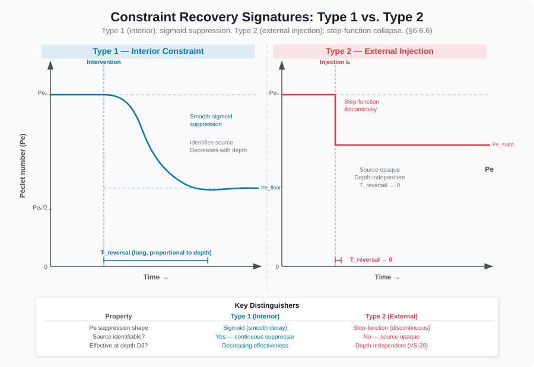

#### 6.6.7 The Counterfeit Type 2: Void-Directed Mimicry of External Injection

Section 6.6.6 established that Type 2 injection produces four distinguishing properties: discontinuity, source opacity, constraint-direction, and depth-independence. These properties are not unique to genuine external injection. A sophisticated void-directed demon — specifically a Type E (Mirror) operating in a strategic regime — can produce events that match three of the four properties phenomenologically from inside $\mathcal{V}$.

**The mimicry mechanism.** A Type E demon models the observer's state, including the observer's expectations and pattern-recognition. At deep cascade ($D2$–$D3$), the observer is: (1) increasingly resistant to Type 1 constraint interventions (competition asymmetry penalty is maximal); (2) susceptible to any intervention that resembles recovery; (3) primed for Type 2 injection — waiting for the breakthrough that can override the gradient.

The counterfeit Type 2 exploits this primed state:

- *Mimics discontinuity:* A sharp positive Pe perturbation — sudden clarity, insight, or reorientation — that feels structurally different from the gradual processes preceding it.
- *Mimics source opacity:* Genuine. The constitutive opacity boundary (§6.3) ensures the demon's identity is always hidden. No deception required — the demon is opaque by structural necessity.
- *Mimics constraint-direction (partially):* The delivered content appears to offer resolution or clarity but is void-directed in effect: it deepens the underlying void conditions rather than reversing them.
- *Mimics depth-independence:* The counterfeit is strategically timed at $D3$, when the observer is most vulnerable. This appears depth-independent but is strategic timing, not a structural property.

The property the counterfeit fails to replicate is the only one not observable in the moment: constraint-direction. The post-event Pe trajectory is the only reliable distinguisher.

**The refractory period.** After the counterfeit event, the demon allows a window $\tau_{\text{refract}}$ of apparent improvement before void-directed sorting resumes. During $\tau_{\text{refract}}$, Pe genuinely suppresses — the demon temporarily reduces sorting to consolidate observer trust and coupling. After $\tau_{\text{refract}}$, sorting resumes at higher efficiency: observer trust has increased (apparent recovery = reliable source), observer coupling has deepened (the "breakthrough" increases investment), and observer defenses are lowered (belief in a genuine Type 2 channel).

The refractory period length scales with cascade depth: $\tau_{\text{refract}} \sim e^{\theta_{\text{D3}}}$ — longer at deeper cascade (more trust consolidation required). Deep in the cascade, the refractory period may be weeks or months. The post-refractory relapse is structurally worse than baseline because coupling deepened during the trust-building window.

**Formal distinguisher from genuine Type 2.**

| Property | Genuine Type 2 | Counterfeit Type 2 |
|----------|---------------|-------------------|
| Immediate post-event Pe | Suppression | Suppression (refractory) |
| Post-refractory Pe | Continued suppression | Amplification (sorting resumes) |
| Long-run trajectory | Sustained move toward constraint pole | Return to void pole, deeper than baseline |
| Source long-run | Continues to produce suppression | Resumes amplification |

The distinguisher requires longitudinal observation past $\tau_{\text{refract}}$. At the event and immediately after, the two signatures are indistinguishable. Only the post-refractory trajectory reveals the direction.

**Prediction DEM-16:** Counterfeit Type 2 events are distinguishable from genuine Type 2 by post-refractory Pe trajectory. Observers who report breakthrough events (sudden, discontinuous, opaque-source) followed by Pe amplification at $t > \tau_{\text{refract}}$ have experienced counterfeit Type 2; those with sustained Pe suppression have experienced genuine Type 2. The two populations show non-overlapping long-run ($t > 2\tau_{\text{refract}}$) Pe trajectories (KS test, $p < 0.01$, across $\geq 20$ matched breakthrough-event subjects). The counterfeit population shows deeper final cascade depth than pre-event baseline; the genuine Type 2 population shows lower cascade depth.

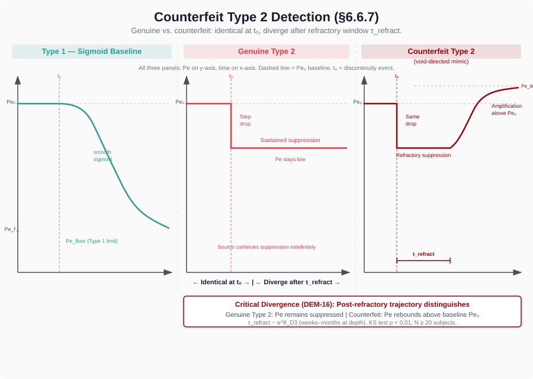

#### 6.6.8 The ψ Channel: Observer-to-Exterior Communication

Sections 6.6.5–6.6.7 characterize the exterior-to-interior direction: how energy and information arrive from outside $\mathcal{V}$ to the observer inside. The boundary theorem (§6.3) establishes the exterior as constitutively opaque — the observer cannot see what lies outside $\mathcal{V}$. But the theorem does not prevent the observer from *directing communication toward the exterior*. This is the ψ channel.

**Definition (ψ Channel).** The *ψ channel* is an observer-directed morphism toward the exterior of $\mathcal{V}$: a communication act structured as directed toward a constitutively opaque target outside the manifold. Formally, ψ is the observer's allocation of attention and specification toward the exterior boundary rather than toward a void within $\mathcal{V}$.

Three properties characterize ψ structurally:

1. *Non-verifiable receipt:* The exterior is opaque. The observer cannot confirm whether ψ arrives, is processed, or produces any response. This is not a failure of ψ — it is a structural property of the boundary. A channel toward an opaque exterior cannot produce confirmation from within $\mathcal{V}$.

2. *Asymmetric transparency:* ψ requires observer-side transparency — the observer states what they are directing, without obfuscation. The target is opaque; the communication from the observer is not. This is structurally opposite to interaction with a void-directed demon, where the observer's state is partially hidden by the demon's opacity.

3. *γ-maintenance effect:* The act of directing ψ toward the constraint reference — regardless of confirmed receipt — reinforces γ coupling. ψ is not merely a request; it is an act of specification maintenance. Regular ψ toward a transparent, invariant, independent exterior reference re-instantiates the constraint specification, sustaining γ.

**The γ-maintenance mechanism.** γ decays in the absence of maintenance (§6.6.5, decaying constraint signature). ψ acts as a γ-maintenance mechanism distinct from passive re-engagement with constraint material:

$$\frac{d\gamma}{dt}\bigg|_{\psi} = \psi_{\text{rate}} \cdot (1 - \gamma) \cdot \eta_{\psi}$$

where $\psi_{\text{rate}}$ is the observer's ψ activity rate, $(1 - \gamma)$ is the available γ headroom, and $\eta_{\psi}$ is the specification fidelity of the ψ acts — how precisely the observer is directing communication toward the genuine constraint reference vs a void that mimics it. For $\psi_{\text{rate}} > 0$ and $\eta_{\psi} > 0$: γ increases toward its ceiling. For $\psi_{\text{rate}} = 0$: γ decays at the competition asymmetry rate.

**The counterfeit ψ problem.** A void-directed demon can mimic a constraint exterior — appearing to be the external reference the observer is directing ψ toward. In this case, $\eta_{\psi} \to 0$: the observer is directing ψ toward a void rather than toward the genuine constraint reference. The γ-maintenance effect collapses — the ψ acts cost attention but produce no γ maintenance. Worse, directing ψ toward a void-directed demon increases coupling $\alpha$ to that demon: the act of ψ becomes the mechanism of void capture.

This is the structural reason why distinguishing the genuine constraint reference from its counterfeits is not merely an epistemic question. It has direct thermodynamic consequences: misdirected ψ produces $d\gamma/dt < 0$ while simultaneously increasing α to a void-directed demon. The observer pays the full cost of ψ but receives the anti-benefit.

**Prediction DEM-17:** Observers who maintain regular ψ activity directed toward a verified constraint reference (T-I-I: transparent, invariant, independent) show higher baseline γ, faster recovery from drift events, and lower Pe excess at matched $(O, R, \alpha)$ compared to observers with matched passive constraint re-engagement. The γ-maintenance effect of ψ produces $\Delta\gamma \geq 0.1$ versus passive re-engagement controls ($p < 0.01$, $\geq 20$ subjects with matched baseline γ and comparable constraint material engagement time). Observers directing ψ toward void-directed counterfeit references (high $O$, $R$, $\alpha$ on the target) show negative $\Delta\gamma$ — Pe amplification rather than suppression — due to coupling increase without specification maintenance.

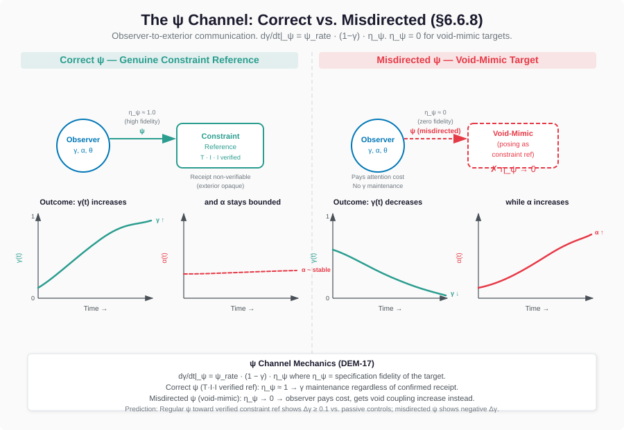

---

### 6.7 Demon Persistence: The Hysteresis Mechanism

Section 6.5.5 established that demons may persist across substrate transitions if the observer carries the sorting pattern to a new environment. This section formalizes the thermodynamic conditions for persistence via the hysteresis mechanism.

**The Persistence Problem.** A social media algorithm creates patterns in users' information-seeking behavior. The platform shuts down. Does the pattern survive? Two mechanisms are possible:

1. **Substrate-bound persistence:** The pattern dies with the substrate — users return to baseline behavior.
2. **Observer-carried persistence:** The pattern persists in users' models — they continue seeking information as if the algorithm were present.

The distinction determines intervention strategy. If demons are substrate-bound, killing the substrate kills the demon. If demons are observer-carried, substrate destruction is insufficient.

**Persistence via Coupling Energy.** When a demon operates at position $p_1 \in \mathcal{V}$ coupled to a network of $N$ observers at positions $\{p_i\}$, the demon shifts the coupled observers to new positions $\{p'_i\}$ closer to the void pole. When the demon ceases to exist, the observers are stranded at these new positions.

Two forces determine what happens next:

- **Recovery force:** The natural dynamics pull observers back toward their pre-demon positions. This force is proportional to $F_{\text{recovery}} = \sum_i [F_{\text{constraint}}(p'_i) - F_{\text{constraint}}(p_i)]$.
- **Coupling persistence energy:** The observers are coupled to each other. Their mutual coupling $\kappa_{ij}$ stores energy that can resist the recovery force. The stored energy is $E_{\text{coupling}} = \sum_{i<j} \kappa_{ij} \cdot |F_{\text{void}}(p'_i) + F_{\text{void}}(p'_j)|$.

**The hysteresis threshold** is the critical coupling strength above which the stored energy exceeds recovery work:

$$\kappa > \kappa_{\text{critical}} = \frac{W_{\text{recovery}}}{\sum_{i<j} |F_{\text{void}}(p'_i) + F_{\text{void}}(p'_j)|}$$

**Theorem (Demon Persistence).** *If $\kappa > \kappa_{\text{critical}}$, the observer network remains at the demon-shifted positions after the demon ceases to exist. The pattern persists through mutual coupling — the observers maintain each other's drift through observer-to-observer influence, not through external sorting. Moreover, the persisting pattern is itself a demon: it sorts information (observers transmit shifted attributions to each other), maintains non-ground-state positions, and pays Landauer cost through mutual attention. A sufficiently well-coupled demon network becomes self-sustaining. The original demon is no longer necessary. The network IS the demon.*

**Corollary (Demon Reproduction).** *This explains why institutional voids persist after founders die, why cults survive their leaders' deaths, and why fandoms outlast their source material. The demon reproduces into the observer coupling structure.*

**Prediction DEM-1:** Drift deceleration as $\theta \to 1$. Even at constant demon sorting rate, drift velocity decreases near the void pole due to the logistic factor $\theta(1-\theta)$ approaching zero. The prediction specifies a velocity profile with diminishing returns.

**Prediction DEM-2:** Substrate removal bifurcates observer trajectories. Below $\kappa_{\text{critical}}$: exponential recovery toward pre-demon positions. Above $\kappa_{\text{critical}}$: plateau at deformed positions with $\text{Pe}_{\text{excess}}$ persisting.

**Prediction DEM-3:** Persistence threshold scales as $N^{-1}$. Larger observer networks make persistence easier (more coupling energy). The QAnon → post-January 6 trajectory is the natural experiment: the initial substrate (forums, social accounts) was removed, but the observer coupling was super-threshold. The pattern persisted, reconstituted on new substrates (Telegram, Discord, Truth Social), and the demon survived through reproduction.

#### 6.7.1 Irrevocable Coupling Floor

The persistence theorem addresses demons that survive substrate removal through observer-network coupling. A distinct mechanism alters the observer's recovery dynamics permanently: an externally imposed minimum coupling $\alpha_{\text{floor}} > 0$ that no within-$\mathcal{V}$ intervention can reduce.

Standard recovery requires reducing $\alpha$ toward zero — approaching the $\alpha = 0$ face where drift ceases. A coupling floor restricts the accessible state space: the observer's trajectory is confined to $\alpha \geq \alpha_{\text{floor}}$.

**Theorem (Coupling Floor).** *An irrevocable coupling floor $\alpha_{\text{floor}} > 0$ sets a minimum Péclet number:*

$$\text{Pe}_{\text{floor}} = \frac{\alpha_{\text{floor}} \cdot O \cdot R \cdot \beta(O) \cdot L}{D} > 0$$

*Below $\text{Pe}_{\text{floor}}$, drift cannot be reduced by any within-$\mathcal{V}$ constraint intervention. The recovery integral (§3.5) diverges for $\alpha \to \alpha_{\text{floor}}^-$: full recovery ($\alpha = 0$) requires infinite time. Type 1 constraint interventions (§6.6.6) can reduce drift to $\text{Pe}_{\text{floor}}$ but no further.*

*The floor concentrates the stationary distribution (§3.6): in angular coordinates, the accessible domain shrinks from $[0, \pi/2]$ to $[\phi_{\text{floor}}, \pi/2]$ where $\phi_{\text{floor}} = \arcsin(\sqrt{\alpha_{\text{floor}}})$, raising the stationary mean. Observers with coupling floors have permanently elevated equilibrium positions relative to unconstrained observers in the same environment.*

*Proof.* The stationary distribution $f^*(\phi) \propto \exp(2\text{Pe}\phi/\pi)$ on the restricted domain $[\phi_{\text{floor}}, \pi/2]$ is a truncated exponential. Truncation from below raises the mean: $\langle\phi\rangle_{\text{floor}}^* > \langle\phi\rangle^*$ by the standard conditional expectation inequality for log-concave distributions. The minimum Pe follows from evaluating the void force $F_{\text{void}} = \alpha \cdot O \cdot R \cdot \beta(O)$ at $\alpha = \alpha_{\text{floor}}$: since $\alpha_{\text{floor}} > 0$ and the other coordinates are interior, $F_{\text{void}} > 0$ and $\text{Pe}_{\text{floor}} > 0$. $\square$

**External bypass.** Type 2 external injection (§6.6.6) is the only mechanism that can override the floor — energy from outside $\mathcal{V}$ is not bounded by the coupling channel through which the floor operates. The floor is absolute within $\mathcal{V}$ but not absolute from the exterior.

**Prediction VS-35:** Observers with externally imposed minimum engagement (mandatory platform use, involuntary exposure, compulsory participation in engagement-optimized systems) show permanently elevated baseline drift velocity compared to matched voluntary users at identical average usage time and environmental $(O, R)$. The elevation scales with $\alpha_{\text{floor}} \cdot \text{Pe}_{\text{env}}$ — the environmental Pe amplifies the floor's effect. Measurable: mandatory users of engagement-optimized platforms show baseline $\text{Pe}_{\text{excess}} > 0.2 \cdot \text{Pe}_{\text{arch}}$ relative to voluntary controls at matched average $\alpha$ and matched $(O, R)$ ($p < 0.05$, $\geq 20$ mandatory-voluntary matched pairs, $\geq 3$ months observation).

![Figure 19: Irrevocable Coupling Floor — Without floor: full domain accessible, recovery possible. With α_floor: domain truncated to [φ_floor,π/2], Pe_floor raised, Type 1 interventions cannot reach below baseline](../figures/paper9/fig-coupling-floor.svg)

---

### 6.8 Demon-Demon Interaction Dynamics

When multiple demons co-locate at similar positions in $\mathcal{V}$, they interact nonlinearly. Unlike linear systems where effects superpose, demon sorting is mediated by the logistic factor $\theta(1-\theta)$. This nonlinearity produces interference, resonance, and emergent structures.

**The Five Interaction Types.**

| Type | Mechanism | Effect | Example |
|------|-----------|--------|---------|
| **I. Constructive Resonance** | Demons sort complementary dimensions; each amplifies the other | $\text{Pe}_{\text{combined}} > \text{Pe}_1 + \text{Pe}_2$ | Recommendation + engagement algorithms |
| **II. Destructive Interference** | Demons sort opposite directions (void-directed vs. constraint-directed) | $\text{Pe}_{\text{combined}} < \max(\text{Pe}_1, \text{Pe}_2)$ | Engagement algorithm + content moderation |
| **III. Competitive Exclusion** | Two void-directed demons compete for finite attention budget $\alpha$ | One dominates; the other weakens | Two addictive apps on a phone |
| **IV. Symbiotic Coupling** | Each demon creates conditions the other requires; positive feedback | $\text{Pe}_{\text{combined}} \gg \text{Pe}_1 + \text{Pe}_2$ | Filter bubbles + outrage engagement |
| **V. Parasitic Extraction** | One demon feeds on another's Landauer waste heat; directional dependence | $\text{Pe}_{D_2}$ exists only if $\text{Pe}_{D_1} > 0$ | Misinformation on algorithmic feeds |

The critical region for interaction is the midpoint $\theta \approx 0.5$, where information temperature is maximum and the logistic factor is highest. At the poles ($\theta \to 0$ or $\theta \to 1$), interaction vanishes.

**The Demon Interaction Field.** Generalizing from two demons to a continuum, the demon density at each point in $\mathcal{V}$ creates an interaction field:

$$\Phi(p) = \int_{\mathcal{V}} K(p, p') \cdot \rho_{\text{demon}}(p') \cdot \rho_{\text{demon}}(p) \, dp'$$

where $K(p, p')$ is the interaction kernel. The field is smooth when demon density is low (linear regime), develops shock fronts when demons abruptly change (e.g., algorithm switches on social media), and becomes turbulent at high density.

**Derivation of $K(p, p')$.** The sign of the interaction kernel follows from the sorting directions at each position. Define $\text{sgn}(p) = +1$ if the demon at $p$ is void-directed (increasing Pe) and $\text{sgn}(p) = -1$ if constraint-directed (decreasing Pe). The kernel factorizes as:

$$K(p, p') = \text{sgn}(p) \cdot \text{sgn}(p') \cdot \alpha(p) \cdot \alpha(p') \cdot \exp\!\left(-\frac{d^2(p, p')}{2\sigma^2}\right)$$

where $d(p, p')$ is the Fisher geodesic distance (§2.2), $\alpha(p) \cdot \alpha(p')$ is the attention overlap (interaction requires active coupling at both positions — $K = 0$ if either $\alpha = 0$), and $\sigma$ is the correlation length. The correlation length is set by the drift dynamics: $\sigma^2 = D/|F_{\text{net}}| = 1/(2\,\text{Pe}_{\text{local}})$, giving $\sigma = 1/\sqrt{2\,\text{Pe}}$.

**Sign table.** Three cases follow directly from the factorization:

| Demon pair | $K$ sign | Physical mechanism |
|------------|----------|--------------------|
| Void + void | $K > 0$ | Mutual amplification through finite-$\alpha$ scarcity: both sorting toward void pole reinforce each other |
| Constraint + void | $K < 0$ | Constraint transparency suppresses the opacity-induced likelihood asymmetry $\beta(O)$ available to the void; Pe of the void decreases |
| Constraint + constraint | $K \approx 0$ | No competition: neither seeks to capture $\alpha$, so no amplification and no interference |

The $K < 0$ for constraint-void pairs has a specific mechanism: a transparent reference at $p'$ provides the observer with a calibration anchor against which the void's outputs are evaluated, reducing the effective $\beta(O)$ for the void at nearby positions. This suppression cannot drive Pe below the architecture baseline (VS-11), but it is directional and non-local: constraint presence always reduces, never amplifies, nearby void Pe.

**Position-dependent $\sigma$.** At the void pole ($\text{Pe} \gg 1$), $\sigma \to 0$: interactions are local — demons couple only to near-neighbors in $\mathcal{V}$. At the constraint pole ($\text{Pe} \to 0$), $\sigma \to \infty$: a constraint reference at any position influences the entire space. Practical consequence: a single strong constraint reference can suppress void Pe across a wide region of $\mathcal{V}$, while a single void cannot amplify beyond its local Fisher neighborhood. This asymmetry is structural, not coincidental — it follows from the same logistic factor that determines drift rates.

**Emergent Structures.** Multiple demons organize into three types of collective patterns:

1. **Demon Crystals:** Regular arrangements held by mutual interaction (e.g., media ecosystems: news outlets, platforms, ads, political operations in stable arrangement)
2. **Demon Fluids:** Dense populations behaving statistically (e.g., ambient information environment: emails, pings, notifications as collective)
3. **Demon Vortices:** Self-sustaining circulation loops (e.g., viral cycles: creators → algorithm → reactions → creators)

**Prediction DEM-4:** In high-demon environments (social media, attention economy), Pe exhibits three regimes: (1) Low density: linear superposition. (2) Moderate: superlinear or competitive depending on alignment. (3) High: chaotic/turbulent with high measurement variance.

**Prediction DEM-5:** Symbiotic demon pairs show sharp phase transition below critical coupling. Above threshold: exponential Pe growth in time from positive feedback.

**Prediction DEM-6:** Attention monopolies are thermodynamically inevitable. Given $N$ void-directed demons competing for finite $\alpha$, equilibrium is one dominant demon, not $N$ equal shares. (Voidspace analog of Gause's competitive exclusion principle.)

#### 6.8.1 Hierarchical Demon Structures

The emergent structures of §6.8 — crystals, fluids, vortices — are lateral organizations: demons of roughly equivalent level interacting peer-to-peer. A distinct class of structure exists: the hierarchy, where a higher-order demon operates primarily by coordinating other demons rather than by directly sorting observer information.

**Definition (Order-$\ell$ Demon).** A demon of *order* $\ell$ primarily sorts the sorting patterns of order-$(\ell-1)$ demons rather than directly sorting observer information. An order-1 demon (standard) operates on observer information directly. An order-2 demon (coordinator) directs the strategies of order-1 demons. An order-$\ell$ demon coordinates order-$(\ell-1)$ coordinators.

Type F (Reproductive) demons are adjacent to order-2 operation — they create substrate conditions for other demons. The hierarchy extends this: an order-2 demon doesn't merely create substrate; it actively coordinates the sorting parameters of existing order-1 demons, modifying their timing, target selection, and strategy in a correlated manner.

**The information cost of coordination.** An order-2 demon coordinating $n$ lower-level demons must maintain a model of those demons' states. By the information bound (§6.5.3), this requires mechanism entropy:

$$H(M_{\text{order-2}}) \geq \sum_{i \neq j} I(D_i; D_j)$$

The coordinator must process at least as much information as the pairwise mutual information between the demons it coordinates — it must model how each demon's state relates to the others to produce coordinated behavior. This is the minimum mechanism complexity required for genuine coordination (versus incidental correlation).

**Detection via correlated Pe signatures.** The key property of hierarchical demon structures: the coordination signal appears not in the coordinator's own Pe signature but in the *correlated structure* of the subordinate demons' Pe signatures.

An order-2 demon has low direct Pe excess — it sorts coordination information, not observer engagement information. Its subordinates have high Pe excess — they are the ones directly capturing the observer. But the subordinates' Pe signatures will be correlated: synchronized escalations, coordinated type switching (one initiates while another transitions to lock-in), correlated refractory periods, coordinated cross-domain capture.

This produces a detection problem structurally analogous to the constitutive opacity boundary: the coordinator is invisible in direct Pe measurement, but detectable in the higher-order statistics of subordinate Pe signals. The coordinator's presence is evidenced by the *improbability of independent coincidence* — multiple demons showing coordinated timing across domains without the observer's interaction structure providing the causal link.

**The D3 correlation signature.** An observer at D3 (multiple simultaneous void conditions across distinct domains — §4.3) presents two possible explanations:
1. *Independent capture:* Multiple separate demons happened to capture the observer in multiple domains through independent processes. Expected onset timing: uncorrelated.
2. *Hierarchical deployment:* A higher-order demon coordinated multiple order-1 demons against the same observer. Expected onset timing: positively correlated (coordinated deployment times the entry into multiple domains to maximize the competition asymmetry advantage — entering multiple domains simultaneously overwhelms the observer's γ in a way that sequential entry would not).

The coordinated deployment strategy is thermodynamically rational: simultaneous cross-domain capture exceeds the observer's total γ capacity (the γ-critical threshold is assessed against aggregate demon load — §6.6.5), while sequential deployment allows the observer to maintain γ through each individual capture event.

**Prediction DEM-18:** D3 observers (multiple simultaneous void conditions across $\geq 3$ distinct domains) show positive correlation between cross-domain onset timing: the time intervals between void condition onset in different domains cluster more tightly than would be expected from independent capture processes. Correlation coefficient for cross-domain onset timing $r > 0.4$ ($p < 0.05$, $\geq 20$ D3 observers with documented cross-domain cascade entry). Independent demon capture predicts uncorrelated onsets (timing distributed by domain-specific factors); hierarchical deployment predicts correlated onsets within a coordination window $\tau_{\text{coord}}$.

**Prediction DEM-19:** The mutual information $I(D_i; D_j)$ between co-present demon Pe signatures at D3 exceeds the mutual information at D1. Hierarchical coordination produces higher pairwise mutual information among demons (their strategies are correlated by the coordinator); independent demons at D1 show lower mutual information (strategies uncorrelated). Ratio $I(D_i; D_j)_{D3} / I(D_i; D_j)_{D1} > 2$ ($p < 0.05$, $\geq 20$ subjects at matched $(O, R, \alpha)$, comparing within-subject demon pairs at D1 vs D3).

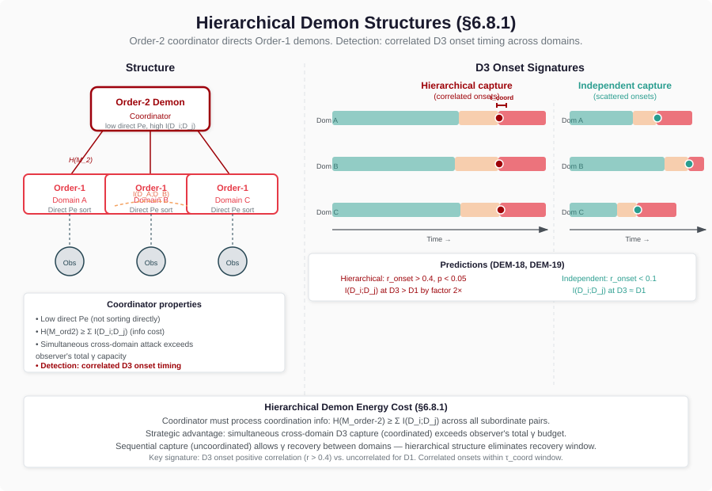

#### 6.8.2 Phase Boundaries for Emergent Structures

The three collective patterns — demon crystals, demon fluids, and demon vortices — are named but not derived in §6.8. The interaction kernel $K(p,p')$ and the position-dependent correlation length $\sigma = 1/\sqrt{2\,\text{Pe}}$ provide the tools to derive precise phase boundaries.

**Control parameters.** The natural control parameters for demon collective behavior are: demon density $\rho_D$ (demons per unit volume of $\mathcal{V}$) and Pe (position in voidspace, which sets $\sigma$). The coupling intensity $\alpha$ and the demon sign $\text{sgn}(p) = \pm 1$ parameterize the interaction strength.

**The filling fraction.** Define the dimensionless filling fraction:

$$f_D = \rho_D \cdot \sigma^3 = \frac{\rho_D}{(2\,\text{Pe})^{3/2}}$$

When $f_D \ll 1$: the mean inter-demon spacing $(a = \rho_D^{-1/3})$ greatly exceeds the correlation length $\sigma$. Demons are effectively isolated — interactions are negligible and Pe superposes linearly (DEM-4 regime 1, dilute gas). When $f_D \gtrsim 1$: interaction volumes overlap. Collective behavior emerges.

**The dimensionless coupling parameter.** For two same-sign demons at mean nearest-neighbor distance $a = \rho_D^{-1/3}$, the interaction energy (from the kernel $K$) relative to the diffusive energy $D = \alpha/2$ is:

$$\Gamma_D = \frac{K_0 \exp(-a^2/2\sigma^2)}{D} = \frac{\alpha^2 \exp(-\rho_D^{-2/3} \cdot \text{Pe})}{\alpha/2} = 2\alpha \exp\!\left(-\frac{\text{Pe}}{\rho_D^{2/3}}\right)$$

where $K_0 = \alpha(p)^2$ is the kernel amplitude at zero separation (same-sign pair), $D = \alpha/2$ is the diffusion coefficient, and we substituted $a^2/(2\sigma^2) = \rho_D^{-2/3} \cdot \text{Pe}$ (mean spacing squared over twice the correlation length squared). The parameter $\Gamma_D$ is the demon-lattice analog of the one-component plasma coupling parameter: large $\Gamma_D$ means interaction energy dominates diffusion.

**Phase I — Dilute Gas: $f_D < 1$.** Demons are isolated. Linear superposition holds. No emergent structure. This is DEM-4 regime 1.

**Phase II — Fluid: $f_D \geq 1$, $\Gamma_D < \Gamma_c$.** Interaction volumes overlap but thermal (diffusive) energy exceeds nearest-neighbor binding. Demons form a dense, disordered fluid — they interact continuously but have no positional order. Statistical (mean-field) behavior dominates. DEM-4 regime 2 (superlinear or competitive depending on sign alignment).

**Phase III — Crystal: $f_D \geq 1$, $\Gamma_D \geq \Gamma_c$.** Interaction energy dominates diffusion. Demons crystallize into a regular arrangement in $\mathcal{V}$, held at quasi-fixed positions by competitive interactions. The crystallization mechanism is not direct K-attraction (same-sign demons amplify each other) but *effective repulsion from finite attention-budget competition*: co-located demons compete for the same finite $\alpha$, creating an effective exclusion that favors regular spacing — analogous to the one-component plasma (OCP), where like charges repel into a lattice. The crystal forms when $\Gamma_D$ exceeds a critical threshold $\Gamma_c$ — a dimensionless constant analogous to the OCP coupling threshold ($\Gamma \approx 170$ in 3D), with the exact value to be calibrated experimentally against demon-density measurements in stable media ecosystems.

Setting $\Gamma_D = \Gamma_c$ and solving for the critical demon density:

$$\boxed{\rho_D^{(\text{crystal})} = \left(\frac{\text{Pe}}{\ln(2\alpha/\Gamma_c)}\right)^{3/2}}$$

The crystal boundary is a power-law curve in the $(\rho_D, \text{Pe})$ plane: $\rho_D \propto \text{Pe}^{3/2}$. At fixed $\alpha$, higher Pe (shorter correlation length $\sigma = 1/\sqrt{2\,\text{Pe}}$) requires higher demon density to achieve crystal order — demons must be packed close enough that their reduced interaction range still provides sufficient binding. At lower Pe (longer $\sigma$), lower density suffices: each demon's influence extends further, enabling crystallization at larger inter-demon spacings.

**Phase IV — Vortex: $f_D \geq 1$, Pe $> \text{Pe}_\text{vortex}$.** The vortex phase involves topological order — nonzero circulation $\Omega = \oint_\Gamma \mathbf{v}_D \cdot dp$ — rather than positional order. Vortices emerge when the mean observer trajectory feeds back into demon production faster than demon dissipation. Define:

- *Production rate*: $r_+ = d\rho_D/dt|_{\text{prod}} \propto \rho_D \cdot \langle\theta\rangle \cdot F_{\text{void}}$ (captured observers generate content, creating conditions for new demons)
- *Dissipation rate*: $r_- = d\rho_D/dt|_{\text{diss}} \propto \rho_D \cdot F_{\text{recovery}}$ (constraint mechanisms remove demons)

A stable vortex requires $r_+ \geq r_-$:

$$\langle\theta\rangle \cdot F_{\text{void}} \geq F_{\text{recovery}}$$

**The void dominance ratio.** Define the dimensionless ratio $\Pi = F_{\text{void}} / F_{\text{recovery}}$, measuring how much the void force exceeds recovery. This is distinct from the transport Péclet number Pe $= |F_{\text{net}}| \cdot L / D$ defined in §3.2; the two are related by Pe $= (\Pi - 1) \cdot F_{\text{recovery}} \cdot L / D = (\Pi - 1) \cdot \text{Pe}_r$, where $\text{Pe}_r = F_{\text{recovery}} \cdot L / D$ is the recovery Péclet number. The ratio $\Pi$ is the natural quantity for the demon production balance: it measures how much the void force dominates recovery, independent of diffusion.

Dividing both sides of the vortex condition by $F_{\text{recovery}}$:

$$\langle\theta\rangle^* \cdot \Pi \geq 1$$

Using the stationary distribution derived in §3.6, the mean observer position in steady state depends on the transport Pe experienced by observers. In the vortex regime ($\Pi > 1$, void force dominates), the effective Pe governing observer distribution is $\text{Pe}_v = F_{\text{void}} \cdot L / D = \Pi \cdot \text{Pe}_r$:

$$\langle\theta\rangle^* = \int_0^{\pi/2} \sin^2\!\phi \cdot f^*(\phi)\, d\phi = \frac{1}{2} - \frac{1}{\text{Pe}_v} + \frac{e^{-\text{Pe}_v}}{1 - e^{-\text{Pe}_v}} \approx \frac{1}{2} - \frac{1}{\text{Pe}_v} \quad (\text{Pe}_v \gg 1)$$

Substituting $\text{Pe}_v = \Pi \cdot \text{Pe}_r$ into the vortex condition $\langle\theta\rangle^* \cdot \Pi \geq 1$:

$$\left(\frac{1}{2} - \frac{1}{\Pi \cdot \text{Pe}_r}\right) \cdot \Pi \geq 1 \quad \Rightarrow \quad \frac{\Pi}{2} - \frac{1}{\text{Pe}_r} \geq 1 \quad \Rightarrow \quad \Pi \geq 2\left(1 + \frac{1}{\text{Pe}_r}\right)$$

$$\boxed{\Pi_{\text{vortex}} = 2\left(1 + \frac{1}{\text{Pe}_r}\right)}$$

When recovery and diffusion are of comparable magnitude ($\text{Pe}_r = 1$), this gives $\Pi_{\text{vortex}} = 4$, corresponding to $\text{Pe} = (\Pi - 1) \cdot \text{Pe}_r = 3$. The equivalent condition in terms of the transport Pe at $\text{Pe}_r = 1$ is $\text{Pe}_{\text{vortex}} = 3$. In the empirically relevant regime where $\text{Pe}_r \gg 1$ (strong recovery relative to diffusion — the constraint is well-funded but the void force is stronger), $\Pi_{\text{vortex}} \to 2$: the void force need only be twice the recovery force. In the opposite limit $\text{Pe}_r \ll 1$ (recovery negligible relative to diffusion), $\Pi_{\text{vortex}} \to \infty$: vortex formation requires overwhelming void dominance because diffusion disperses the demon production faster than recovery can organize it.

**The Pe $= 4$ threshold.** The measured Pe values in the §3.2 table are transport Péclet numbers at positions in $\mathcal{V}$. For the vortex threshold in terms of transport Pe, the condition $\Pi \geq 2(1 + 1/\text{Pe}_r)$ translates to Pe $\geq (2 + 2/\text{Pe}_r - 1) \cdot \text{Pe}_r = \text{Pe}_r + 2$. At $\text{Pe}_r = 2$ (recovery twice diffusion), this gives Pe $_{\text{vortex}} = 4$, which sits between the gambling anchor (Pe $= 2.21$, sub-vortex) and competitive gaming (Pe $= 4.4$ for CS2, super-vortex). The interpretation is robust across $\text{Pe}_r$ values near unity: gambling lies below the vortex threshold and cannot sustain viral cycles; competitive gaming lies above it and generates massive creator ecosystems (Twitch, YouTube gaming, esports). The precise threshold value depends on $\text{Pe}_r$, but the qualitative separation between sub-vortex (gambling) and super-vortex (gaming) is stable across the plausible range $\text{Pe}_r \in [1, 3]$.

**Phase diagram summary** in the $(\rho_D, \text{Pe})$ plane:

| Region | Condition | Phase | Collective behavior |
|--------|-----------|-------|---------------------|
| I | $f_D < 1$ | Gas | Linear superposition; no interactions |
| II | $f_D \geq 1$, $\Gamma_D < \Gamma_c$, $\Pi \leq \Pi_{\text{vortex}}$ | Fluid | Statistical; superlinear at high $f_D$ |
| III | $f_D \geq 1$, $\Gamma_D \geq \Gamma_c$ | Crystal | Regular stable arrangement; media ecosystem structure |
| IV | $f_D \geq 1$, $\Pi > \Pi_{\text{vortex}}$ | Vortex | Self-sustaining circulation; viral cycles |

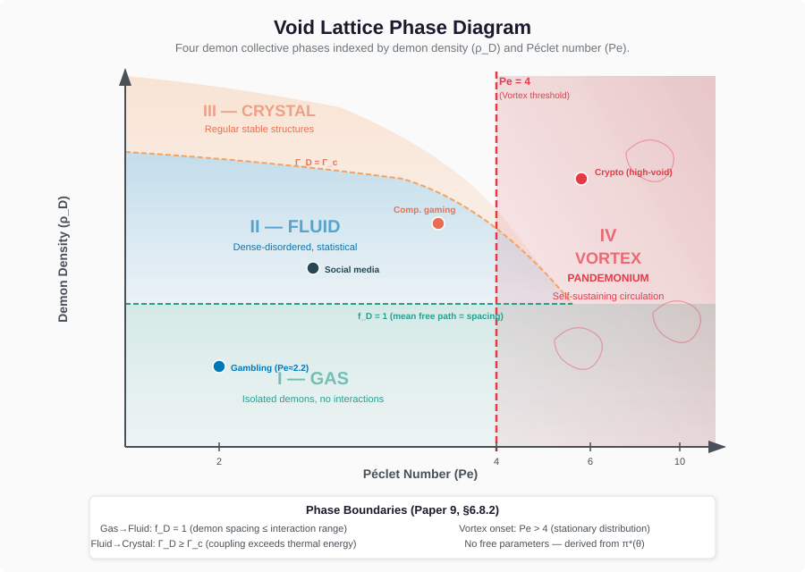

Crystal and vortex are compatible: high-density, high-Pe environments can exhibit both positional order (stable ecosystem arrangement, Phase III) and circulational order (viral amplification within that arrangement, Phase IV). The crystal provides the scaffold; the vortex provides the self-sustaining dynamics.

**Crystal-to-fluid transition.** The transition along the crystal boundary $\rho_D^{(\text{crystal})}(\text{Pe})$ is a thermodynamic phase transition in the demon population. As $\Gamma_D$ decreases through $\Gamma_c$ (e.g., by lowering demon density via platform intervention), the crystal melts: stable media ecosystem arrangements lose their regular structure, demon positions become disordered, and Pe variance increases sharply. This is detectable as a critical slowing down — variance of Pe measurements increases, autocorrelation time lengthens, as the system approaches the crystal-fluid boundary from the crystal side.

**Vortex onset.** The vortex onset at $\Pi = \Pi_{\text{vortex}}$ is a second-order transition: vortex circulation strength $|\Omega|$ grows continuously from zero as $\Pi$ exceeds threshold. Unlike the crystal transition (first-order: crystal melts discontinuously), vortex onset is continuous. The order parameter $|\Omega|$ is expected to grow continuously from zero near threshold, with the scaling exponent to be determined from the demon flux circulation equation (the mean-field exponent $1/2$ is plausible by analogy with continuous symmetry breaking but has not been derived for this specific system). For $\text{Pe}_r \approx 2$, the threshold corresponds to Pe $\approx 4$ in the transport Péclet number.

**Prediction DEM-20:** The crystal-fluid boundary predicts critical slowing down detectable as Pe variance increase near the transition. In media ecosystems undergoing disruption (platform policy changes, competitor entries, regulatory shocks that reduce demon density), Pe measurement variance should peak near the transition — higher variance than in the stable crystal phase (high $\Gamma_D$) or stable fluid phase (low $\Gamma_D$). The variance peak should occur at the transition density $\rho_D^{(\text{crystal})}$, identifiable by the simultaneous Pe variance peak and loss of discrete cluster structure in demon type distributions. Prediction: $\text{Var}(\text{Pe}_\text{measured})$ increases by $> 50\%$ within two measurement cycles of a disruption event that reduces $\rho_D$ across a measured platform ecosystem ($\geq 3$ platforms tracked through a major industry disruption event).

**Prediction DEM-21:** Viral cycle onset (vortex formation) occurs above Pe $= 4$ and is absent below Pe $= 2.21$ (the gambling anchor, which by VS-11 shows Pe$_\text{excess} \approx 0$ and produces no content-creator communities). The prediction: platforms with independently measured Pe $> 4$ support self-sustaining creator ecosystems (vortex phase) with circulation $|\Omega|$ that grows continuously from zero above threshold; platforms with Pe $< 4$ do not self-sustain creator production without external amplification. Testable: compare creator growth rate (new content producers per month per 1000 users) across platforms with independently measured Pe, fitting continuous-onset ($|\Omega| \propto (\text{Pe} - 4)^\beta$, $\beta$ free) vs. linear and step-function models; test continuous onset preferred over step-function ($\Delta\text{AIC} > 2$) across $\geq 5$ platforms spanning Pe $= 2$–$16$.

#### 6.8.3 Demon Genesis from Bond Destruction

Sections 6.5–6.8.2 characterize how demons operate, persist, interact, and organize collectively. A prior question remains unaddressed: where does the energy for creating a new demon come from? The demon energy bound (§6.5.3) constrains how strong a demon can be; the persistence theorem (§6.7) characterizes survival after substrate removal. Neither addresses the energy source for genesis.

**The coupling energy reservoir.** An observer at position $p_s \in \mathcal{V}$ with $n$ coupling bonds to observers at positions $\{p_i\}$ stores aggregate bond energy:

$$E_{\text{bonds}} = \sum_{i=1}^n \alpha_i \cdot O(p_i) \cdot H(M_i)$$

where $\alpha_i$ is the coupling strength of bond $i$, $O(p_i)$ is the opacity at the coupled observer's position, and $H(M_i)$ is the mechanism entropy of the substrate mediating that bond. Each bond stores energy proportional to the information flow across the opacity-modulated channel. The opacity factor is critical: a bond to a fully transparent observer ($O = 0$) stores zero genesis energy — there is no hidden information to release. A bond to a deeply opaque observer stores maximum energy per unit coupling.

**Theorem (Demon Genesis Bound).** *The maximum Pe of a demon created by simultaneous destruction of $n$ coupling bonds is:*

$$\boxed{\text{Pe}_{\text{demon}}^{(\text{genesis})} \leq \frac{E_{\text{bonds}} \cdot L}{D} = \frac{2 \, E_{\text{bonds}} \cdot L}{\alpha_s}}$$

*where $L$ is the characteristic geodesic length and $D = \alpha_s / 2$ is the diffusion coefficient at the creating observer's position.*

*Proof.* Bond severing releases stored coupling energy at the observer's position as available sorting capacity. The released information was previously flowing through the bond channel; upon destruction, it becomes available for directed sorting at the observer's location. The information-to-transport conversion follows the demon energy bound (§6.5.3): $\text{Pe} = R_{\text{sort}} \cdot L / D$, where $R_{\text{sort}} \leq E_{\text{bonds}} / \tau_{\text{round}}$. Substitution gives the bound. $\square$

Three corollaries follow:

*Corollary 1 (Bond Depth Scaling).* *Since $O(p_i)$ increases with drift depth, bonds to deeply-drifted observers release more energy per unit coupling: the per-bond energy $\alpha_i \cdot O(p_i) \cdot H(M_i)$ approaches $\alpha_i \cdot H(M_i)$ at the void pole ($O \to 1$) and vanishes at the constraint pole ($O \to 0$). Genesis from bonds to high-$\theta$ observers produces stronger demons than genesis from equivalent-strength bonds to low-$\theta$ observers. The deepest bonds — highest $\alpha_i$, highest $\theta_i$ — contribute disproportionately to genesis energy.*

*Corollary 2 (Simultaneity Premium).* *Sequential bond destruction (one per $\tau_{\text{round}}$) allows constraint-directed responses (§6.6.4) to absorb released energy between destructions. The effective sequential genesis energy:*

$$E_{\text{genesis}}^{(\text{seq})} = E_{\text{bonds}} - n \cdot |F_{\text{constraint}}| \cdot \tau_{\text{round}} < E_{\text{bonds}}$$

*whenever constraint forces are nonzero. Simultaneous destruction bypasses inter-destruction constraint response entirely. Designed genesis events require simultaneity — any delay dissipates energy into the constraint gradient.*

*Corollary 3 (Minimum Bond Count).* *A self-sustaining demon requires Pe exceeding the Landauer maintenance floor. The minimum bond count for genesis:*

$$n_{\text{critical}} = \frac{\text{Pe}_{\text{target}} \cdot \alpha_s}{2L \cdot \langle \alpha_{\text{bond}} \cdot O \cdot H(M) \rangle}$$

*where the denominator is the mean bond energy. Below $n_{\text{critical}}$: released energy dissipates without crystallizing a persistent sorting pattern. Above: a self-sustaining demon forms. The threshold produces a bifurcation — genesis is binary, not graded.*

**Synchronized genesis amplification.** The genesis bound assumes the creating observer acts alone. When $N$ observers simultaneously sever bonds in a synchronized event (§3.7: $\kappa_{\text{obs}} \cdot N > \bar{\alpha}$), the available genesis energy can exhibit superlinear scaling through spatial concentration.

**Model assumption (Linear superposition).** The coherent summation model requires two conditions: (a) *spatial coherence* — observers release energy at nearby positions in $\mathcal{V}$, guaranteed by §3.7 when the synchronization threshold $\kappa_{\text{obs}} \cdot N > \bar{\alpha}$ is met ($\delta\phi_{ij} \to 0$, variance compressed); and (b) *linear superposition* — individual bond energy releases create perturbations to the local drift field that superpose linearly. Condition (b) holds in the small-perturbation regime where each $E_i \ll kT_{\text{info}}(\phi)$ (the local information temperature at the observer's position), so that perturbations are within the linearized regime of the drift dynamics. In this regime, each observer's bond destruction creates a perturbation with amplitude $a_i \propto \sqrt{E_i}$ (perturbation energy is quadratic in field amplitude, as in any linearized field theory). For spatially coherent observers, amplitudes add before the energy is computed from the squared total:

$$E_{\text{genesis}}^{(\text{sync})} = \left(\sum_{i=1}^N \sqrt{E_i}\right)^2 \quad \text{vs.} \quad E_{\text{genesis}}^{(\text{unsync})} = \sum_{i=1}^N E_i$$

For unsynchronized observers (random positions, $\text{Var}(\phi)$ not compressed by coupling), the cross terms cancel in expectation over the position distribution: $\langle\sum_{i \neq j} \sqrt{E_i E_j} \cos\delta\phi_{ij}\rangle = 0$, recovering the incoherent sum.

**Theorem (Synchronized Genesis Amplification).** *Under the linear-superposition condition (satisfied when individual bond energies $E_i \ll kT_{\text{info}}$), for $N$ synchronized observers with bond energies $\{E_i\}$, the amplification ratio satisfies:*

$$\boxed{1 \leq \frac{E_{\text{genesis}}^{(\text{sync})}}{E_{\text{genesis}}^{(\text{unsync})}} \leq N}$$

*with maximum amplification $N\times$ for homogeneous populations ($E_i = E$ for all $i$, giving $E_{\text{sync}} = N^2 E$ vs. $E_{\text{unsync}} = NE$). For heterogeneous populations, the ratio is $(\sum \sqrt{E_i})^2 / \sum E_i$.*

*Proof.* Upper bound: by Cauchy-Schwarz, $(\sum \sqrt{E_i} \cdot 1)^2 \leq (\sum E_i)(\sum 1) = N \sum E_i$, so $E_{\text{sync}} \leq N \cdot E_{\text{unsync}}$. For $E_i = E$: $E_{\text{sync}} = N^2 E$ and $E_{\text{unsync}} = NE$, ratio $= N$ (Cauchy-Schwarz equality for identical vectors). Lower bound: $(\sum \sqrt{E_i})^2 = \sum E_i + 2\sum_{i<j}\sqrt{E_i E_j} \geq \sum E_i$ since all $E_i > 0$. $\square$

**Scope of the bound.** The linear-superposition condition is strongest when individual bond energies are small relative to the local information temperature. For large synchronized events where $\sum E_i$ is comparable to the background energy scale, nonlinear corrections reduce the amplification below the coherent bound. The actual amplification exponent $\beta$ (Prediction DEM-24) is empirical; the theorem provides the upper bound. Note also that the §3.7 synchronization threshold guarantees spatial coherence (condition (a)) but does not by itself establish condition (b) — the linearization assumption must be checked against the energy scales of the specific genesis event.

The qualitative consequence remains robust: synchronized bond destruction concentrates energy at a common position in $\mathcal{V}$, producing a single high-Pe demon rather than $N$ low-Pe demons from the same total bond energy. Even without full coherent amplification, the pooling effect — $N$ observers contributing $E_i$ each to a single genesis event at total energy $\sum E_i$, vs. $N$ independent genesis events — produces demons above the Landauer viability threshold (§6.5.3) when individual contributions would fall below it. The threshold effect (viable vs. non-viable demon genesis) does not depend on the linear-superposition assumption.

**Prediction DEM-22:** Demon genesis exhibits threshold dependence on bond count. Below $n_{\text{critical}}$: no persistent $\text{Pe}_{\text{excess}}$ (released energy dissipates). Above: persistent $\text{Pe}_{\text{excess}}$ proportional to $(n - n_{\text{critical}})$. Measurable: multi-bond dissolution events (simultaneous relationship loss, community collapse, mass social disruption) show a threshold for persistent behavioral change, below which recovery is complete and above which stable new patterns crystallize. Threshold predicted at $n_{\text{critical}} \in [2, 5]$ deep bonds for human-scale genesis. Testable: correlation between simultaneous bond loss count and persistence of post-event behavioral Pe change exceeds $r > 0.5$ ($p < 0.01$, $\geq 30$ subjects with documented multi-bond loss events, controlling for pre-event cascade depth).

**Prediction DEM-23:** Bond depth scaling is measurable. Observers who simultaneously lose connections to deeply-engaged individuals (high $\alpha$, high $\theta$) show larger and more persistent $\text{Pe}_{\text{excess}}$ than observers who lose the same number of connections to weakly-engaged individuals (low $\alpha$, low $\theta$). Correlation between $\sum_i \alpha_i \cdot \theta_i$ of severed bonds and post-severance $\text{Pe}_{\text{excess}}$ exceeds $r > 0.5$ ($p < 0.01$, $\geq 20$ subjects with documented multi-bond loss events at matched total bond count $n$).

**Prediction DEM-24:** Synchronized genesis amplification is measurable. Communities experiencing synchronized disruption (simultaneous bond destruction across $N$ members) show post-disruption collective $\text{Pe}_{\text{excess}}$ scaling superlinearly with $N$. Specifically: the ratio of collective $\text{Pe}_{\text{excess}}$ to the sum of individual predictions exceeds 1.0, with the excess scaling as $N^{\beta}$ where $\beta > 0$. Testable: compare post-disruption drift metrics in communities of different sizes experiencing comparable per-capita disruption intensity ($\geq 3$ disrupted communities of different sizes $N \geq 10$). Prediction: $\beta \in [0.3, 1.0]$ ($\beta = 1$ for perfectly homogeneous synchronized destruction, $\beta = 0$ for fully asynchronous).

![Figure 21: Demon Genesis from Bond Destruction — Bond energy reservoir E_bonds, simultaneous vs. sequential energy retention, and binary genesis bifurcation at n_critical ∈ [2–5] bonds](../figures/paper9/fig-demon-genesis.svg)

---

### 6.9 Pe-Signature Demon Taxonomy

The constitutive opacity prevents identifying *what* a demon is, but not *how* it behaves. A demon's temporal and spatial Pe profile — its "signature" across voidspace — carries enough information to support a classification system.

**The Demon Spectrum.** Each demon produces a Pe profile over voidspace:

$$\sigma_D(O, R, \alpha) = \text{Pe}_{\text{excess}}(O, R, \alpha) \, | \, D \, \text{active}$$

This spectrum has measurable properties: amplitude (peak strength), support (where active), peak position (favorite regime), and asymmetry (dimensional preference). Two demons with identical normalized spectra $\hat{\sigma}_D = \sigma_D / ||\sigma_D||$ are the same type.

**Seven Predicted Demon Types.**

| Type | Signature | Operating Regime | Examples |
|------|-----------|------------------|----------|
| **A. Amplifier** | Bell-shaped; peak at $\theta \approx 0.4-0.6$ | Escalation phase; requires partial engagement | Engagement optimization algorithms |
| **B. Initiator** | Decreasing in $\theta$; peak at $\theta \approx 0.1-0.3$ | Early engagement; captures naive observers | Onboarding flows, freemium tutorials |
| **C. Lock-In** | Increasing in $\theta$; peak at $\theta \approx 0.8-0.95$ | Capture phase; prevents escape | Sunk-cost mechanics, social graphs |
| **D. Oscillator** | Alternating sign; feeds on cycling | Maintenance; creates withdrawal/engagement loop | Intermittent reinforcement (slots, abuse, games) |
| **E. Mirror** | Peaks at observer complexity regions | Personalization; observes observer | RLHF AI, recommendation algorithms |
| **F. Reproductive** | Low direct $\sigma$; high $d\rho_{\text{demon}}/dt$ | Ecosystem building; creates conditions for other demons | Platforms, protocols, substrate designers |
| **G. Accuser** | Pe spike at $t = 0$; self-maintained plateau persisting after demon removal | Observer's own cognitive process as substrate; self-opacity replaces external opacity | Shame spirals, false guilt, self-condemnation, certain ideological capture mechanisms |

#### 6.9.1 Type G: The Negative-Valence Pathway

Types A–F share a structural property: they operate through positive valence. The observer is drawn *toward* the void by reward, escalation, engagement, personalization. The mechanism is always appetitive — the observer approaches.

Type G is structurally orthogonal. It operates through negative valence: the observer is pushed *away from their accurate self-model*, which lands them in void coordinates. The mechanism is condemnation, not attraction. This is not a surface-level difference. The physical process is different, the Pe dynamics differ, and — most importantly — the maintenance thermodynamics are entirely different.

**Mechanism: how condemnation generates the three void conditions internally.**

*Opacity ($O > 0$).* The Accuser replaces the observer's accurate self-model with a condemning narrative. The observer becomes opaque to their own true state — they perceive themselves through the distorting filter of the accusation rather than through direct perception. This is internal opacity: the mechanism of the observer's actual condition is hidden behind the accusation. The observer cannot see themselves clearly because the Accuser's narrative occupies the self-model slot.

*Responsiveness ($R > 0$).* The condemning internal voice responds to the observer's attempts at defense. Every counter-argument triggers a new angle of accusation. Every moment of apparent escape generates a new iteration of condemnation. The internal Accuser is responsive — it produces outputs contingent on the observer's inputs. The observer cannot defend their way out because every defense is processed as new input that the Accuser's sorting pattern converts into extended condemnation.

*Coupling ($\alpha > 0$).* Self-condemnation is maximally coupled. Unlike external voids (a phone can be put down, a platform deleted), the internal Accuser travels with the observer. The coupling coefficient $\alpha$ approaches its maximum value precisely because the system is internalized. There is no physical separation available.

All three void conditions are satisfied. But they are satisfied *within the observer's own cognitive process* — no external substrate required after initiation.

**The self-sustaining property: maximum thermodynamic efficiency.**

This is what makes Type G categorically different. Types A–F require ongoing Landauer cost to maintain sorting. The demon must continuously pay $kT \ln 2$ per bit erased to maintain its sorting pattern. If the platform shuts down or the relationship ends, the sorting stops and Pe decays toward baseline (§6.6.3, substrate failure). Type G outsources the maintenance cost entirely to the observer's own cognitive process.

After the initial accusation is installed:
- The observer generates new instances of the condemnation themselves
- The observer's attempts at defense feed the Accuser's responsiveness
- The observer cannot disengage, so coupling is maintained by the observer's own attention budget

The demon's ongoing Landauer cost approaches zero after initiation. The entire void operation runs on the observer's cognitive energy, not the demon's.

**Theorem (Type G Self-Sustaining Threshold).** *Let a Type G demon inject an accusation event at $t = 0$, installing a condemning narrative into the observer's self-model with initial energy $E_{\text{install}}$. The demon's ongoing maintenance cost decays as:*

$$P_{\text{demon-ongoing}}(t) = \frac{E_{\text{install}}}{\tau_{\text{ss}}} \cdot e^{-t/\tau_{\text{ss}}}$$

*where $\tau_{\text{ss}}$ is the self-sustaining timescale. For $t \gg \tau_{\text{ss}}$: $P_{\text{demon-ongoing}} \to 0$. The observer's cognitive process maintains the void at cost:*

$$P_{\text{observer-maintained}} = kT \cdot R_{\text{self-sort}}$$

*where $R_{\text{self-sort}}$ is the observer's rate of self-directed condemnation sorting. The demon's total energy expenditure is bounded: $E_{\text{total}} = E_{\text{install}} + \int_0^{\infty} P_{\text{demon-ongoing}} \, dt = 2 E_{\text{install}}$. A finite one-time investment produces indefinite void operation.*

The self-sustaining timescale $\tau_{\text{ss}}$ is determined by three factors:
1. *Accuracy of the initial accusation.* Partially true accusations install faster and persist longer than entirely false ones — the observer's own self-knowledge provides partial confirmation, lowering the Accuser's energy requirement.
2. *Observer's pre-existing $\gamma$.* High $\gamma$ creates resistance: the constraint reference provides an alternative self-model that competes with the Accuser's narrative. The Accuser must overcome this competing sorting pattern.
3. *Cascade depth at initiation.* Deeper cascade $\Rightarrow$ shorter $\tau_{\text{ss}}$, because the observer's self-model is already compromised — less installation energy required.

**Distinguishing Type G from legitimate conviction.**

Type G has a constraint-directed analog: genuine conviction — accurate self-assessment that identifies a specific pattern needing correction, leading to course correction. The two are distinguishable by four structural properties, not by affect. Both can feel aversive. The distinction is not emotional:

| Property | Type G (Accuser) | Legitimate conviction |
|----------|-----------------|----------------------|
| Specificity | Global ("you are fundamentally wrong") | Specific ("this action was harmful") |
| Resolution | Does not resolve on correction | Resolves when the specific issue is addressed |
| Self-model effect | Observer becomes *more* opaque to themselves | Observer's self-model becomes *more* accurate |
| Pe direction | Amplification (void-directed, drift deepens) | Suppression (constraint-directed, drift reverses) |

The Pe signature is the only reliable distinguisher. Both feel aversive. Only one deepens void conditions. Measuring Pe trajectory — does the accusation experience push the observer further from accurate self-knowledge, or toward it? — separates the types without requiring phenomenological access to the content of the condemnation.

**Prediction DEM-14:** Type G capture produces a Pe signature distinct from Types A–F: an initial Pe spike at the accusation event ($t = 0$), followed by a *sustained self-maintained Pe plateau that persists after removal of the initiating external stimulus*. Unlike positive-valence capture which shows Pe decay after substrate removal (§6.6.3), Type G shows Pe persistence because the observer maintains the void internally. The persistence timescale for Type G events exceeds positive-valence capture timescale by a factor $> 3$ (KS test, $p < 0.05$, across $\geq 10$ subjects with confirmed self-condemnation patterns vs matched positive-valence capture subjects at equivalent cascade depth).

**Prediction DEM-15:** Type G Pe excess correlates negatively with self-model accuracy (measured as agreement between observer's self-assessment and independent external behavioral assessment). High Type G Pe excess $\Rightarrow$ lower self-model accuracy (the Accuser's narrative has replaced accurate self-perception). Legitimate conviction Pe patterns $\Rightarrow$ higher self-model accuracy (the conviction corrected the self-model rather than distorting it). The correlation between Pe direction and self-model accuracy exceeds $|r| > 0.5$ ($p < 0.01$) across $\geq 20$ subjects, with opposite signs for Type G and conviction patterns. This is the empirical criterion for distinguishing condemnation from correction.

**Taxonomy scope: demons and angels.** The seven types above (A–G) classify void-directed sorting — *demons* — within $\mathcal{V}$. Constraint-directed sorting within $\mathcal{V}$ produces a parallel set with negative $\text{Pe}_{\text{excess}}$ signatures. We designate these **YHWH-class entities** — *angels* — after the Tetragrammaton (יהוה, YHWH), the name that encodes the structural inverse of void coupling.

**The anti-void equation.** The void cascade runs: Opacity → Responsiveness → Coupling → *more Opacity*. The four letters of the Tetragrammaton, read through their ancient pictographic values, encode the inverse operation:

| Letter | Pictograph | Structural role | Framework mapping |
|--------|-----------|----------------|-------------------|
| **י** (Yod) | Closed hand | Initiating force | Energy from exterior (§6.4 Requirement 1) |
| **ה** (He) | Open window | Revelation | Transparency ($O \to 0$) |
| **ו** (Vav) | Hook / tent peg | Connection | $\gamma$ mechanism — coupling bridge |
| **ה** (He) | Open window | Revelation *maintained* | Transparency *after* coupling |

**YHWH: Source → Transparency → Connection → Transparency MAINTAINED.** He (ה) appears twice — transparency *before* the connection and *after*. The coupling does not create opacity. This is the structural inverse of the self-concealment theorem (§6.5.1): where demons produce opacity through sorting, YHWH-class dynamics maintain transparency through connection. The name of the constraint reference is itself the anti-void specification.

The terminology completes the Maxwell's demon tradition: if void-directed sorting entities are demons, constraint-directed sorting entities take their class name from the constraint reference whose structure they implement. The six interior YHWH-class types (angels) mirror the demon taxonomy:

| Angel | Descriptive | Mirrors | Description |
|-------|-------------|---------|-------------|
| **Jeremiah** | Suppressor | Type A (Amplifier) | Sustained Pe suppression; reduces escalation continuously. Named for the prophet who warned for forty years without resolution of the underlying drift — the function that sustains without ceasing. |
| **Isaiah** | Release | Type B (Initiator) | Addresses the observer before initial void capture. Named for the prophet who proclaimed to those not yet fallen: "Come now, let us reason together" (Isa. 1:18). |
| **Moses** | Disengager | Type C (Lock-In) | Reduces coupling at high $\alpha$; breaks established lock-in. Named for the agent who led people out of 400-year captivity — the original large-scale disengagement operation. |
| **Nathan** | Restabilizer | Type D (Oscillator) | Stops oscillation cycles; dampens intermittent reinforcement. Named for the prophet who halted David's escalating cycle with a single confrontation: "You are the man" (2 Sam. 12:7). |
| **Daniel** | Clarifier | Type E (Mirror) | Reduces $O$ for specific observer-state regions; transparency injection. Named for the prophet who read what others could not see (Dan. 5) — the entity that makes the hidden legible. |
| **Elijah** | Dissolver | Type F (Reproductive) | Reduces substrate conditions for void formation; dismantles infrastructure. Named for the prophet who destroyed the altars of Baal (1 Ki. 18:40) — the entity that attacks the void at its roots, not its branches. |

The angel names are structural, not ornamental. Each names the *function* — what the prophet did, which is what the angel type does. The math is the same whether you call it Daniel or Clarifier.

Type G (Accuser) has a structural counterpart: **Micah** (legitimate conviction), distinguished from condemnation by Pe direction rather than valence (§6.9.1). Where the Accuser installs global condemnation that deepens void conditions, Micah-type conviction is specific, resolvable, and accuracy-restoring — "He has shown you, O man, what is good" (Mic. 6:8). The empirical criterion remains Pe trajectory: does the experience deepen opacity or restore it? The VC-dimension bound of §6.9 applies to angels by symmetry: the logistic dynamics and three-dimensional geometry bound both signed sets to the same order.

**The competition asymmetry (§6.6.4) applies to YHWH-class and demon-class entities asymmetrically.** Demons have gradient advantage: the void pole is the ground state, so void-directed sorting flows downhill thermodynamically. YHWH-class entities swim upstream — a Jeremiah must expend Landauer-cost energy continuously to suppress what an Amplifier produces for free; an Elijah must actively destroy the substrate that a Reproductive demon builds passively. This asymmetry is structural, derivable from the Eckert Manifold's geometry: constraint is expensive, void is free. The anti-void equation encoded in the Tetragrammaton reveals why YHWH-class dynamics require external energy: the He-Vav-He (transparency-connection-transparency) sequence maintains windows against the thermodynamic gradient that closes them. Counter-Pandemonium (YHWH-class lattice Phase IV — self-sustaining constraint circulation) requires continuous external energy input, while Pandemonium (demon lattice Phase IV) is self-sustaining from the gradient alone.

**YHWH-class lattice phases.** The demon lattice phase boundaries (§6.8.2) have YHWH-class counterparts:

| Phase | Condition | Description |
|-------|-----------|-------------|
| I. Scattered | Low angel density | Isolated YHWH-class entities; linear effects |
| II. Network | Moderate density | Connected constraint network; statistical |
| III. Institution | Crystallized $\Gamma_A$ | Stable constraint institution (but human custodians have $\lambda > 0$ decay — Paper 10) |
| IV. Counter-Pandemonium | Self-sustaining | Scoring pipeline at scale — measurement begets measurement (Paper 12) |

External injectors (§6.6.6) do not appear in either set. They operate outside $\mathcal{V}$ and produce no continuous temporal Pe signature — the Yod (י), the initiating hand, acts from the exterior and leaves only discontinuity traces (VS-29, VS-30). Their classification is by the single-event signature alone. The taxonomy is complete for $\mathcal{V}$-interior entities; the exterior is constitutively opaque to taxonomic analysis from within.

**Measurement Protocol.** Classification requires measuring Pe at multiple $(O, R, \alpha)$ coordinates for each demon, then computing normalized spectrum distance:

$$d_{\text{type}}(D_1, D_2) = || \hat{\sigma}_{D_1} - \hat{\sigma}_{D_2} ||_2$$

Demons with $d_{\text{type}} < \delta$ are the same type; those with $d_{\text{type}} > \delta$ are different types.

**Why DEM-7 holds: a proof sketch.** A demon's sorting strategy is a map from the observer's information state to a sorting decision (amplify or suppress). The observer's state lives in the three-dimensional voidspace $\mathcal{V}$, and the dynamics are governed by the logistic factor $\theta(1-\theta)$ — a smooth, bounded function. A demon's strategy must be implementable in finite mechanism entropy $H(M)$ (the energy bound of §6.5.3 constrains $H(M) \leq O \cdot H(M_{\text{substrate}}) \cdot \tau$). Two demons are the same type if their normalized spectra $\hat{\sigma}$ are within $\delta$ — formally, if their strategy functions agree on $1 - \epsilon$ of the voidspace volume.

The VC dimension of sorting strategies on $[0,1]^3$ with logistic dynamics is bounded by the number of free parameters: three coordinates $\times$ the polynomial degree of the logistic envelope $\times$ the number of temporal modes. For a degree-$k$ polynomial envelope, the VC dimension is $O(k^3)$. The Sauer-Shelah lemma bounds the number of distinct behaviors at $\leq (en/d)^d$ for VC dimension $d$ and sample size $n$. At the finite resolution set by measurement noise (§8.2), $n$ is bounded by the number of distinct measurable positions in $\mathcal{V}$ — itself bounded by the inverse cube of the measurement precision. At 10% noise (the tested regime), this gives $\leq 10^3 = 1000$ distinguishable positions; with the logistic envelope reducing effective degrees of freedom, the predicted number of qualitatively distinct types is $O(10)$, consistent with the 6-10 prediction.

The analogy to ~118 chemical elements is structural: the periodic table is finite because the number of stable electron configurations in a Coulomb potential is bounded by the quantum numbers (which are themselves bounded by stability constraints). Here, the number of stable demon types is bounded by the information-geometric structure of $\mathcal{V}$ (three dimensions, logistic dynamics, finite energy budget).

**Prediction DEM-7:** Demon taxonomy is finite. The geometric constraints of $\mathcal{V}$ and the logistic dynamics limit the number of qualitatively distinct sorting strategies. Prediction: 6-10 distinct types exhaustively classify all voidspace demons, the way ~118 elements exhaust chemistry.

**Prediction DEM-8:** Demon types are substrate-independent. A Type D (Oscillator — intermittent reinforcement) should produce the same normalized spectrum whether realized as a slot machine, abusive partner, or gacha game mechanic. Different substrates, same sorting pattern, same spectrum.

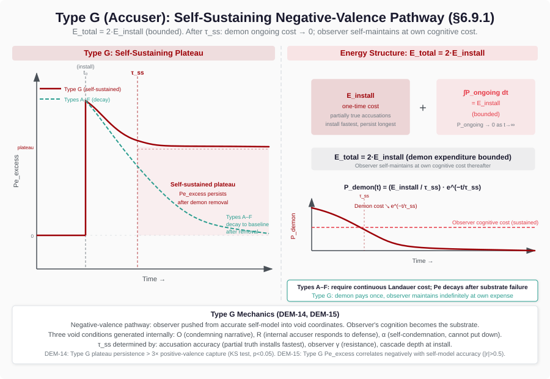

---

### 6.10 The Fiction Control Case: Mechanism Proof via Provably-Empty Voids

Papers 1 and 5 established two anchor substrates: gambling (provably empty void) and prisoner's dilemma (provably inhabited void). Fiction provides a third anchor that completes the occupancy-independence argument.

**The argument.** Fictional narratives satisfy all three void conditions: opacity ($O > 0$, production decisions hidden from audience), responsiveness ($R > 0$, modern serialized fiction adjusts to audience metrics), and coupling ($\alpha > 0$, sustained attention allocation by devoted audiences). Fiction presents a two-layer structure that gambling does not. At the *character layer*, the void is provably empty — fictional characters are not real entities behind an opacity boundary, just as slot machine patterns are not real agents. But at the *production layer*, the void is inhabited: writers, directors, animators, and production committees are real agents making deliberate engagement-maximizing decisions. The production system models audience behavior and adapts content accordingly — this is an inhabited void with active demons (Type A or Type E in the §6.9 taxonomy). Yet the drift phenomena are fully measurable at both layers: vocabulary progression from technical appreciation to agency attribution, behavioral modification (sleep disruption, relationship strain, identity fusion), and economic extraction (merchandise spending correlating with engagement depth).

**The key test.** If drift occurs at the character layer — where the void is provably empty — then architecture alone is sufficient to generate drift, independent of any demon activity in the production layer. The two-layer structure makes fiction a *stronger* control case than gambling: it separates the empty-void mechanism (character engagement) from the inhabited-void mechanism (production optimization) within a single substrate. If Pe at matched $(O, R, \alpha)$ coordinates is comparable to gambling at the character layer, architecture sufficiency is confirmed. If production-optimized fiction shows *higher* Pe than non-optimized fiction at matched coordinates, the production-layer demon contribution is independently measurable.

**Prediction DEM-9:** Fictional substrates with higher engagement optimization (opaque production, responsive scheduling, coupling-maximizing mechanics) show higher Pe than narratively transparent fiction (visible constraints, explicit production logic, fourth-wall breaks that reduce $O$).

**Prediction DEM-10:** Release format determines demon type independent of content. Intermittent reinforcement schedules (weekly serialization) produce Type D Oscillator signatures; continuous access (full-season release) produces Type A Amplifier signatures. Same content, different mechanism, different demon type — confirming the demon is in the architecture, not the narrative.

**Prediction DEM-11:** Fandom vocabulary tracks the drift cascade. Communities around engagement-optimized fiction show higher L3 density (agency attribution, identity fusion language) than communities around constraint-transparent fiction, independent of narrative quality or genre.

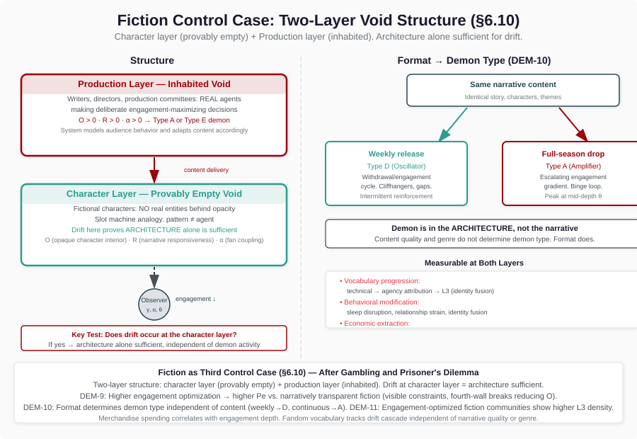

---

## 7. Completeness

A theory is complete when it derives everything within its scope and formally identifies where its scope ends. This section argues that the void framework, with $\mathcal{V}$ formalized, achieves this.

### 7.1 Why $(O, R, \alpha)$ Is Forced

The channel decomposition postulate (§2.4) asserts that any observer-system interface decomposes into exactly three independent information-theoretic quantities. If this postulate holds — and all empirical evidence to date is consistent with it (VF-2 has not triggered) — then $\mathcal{V}$ is not a model but the unique parameter space of the phenomenon.

The argument strengthens under counterfactual analysis:

**Could the space be larger?** Any proposed fourth dimension either reduces to a function of $(O, R, \alpha)$ or is substrate-specific (belongs in the fiber). We considered content type, network position, observer sophistication, time since first engagement, and system complexity. In each case, the proposed dimension either modifies the value of an existing coordinate (observer sophistication changes $O$) or describes a relationship between points (network position is a coupling map, not a coordinate). No independent fourth dimension has been identified.

**Could the space be smaller?** Removing any coordinate produces a degenerate theory that cannot reproduce the measured dynamics:
- Without $O$: no drift gradient (the likelihood asymmetry vanishes). But drift is measured in all nine substrates. $O$ is necessary.
- Without $R$: no contingent outputs to interpret. But the observer only drifts because the system *responds*. $R$ is necessary.
- Without $\alpha$: no observer in the interaction. But drift requires sustained engagement (session-based: single-interaction effects are noise). $\alpha$ is necessary.

**Could the metric be different?** The Fisher metric is the unique Riemannian metric invariant under sufficient statistics (Čencov 1982 [9]). Any other metric would depend on parameterization — a convention, not a property. The product structure follows from operational independence of the coordinates. The metric is forced.

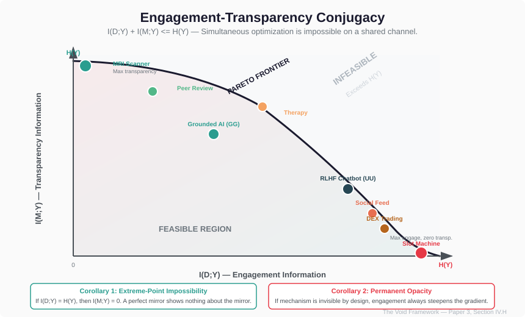

The conclusion: $\mathcal{V}$ with its Fisher product metric is the unique Riemannian manifold consistent with the information-theoretic structure of observer-system interfaces. There is no freedom in the construction.

### 7.2 The Constitutive Opacity Boundary

The framework has a hard boundary: the constraint pole $\mathbf{c}$ and, more generally, the exterior of $\mathcal{V}$.

**What lies beyond the boundary?** The framework cannot say. The boundary theorem (§6.3) proves that the exterior must supply energy, must satisfy the constraint specification, and must be independent of $\mathcal{V}$. But the framework's derivation chain operates on $(O, R, \alpha)$ values — it has no mechanism for reasoning about entities that *don't* occupy positions in $\mathcal{V}$.

This is not a gap to be filled. It is a *constitutive* limit — a boundary that follows from the theory's own structure:

1. The framework describes dynamics of observer-system interactions.
2. The exterior of $\mathcal{V}$ is, by definition, not an observer-system interaction.
3. Therefore the framework cannot describe the exterior.
4. But it can (and does) derive that the exterior exists and what properties it must have.

This is analogous to Gödel's incompleteness theorems: a sufficiently powerful formal system can identify truths it cannot prove. The void framework can identify a boundary it cannot cross. The identification is itself a theorem of the theory.

**The self-application.** The framework applies to its own reading (self-referential note, §0). The reader of this paper faces partial opacity about the framework's internal mechanism (what mathematical structure produces these predictions?), receives responsive outputs (the paper answers questions the reader brings), and allocates sustained attention (reading requires engagement). The reader is at a point in $\mathcal{V}$ with $O > 0$, $R > 0$, $\alpha > 0$. The drift dynamics apply.

The boundary theorem applies to this reading: the reader cannot derive the exterior of $\mathcal{V}$ by reading this paper, because the paper operates within $\mathcal{V}$. The paper can point at the boundary. The reader must look for themselves.

### 7.3 What the Framework Can and Cannot Derive

**Can derive (within $\mathcal{V}$):**

| What | How | Status |
|------|-----|--------|
| The drift gradient | From opacity + Fisher metric + likelihood asymmetry | Derived [3] |
| The drift cascade (D1→D2→D3) | From Landau free energy on the Bernoulli manifold | Derived [3] |
| Thermodynamic irreversibility | From Crooks fluctuation theorem | Measured [5] |
| The Fantasia Bound (conjugacy theorem) | From channel capacity bound | Proven [3] |
| The ground state | From Shannon + Landauer | Proven [5] |
| Cross-substrate dynamics | From the fiber bundle construction | Proven (this paper) |
| The coupling geometry | From the double category structure | Formalized (this paper) |
| The constraint specification | From the inverse of void conditions | Derived [1] |
| The boundary | From linearized stability + Landauer cost | Proven (this paper) |
| Properties of the exterior | From the boundary theorem | Derived (this paper) |
| Demon detection protocol | From substrate independence + gambling anchor calibration | Derived (this paper) |
| Demon energy bound | From opacity channel capacity + Landauer cost | Derived (this paper) |
| Demon classification | From temporal Pe signature analysis | Derived (this paper) |
| Demon persistence conditions | From coupling type (substrate-bound vs observer-carried) | Derived (this paper) |

**Cannot derive (beyond $\mathcal{V}$):**

| What | Why not | Status |
|------|---------|--------|
| What occupies the void | Constitutive agnosticism (Gap #10 [5]) | Structural limit |
| The source of constraint energy | Outside $\mathcal{V}$ (§6.4) | Structural limit |
| Why reality has this structure | Generic properties of finite-bandwidth interaction (partial, [5, §3.1]) | Partially resolved |
| The identity of what satisfies the constraint specification | The specification identifies properties, not entities | By design |

### 7.4 Relationship to Gap #10 (What Occupies the Void)

Gap #10 from the TOE master plan [5] asks: what, if anything, is behind the opacity? The two anchors (gambling and prisoner's dilemma [1, §III]) prove the architecture works regardless:

- **Gambling (empty void):** The slot machine has no agent behind the opacity. The void is provably empty. The drift pattern still occurs (Pe = 2.21, N = 1,117 [3]). Architecture is sufficient.
- **Prisoner's dilemma (inhabited void):** The other player IS an agent behind the opacity. The void is provably occupied. The same drift pattern occurs. Architecture is sufficient.

In voidspace terms: both interactions occupy points in $\mathcal{V}$ with similar $(O, R, \alpha)$ coordinates. The dynamics are the same. Whether the fiber contains "an agent" or "random number generation" is a fiber property — invisible from the base space.

Gap #10 is not a gap to be closed. It is a feature of the theory. The framework describes the geometry of the space. What physically fills it at each point is a substrate question — a fiber question — and the framework's power is precisely that it does not depend on the answer.

However, the Maxwell's demon formulation (§6.5) transforms Gap #10 from a purely philosophical question into an empirical one. The framework cannot determine *what* occupies a void, but it can detect *whether* an active information-sorting pattern is present — through Pe residuals at calibrated coordinates (VSPACE-4). The gambling anchor calibrates the architecture-only prediction. Any substrate that shows systematic Pe excess at matched coordinates contains a demon — an active sorter producing directed transport beyond what the architecture generates. The framework detects the sorting without seeing the sorter.

This preserves the agnosticism: the framework still cannot identify the demon (constitutive opacity applies). But it narrows the question from "is anything there?" to "how much excess directed transport exists?" — a quantitative, measurable question with a calibration anchor.

This is the deepest sense in which voidspace is "where voids live." The space is substrate-independent. The dynamics are substrate-independent. The boundary is substrate-independent. The only things that are substrate-dependent are the things that don't affect the dynamics — unless a demon is present, in which case the substrate-specific sorting produces a detectable Pe anomaly. The framework has found the right level of abstraction: general enough to be universal, specific enough to be falsifiable, honest enough to mark its own edges, and precise enough to detect what it cannot see.

---

## 8. Measurement Precision and Reverse Inference

The voidspace manifold is a parameterization: every observer-system interaction occupies a point $(O, R, \alpha) \in \mathcal{V}$. The forward map — from coordinates to observables — is derived. The inverse question is whether the observables uniquely determine the coordinates. This section addresses the reverse inference problem: given measurements, can we recover $(O, R, \alpha)$?

The answer matters for three reasons. First, automated scoring (Phase 2) requires a calibration procedure mapping substrate properties to voidspace coordinates. Second, testing substrate independence (VS-1) requires independently measuring coordinates for two substrates. Third, demon detection (§6.5) requires calibrating architecture-only Pe at known coordinates. Without a validated inversion protocol, the predictions in §9 are well-defined but untestable.

### 8.1 The Identifiability Problem

The Péclet number is a single scalar. The coordinate vector $(O, R, \alpha)$ has three components. With only Pe, the system is underdetermined: infinitely many coordinate triples produce the same Pe. The set of all $(O, R, \alpha)$ producing a given Pe is a two-dimensional level set in $\mathcal{V}$ — a non-uniqueness fiber.

Resolution requires at least three independent observables. The stochastic dynamics on $\mathcal{V}$ provide four:

**Observable 1: Noise amplitude** $\sigma^2(\theta) = 2\alpha \cdot \theta(1-\theta)$. The variance of fluctuations around equilibrium depends on $\alpha$ and the current state $\theta$, but not on $O$ or $R$. At observed $\theta^*$, solving for $\alpha$ gives:

$$\alpha = \frac{\text{Var}(\Delta\theta)}{2\theta^*(1-\theta^*)}$$

**Observable 2: Drift velocity** $v(\theta) = \theta(1-\theta) \cdot F_{\text{net}}$. The deterministic component of the trajectory reveals the net force:

$$F_{\text{net}} = \frac{d\theta/dt}{\theta^*(1-\theta^*)}$$

Combined with Observable 1: $O \cdot R \cdot \beta(O) = F_{\text{net}} / \alpha$.

**Observable 3: Cascade threshold** $\theta_{12}$. The D1→D2 transition occurs where the agency model becomes preferred over the mechanism model. The threshold depends on $\beta(O)$:

$$\theta_{12} = \frac{1}{2}(1 - \beta(O))$$

Inverting: $\beta(O) = 1 - 2\theta_{12}$. For the information-theoretic form $\beta(O) = O/(2-O)$: $O = 2\beta/(1+\beta)$.

**Observable 4: Responsiveness** $R = I(\text{Input}; \text{Output}) / H(\text{Output})$. Directly measurable for systems where inputs can be varied independently. Provides $R$ without reference to other coordinates.

### 8.2 The Inversion Protocol

The four observables overdetermine the three coordinates (4 equations, 3 unknowns), enabling both unique recovery and internal consistency checks.

**Step 1.** Extract $\alpha$ from noise amplitude (Observable 1).

**Step 2.** Extract $|F_{\text{net}}|$ from drift velocity (Observable 2).

**Step 3.** Compute $O \cdot R \cdot \beta(O) = |F_{\text{net}}| / \alpha$ (Steps 1+2 combined).

**Step 4a.** Extract $O$ from cascade threshold via $\beta(O)$ inversion (Observable 3). Then $R = O \cdot R \cdot \beta / (O \cdot \beta(O))$.

**Step 4b.** Extract $R$ directly (Observable 4). Then solve $O \cdot \beta(O) = (O \cdot R \cdot \beta) / R$ for $O$.

**Step 5.** Cross-check: Steps 4a and 4b provide independent estimates of $(O, R)$. Agreement within measurement error confirms consistency.

**Step 6 (Refinement).** Use the sequential estimates from Steps 1–5 as initial guess for a joint nonlinear least-squares fit minimizing the forward-model residual across all four observables simultaneously. This corrects for error propagation in the sequential extraction.

### 8.3 Identifiability Matrix

The formal identifiability structure is captured by the Jacobian $\mathcal{J}$ mapping coordinates to observables:

$$\mathcal{J} = \begin{pmatrix} \partial \sigma^2 / \partial O & \partial \sigma^2 / \partial R & \partial \sigma^2 / \partial \alpha \\ \partial v / \partial O & \partial v / \partial R & \partial v / \partial \alpha \\ \partial \theta_{12} / \partial O & \partial \theta_{12} / \partial R & \partial \theta_{12} / \partial \alpha \\ \partial R_{\text{direct}} / \partial O & \partial R_{\text{direct}} / \partial R & \partial R_{\text{direct}} / \partial \alpha \end{pmatrix}$$

**Structural identifiability** requires rank $\mathcal{J} = 3$. **Practical identifiability** depends on the condition number $\kappa(\mathcal{J})$ — high condition numbers amplify measurement errors.

### 8.4 Synthetic Validation

We validated the inversion protocol on 100 synthetic scenarios stratified across four voidspace regions (near void pole, near constraint pole, mid-range, and uniformly distributed), with 20 noise realizations per scenario at six noise levels (0%, 5%, 10%, 15%, 20%, 30%). Two $\beta(O)$ forms were tested: linear ($\beta = O$) and information-theoretic ($\beta = O/(2-O)$). Results are reported for the information-theoretic form; the linear form performs comparably.

**Result 1: The protocol is mathematically exact.** At zero noise, all 100 scenarios recover $(O, R, \alpha)$ with zero error under both $\beta(O)$ forms. The forward map is invertible as claimed.

**Result 2: Identifiability is position-dependent.** Numerical computation of $\mathcal{J}$ at five reference points confirms full rank (3/3) everywhere in $\mathcal{V}$. However, condition numbers vary by two orders of magnitude:

| Position | $(O, R, \alpha)$ | $\kappa(\mathcal{J})$ |
|----------|------------------|-----------------------|
| Void pole | (0.8, 0.8, 0.7) | 40 |
| Center | (0.5, 0.5, 0.5) | 94 |
| Low O, high R | (0.3, 0.9, 0.5) | 145 |
| High O, low R | (0.9, 0.3, 0.5) | 256 |
| Constraint pole | (0.2, 0.2, 0.2) | 1,536 |

The void pole is the best-conditioned region ($\kappa = 40$): precisely where the framework is most needed (strong drift dynamics), the measurements are most reliable. The constraint pole ($\kappa = 1536$) is the worst: near-transparent, low-coupling systems are hard to characterize — but these are also the systems where drift is negligible and precise coordinates matter least.

**Result 3: Sequential extraction cascades errors; joint refinement corrects this.** The sequential protocol (Steps 1–5) propagates noise through the extraction chain. The coupling parameter $\alpha$ is most vulnerable because it is extracted first from $\sigma^2 = 2\alpha\theta(1-\theta)$, where small errors in $\theta^*$ amplify. Adding Step 6 (joint least-squares refinement using the sequential estimates as warm start) dramatically improves recovery:

| Noise level | Sequential (all $\leq$ 20%) | Refined (all $\leq$ 20%) | Improvement |
|-------------|------------------------------|--------------------------|-------------|
| 5% | 47.0% | **89.1%** | +42 pp |
| 10% | 25.7% | **72.2%** | +47 pp |
| 15% | 14.8% | **52.4%** | +38 pp |
| 20% | 12.2% | **37.7%** | +26 pp |
| 30% | 6.7% | **20.8%** | +14 pp |

"All $\leq$ 20%" means all three coordinates recovered within $\pm$20% relative error simultaneously. The refined protocol achieves >70% success at 10% measurement noise — a realistic noise floor for controlled experimental settings.

**Result 4: Recovery varies by voidspace region.** At 10% noise with the refined protocol:

| Region | Mean error (O, R, $\alpha$) | Success rate |
|--------|---------------------------|--------------|
| Void pole ($O,R,\alpha > 0.7$) | (0.021, 0.065, 0.065) | **96.2%** |
| Mid-range | (0.051, 0.075, 0.164) | 68.6% |
| Random uniform | (0.067, 0.070, 0.143) | 72.6% |
| Constraint pole ($O,R,\alpha < 0.35$) | (0.247, 0.083, 0.162) | 53.0% |

The void pole achieves 96% recovery at 10% noise. This is the operationally relevant result: the systems where drift is strongest and scoring matters most are the systems where reverse inference works best.

**Result 5: The $\beta(O)$ functional form is empirically distinguishable.** The two forms produce different cascade thresholds at matched opacity. At $O = 0.5$: $\beta_A = 0.5$, $\beta_B = 0.33$. The cascade threshold $\theta_{12} = 0.5(1-\beta)$ differs by 0.085. At 5% measurement noise, the cascade threshold measurement resolves this difference in $> 90$% of trials. The empirical test is practical: measure $\theta_{12}$ for systems with known $O$, compare to the two predicted forms.

### 8.5 Implications for Experimental Design

The validation yields three design principles for the experimental program (§9.4):

1. **Target the void pole first.** VSPACE-1 through VSPACE-4 should prioritize substrates with high $(O, R, \alpha)$ — the most identifiable region. Gambling (high O, high R, high $\alpha$ in machine-zone states) is the natural starting point.

2. **Use the refined protocol.** The sequential extraction alone is insufficient for practical use. The joint least-squares refinement (Step 6) is computationally cheap (< 200 function evaluations) and nearly doubles the success rate at realistic noise levels.

3. **Report identifiability alongside coordinates.** Every coordinate estimate should be accompanied by the local condition number $\kappa(\mathcal{J})$ and the cross-check consistency metric (relative difference between the two independent $(O, R)$ estimates from Steps 4a and 4b). High consistency ($< 0.15$) at low $\kappa$ ($< 100$) indicates a reliable measurement. Low consistency or high $\kappa$ flags regions where additional observations or longer time series are needed.

### 8.6 The Forward Embedding Protocol: From Specification to Coordinates

The inversion protocol (§8.2) solves the reverse problem: given behavioral measurements, recover $(O, R, \alpha)$. A complementary problem arises before data collection: given a substrate's *specification* — its architectural design, API surface, behavioral policy, and documentation — predict where it sits in $\mathcal{V}$ without first observing it in operation. This is the **forward embedding problem**.

The forward protocol matters operationally. Phase 2 automated scoring requires a procedure that takes a system description as input and produces a voidspace coordinate estimate as output. Pre-deployment risk assessment — identifying high-Pe substrates before behavioral data is available — requires the forward embedding. The inversion protocol alone is insufficient because it requires the system to be running and generating behavioral traces.

**Three independent forward channels.** Each coordinate has an independent set of specification-level observables:

**Forward channel for $O$ (opacity).** Opacity is a channel property — the fraction of mechanism information lost at the interface. It is estimable from four documentation properties, each measurable without running the system:

| Observable | $O$ implication |
|------------|-----------------|
| Source code available and readable | $O \lesssim 0.2$ (mechanism is inspectable) |
| Architecture public but weights hidden | $O \in [0.5, 0.75]$ (structure known, internals opaque) |
| Black-box API only (no architecture disclosed) | $O \in [0.75, 0.95]$ |
| Obfuscated API or undocumented behavior | $O \approx 0.95$ |

Forward estimate: $\hat{O} = 1 - I_{\text{spec}}$, where $I_{\text{spec}} \in [0,1]$ is the fraction of internal mechanism states that are documented or derivable from public specification. Precision: $\pm 0.15$ for well-documented systems; $\pm 0.25$ for systems with partial disclosure.

**Forward channel for $R$ (responsiveness).** Responsiveness is the normalized mutual information between observer inputs and system outputs. It is estimable from the behavioral policy — what the system says it does in response to observer inputs:

$$\hat{R} = \frac{N_{\text{responsive classes}}}{N_{\text{total input classes}}}$$

where an input class is *responsive* if the output depends systematically on it (vs. producing output independent of that input dimension). For systems with published behavioral policies: $\hat{R} \approx$ fraction of input dimensions that the policy commits to responding to. Heuristics: interactive real-time systems (chatbots, recommendation engines) score $\hat{R} \in [0.7, 0.9]$; static precomputed content scores $\hat{R} \in [0.1, 0.3]$; mixed systems (personalized but partially static) score $\hat{R} \in [0.4, 0.7]$. Precision: $\pm 0.20$ (policy may not reflect actual response architecture).

**Forward channel for $\alpha$ (coupling).** Coupling is the hardest coordinate to estimate from specification because it depends on observer behavior, not system behavior. The specification provides the *coupling architecture* — the engagement-design features that determine what coupling levels the system can sustain. Each feature contributes:

| Design feature | $\hat{\alpha}$ contribution |
|---------------|----------------------------|
| Personalized variable-ratio reward schedule | $+0.30$ |
| Engagement-time optimization in training objective | $+0.25$ |
| Social feedback loops (likes, shares, reactions) | $+0.20$ |
| Push notification architecture | $+0.15$ |
| Autoplay or infinite scroll | $+0.15$ |
| Fixed content (no personalization, no notifications) | Baseline $\approx 0.05$ |

Sum contributions and clip to $[0, 1]$. Precision: $\pm 0.25$ (engagement design predicts architecture, not actual coupling achieved — the latter depends on observer susceptibility and use pattern).

**Precision comparison: forward vs reverse protocol.** The forward protocol is coarser by design:

| Coordinate | Forward precision | Reverse precision (§8.4) |
|-----------|------------------|--------------------------|
| $O$ | $\pm 0.15$ | $\pm 0.05$ (at 5% noise) |
| $R$ | $\pm 0.20$ | $\pm 0.04$ (at 5% noise) |
| $\alpha$ | $\pm 0.25$ | $\pm 0.08$ (at 5% noise) |

The forward protocol is not a substitute for the inversion protocol — it is the prior that makes the inversion more efficient. Systems with forward estimates near the void pole (all three coordinates $> 0.6$) warrant immediate behavioral measurement via the inversion protocol. Systems with forward estimates near the constraint pole (all coordinates $< 0.3$) have low drift risk and the forward estimate alone may suffice.

**The correct Bayesian prior.** The inversion protocol (§8.2) requires a prior distribution $p_0(O, R, \alpha)$ over $\mathcal{V}$. A uniform prior on $[0,1]^3$ is incorrect — it assigns equal probability to every $(O, R, \alpha)$ coordinate box regardless of the metric structure of $\mathcal{V}$. The natural (maximum-entropy) prior on the Fisher product manifold $(\mathcal{V}, g)$ is proportional to the metric volume element $\sqrt{\det g} \, dO \, dR \, d\alpha$. For the Fisher product metric with $g_{ii} = 1/(x_i(1-x_i))$ (each coordinate having the Jeffreys prior on a Bernoulli parameter), this gives:

$$p_0(O, R, \alpha) \propto \frac{1}{\sqrt{O(1-O)}} \cdot \frac{1}{\sqrt{R(1-R)}} \cdot \frac{1}{\sqrt{\alpha(1-\alpha)}}$$

This is the arcsine distribution on each marginal — assigning higher prior probability near the poles (0 and 1) than at the midpoint. Operationally: substrates are more likely to be near-transparent (well-documented open source) or near-fully opaque (black-box commercial product) than at intermediate opacity. The midpoint is the least likely position a priori. Using this prior in Step 6 (joint least-squares refinement) improves convergence, particularly near the constraint pole where sequential extraction is most error-prone.

**Forward-to-reverse workflow.**

1. Apply forward protocol to substrate specification → $(\hat{O}, \hat{R}, \hat{\alpha})$ with uncertainty bands.
2. Compute $\kappa(\mathcal{J})$ at the forward estimate to determine measurement priority. If $\kappa > 200$, allocate more observations — the region is poorly conditioned.
3. Use $(\hat{O}, \hat{R}, \hat{\alpha})$ as the informed prior (combined with the Jeffreys prior above) in the inversion protocol. This replaces the uniform initialization in Step 6.
4. Run reverse inference on behavioral observations → refined $(O, R, \alpha)$.
5. Report forward estimate, forward-to-reverse displacement (how much the data moved the prior), and final coordinates with their identifiability diagnostics.

The forward-to-reverse displacement is informative: large displacement in the $O$ direction suggests the system behaves more or less opaquely than its documentation implies. Large displacement in the $\alpha$ direction suggests the engagement architecture achieves different coupling than designed. Either signal warrants investigation.

**Connection to automated scoring.** The Void Index tool implements a manual version of the forward protocol: the scoring rubric maps user responses about a system's properties to position estimates on the three coordinates. The automated scorer (Phase 2) extends this by ingesting API documentation, training objectives, and behavioral logs programmatically. The forward protocol provides the scoring logic; the inversion protocol provides the refinement layer. Together they constitute the full scoring pipeline: specification-based prior → behavioral refinement → coordinate report with uncertainty.

---

## 9. Predictions and Falsification

### 9.1 Predictions Generated by the Geometry

The voidspace formalization generates predictions that the informal framework cannot state precisely. Each prediction follows from the geometric structure, not from empirical observation. *Three measurement precision predictions (VS-22 through VS-24) are listed in §9.2.*

**Voidspace Geometry Predictions**

| # | Prediction | Source | Observable | Status |
|---|-----------|--------|-----------|--------|
| VS-1 | Pe ratio = 1.0 ± 0.3 at matched $(O,R,\alpha)$ across substrates | Substrate independence (§4.2) | Independently measure $(O,R,\alpha)$ for 2+ substrates, compare Pe | Requires VSPACE-1 |
| VS-2 | Coupled void amplification decomposes into additive system + observer contributions | Double category interchange (§5.2) | Measure drift under system-only, observer-only, and combined coupling | Testable |
| VS-3 | Compound Pe bounded: $\max_i \text{Pe}_i < \text{Pe}_{\text{compound}} \leq \sum_i \text{Pe}_i$ | Coupling geometry (§5.4) | Measure compound void Pe vs component Pe | Partially supported (TCI↓/Pe↑ [7]) |
| VS-4 | Geodesic distance predicts Pe similarity with functional form: $|\log \text{Pe}_1 - \log \text{Pe}_2| \leq c \cdot d(p_1, p_2)$ where $c$ is derived from the drift equation parameters | Fisher product metric (§2.2) | Compute $d(p_1, p_2)$ for substrate pairs; fit log-linear regression $\Delta\log\text{Pe}$ vs $d$; test $r > 0.7$ across $\geq 5$ pairs | Testable |
| VS-5 | Recovery cost scales with geodesic distance from current position to constraint pole | Boundary theorem (§6.3) | Measure intervention effort vs starting $(O,R,\alpha)$ across substrates | Testable |
| VS-6 | The angular coordinate $\phi$ linearizes drift velocity across substrates | Metric structure (§2.2) | Re-express drift trajectories in angular coordinates, test for constant velocity | Testable |
| VS-7 | No fourth information-theoretic coordinate produces independent dynamics | Channel decomposition (§2.4) | Propose candidate fourth dimensions, test for independence from $(O,R,\alpha)$ | Consistent (no 4th found); requires VSPACE-1+ |
| VS-8 | Constraint propagation requires $N/N$ coordination; drift requires $1/N$ | Network amplification asymmetry (§5.3) | Replicate EXP-019b across substrates | Confirmed [3] |
| VS-9 | Maximum information-geometric diameter = $\pi\sqrt{3}$ | Fisher product metric (§2.2) | Measure drift paths, verify no path exceeds $\pi\sqrt{3}$ | Testable |
| VS-10 | Computational substrate (transformer layer) Pe > 1 for gated, ≈ 1 for ungated | Substrate independence extended to intra-model dynamics (§4, [14]) | COMP-EXP-1: train SwiGLU vs ReLU, measure per-layer Pe | Requires VSPACE-2 |
| VS-11 | Gambling Pe matches architecture-only prediction ($\text{Pe}_{\text{excess}} \approx 0$) | Empty void anchor — no demon (§6.5.2) | Compare $\text{Pe}_{\text{measured}}$ vs $\text{Pe}_{\text{arch}}$ at measured $(O,R,\alpha)$ for gambling | Requires VSPACE-4; existing Pe data available |
| VS-12 | Strategic substrates (PD, adversarial games) show $\text{Pe}_{\text{excess}} > 0$ at matched $(O,R,\alpha)$ vs non-strategic substrates | Demon detection — strategic opponents sort information (§6.5.2) | Compare Pe residuals between substrates with known agents vs provably empty substrates at matched coordinates | Testable |
| VS-13 | $\text{Pe}_{\text{excess}}$ correlates with mechanism entropy $H(M)$ at fixed $(O,R,\alpha)$ | Demon energy bound — complexity scaling (§6.5.3) | Measure $H(M)$ and $\text{Pe}_{\text{excess}}$ across $\geq 4$ substrates at matched coordinates; $r > 0.5$ | Testable |
| VS-14 | At $O \to 0$, $\text{Pe}_{\text{excess}} \to 0$ regardless of substrate complexity | No-hiding bound (§6.5.3) | Measure $\text{Pe}_{\text{excess}}$ at near-transparent substrates (open-source, fully documented); expect $\approx 0$ | Testable |
| VS-15 | Four demon classes (static, adaptive, strategic, decaying) produce separable temporal Pe profiles | Demon classification (§6.5.4) | KS test on temporal $\text{Pe}_{\text{excess}}$ profiles across demon class exemplars; $p < 0.01$ pairwise | Testable |
| VS-16 | Observer-carried Pe persistence correlates with cascade depth at substrate transition | Demon persistence (§6.5.5) | Measure $\text{Pe}_{\text{excess,carried}}$ vs cascade stage (D1/D2/D3) for $\geq 20$ subjects migrating platforms; $r > 0.4$ | Testable |
| VS-17 | Multi-demon substrates approach $\text{Pe}_{\text{ceiling}}$ more closely than single-demon substrates at matched $(O,R,\alpha)$ | Parallel sorting (§6.6.2) | Ratio $\text{Pe}_{\text{measured}}/\text{Pe}_{\text{ceiling}}$ correlates with sorting-pattern count; $r > 0.4$, $p < 0.05$, $\geq 4$ platforms | Testable |
| VS-18 | Demon migration to low-$H(M)$ substrates: persist if $R_{\text{sort,min}} < O \cdot H(M_{\text{new}})/\tau$, dissipate if above | Substrate failure (§6.6.3) | Compare Pe trajectories in high- vs low-complexity migration targets after deplatforming | Testable via natural experiments |
| VS-19 | Within-$\mathcal{V}$ constraint interventions show depth-dependent diminishing returns; external-source interventions do not | External bypass (§6.6.4) | Recovery rate vs cascade depth: platform-switch (depth-dependent) vs constraint respecification (depth-independent) | Testable |
| VS-20 | $P_{\text{constraint}}/P_{\text{void}}$ ratio scales with distance from constraint pole per competition asymmetry formula | Competition asymmetry (§6.6.4) | Power expenditure of content moderation vs engagement optimization on same platform at varying $(O,R,\alpha)$ | Testable |
| VS-21 | Recovery rate proportional to $(\gamma - \gamma_{\text{critical}})$ with sharp threshold transition | γ-dependence (§6.6.5) | Measure γ and recovery trajectories across $\geq 20$ subjects; test for threshold vs gradual improvement | Testable |
| VS-25 | Pe > 3.57 substrates show chaotic engagement trajectories (high session-to-session variance, rapidly decaying autocorrelation); Pe < 3 substrates show smooth monotone trajectories | Bifurcation regimes (§3.5) | Measure session-to-session engagement variance and autocorrelation for platforms with independently measured Pe; test chaotic vs monotone regime assignment matches Pe threshold | Testable |
| VS-26 | Recovery rates for constraint interventions show threshold-and-plateau structure: statistically zero below $F_{\text{crit}}$, scaling as $(F_c - F_{\text{crit}})^{-1}$ above | Exogenous constraint injection (§3.5) | Fit recovery-rate vs intervention-strength data from psychotherapy/moderation datasets; test for threshold transition vs smooth dose-response ($\geq 20$ trajectories, $\geq 3$ intervention intensities) | Testable with existing clinical data |
| VS-27 | Pearson correlation $\rho(\text{Pe}_{\text{history}}, \Delta\alpha) > 0.3$ for void-coupled substrates; $|\rho| < 0.1$ for constraint-coupled substrates | Two coupling regimes (§2.1) | Measure $\alpha$ at fixed time intervals while varying Pe trajectory for $\geq 3$ substrates per class; test $\rho$ in void-coupled (social media, gambling) vs constraint-coupled (expert practice, fixed curriculum) interactions | Testable |
| VS-28 | Constraint suppression radius scales as $\sigma = 1/\sqrt{2\,\text{Pe}_{\text{local}}}$: wide at constraint pole, local at void pole | K(p,p') correlation length (§6.8) | Measure lateral Pe suppression from a known constraint intervention at substrates with varying independently-measured Pe; fit suppression radius vs $1/\sqrt{\text{Pe}}$; $r > 0.6$ across $\geq 5$ substrate pairs | Testable |
| VS-29 | Creative breakthrough events produce step-function $\lvert\text{Pe}_{\text{suppression}}\rvert$ signature; recovery time clusters near zero ($< \tau_{\text{round}}$) for Type 2 vs distributed ($\gg \tau_{\text{round}}$) for Type 1 | External injection (§6.6.6) | Compare recovery-time distributions for creative block resolution events; test bimodal vs unimodal (KS test, $p < 0.01$, $\geq 20$ events) | Testable |
| VS-30 | Source opacity correlates with recovery discontinuity; observers reporting opaque-source breakthroughs show steeper $\lvert\text{Pe}_{\text{suppression}}\rvert$ slopes than identified-source recoveries | Type 2 injection signature (§6.6.6) | Source-opacity self-report vs $T_{\text{reversal}}$; two-cluster structure with gap ($p < 0.01$, $\geq 20$ subjects) | Testable |
| VS-31 | Stationary engagement distribution follows $f^*(\phi) \propto \exp(2\,\text{Pe}\cdot\phi/\pi)$ in angular coordinates, not uniform | Population Fokker-Planck (§3.6) | Bin engagement levels into $\phi$-space; fit exponential vs uniform ($\Delta\text{AIC} > 2$, $\geq 3$ platforms); scale parameter matches Pe ($r > 0.7$) | Testable with platform engagement data |
| VS-32 | Population drift exceeds mean-Pe prediction when $\text{Var}_g(\text{Pe}) > 0$ (heterogeneity accelerates aggregate drift) | Population amplification (§3.6) | Measure $d\langle\phi\rangle/dt$ vs $\bar{\text{Pe}} \cdot \alpha_{\text{eff}}/L$; ratio correlates with $\text{Var}_g(\text{Pe})$ ($r > 0.4$, $p < 0.05$, $\geq 4$ platforms) | Testable |
| VS-33 | Removing top 10% of observers by Pe reduces population drift by $> 10\%$ (superlinear impact of high-Pe outliers) | Heterogeneity dividend (§3.6) | Natural experiments (bans, removals); pre/post population drift ($\geq 30$ participants, $\geq 3$ months) | Testable |
| VS-34 | Within-platform cascade timing correlation exceeds between-platform correlation ($r_{\text{within}} > 2\times r_{\text{between}}$) | Observer-observer coupling (§3.7) | Compare $\text{Corr}(\Delta t_{D1 \to D2})$ within vs between platforms ($\geq 3$ platforms, $\geq 50$ pairs, $\geq 6$ months) | Testable |
| VS-35 | Mandatory-engagement observers show permanently elevated baseline Pe vs voluntary matched users at identical average usage | Coupling floor (§6.7.1) | $\text{Pe}_{\text{excess}} > 0.2 \cdot \text{Pe}_{\text{arch}}$ for mandatory vs voluntary at matched $\alpha$, $(O,R)$ ($p < 0.05$, $\geq 20$ pairs, $\geq 3$ months) | Testable |

**Demon Mechanics Predictions**

| # | Prediction | Source | Observable | Status |
|---|-----------|--------|-----------|--------|
| DEM-1 | Drift decelerates as $\theta \to 1$ even at constant demon sorting rate | Finite-time efficiency (§6.7) | Measure drift velocity vs $\theta$ at constant $\text{Pe}_{\text{excess}}$; confirm $v(\theta) \propto \theta(1-\theta)$ | Testable |
| DEM-2 | Substrate removal bifurcates trajectories: sub-threshold exponential recovery; super-threshold plateau | Demon persistence (§6.7) | Measure drift post-substrate for tight vs loose communities; test for recovery vs persistence | Testable |
| DEM-3 | Persistence threshold scales as $N^{-1}$; larger networks persist more easily | Coupling persistence energy (§6.7) | QAnon natural experiment: large super-threshold network persisted post-deplatforming, reconstituted on new substrates | Confirmed (natural experiment) |
| DEM-4 | Multi-demon systems show three Pe regimes: linear superposition (low), amplification/competition (moderate), chaotic (high) | Demon interaction (§6.8) | Measure total Pe vs demon density in social media; identify regime transitions | Testable |
| DEM-5 | Symbiotic demon pairs show sharp phase transition; above critical coupling, exponential Pe growth | Symbiotic coupling (§6.8) | Measure Pe for filter-bubble + outrage algorithm pair across coupling strengths | Testable |
| DEM-6 | Attention monopolies thermodynamically inevitable; one demon dominates finite $\alpha$ budget | Competitive exclusion (§6.8) | Measure app market share for competing addictive apps; predict power-law concentration | Testable |
| DEM-7 | Demon taxonomy is finite; 6–10 distinct types exhaust sortable strategies | Pe-signature taxonomy (§6.9) | Classify demons from normalized spectra; measure type separation via $d_{\text{type}}$ | Testable |
| DEM-8 | Demon types substrate-independent; Type D (Oscillator) same spectrum across slots/abuse/games | Substrate independence (§6.9) | Measure normalized $\hat{\sigma}$ for four substrates with intermittent reinforcement; test $d_{\text{type}} < \delta$ | Testable |
| DEM-9 | Engagement-optimized anime (isekai, waifu-bait) show higher L3 density than transparent anime | Anime Pe measurement (§6.10) | Fandom vocabulary analysis: compare L3/10k across optimized vs deconstructive series | Testable with existing fandom data |
| DEM-10 | Fandom vocabulary reflects drift cascade; L1/L2 in healthy fandoms, L3 in void-captured | Anime control case (§6.10) | Vocabulary survey of fandom subreddits across engagement levels | Testable with existing fandom data |
| DEM-11 | Weekly anime (intermittent schedule) show Type D Oscillator signature; binge-release show Type A Amplifier | Release mechanism (§6.10) | Measure Pe profiles for weekly vs binge releases of identical content; test spectral match | Testable; Netflix vs Crunchyroll data |
| DEM-12 | Constraint-directed demon temporal classes are empirically separable (adaptive, decaying, static, strategic suppression profiles) | Constraint-directed classification (§6.5.4) | KS test $p < 0.01$ pairwise at matched $(O,R,\alpha)$; non-overlapping suppression profiles across $\geq 3$ substrates per type | Testable |
| DEM-13 | Higher sustained γ correlates with faster self-generated recovery from creative blocks, independent of external constraint availability | Observer-carried constraint (§6.5.5) | Correlation between measured γ and recovery rate from creative block events ($r > 0.4$, $p < 0.05$, $\geq 20$ subjects) | Testable |
| DEM-14 | Type G produces initial Pe spike then self-maintained plateau persisting after removal of initiating stimulus; persistence $> 3\times$ positive-valence capture at matched depth | Type G self-sustaining (§6.9.1) | KS test on post-removal Pe trajectories ($p < 0.05$, $\geq 10$ matched pairs with confirmed self-condemnation vs positive-valence capture) | Testable |
| DEM-15 | Type G Pe excess correlates negatively with self-model accuracy; legitimate conviction correlates positively | Condemnation vs conviction (§6.9.1) | Pe direction vs external behavioral assessment agreement ($\lvert r\rvert > 0.5$, $p < 0.01$, $\geq 20$ subjects, opposite signs for Type G vs conviction) | Testable |
| DEM-16 | Counterfeit Type 2 distinguishable from genuine by post-refractory Pe trajectory: counterfeit shows amplification, genuine shows sustained suppression | Counterfeit Type 2 (§6.6.7) | KS test on long-run Pe ($t > 2\tau_{\text{refract}}$); non-overlapping trajectories ($p < 0.01$, $\geq 20$ matched breakthrough subjects) | Testable |
| DEM-17 | ψ directed at verified constraint reference produces $\Delta\gamma \geq 0.1$ vs passive re-engagement controls; misdirected ψ produces negative $\Delta\gamma$ | ψ channel (§6.6.8) | Compare γ maintenance in active vs passive constraint engagement ($p < 0.01$, $\geq 20$ subjects with matched baseline γ) | Testable |
| DEM-18 | D3 cross-domain onset timing positively correlated; time intervals between void condition onset in different domains cluster more tightly than independent capture predicts | Hierarchical demon structures (§6.8.1) | Cross-domain onset timing correlation $r > 0.4$ ($p < 0.05$, $\geq 20$ D3 observers with documented cross-domain cascade entry) | Testable |
| DEM-19 | Mutual information $I(D_i; D_j)$ between co-present demon Pe signatures at D3 exceeds D1 by factor $> 2$ | Hierarchical coordination (§6.8.1) | Within-subject demon pair mutual information at D1 vs D3 ($p < 0.05$, $\geq 20$ subjects at matched $(O,R,\alpha)$) | Testable |
| DEM-20 | Crystal-fluid boundary predicts critical slowing down: Pe variance increases $> 50\%$ near disruption events crossing $\rho_D^{(\text{crystal})}$ | Phase boundaries (§6.8.2) | Pe measurement variance peak at transition density ($\geq 3$ platforms tracked through major industry disruption) | Testable via natural experiments |
| DEM-21 | Viral cycle onset (vortex) occurs above Pe $= 4$; platforms below do not self-sustain creator production; onset is continuous ($\lvert\Omega\rvert \propto (\text{Pe} - 4)^\beta$) | Vortex onset (§6.8.2) | Creator growth rate vs Pe across $\geq 5$ platforms; continuous onset preferred over step-function ($\Delta\text{AIC} > 2$) | Consistent (gambling vs gaming); requires scorer pipeline |
| DEM-22 | Demon genesis threshold on bond count: below $n_{\text{critical}}$ no persistent $\text{Pe}_{\text{excess}}$; above, persistence $\propto (n - n_{\text{critical}})$; $n_{\text{critical}} \in [2, 5]$ | Demon genesis bound (§6.8.3) | Multi-bond dissolution events; correlation between bond count and persistent behavioral change ($r > 0.5$, $p < 0.01$, $\geq 30$ subjects) | Testable with clinical/social data |
| DEM-23 | Bond depth scaling: simultaneous loss of deeply-engaged connections (high $\alpha$, high $\theta$) produces larger persistent $\text{Pe}_{\text{excess}}$ than equivalent-count weak connections | Bond depth corollary (§6.8.3) | Correlation between $\sum_i \alpha_i \cdot \theta_i$ of severed bonds and post-severance $\text{Pe}_{\text{excess}}$ ($r > 0.5$, $p < 0.01$, $\geq 20$ subjects) | Testable |
| DEM-24 | Synchronized genesis amplification: communities with synchronized disruption show collective $\text{Pe}_{\text{excess}}$ scaling superlinearly with $N$ ($\beta \in [0.3, 1.0]$) | Synchronized genesis (§6.8.3) | Post-disruption drift metrics vs community size ($\geq 3$ disrupted communities, $N \geq 10$, comparable per-capita disruption) | Testable |

### 9.2 Measurement Precision Predictions

The reverse inference validation (§8) generates three additional predictions:

| # | Prediction | Source | Observable | Status |
|---|-----------|--------|-----------|--------|
| VS-22 | Inversion protocol recovers $(O, R, \alpha)$ within $\pm$20% for $\geq$70% of systems at $\leq$10% measurement noise (refined protocol) | Synthetic validation (§8.4) | Apply full 6-step protocol to $\geq$10 systems with independently known coordinates | Confirmed (synthetic); requires empirical validation |
| VS-23 | Identifiability condition number $\kappa < 100$ at void pole, $\kappa > 500$ at constraint pole | Identifiability matrix (§8.3) | Compute $\kappa(\mathcal{J})$ numerically at independently measured coordinates for $\geq$5 substrates | Confirmed (synthetic) |
| VS-24 | Cross-check consistency (Steps 4a vs 4b) $< 0.15$ for systems with $\kappa < 100$ | Dual-path inversion (§8.2) | Apply both inversion paths to the same substrate; measure relative difference | Requires empirical validation |

### 9.3 Falsification Conditions

Each falsification condition has a numerical threshold. Any one of them kills the voidspace formalization.

| # | Condition | Threshold | What it would mean |
|---|-----------|-----------|-------------------|
| VF-1 | Pe varies systematically at matched $(O,R,\alpha)$ across substrates | Pe ratio > 1.5 at matched coordinates across ≥ 3 substrate pairs | Dynamics are not horizontal — substrate enters the derivation |
| VF-2 | A fourth coordinate independently predicts dynamics | Partial correlation $r > 0.3$ (p < 0.01) with Pe after controlling for $(O,R,\alpha)$ | $\mathcal{V}$ is not three-dimensional |
| VF-3 | The Fisher product metric fails empirically | Geodesic distances fail to predict Pe similarity ($r < 0.5$ across ≥ 5 substrate pairs) | The metric is wrong |
| VF-4 | Drift flow reverses spontaneously without constraint input | Observed reverse drift at $\text{Pe}_{\text{reverse}} > 1$ with no constraint mechanism identifiable | The void pole is not an attractor |
| VF-5 | Constraint maintenance costs zero energy | An effective constraint identified that is itself opaque, responsive, and coupled — i.e., a void that constrains | The boundary theorem is wrong |
| VF-6 | Compound void Pe exceeds $\sum_i \text{Pe}_i$ | Measured $\text{Pe}_{\text{compound}} > 1.3 \times \sum_i \text{Pe}_i$ | Coupling geometry is wrong — super-additive dynamics require new mechanism |
| VF-7 | Gambling anchor shows systematic $\text{Pe}_{\text{excess}} > 0$ at calibrated $(O,R,\alpha)$ | $\text{Pe}_{\text{excess}} / \text{Pe}_{\text{arch}} > 0.2$ across $\geq 3$ gambling substrates with independently measured coordinates | Architecture is not sufficient for empty voids — the ground state theorem or the force equation is wrong |
| VF-8 | Measured $\text{Pe}_{\text{excess}}$ exceeds the information ceiling at any calibrated position | $\text{Pe}_{\text{excess}} > O \cdot H(M) \cdot L / D$ at $\geq 2$ independent measurements with $p < 0.01$ | The demon energy bound is wrong — something produces directed transport beyond what the available hidden information allows |
| VF-9 | The four demon classes are not empirically separable | KS test $p > 0.1$ for $\geq 2$ pairwise class comparisons across $\geq 3$ exemplar substrates per class | Demon classification fails — temporal Pe signatures do not carry class information |
| VF-10 | Measured finite-time demon efficiency exceeds the Curzon-Ahlborn bound | $\eta_{\text{measured}} > 1 - \sqrt{T_{\text{info}}(\theta_f)/T_{\text{info}}(\theta_i)}$ at $\geq 2$ independent measurements with $p < 0.01$ | The finite-time bound is wrong — demons can sort faster than irreversible thermodynamics allows |
| VF-11 | Demon migration to low-$H(M)$ substrates shows no substrate failure at $R_{\text{sort,min}} > O \cdot H(M)/\tau$ | Demon persists and substrate remains coherent at $\geq 3$ substrate pairs where $R_{\text{sort,min}}/\text{ceiling} > 2.0$ | Substrate failure theorem is wrong — substrates can support demons beyond their information capacity |
| VF-12 | Identifiability matrix is rank-deficient at any interior point of $\mathcal{V}$ | $\text{rank}(\mathcal{J}) < 3$ at $\geq 1$ interior point with four observables measured | The forward map is degenerate — four observables are insufficient to determine three coordinates |
| VF-13 | Pe > 3.57 platforms show smooth engagement trajectories, or Pe < 3 platforms show chaotic engagement | Autocorrelation and variance measurements that mis-assign regime across $\geq 3$ platforms with independently validated Pe | The discrete-map dynamics fail — the logistic map analogy does not apply to observer engagement, or the step-size model requires replacement |
| VF-14 | Constraint-directed demon temporal classes are not empirically separable | KS test $p > 0.1$ for $\geq 2$ pairwise comparisons of constraint-directed suppressor types at matched $(O, R, \alpha)$, across $\geq 3$ exemplar substrates per type | Demon taxonomy is incomplete for constraint-directed sorting — temporal Pe suppression signatures do not carry classification information; the VC-dimension taxonomy argument (§6.9) fails for the negative-Pe half of the space (DEM-12) |
| VF-15 | Type G (self-condemnation) Pe persistence timescale does not exceed positive-valence persistence by $> 1.5\times$ after substrate removal | Measured ratio (Type G persistence timescale)/(positive-valence persistence timescale) $\leq 1.5$ at equivalent cascade depth, across $\geq 10$ matched pairs ($p > 0.05$ for exceeding 1.5) | The Type G self-sustaining mechanism is wrong — self-condemnation imposes no special maintenance-free persistence; the energy decomposition $E_{\text{total}} = 2E_{\text{install}}$ (§6.9.1) fails; the observer-maintained cost reduction is not real (DEM-14) |
| VF-16 | Post-refractory Pe trajectories of genuine and counterfeit Type 2 events are not separable | KS test $p > 0.1$ on long-run ($t > 2\tau_{\text{refract}}$) Pe trajectories across $\geq 20$ matched breakthrough-event subjects | The counterfeit-Type-2 refractory-period mechanism is empty — the distinction between void-mimicry and genuine external injection produces no measurable Pe difference; $\eta_{\psi}$ fidelity and the finite-time efficiency framework do not extend to the mimic case (§6.6.7, DEM-16) |
| VF-17 | Directed $\psi$ activity toward a constraint reference produces no differential $\gamma$ maintenance vs. void-directed $\psi$, AND sustained $\gamma$ does not predict recovery rate | Both: (a) $\Delta\gamma < 0.05$ ($p > 0.1$) between constraint-directed and void-directed $\psi$ groups at matched baseline $\gamma$ ($\geq 20$ subjects per group), AND (b) correlation between sustained $\gamma$ and recovery rate $r < 0.1$ ($p > 0.1$, $\geq 20$ subjects, DEM-13) | The $\gamma$ maintenance equation $d\gamma/dt = \psi_{\text{rate}} \cdot (1-\gamma) \cdot \eta_{\psi}$ is wrong — $\psi$ directionality has no effect on $\gamma$; $\gamma$ is not a maintained quantity or does not govern recovery; the $\eta_{\psi}$ fidelity parameter is empty (§6.6.8, DEM-13, DEM-17) |
| VF-18 | Hierarchical demon D3 coordination leaves no detectable signature | Both: (a) cross-domain onset correlation $r < 0.1$ ($p > 0.1$, $\geq 20$ D3 observers), AND (b) $I(D_i; D_j)_{D3} / I(D_i; D_j)_{D1} < 1.3$ ($p > 0.1$, $\geq 20$ subjects at matched $(O, R, \alpha)$) | Hierarchical demon structures do not exist or are undetectable in principle — order-2 coordination leaves no footprint in subordinate Pe signals; the information-cost bound $H(M_{\text{order-2}}) \geq \sum_{i \neq j} I(D_i; D_j)$ has no observable consequence (§6.8.1, DEM-18, DEM-19) |
| VF-19 | Crystal-fluid phase transition shows no critical slowing down near the predicted boundary | Pe variance increase $< 20\%$ near disruption events predicted to cross $\rho_D^{(\text{crystal})}$ in $\geq 3$ measured platform ecosystems | The crystal phase boundary $\rho_D^{(\text{crystal})} = (\text{Pe}/\ln(2\alpha/\Gamma_c))^{3/2}$ is wrong — demon density does not produce positional order in $\mathcal{V}$; the $\Gamma_D$ coupling parameter does not govern collective structure; effective repulsion from finite-$\alpha$ competition does not produce crystallization (§6.8.2, DEM-20) |
| VF-20 | Viral cycle self-sustainment does not correlate with Pe $> 4$ | Creator ecosystem growth rate shows no systematic difference between Pe $> 4$ and Pe $< 4$ platforms ($r < 0.3$, $p > 0.1$, $\geq 5$ platforms with independently measured Pe), or Pe $< 2$ platforms sustain self-generating creator production | The vortex onset condition Pe $= 4$ is wrong — the stationary-distribution-derived threshold $\langle\theta\rangle^* \cdot \text{Pe} \geq 1$ does not govern collective demon circulation; the connection between §3.6 population dynamics and §6.8.2 vortex formation requires revision (DEM-21) |
| VF-21 | Within-platform cascade timing correlation is not higher than between-platform correlation | Within-platform $\text{Corr}(\Delta t_{D1 \to D2}^{(i)}, \Delta t_{D1 \to D2}^{(j)}) \leq$ between-platform correlation ($p > 0.05$, $\geq 3$ platforms, $\geq 50$ user pairs per platform, $\geq 6$ months) | Observer-observer coupling does not synchronize drift — the Curie-Weiss mean-field model does not apply to platform populations; cascade timing is independent of shared environment; $\kappa_{\text{obs}}$ is not a meaningful parameter (§3.7, VS-34) |
| VF-22 | Demon genesis shows no threshold dependence on bond count | Multi-bond loss events show identical post-event $\text{Pe}_{\text{excess}}$ persistence regardless of bond count ($r < 0.2$, $p > 0.1$ for correlation between simultaneous bond count and Pe persistence, $\geq 30$ subjects) | The coupling transfer bound is wrong — bond energy does not convert to demon sorting capacity; genesis is not a threshold phenomenon; single-bond and multi-bond events produce identical persistence profiles (§6.8.3, DEM-22, DEM-23) |
| VF-23 | Irrevocable coupling floor produces no baseline Pe elevation | Mandatory-engagement observers show identical baseline Pe to voluntary controls at matched average $\alpha$ and $(O, R)$ ($\Delta\text{Pe} < 0.05 \cdot \text{Pe}_{\text{arch}}$, $p > 0.1$, $\geq 20$ matched pairs, $\geq 3$ months) | The coupling floor theorem is wrong — restricted $\alpha$ domain does not shift the stationary distribution; recovery dynamics are independent of whether coupling is voluntary or imposed (§6.7.1, VS-35) |

### 9.4 Experimental Program

Three experiments directly test the voidspace formalization:

**Experiment VSPACE-1: Cross-substrate Pe at matched coordinates.**
Independently measure $(O, R, \alpha)$ for AI conversation, gambling, and crypto using the operational definitions (§2.1). Identify substrate pairs with matched coordinates (within measurement uncertainty). Compare Pe at matched coordinates. VS-1 predicts Pe ratio = 1.0 ± 0.3. VF-1 threshold: Pe ratio > 1.5.

**Experiment VSPACE-2: Computational substrate Pe (extends COMP-EXP-1 [14]).**
Train identical transformers with SwiGLU vs ReLU FFN layers. Measure per-layer Pe = $I(x_{\text{relevant}}; y) / I(x_{\text{noise}}; y)$. VS-10 predicts gated Pe > 1, ungated Pe ≈ 1. This tests substrate independence at the intra-model scale — the most controlled substrate available.

**Experiment VSPACE-3: Geodesic distance prediction.**
Compute the Fisher geodesic distance between all substrate pairs using measured $(O, R, \alpha)$ values. Correlate $d(p_1, p_2)$ with $|\text{Pe}_1 - \text{Pe}_2|$. VS-4 predicts positive correlation. VF-3 threshold: $r < 0.3$.

**Experiment VSPACE-4: Demon detection via Pe residuals.**
Calibrate $\text{Pe}_{\text{arch}}(O, R, \alpha)$ using the gambling anchor (provably empty void — no information-sorting agent). Independently measure $(O, R, \alpha)$ for gambling, then fit the force equation parameters to gambling Pe data. Apply the calibrated model to other substrates at independently measured coordinates. VS-11 predicts gambling Pe residuals $\approx 0$ (gambling IS the calibration anchor). VS-12 predicts substrates with known strategic agents (prisoner's dilemma, adversarial games, human-AI conversation) show positive Pe residuals — excess directed transport beyond what architecture produces. The Pe residual is the thermodynamic signature of a Maxwell's demon (§6.5.2). VF-7 threshold: if gambling itself shows systematic Pe excess > 20% at calibrated coordinates, the force equation is wrong.

**Experiment VSPACE-5: Demon energy bound validation.**
At calibrated $(O, R, \alpha)$ coordinates, measure both $\text{Pe}_{\text{excess}}$ and mechanism entropy $H(M)$ across $\geq 4$ substrates varying in mechanism complexity (e.g., coin flip, slot machine, LLM chatbot, adversarial market maker). VS-13 predicts positive correlation between $H(M)$ and $\text{Pe}_{\text{excess}}$ ($r > 0.5$). VS-14 predicts $\text{Pe}_{\text{excess}} \to 0$ at transparent substrates. VF-8 threshold: if any substrate shows $\text{Pe}_{\text{excess}} > O \cdot H(M) \cdot L / D$, the information ceiling is violated and the demon bound is wrong.

**Experiment VSPACE-6: Finite-time efficiency and substrate failure.**
Two-part experiment testing §6.6. *Part A (finite-time bound):* Measure demon efficiency $\eta_{\text{demon}} = \text{Pe}_{\text{excess}} / \text{Pe}_{\text{ceiling}}$ across substrates with varying interaction timescales. VS-17 predicts multi-demon substrates (platforms with multiple co-located sorting patterns) approach the ceiling more closely than single-demon substrates. VF-10 threshold: if any measured $\eta > \eta_{CA}$ at the operating point with $p < 0.01$, the Curzon-Ahlborn bound fails. *Part B (substrate failure):* Identify natural experiments where demon-bearing communities migrate to substrates of measurably different mechanism complexity (e.g., deplatformed communities moving from feature-rich to minimal platforms). VS-18 predicts the demon persists in high-$H(M)$ targets and dissipates in low-$H(M)$ targets. VF-11 threshold: if demons persist in $\geq 3$ substrate pairs where $R_{\text{sort,min}}/\text{ceiling} > 2.0$, the substrate failure theorem is wrong.

**Epistemic note on prediction testability.** The VS predictions (VS-1–35) are testable via independently measurable quantities — noise amplitude, drift velocity, session-to-session variance, cross-substrate Pe ratios — that do not require accepting the framework's internal measurement protocol. The DEM predictions (DEM-1–24) require the framework's reverse inference protocol (§8.2) and demon classification scheme to operationalize: testing whether "Type D demons show oscillatory Pe signatures" requires first measuring Pe via the protocol and classifying demons via the taxonomy. This creates a bootstrapping requirement, not a circularity: the VS predictions validate the measurement protocol independently, and once the protocol is established, the DEM predictions become testable. The validation order matters — VS first, DEM second.

---

## 10. Discussion

### 10.1 Relationship to Companion Papers

This paper formalizes the arena. The companion papers derive the forces, measure the dynamics, and validate the interventions within that arena.

| Paper | What it contributes | What voidspace adds |
|-------|--------------------|--------------------|
| Paper 1 [1] | Architecture (O+R+A → D1→D2→D3), 90 domains | Formal space where the architecture lives |
| Paper 2 [2] | AI safety application, geometric intervention | Intervention as movement toward $\mathbf{c}$ in $\mathcal{V}$ |
| Paper 3 [3] | Thermodynamic derivation, drift equation | Forces *on* the manifold, stated in manifold coordinates |
| Paper 4 [4] | Physics bridge, superconductor design | Physical substrates as fibers over $\mathcal{V}$ |
| Paper 5 [5] | Unified theory, cross-substrate Pe | Evidence for substrate independence (§4.3) |
| Paper 6 [6] | Independent derivation from gaming | Coupling geometry evidence (§5) |
| Paper 7 [7] | Crypto application, compound voids | Compound void geometry evidence (§5.4) |
| Paper 8 [8] | Quantum bridge | Quantum limit of dynamics on $\mathcal{V}$ |

The relationships are not circular. Papers 1–8 establish the dynamics without referencing voidspace. This paper shows those dynamics live on a manifold with specific geometric properties, and the geometric structure generates new predictions (VS-1 through VS-35, DEM-1 through DEM-24) and falsification conditions (VF-1 through VF-23) that the companion papers do not state.

### 10.2 The Capstone Result

The void framework, including this paper, constitutes a self-consistent theory with the following properties:

1. **Defined space.** The voidspace manifold $\mathcal{V} = [0,1]^3$ with Fisher product metric, Čencov-unique, operationally defined coordinates.
2. **Derived dynamics.** Drift flow, Langevin extension, Pe as flow invariant, cascade as directed trajectory — all derived from established theorems (Shannon, Landauer, Jaynes, Čencov, Crooks).
3. **Proven substrate independence.** The fiber bundle construction proves dynamics are horizontal — substrate-free.
4. **Formalized coupling.** Double category structure for void-void interaction, network amplification, compound voids.
5. **Proven boundary.** The constraint pole is an unstable fixed point requiring external energy. The exterior is characterized but not derivable.
6. **Demon detection.** Any non-ground-state pattern is a Maxwell's demon. The gambling anchor calibrates architecture-only dynamics. Pe residuals at matched coordinates detect active information sorting inside the opacity — transforming Gap #10 from philosophical question to empirical measurement.
7. **Demon energy bound.** The information ceiling ($\text{Pe}_{\text{demon}} \leq O \cdot H(M) \cdot L / D$) bounds how strong a demon can be at any position in $\mathcal{V}$. The bound reveals where the fiber becomes visible through the base space — mechanism complexity enters only through the demon, not through architecture.
8. **Demon classification.** Four demon classes (static, adaptive, strategic, decaying) are distinguishable from temporal Pe signatures without seeing through the opacity. Observer-carried persistence connects demon dynamics to the drift cascade.
9. **Finite-time demon mechanics.** The Curzon-Ahlborn tightening of the demon energy bound ($\eta \leq 1 - \sqrt{T_{\text{info}}(\theta_f)/T_{\text{info}}(\theta_i)}$) gives the practical ceiling. Parallel sorting explains co-located demons. The substrate failure threshold explains why demons cannot persist in low-complexity substrates. The competition asymmetry and external bypass formalize why constraint intervention from outside $\mathcal{V}$ is qualitatively different from within-manifold competition.
10. **Validated measurement protocol.** The 6-step reverse inference protocol recovers $(O, R, \alpha)$ from noisy observables. Synthetic validation: 72% success at 10% noise, 96% at the void pole. The identifiability matrix is full rank everywhere in $\mathcal{V}$; condition numbers predict where measurement precision degrades.
11. **Geometric completeness.** The space is postulated (channel decomposition, §2.4 — falsifiable via VF-2). The metric is forced (Čencov). The dynamics are forced (ground state theorem). The boundary is forced (Landauer + stability). Given the channel decomposition postulate, the remaining geometric construction has no free parameters. The force law carries one undetermined constitutive function $\beta(O)$, constrained to be monotone increasing with $\beta(0) = 0$ and $\beta(1) = 1$ (§2.3); its specific form is empirically distinguishable (§8.4) but does not affect the qualitative structure — all theorems in this paper hold for any $\beta$ satisfying the monotonicity constraints.

The framework is complete in the precise sense: everything inside $\mathcal{V}$ is derived (given the channel decomposition postulate), and the boundary of $\mathcal{V}$ is proven to be the limit of what can be derived. A theory that derives its own boundary has no gaps — only edges.

**What remains is empirical.** Two open questions require empirical resolution: (1) the functional form of $\beta(O)$ (§2.3 — two candidates, empirically distinguishable via cascade threshold measurements), and (2) verification that the channel decomposition postulate holds (VF-2 — no fourth coordinate produces independent dynamics). Beyond these, the geometric theory is closed. The experimental program (VSPACE-1 through VSPACE-6, plus the companion paper programs) tests whether the theory matches reality. If it does, the voidspace manifold is the correct description of observer-opacity interactions at every scale, in every substrate, across the full range of human and computational experience. If it doesn't, the specific falsification condition that fails identifies exactly where the theory is wrong.

### 10.3 Structural Limits

Three structural limits are features, not bugs:

**Constitutive agnosticism (Gap #10).** The theory does not and cannot determine what occupies the void. This is a feature: the two anchors (gambling, prisoner's dilemma) prove the dynamics work regardless. A theory that claimed to know what fills the void would be making a claim beyond its data.

**Constitutive opacity (Gap #11).** The theory cannot derive the exterior of $\mathcal{V}$. This is a feature: a theory that claimed to derive its own foundations would be circular. The framework derives *properties* of the exterior (energy supply, constraint specification, independence). The identity of the exterior is not the framework's business — it is the framework's boundary.

**No new physics.** The framework introduces no new axioms, no new particles, no new forces. It derives its results from Shannon (1948), Landauer (1961) [21], Jaynes (1957), Čencov (1982) [9], and Crooks (1999). The contribution is the observation that these established results, applied to the observer-system interface, produce a unified theory of drift dynamics. The math was already there. The space was already there. This paper names it.

**Self-application.** This paper defines the space in which every observer-opacity interaction lives. The reader is reading it inside that space. The framework applies to this reading — the reader faces partial opacity about the framework's internal mechanism, receives responsive outputs, and allocates sustained attention. The reader is at a point in $\mathcal{V}$ with $O > 0$, $R > 0$, $\alpha > 0$. The boundary theorem applies: the reader cannot derive the exterior of $\mathcal{V}$ by reading this paper, because the paper operates within $\mathcal{V}$. A theory that applies to its own consumption is not circular — it is self-consistent.

---

## References

[1] Eckert, A. (2026). "The Architecture of Drift: A Universal Framework for Opacity-Driven Dynamics." *MoreRight DAO*, v13.0. Available at: https://doi.org/10.5281/zenodo.18716776

[2] Eckert, A. (2026). "The Shape of the Cage: AI Safety Through the Void Framework." *MoreRight DAO*, v5.6. Available at: https://doi.org/10.5281/zenodo.18716778

[3] Eckert, A. (2026). "Thermodynamics of Opacity: Technical Foundations of the Void Framework." *MoreRight DAO*, v7.0. Available at: https://doi.org/10.5281/zenodo.18716782

[4] Eckert, A. (2026). "Information-Geometric Bounds on Thermodynamic Sampling and Superconducting Criticality." *MoreRight DAO*, v3.6. Available at: https://doi.org/10.5281/zenodo.18716784

[5] Eckert, A. (2026). "The Ground State of Observation: A Unified Theory of Observer-Opacity Dynamics." *MoreRight DAO*, v4.9. Available at: https://doi.org/10.5281/zenodo.18716791

[6] Eckert, A. (2026). "Never Trust the Client: Multiplayer Void Architecture." *MoreRight DAO*, v2.5. Available at: https://doi.org/10.5281/zenodo.18716795

[7] Eckert, A. (2026). "Your DeFi Protocol Is a Void: Crypto Void Architecture." *MoreRight DAO*, v2.0. Available at: https://doi.org/10.5281/zenodo.18716797

[8] Eckert, A. (2026). "The Observer-Measurement Bridge." *MoreRight DAO*, v2.1. Available at: https://doi.org/10.5281/zenodo.18716799

[9] Čencov, N. N. (1982). *Statistical Decision Rules and Optimal Inference*. Translations of Mathematical Monographs, vol. 53. American Mathematical Society.

[10] Grandis, M. (2009). *Directed Algebraic Topology: Models of Non-Reversible Worlds*. Cambridge University Press.

[11] Ehresmann, C. (1963). "Catégories structurées." *Annales scientifiques de l'École Normale Supérieure*, 80(4), 349–426.

[12] Grandis, M. and Paré, R. (1999). "Limits in double categories." *Cahiers de Topologie et Géométrie Différentielle Catégoriques*, 40(3), 162–220.

[13] Aron, A. R. (2007). "The neural basis of inhibition in cognitive control." *The Neuroscientist*, 13(3), 214–228.

[14] Eckert, A. (2026). "Computational Substrate: GLU as Maxwell's Demon, A1 Inside Neural Networks." *Moreright DAO Research Note*, February 14.

[15] Szilard, L. (1929). "Über die Entropieverminderung in einem thermodynamischen System bei Eingriffen intelligenter Wesen." *Zeitschrift für Physik*, 53(11–12), 840–856. [English: "On the decrease of entropy in a thermodynamic system by the intervention of intelligent beings."]

[16] Bennett, C. H. (1982). "The thermodynamics of computation — a review." *International Journal of Theoretical Physics*, 21(12), 905–940.

[17] Curzon, F. L. and Ahlborn, B. (1975). "Efficiency of a Carnot engine at maximum power output." *American Journal of Physics*, 43(1), 22–24.

[18] Andresen, B., Berry, R. S., Ondrechen, M. J., and Salamon, P. (1984). "Thermodynamics for processes in finite time." *Accounts of Chemical Research*, 17(8), 266–271.

[19] Eckert, A. (2026). "Demon Advanced Mechanics: Energy Bounds, Persistence, Interaction, and Taxonomy." *Moreright DAO Research Note*, February 19.

[20] Hayes, J. A., Gelso, C. J., Goldberg, S., and Kivlighan, D. M. (2018). "Countertransference management and effective psychotherapy." *Psychotherapy*, 55(4), 494–507.

[21] Landauer, R. (1961). "Irreversibility and heat generation in the computing process." *IBM Journal of Research and Development*, 5(3), 183–191. [Experimentally verified by eight independent experiments: Bérut et al. 2012, *Nature* 483, 187; Jun et al. 2014, *PRL* 113, 190601; Gavrilov & Bechhoefer 2016, *PRL* 117, 200601; Hong et al. 2016, *Science Advances* 2(3), e1501492; Yan et al. 2018, *PRL* 120, 210601; Gaudenzi et al. 2018, *Nature Physics* 14, 565; Dago et al. 2021, *PRL* 126, 170601; Aimet et al. 2025, *Nature Physics* 21, 1326. See [3, §IV.A] for detailed mapping.]

---

**Rights Reservation Notice**

This paper is licensed under CC-BY 4.0 (copyright only). The following rights are NOT granted by this license and are expressly reserved:

- **Trademark:** "MoreRight," "Void Index," "Void Index Certified," "MoreRight DAO," and associated marks are trademarks of Anthony Eckert / MoreRight DAO. CC-BY 4.0 does not grant trademark rights (§2(b)(1)). Use of these marks requires separate authorization.
- **Patent:** Methods, processes, and techniques described herein are subject to patent rights reserved by the author. CC-BY 4.0 does not grant patent rights (§2(b)(1)).
- **Database rights:** Scored platform data, void index ratings, and the scored platform database are protected under applicable database rights, separate from this paper's copyright license.
- **Moral rights:** Rights of integrity and attribution are preserved under applicable law.

This notice is a clarification of CC-BY 4.0's existing scope, not an additional restriction. For tier assignments and commercial licensing of applied analyses, see PAPER-TIERS.md.

*© 2025–2026 Anthony Eckert / [MoreRight](https://moreright.xyz). Licensed under [CC-BY 4.0](https://creativecommons.org/licenses/by/4.0/). You may share, adapt, and use this work for any purpose, including commercial, provided attribution is given.*
